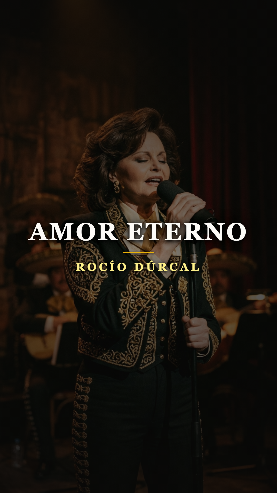
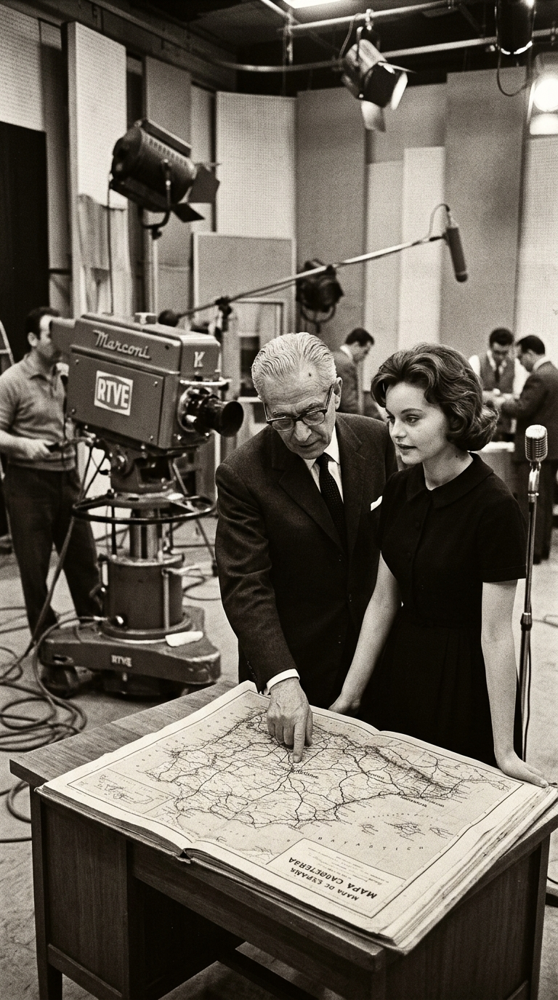
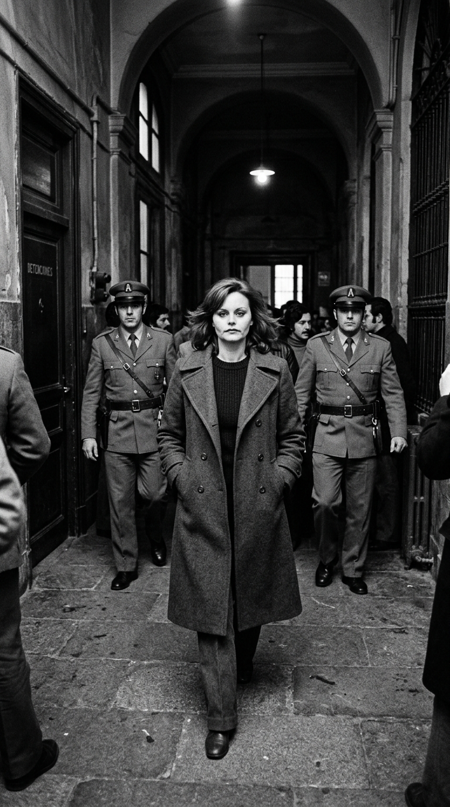
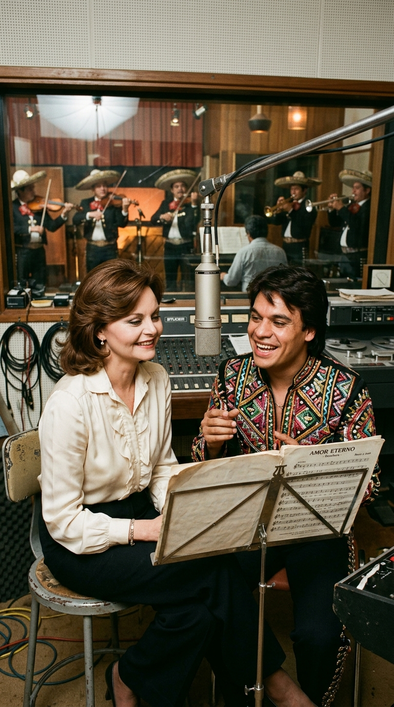
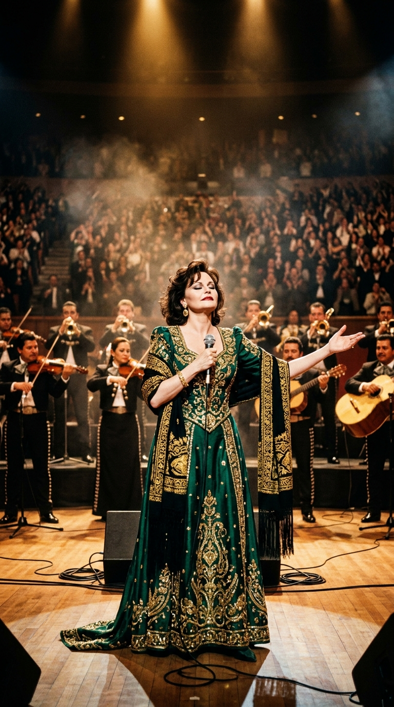
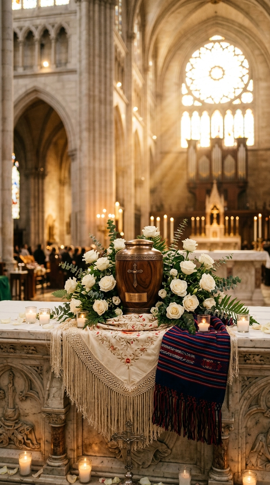

# 🌹 La Reina Eterna del Mariachi: Cómo Rocío Dúrcal Sanó el Alma de México con «Amor Eterno»
### *La historia de la madrileña de Cuatro Caminos que desafió a la policía de Franco, cruzó el océano para derribar el machismo del mariachi junto a Juan Gabriel y convirtió una elegía de orfandad en la plegaria más desgarradora de la música hispana.*

---

**Por la redacción de Acordes Ocultos**  
*Tiempo de lectura estimado: 9 minutos*

---

### Prólogo: El dedo sobre el mapa de Granada y la peluquería de Cuatro Caminos (1961)

A finales de la década de 1950, en las calles obreras del barrio madrileño de Cuatro Caminos, una niña delgada y de mirada chispeante cantaba coplas y jotas mientras barría el suelo de la peluquería donde trabajaba como modesta aprendiza. Se llamaba **María de los Ángeles de las Heras Ortiz**. En su hogar humilde, sostenido por el esfuerzo de su padre camionero y el cariño vigilante de su abuelo Eulogio, el arte no era un pasatiempo burgués, sino una necesidad física de escape.

En 1959, con apenas quince años, su abuelo la inscribió en el programa de Televisión Española *«Primer aplauso»*. Cuando aquella adolescente menuda se plantó ante los micrófonos de la recién nacida televisión pública y dejó escapar un chorro de voz afinadísimo, limpio y lleno de aplomo natural, un influyente productor y cazatalentos se fijó de inmediato en su potencial: **Luis Sanz**, el hombre que moldearía a las grandes figuras del cine español.

Sanz se presentó al poco tiempo en el taller de peluquería. Le ofreció formación intensiva de canto, danza y declamación, pero le impuso una condición indispensable: su verdadero nombre era demasiado largo y solemne para las marquesinas. Había que buscarle un nombre artístico. 

El primer nombre surgió de un recuerdo entrañable de su abuelo, que solía decirle que su voz le recordaba al rocío fresco del amanecer en el campo: sería **Rocío**. Para el apellido, el productor extendió un mapa físico de España sobre la mesa de su despacho, cerró los ojos y dejó caer el dedo índice al azar. Cuando levantó la mano, la yema señalaba un pequeño pueblo blanco en la comarca del Valle de Lecrín, en la provincia de Granada: **Dúrcal**.

Aquella tarde de 1961 nacía Rocío Dúrcal. Nadie en aquel despacho podía sospechar que aquella niña madrileña, predestinada a reinar en las comedias juveniles de los sesenta, terminaría cruzando el océano para ganarse el respeto del país más celoso de su folclore: México.

*Madrid, 1961: Una joven María de los Ángeles de las Heras en los estudios de Televisión Española, en los albores de su transformación artística.*

---

### Acto I: Los calabozos de la DGS y el rescate de Lola Flores (1975)

Durante toda la década de 1960, Rocío Dúrcal fue una de las figuras más queridas del cine musical español. Protagonizó hitos de taquilla como *«Canción de juventud»*, *«Rocío de la Mancha»* y *«Más bonita que ninguna»*, acumulando millones de admiradores que veían en ella el arquetipo de la muchacha buena, hacendosa y luminosa. En enero de 1970 consolidó su estabilidad emocional al contraer matrimonio con el músico hispanofilipino **Antonio Morales «Junior»** (integrante fundamental de Los Brincos y Juan y Junior), sellando una alianza conyugal sólida que resistiría durante más de tres décadas todas las marejadas del éxito y la prensa del corazón.

Sin embargo, detrás de la imagen cándida de estrella cinematográfica latía una mujer con un sentido irreductible de la dignidad y la justicia social.

En **febrero de 1975**, en las postrimerías asfixiantes del régimen franquista, la profesión teatral de Madrid estalló. Cansados de jornadas extenuantes sin derecho a descanso semanal, contratos precarios y la falta de retribución en los ensayos, los actores españoles declararon una histórica **huelga de escenarios**, la primera protesta laboral organizada del sector en cuarenta años. 

Mientras algunas figuras consagradas optaron por el silencio prudente para evitar represalias de la dictadura, Rocío Dúrcal no dudó un segundo. Se unió a las asambleas y piquetes informativos junto a compañeras como Concha Velasco y Tina Sainz, recorriendo los teatros madrileños para exigir el cierre solidario de funciones.

El **8 de febrero de 1975**, durante una asamblea en el Teatro Bellas Artes, la Policía Armada intervino el recinto. **Rocío Dúrcal fue detenida y conducida a los sótanos de la Dirección General de Seguridad en la Puerta del Sol**, donde pasó horas bajo custodia e incomunicada en aquellos calabozos donde el régimen recluía a los disidentes.

Al enterarse de lo ocurrido, fue la mítica **Lola Flores** quien acudió en persona a la sede policial de la Puerta del Sol para interceder por Rocío, depositando de su propio bolsillo la cuantiosa fianza de doscientas mil pesetas exigida por las autoridades gubernativas para lograr su puesta en libertad.

Aquel episodio reveló el verdadero temple de Rocío: no era una muñeca dócil fabricada por la industria del entretenimiento; era una mujer libre, con el coraje de arriesgar su libertad por la dignidad de sus compañeros. Esa misma bravura moral sería la que necesitaría, dos años más tarde, para emprender el viaje más audaz de su vida.

*Febrero de 1975: Rocío Dúrcal en las calles de Madrid encabezando la huelga por los derechos laborales del teatro, horas antes de su detención por la policía armada.*

---

### Acto II: El encuentro con el Divo de Juárez y el asalto al mariachi (1977)

A mediados de los setenta, la fórmula del cine musical languidecía en España y las baladas pop amenazaban con estancar su carrera. Intuyendo que debía reinventarse desde los cimientos, Rocío decidió volar a México en **1977** de la mano de la filial discográfica de Ariola.

Allí se produjo el encuentro providencial con un joven compositor de veintisiete años que estaba revolucionando la música popular con sus melodías incendiarias y su magnetismo escénico: **Alberto Aguilera Valadez**, conocido artísticamente como **Juan Gabriel**.

Entre el compositor de Michoacán y la cantante de Madrid la complicidad fue instantánea. Juan Gabriel, fascinado por la tesitura cristalina y la nobleza interpretativa de Rocío, le propuso una idea que dentro de la propia discográfica sonó a temeridad comercial: **grabar un álbum completo de rancheras mexicanas con mariachi**.

El mariachi era, hasta entonces, un coto celosamente custodiado, dominado por la tradición de voces recias y bravías como las de Jorge Negrete, Pedro Infante o Javier Solís. Que una mujer viniera de España a enfundarse el traje de charro y cantar la música vernácula fue recibido por sectores puristas con escepticismo mordaz: *«¿Qué va a saber una señorita madrileña de cantar rancheras con el dolor de nuestra tierra?»*.

Rocío y Juan Gabriel ignoraron los murmullos. Se encerraron en los estudios de grabación de Ciudad de México y alumbraron *«Rocío Dúrcal canta a Juan Gabriel»* (1977).

Cuando el disco sonó en la radio, el asombro fue unánime. Rocío no cayó en el error de impostar un acento ajeno ni de forzar quejidos artificiales; cantó la ranchera desde su propia verdad, aplicando una dicción impecable, una delicadeza vocal luminosa y un desgarro lírico que desarmó al público mexicano. El éxito del disco abrió una saga de grabaciones históricas y la prensa azteca la ungió con un título que nadie le arrebataría: **«La Española más Mexicana»**.

*Otoño de 1977: Rocío Dúrcal y un joven Juan Gabriel en los estudios de grabación de Ariola en Ciudad de México, fundando la dupla más exitosa de la música ranchera.*

---

### Acto III: 1984: La llamada en Acapulco y el peso de «Amor Eterno»

La cima de aquella comunión artística llegó a través de una de las pérdidas personales más dolorosas de Juan Gabriel, una herida que el cantautor guardaba en silencio desde una década atrás.

El **27 de diciembre de 1974**, mientras se encontraba cumpliendo una temporada de actuaciones en el puerto de **Acapulco, Guerrero**, Juan Gabriel recibió una llamada telefónica urgente. Desde Michoacán le comunicaban la peor noticia: su madre, **Victoria Valadez Rojas**, acababa de fallecer a causa de un infarto fulminante en su casa de **Parácuaro**.

La relación entre Alberto y su madre había sido un abismo de dolor y anhelo: agobiada por la extrema pobreza, doña Victoria lo había ingresado de niño en el internado de la Escuela de Mejoramiento Social para Menores de Ciudad Juárez, dejándole una sensación de orfandad que el artista intentó reparar durante toda su juventud. Enterarse de su muerte lejos, sin haber podido acompañarla en sus últimos momentos ni despedirse en su lecho, lo sumió en una desolación imborrable.

En medio de aquel impacto, en Acapulco, Juan Gabriel volcó su dolor en una elegía fúnebre de una hondura sobrecogedora: **«Amor Eterno»**.

> *«Tú eres el amor del cual yo tengo*  
> *el más triste recuerdo de Acapulco.*  
> *Por eso es que mi alma se conforma*  
> *con rescatar el tiempo que he perdido...*  
> *Tarde o temprano estaré contigo*  
> *para seguir amándonos...»*

Durante casi diez años, la pieza permaneció como un tributo reservado que el compositor interpretaba en contadas ocasiones. Pero en **1984**, durante la producción del álbum *«Canta a Juan Gabriel Volumen 6»*, el Divo de Juárez comprendió que solo existía una voz capaz de interpretar aquel luto con la sobriedad y la pureza que exigía: la de Rocío.

La sesión de grabación principal se llevó a cabo en los **Estudios Gas de la Ciudad de México**, bajo la dirección musical y los arreglos de Eduardo Magallanes y el propio Juan Gabriel. Con violines de cadencia solemne y una guitarra marcando el paso lento de un cortejo fúnebre, Rocío se colocó ante el micrófono.

En lugar de recurrir al exceso melodramático, la madrileña cantó con una contención conmovedora. En el verso culminante (*«¡Amor eterno e inolvidable...!»*), su voz alcanzó una resonancia tan pura que convirtió la pérdida íntima de un hijo en un bálsamo universal para el dolor ajeno.

El álbum —que incluía piezas fundamentales como «Costumbres» y el célebre dueto «Déjame vivir»— se transformó en un suceso de ventas sin precedentes en el continente, consagrando a «Amor Eterno» como la plegaria definitiva en despedidas, velatorios y altares del Día de Muertos desde México hasta el cono sur.

*1984: Rocío Dúrcal durante las sesiones de producción del álbum «Canta a Juan Gabriel Volumen 6».*

---

### Acto IV: Bellas Artes, el distanciamiento y la entereza final (1990–2005)

En **mayo de 1990**, la trascendencia de la obra quedó refrendada cuando Juan Gabriel derribó las fronteras de la alta cultura mexicana al presentarse en el majestuoso **Palacio de Bellas Artes** de la Ciudad de México junto a la Orquesta Sinfónica Nacional, bajo la dirección de Enrique Patrón de Rueda. Su estremecedora versión en directo de «Amor Eterno», precedida por una emocionada dedicatoria a su madre, consagró la melodía en la memoria colectiva hispanoamericana.

Poco después, desacuerdos comerciales y discrepancias en el manejo discográfico provocaron un prolongado distanciamiento profesional y personal entre Rocío y Juan Gabriel. Aunque la prensa especuló con el declive artístico de la madrileña lejos del repertorio de su mentor, la realidad demostró lo contrario.

Rocío Dúrcal continuó triunfando con luz propia. Se alió con el maestro mexicano **Marco Antonio Solís** y grabó trabajos de gran calado popular que abarrotaron recintos emblemáticos como el Auditorio Nacional de México o el Radio City Music Hall de Nueva York. 

A comienzos de **2001**, la adversidad golpeó su salud: los médicos le diagnosticaron cáncer de matriz, que con los años hizo metástasis en los pulmones. Fiel a la discreción que siempre guio su vida privada, Rocío afrontó el tratamiento con entereza, dosificando sus presentaciones sin perder el amor por el escenario mientras sus fuerzas se lo permitieron.

En **noviembre de 2005**, la Academia Latina de la Grabación le concedió en Los Ángeles el prestigioso **Premio a la Excelencia Musical (Lifetime Achievement Award)** en reconocimiento a su extraordinaria aportación a la música iberoamericana. Sería su última gran distinción pública internacional.

---

### Epílogo: El reposo dividido y el abrazo eterno (2006)

El **25 de marzo de 2006**, a los sesenta y un años, María de los Ángeles de las Heras falleció en su residencia de Torrelodones, en la sierra madrileña, arropada por su esposo Junior y sus tres hijos. Su partida desató un hondo duelo en España y una ola de conmoción en toda América Latina; en México, las estaciones de radio encadenaron homenajes continuos repasando su legado ranchero.

En un gesto que retrataba la dualidad de su corazón, la artista dispuso que **sus cenizas fueran divididas en dos partes iguales**: una mitad reposaría en el cementerio de Torrelodones, en la tierra que la vio nacer, y la otra cruzaría el Atlántico para descansar en suelo mexicano.

El **2 de mayo de 2006**, la Basílica de Santa María de Guadalupe en Ciudad de México acogió una misa solemne y multitudinaria. Ante la presencia de su viudo Antonio Morales y de sus hijos Carmen, Antonio y Shaila, arropados por cientos de admiradores y los acordes solemnes del Mariachi Vargas de Tecalitlán, la urna fue depositada en una cripta del templo sagrado del Tepeyac.

Juan Gabriel no estuvo presente en el recinto; la distancia entre ambos no llegó a cerrarse en vida, dejando un halo de nostalgia sobre aquella hermandad rota que el propio autor recordaría con respeto en presentaciones posteriores. Sin embargo, por encima de los silencios humanos, la música triunfó sobre el tiempo. 

Hoy, cada vez que una guitarra y un mariachi entonan las notas de *«Amor Eterno»*, renace el milagro de aquella muchacha de Cuatro Caminos que aprendió a descifrar el alma mexicana y le entregó, con su voz limpia y serena, un himno inmortal para despedir a quienes más amamos.

*Ciudad de México, mayo de 2006: Ofrendas y flores en la Basílica de Guadalupe custodiando el reposo de Rocío Dúrcal, «La Española más Mexicana».*

---

### 📚 Fuentes y Archivo Documental

1. **Magallanes, Eduardo** (1995). *«Querido Alberto: Biografía autorizada de Juan Gabriel»*. Editorial Diana, México. Documentación sobre el deceso de doña Victoria Valadez en Parácuaro (1974) y la producción discográfica de «Canta a Juan Gabriel Vol. 6» (1984).
2. **Hemeroteca Diario El País y ABC** (Ediciones de febrero de 1975, marzo y mayo de 2006). Cobertura policial de la huelga de actores en Madrid, el arresto en el Teatro Bellas Artes, el deceso de Rocío Dúrcal y las exequias en la Basílica de Guadalupe.
3. **Crónicas hemerográficas de El Universal y Reforma** (Marzo y mayo de 2006). Crónica del traslado de las cenizas a México y el homenaje fúnebre en la Basílica de Guadalupe.
4. **Palacio de Bellas Artes / Conaculta / INBA** (1990). *Registro audiovisual y crónicas del concierto «Juan Gabriel en el Palacio de Bellas Artes»* junto a la Orquesta Sinfónica Nacional (OSN).
5. **The Latin Recording Academy** (Noviembre de 2005). *Acta de entrega del Lifetime Achievement Award (Premio a la Excelencia Musical)* concedido a Rocío Dúrcal en Los Ángeles, California.
