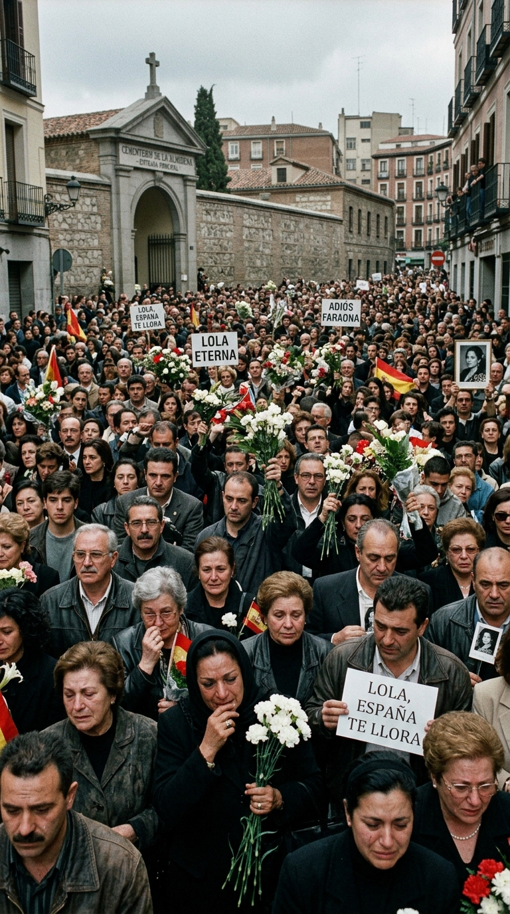
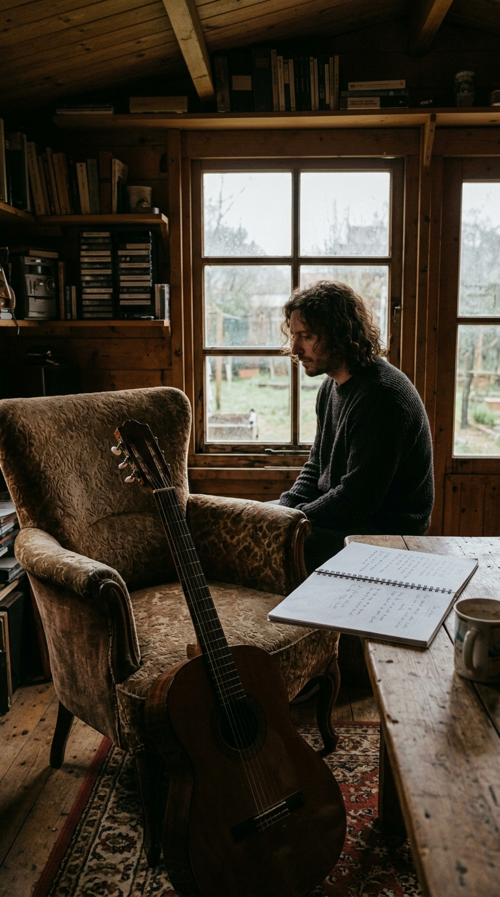
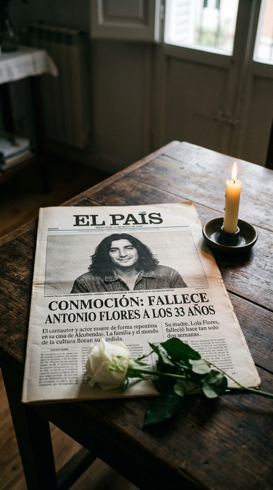
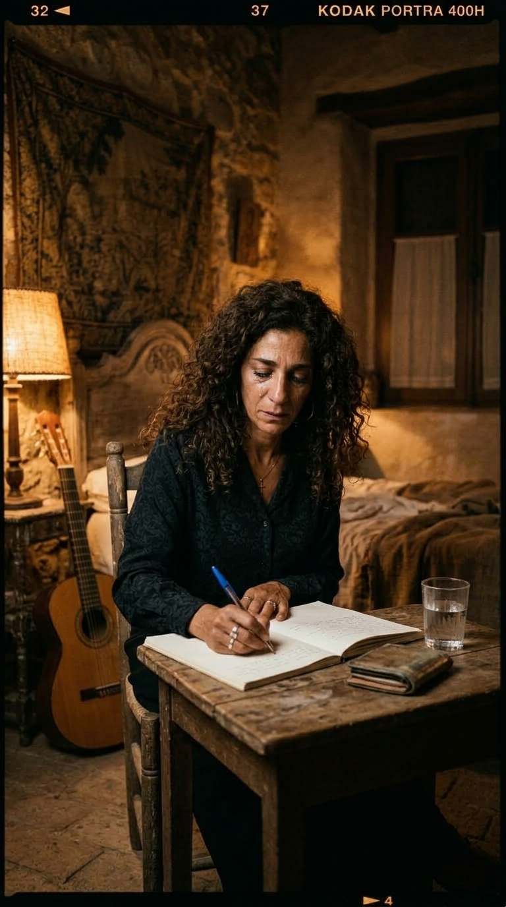
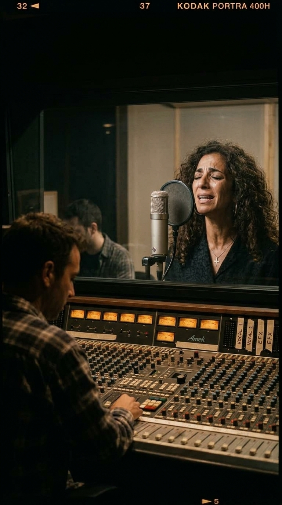

# El Secreto de «Qué Bonito»: El Réquiem de los Flores y la Canción que Nació del Llanto

> *«Qué bonito sería poder volar y a tu lado ponerme a cantar... como de costumbre, estar los dos juntos».*

---

## Prólogo: La Primavera más Negra de la Música Española

Hay ausencias que marcan una época y tragedias que quiebran el pulso de todo un país. En mayo de 1995, España no solo despidió a la mayor leyenda que jamás haya parido el arte popular; presenció, con el corazón encogido y una incredulidad dolorosa, el derrumbe sucesivo de una de las dinastías artísticas más queridas y volcánicas del mundo hispanohablante.

En un lapso de apenas catorce días, la familia Flores pasó de la gloria de los aplausos al abismo insondable del duelo por partida doble. De aquellas dos semanas de mayo no quedó únicamente el luto riguroso que tiñó las portadas de los periódicos y los balcones de Madrid; quedó también un milagro sonoro, una carta en tiempo presente que Rosario Flores le escribió a su hermano Antonio para mantenerlo con vida en el único lugar donde la muerte no tiene jurisdicción: los acordes de una guitarra.

---

## Acto I: El Ocaso de «La Faraona» (16 de Mayo de 1995)

Hacía veinticinco años que Lola Flores libraba una batalla secreta y feroz contra el cáncer de mama, un combate que la artista transformó en coraje sobre los escenarios, negándose a que la enfermedad silenciara su temperamento gitano. Sin embargo, a comienzos de la primavera de 1995, sus fuerzas comenzaron a menguar en su residencia familiar de «El Lerele», en La Moraleja.

En la madrugada del 16 de mayo, a los setenta y dos años, el corazón de «La Faraona» se detuvo. 

El impacto en la sociedad española fue monumental. Más de ciento cincuenta mil personas desfilaron en procesión ininterrumpida ante su capilla ardiente instalada en el Centro Cultural de la Villa de Madrid. Entre mantones de Manila, coronas de claveles rojos y el dolor palpable de la multitud, sus tres hijos —Lolita, Antonio y Rosario— resistieron el dolor abrazados. Pero entre ellos, había uno cuyo rostro reflejaba un abismo que iba mucho más allá de la tristeza convencional: Antonio.

---

## Acto II: La Cabaña de «El Lerele» y la Orfandad Imposible (30 de Mayo de 1995)

Para Antonio Flores, su madre no era únicamente el pilar familiar; era su templo, su refugio incondicional frente a sus demonios internos y su mayor protectora artística. Antonio había alcanzado la cumbre de su carrera con el álbum *Cosas mías* (1994) y temas inmortales como *«No dudaría»*, *«Siete vidas»* y *«Alba»*. Pero el éxito no pudo servirle de escudo ante el vacío absoluto que dejó la marcha de su madre.

Tras el entierro en el cementerio de la Almudena, Antonio se recluyó en la pequeña cabaña de madera que tenía construida en el jardín de «El Lerele». Allí, entre guitarras acústicas, amplificadores y fotos familiares, intentó buscar refugio en la composición. Durante casi dos semanas apenas probó bocado; no dormía y pasaba las madrugadas tocando notas apagadas en la penumbra. 

El 30 de mayo de 1995, exactamente catorce días después de la partida de Lola, el país despertó conmocionado: Antonio Flores había sido hallado sin vida en su cabaña a los treinta y tres años. 

La noticia congeló a España. Una misma familia, un mismo hogar y una misma estirpe habían perdido a su raíz y a su poeta en medio mes. El luto nacional se transformó en una sensación de asfixia colectiva.

---

## Acto III: El Silencio de Rosario y la Noche en América

Para Rosario, el golpe fue letal. Antonio no era solo su hermano mayor; era su cómplice absoluto, el productor y compositor de sus primeros éxitos (*De ley* y *Siento*), la persona que entendía como nadie su fusión única de flamenco, rumba y rock callejero. Eran uña y carne, dos mitades de una misma llama artística.

Huérfana de madre y de hermano a los treinta y dos años, Rosario quedó paralizada por el dolor. Canceló todos sus contratos y se recluyó en la más estricta intimidad. Durante meses fue incapaz de escuchar música; el sonido de los acordes flamencos le abría una herida insoportable.

A finales de 1995, obligada por compromisos previos y con la necesidad vital de tomar distancia de la asfixia mediática madrileña, Rosario viajó a América. Una noche, en la soledad de una habitación de hotel, el insomnio y la memoria la desbordaron. Abrió las cortinas, miró la inmensidad del cielo estrellado y, por primera vez desde la tragedia, sintió que Antonio estaba allí, mirándola.

Con las manos temblorosas y los ojos empañados en lágrimas, tomó un bolígrafo y un cuaderno de notas. No intentó componer una canción estructurada ni buscar metáforas comerciales; simplemente se puso a hablar con él, en tiempo presente, como si Antonio estuviera sentado a los pies de la cama con su guitarra:

> *«Qué bonito sería poder volar y a tu lado ponerme a cantar... como de costumbre, estar los dos juntos».*

En apenas unos minutos, entre sollozos incontenibles, los versos fluyeron como un desahogo sagrado. Escribió sobre las tardes compartidas en el porche, sobre el brillo de su mirada morena y sobre la certeza de que su conexión trascendía los límites de la vida terrenal. Así nació *«Qué Bonito»*.

---

## Acto IV: La Catarsis en el Estudio y el Álbum «Mucho por Vivir»

Al regresar a España en 1996, Rosario entró a los estudios de grabación para dar forma a su tercer disco, al que tituló con valentía y desafío existencial: *Mucho por vivir*. 

Cuando llegó el momento de grabar la voz de *«Qué Bonito»*, el ambiente en la sala de control se volvió solemne. Solo una guitarra española desnuda y un suave acompañamiento de percusión acústica arroparon su garganta. Rosario no pudo contener el llanto durante varias tomas; su voz se quebraba en los agudos, pero los productores decidieron conservar esa imperfección desgarrada, porque en ese temblor residía la verdad incontestable de su alma.

La canción no era un lamento fúnebre; era una celebración del amor inmortal, una rumba lenta impregnada de luz y esperanza.

---

## Epílogo: El Regreso al Escenario y la Herencia de la Furia

El lanzamiento de *Mucho por vivir* en 1996 fue un fenómeno social sin precedentes en España y América Latina. El disco vendió más de cuatrocientas mil copias en pocas semanas, pero el verdadero clímax ocurrió cuando Rosario subió por primera vez a un escenario tras la tragedia.

Vestida de riguroso luto negro, con su melena morena al viento y los brazos abiertos hacia el cielo, cantó *«Qué Bonito»* ante un estadio que enmudeció por completo. En el estribillo, Rosario alzó la mirada hacia los focos, señalando al infinito con el puño cerrado. En las gradas, miles de personas rompieron a llorar al unísono. 

La hija de «La Faraona» y la hermana de Antonio no solo había sobrevivido al dolor más desgarrador que un ser humano puede soportar; había transformado las cenizas de su estirpe en una obra de arte inmortal. Cada vez que suenan los primeros compases de *«Qué Bonito»*, la dinastía de los Flores vuelve a estar completa.

---

### 📚 Fuentes y Archivo Documental
1. **Flores, Rosario.** *Entrevistas retrospectivas sobre la creación de «Qué Bonito» y el álbum Mucho por vivir*. RTVE y El País, 1996–2020.
2. **Flores, Lolita.** *Lolita: Flores y alguna espina*. Ediciones Martínez Roca, 2010.
3. **Román, Manuel.** *Lola Flores: El volcán y la brisa*. Algaba Ediciones, 2007.
4. **Hemeroteca Diario El País.** *Ediciones especiales del 17 de mayo de 1995 (Muerte de Lola Flores) y del 31 de mayo de 1995 (Muerte de Antonio Flores)*.
5. **Hemeroteca Diario ABC.** *Crónicas de despedida a la familia Flores en Madrid y capilla ardiente en la Villa*. Mayo de 1995.
6. **Sony Music Entertainment Spain / Epic Records.** *Créditos y notas discográficas del álbum Mucho por vivir de Rosario Flores*. Depósito Legal M-18234-1996.
