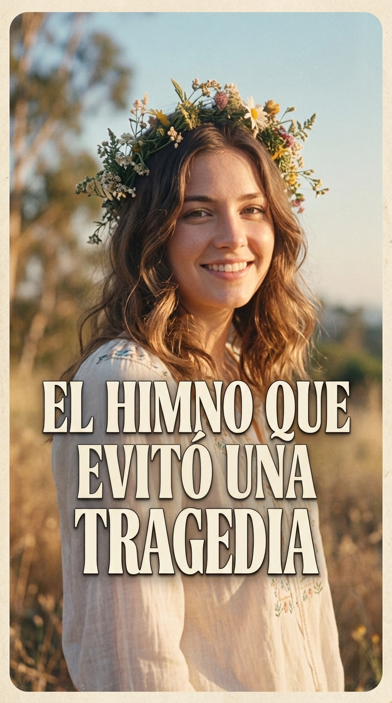
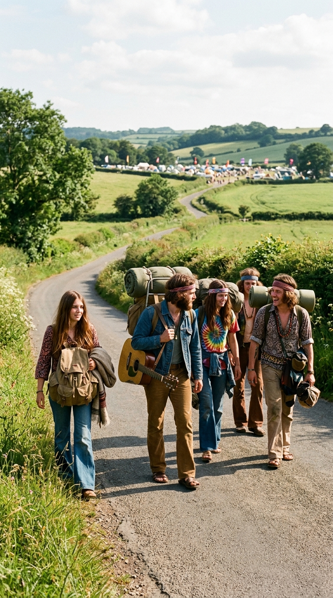
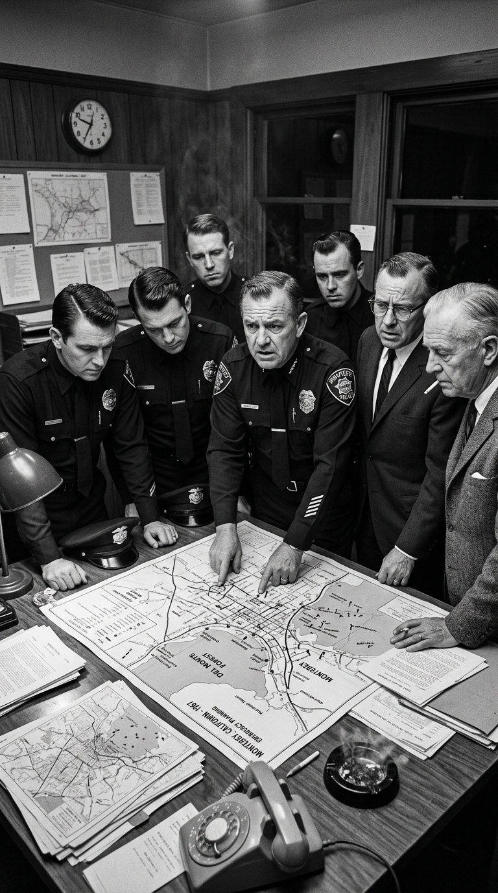
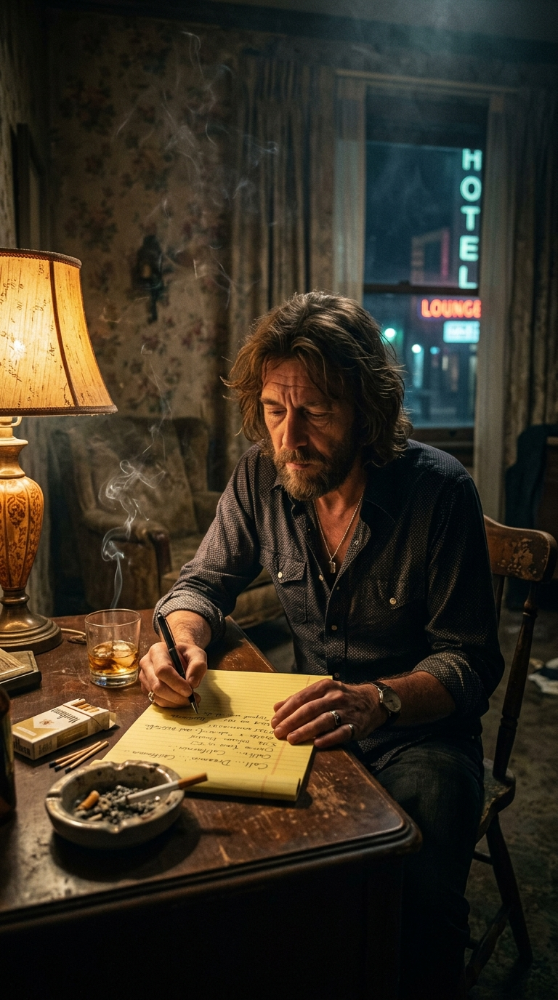
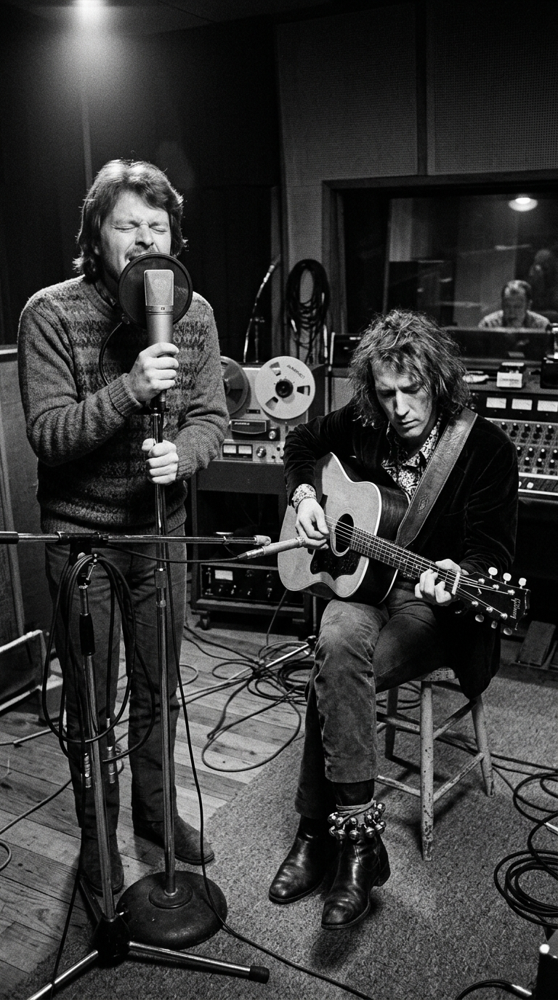
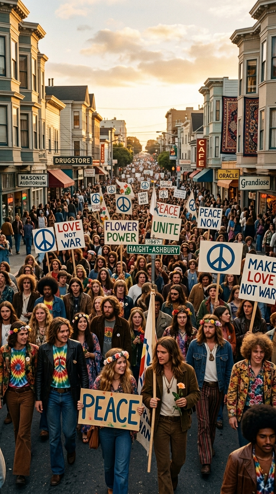
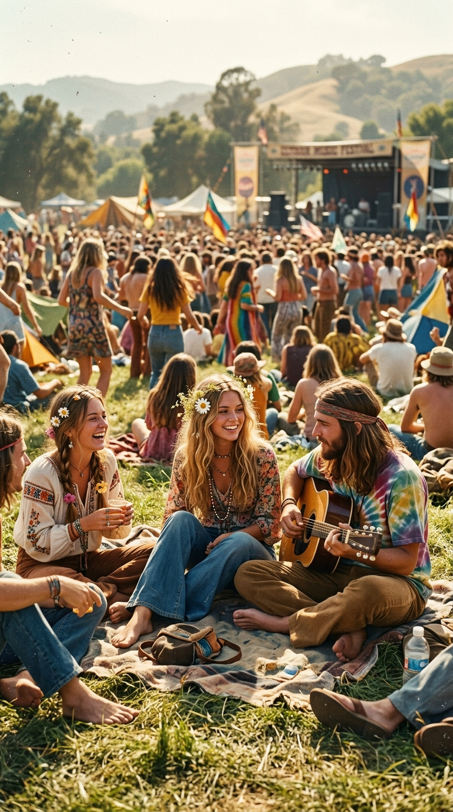

# 🌸 El Himno que Desarmó una Guerra: Cómo una Canción de Veinte Minutos Evitó un Baño de Sangre en California

> *«La ciudad de Monterey estaba al borde del pánico. Los periódicos advertían de una invasión de hordas salvajes con drogas, melenas y harapos. Las autoridades amenazaban con sacar a la policía con gases lacrimógenos. Necesitábamos una canción que funcionara como un salvoconducto sagrado, un aviso al mundo de que los chicos venían con el corazón abierto, no con palos ni piedras.»*  
> — **Lou Adler**, productor discográfico y cofundador del Festival de Monterey, 1967.

---

*Bel Air, California, mayo de 1967: La balada pastoral escrita en una madrugada con cascabeles en los tobillos que transformó la histeria policial en el amanecer pacífico del Verano del Amor.*

---

### Prólogo: El miedo al abismo en la bahía

En la primavera de 1967, la sociedad conservadora estadounidense observaba el norte de California con el mismo terror con el que se contempla un polvorín a punto de estallar. En las colinas de San Francisco, en la encrucijada de las calles **Haight y Ashbury**, miles de adolescentes y jóvenes desertores del sistema se congregaban atraídos por la promesa de la psicodelia, la poesía beatnik, la música libre y el rechazo frontal a la sangrienta guerra de Vietnam.

Pero en la tranquila, aristocrática y militarizada península de Monterey —ubicada a unos ciento noventa kilómetros al sur de San Francisco—, la palabra «hippie» no era sinónimo de pacifismo, sino de anarquía y degradación moral. 

Cuando el productor discográfico **Lou Adler** y **John Phillips** (la mente maestra detrás del exitoso cuarteto vocal The Mamas and the Papas) anunciaron la celebración del **Monterey International Pop Festival** para los días 16, 17 y 18 de junio de 1967 —el primer gran festival benéfico de rock al aire libre en la historia del país—, el Ayuntamiento de Monterey entró en estado de alarma.

El alcalde Minnie Caryl, el jefe de policía local Frank Marinello y los comerciantes de la zona convocaron reuniones de urgencia. Los titulares de prensa predecían disturbios multitudinarios, saqueos y enfrentamientos violentos entre los recién llegados y las fuerzas del orden. La policía amenazaba con clausurar el recinto ferial, negar los permisos de acampada o solicitar la intervención directa de los tanques y blindados de la **Guardia Nacional de California** para dispersar a los asistentes por la fuerza.

El festival corría un riesgo mortal de convertirse en una carnicería antes de que sonara la primera guitarra. Lou Adler y John Phillips sabían que ninguna reunión de relaciones públicas ni ningún comunicado burocrático lograría disipar la histeria de las autoridades. 

Hacía falta un conjuro musical.

---

### Acto I: Veinte minutos en Bel Air

Una madrugada de mayo de 1967, en su elegante residencia de Bel Air en Los Ángeles, John Phillips no podía conciliar el sueño. Subió a su estudio privado, tomó su guitarra acústica **Gibson** de doce cuerdas y se sentó junto al ventanal que dominaba los jardines iluminados por la luna.

Phillips comprendió que el festival necesitaba una invitación pública, una especie de salvoconducto lírico que desactivara los prejuicios de los adultos y, al mismo tiempo, guiara el comportamiento de las decenas de miles de jóvenes que ya preparaban sus mochilas en todos los rincones de Estados Unidos para peregrinar hacia la Costa Oeste.

En apenas **veinte minutos**, los acordes y los versos brotaron con una fluidez asombrosa, envueltos en una ternura casi religiosa:

> *«If you're going to San Francisco...  
> be sure to wear some flowers in your hair.  
> If you're going to San Francisco...  
> you're gonna meet some gentle people there.»*

La metáfora de las flores en el cabello era una orden tácita de desarme: nadie puede empuñar una piedra ni esconder una navaja si lleva una rosa trenzada en el pelo. La canción no prometía una revolución bélica ni un asalto a las instituciones; prometía un encuentro fraternal entre seres humanos pacíficos (*«gentle people»*).

A la mañana siguiente, Phillips llamó a Lou Adler:

—*«Tengo el tema. Y ya sé exactamente quién tiene que cantarlo»*, le anunció.

---

### Acto II: La voz pastoral y los cascabeles en los tobillos

El elegido no fue una estrella consagrada, sino un viejo hermano de sangre musical: **Philip Wallach Blondheim III**, conocido artísticamente como **Scott McKenzie**. 

McKenzie y Phillips se conocían desde la adolescencia en Alexandria, Virginia. Juntos habían cantado doo-wop en The Abstracts y más tarde habían fundado el respetado conjunto folk The Journeymen en Greenwich Village. Cuando Phillips decidió crear The Mamas and the Papas en 1965, le rogó a McKenzie que fuera el cuarto integrante del grupo. Scott, temeroso de quedar atrapado en una maquinaria pop comercial, rechazó la oferta para buscar su propio camino acústico en solitario.

Sin embargo, cuando McKenzie escuchó la maqueta al piano que Phillips había grabado, quedó paralizado por la pureza de la melodía. Poseía una voz de tenor cálida, melancólica y sosegada, carente del ego desgarrador de los cantantes de rock convencionales: era la voz de un trovador que relataba un milagro inminente.

La grabación definitiva se llevó a cabo en los estudios **Western Recorders** (en Sunset Boulevard, Hollywood) con la asistencia del legendario ingeniero de sonido **Armin Steiner**.

La sesión se prolongó durante toda la noche hasta las seis de la mañana. Para lograr una atmósfera rítmica hipnótica que evocara el paso tranquilo de los caminantes, John Phillips se colocó una hilera de **cascabeles indios** (*ghungroos*) atados alrededor de los tobillos. Mientras rasgueaba su guitarra acústica y cantaba las armonías vocales de acompañamiento junto a Michelle Phillips, marcaba el compás golpeando suavemente las botas contra el suelo de madera: *chling-chling, chling-chling*.

La base instrumental corrió a cargo de los mejores músicos de sesión del planeta: **Joe Osborn** en el bajo, **Larry Knechtel** en los teclados y el inconfundible pulso acolchado de **Hal Blaine** en la batería, los pilares de la mítica «Wrecking Crew».

Al amanecer, la cinta estaba terminada. Era una plegaria laica de tres minutos impregnada del aroma del mar y el rocío de la mañana.

---

### Acto III: El verano de la inocencia y el milagro de Monterey

Lanzada de urgencia por el sello Ode Records a finales de mayo de 1967, la repercusión de *«San Francisco (Be Sure to Wear Flowers in Your Hair)»* superó cualquier cálculo comercial o logístico.

La canción no solo se convirtió en un éxito radial instantáneo: funcionó como una bengala en la noche que alertó a toda una generación. En menos de un mes, el disco escaló al puesto número cuatro en el Billboard Hot 100 de Estados Unidos y alcanzó el número uno indiscutible en Gran Bretaña, Irlanda, Alemania, Noruega y Australia, vendiendo más de siete millones de copias en todo el mundo.

Cuando el fin de semana del **16 de junio de 1967** las puertas del Monterey County Fairgrounds se abrieron, el temor de las autoridades se disolvió en el aire tibio de la bahía. Más de **cincuenta mil jóvenes** colmaron los recintos con flores en las solapas, guirnaldas en el pelo y carteles pintados a mano. 

La policía local, desconcertada ante la docilidad y la amabilidad de la multitud, terminó aceptando margaritas de manos de las muchachas y colocándolas en las solapas de sus uniformes. Durante tres días enteros de música ininterrumpida —donde el mundo fue testigo del bautismo de fuego de **Jimi Hendrix** quemando su Stratocaster, la desgarradora consagración de **Janis Joplin** con Big Brother and the Holding Company y la apoteosis soul de **Otis Redding**— no se registró un solo acto de violencia, ni un solo arresto por disturbios, ni un solo herido.

Aquella canción nacida de la necesidad de apaciguar a un puñado de concejales provincianos acababa de inaugurar formalmente el legendario **«Verano del Amor»** (*Summer of Love*), transformando a San Francisco en la capital espiritual de la libertad juvenil.

---

### Epílogo: El peso de un mito fugaz

El éxito abrumador y repentino terminó siendo una carga pesada para Scott McKenzie. Abrumado por el acoso mediático y entristecido al comprobar cómo la industria corporativa y el turismo de masas terminaban mercantilizando y corrompiendo la pureza original del movimiento en Haight-Ashbury, el cantante decidió distanciarse de los reflectores.

Se retiró a vivir en el desierto de Joshua Tree y más tarde a su natal Virginia, viviendo con sencillez y lejos del bullicio de los grandes estadios. Décadas más tarde, en 1988, volvería a rozar la gloria mundial al coescribir junto a John Phillips el éxito planetario *«Kokomo»* para The Beach Boys, antes de reunirse en giras nostálgicas con The Mamas and the Papas.

Cuando Scott McKenzie falleció en Los Ángeles en agosto de 2012, a los setenta y tres años, periódicos de los cinco continentes recordaron su nombre por una sola razón: haber prestado su garganta para entonar el himno que convenció al mundo de que la música era capaz de detener una guerra antes de que comenzara.

---

### Reflexión: El eco de una utopía que no muere

Seis décadas después de aquel verano irrepetible, cuando el cinismo y las prisas parecen gobernar el mundo moderno, los acordes transparentes de *«San Francisco»* conservan intacta su fragancia pastoral. Siguen recordándonos que, al menos durante un breve instante suspendido en el tiempo, miles de almas creyeron de verdad que unas flores en el pelo bastaban para cambiar el destino de la humanidad.

Y a ti, ¿qué sentimiento te invade cuando escuchas esa melodía que inauguró el sueño más luminoso de los años sesenta?

---

### 📚 Fuentes y Archivo Documental

* **Phillips, John (1986):** *Papa John: An Autobiography*. Dell Publishing. Memorias personales con el testimonio detallado de la composición en Bel Air y la sesión nocturna con cascabeles en Western Recorders.
* **Adler, Lou (2007):** *The Making of the Monterey International Pop Festival*. Entrevista conmemorativa por el 40 aniversario en Rolling Stone Magazine y documental oficial de D.A. Pennebaker.
* **Blaine, Hal & Goggin, David (1990):** *Hal Blaine and the Wrecking Crew*. MixBooks. Documentación técnica de las sesiones de grabación en Hollywood con Joe Osborn y Larry Knechtel.
* **Echols, Alice (1999):** *Scars of Sweet Paradise: The Life and Times of Janis Joplin*. Metropolitan Books. Contexto sobre la reacción de las autoridades de Monterey ante la llegada del movimiento contracultural.
* **Billboard & Cash Box Archives (Mayo-Julio 1967):** Informes de ventas de sencillos y evolución de listas en Estados Unidos y Europa bajo el sello Ode Records.
