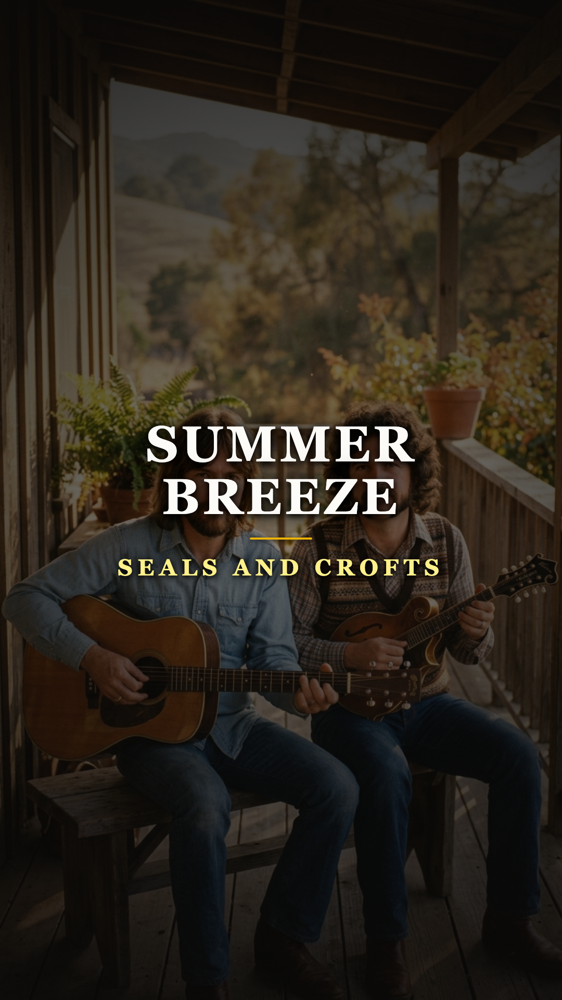
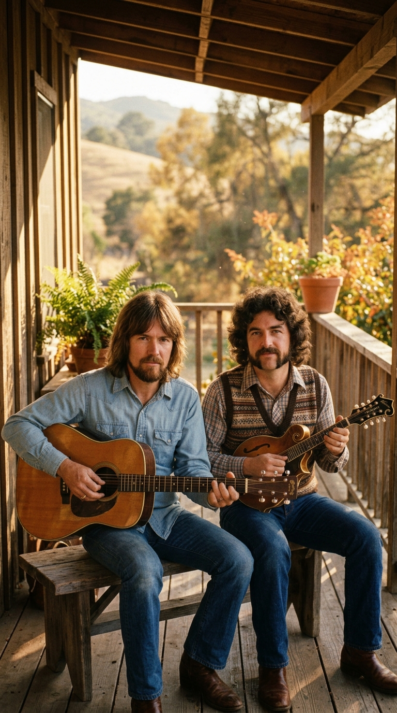
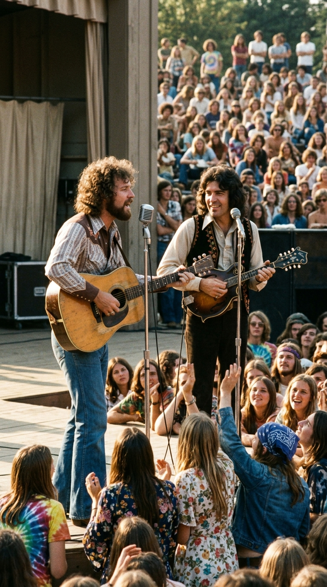
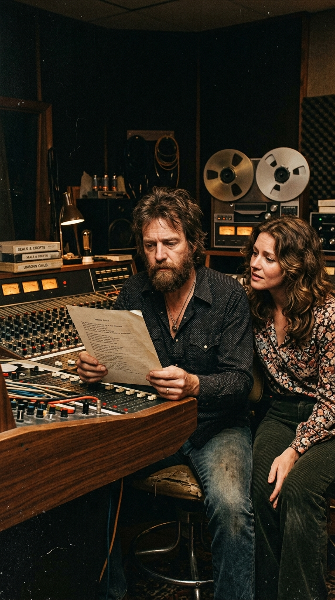
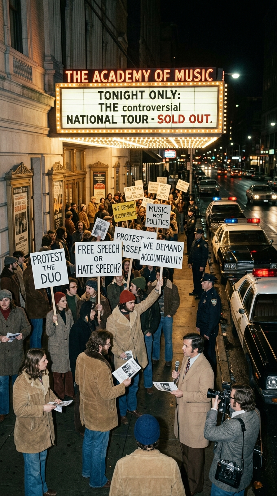
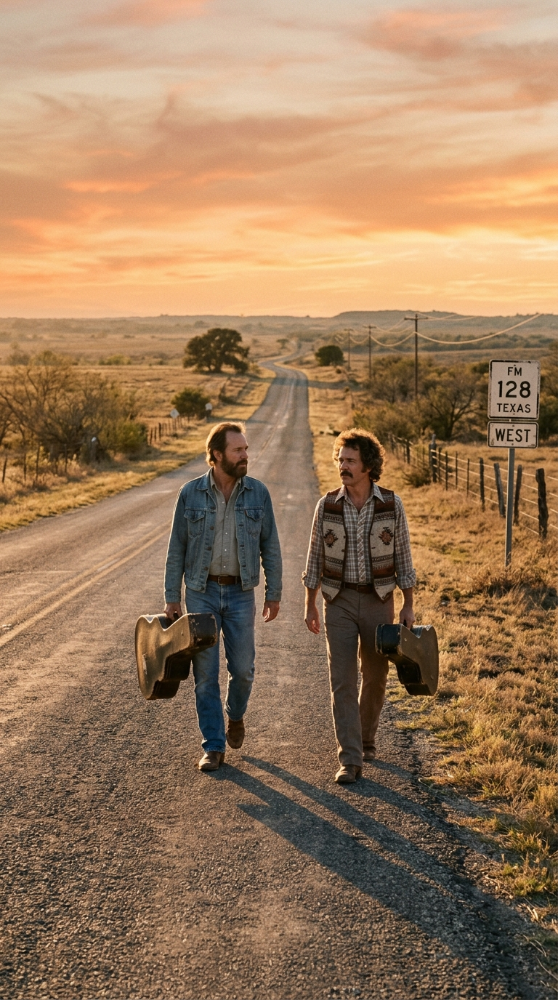

# 🍃 El Secreto de Summer Breeze: El Suicidio Comercial de los Reyes de la Paz
### *Cómo Jim Seals y Dash Crofts tocaron el cielo con la canción más dulce de los setenta y, apenas dos años después, sacrificaron voluntariamente su fama millonaria antes que traicionar su fe.*

---

**Por la redacción de Acordes Ocultos**  
*Tiempo de lectura estimado: 7 minutos*

---

### Prólogo: El aroma a jazmín y el remanso de paz (1972)

En el verano de 1972, Estados Unidos era un país herido y convulso. Las secuelas de la guerra de Vietnam todavía ardían en los noticieros, el escándalo de Watergate comenzaba a agrietar los cimientos de la Casa Blanca y el rock ácido de finales de los sesenta daba paso a una sensación generalizada de desencanto. La juventud, agotada del ruido y la confrontación política, buscaba desesperadamente un refugio.

Ese refugio llegó en forma de una brisa acústica inconfundible. Con un arpegio sutil de guitarra acústica y mandolina, acompañado por el tintineo cristalino de un piano infantil de juguete, dos músicos tejanos de aspecto sobrio y mirada tranquila lanzaron al aire una melodía que parecía acariciar el alma:

> *«Summer breeze makes me feel fine,  
> blowin' through the jasmine in my mind...»*

**Jim Seals** y **Dash Crofts** se convirtieron, de la noche a la mañana, en los monarcas indiscutibles del *soft rock*. Su álbum *«Summer Breeze»* vendió millones de copias, alcanzó el puesto número seis en las listas de Billboard y convirtió al dúo en habituales de los grandes estadios y festivales al aire libre. La crítica los aclamaba como los embajadores de una nueva inocencia; el público los veneraba porque sus canciones no hablaban de excesos ni de furia, sino de volver al hogar en una tarde de viernes, del murmullo del viento agitando cortinas de lino y de la dicha simple de la paz doméstica.

Sin embargo, lo que casi nadie en la industria discográfica comprendía era que aquella dulzura no era una estrategia de marketing ni una pose estética. Para Jim y Dash, la paz era un voto espiritual inquebrantable. Y estaban dispuestos a pagar el precio más alto del mundo por defenderla.

*California, 1972: Jim Seals y Dash Crofts en el porche donde buscaron la serenidad acústica tras su conversión espiritual.*

---

### Acto I: La fe Bahá'í y el escape del ego

Antes de alcanzar el estrellato acústico, Seals y Crofts habían conocido de primera mano el lado más desgastante del espectáculo. Durante los años sesenta habían formado parte de The Champs (el célebre grupo instrumental de *«Tequila»*) y de diversas bandas de garaje en Texas y Los Ángeles. La vida de giras erráticas, el alcohol y las presiones comerciales los habían dejado al borde del colapso emocional.

En 1969, mientras buscaban un sentido existencial que la fama no podía darles, ambos se convirtieron formalmente a la **fe Bahá'í**, una religión monoteísta nacida en Persia que proclama la unidad espiritual de toda la humanidad, la igualdad radical de las personas y la sacralidad de la vida desde su origen.

Aquella conversión transformó radicalmente su cosmovisión y su forma de componer. Como el propio Jim Seals explicaría años después en entrevistas de época, *«Summer Breeze»* no era solo una estampa vacacional:
> *«Para nosotros, el jazmín en la mente representaba escapar de la prisión del ego. Cuando el ser humano vive solo para su ambición o sus placeres, se encierra en una celda de inseguridad y miedo. La brisa es el espíritu que te libera y te recuerda que hay algo superior a ti»*.

Con esa pureza espiritual en el corazón, el dúo encadenó otro álbum colosal en 1973, *«Diamond Girl»*, consolidando una posición privilegiada en la cima de la industria norteamericana. Eran ricos, respetados y profundamente queridos. Nada hacía presagiar que el abismo estaba a punto de abrirse bajo sus pies.

*Verano de 1973: Seals and Crofts ante decenas de miles de personas en la cima de su popularidad y reconocimiento internacional.*

---

### Acto II: El poema sobre la mesa de mezclas (1973)

En enero de 1973, el Tribunal Supremo de los Estados Unidos emitió su histórica sentencia en el caso **Roe v. Wade**, despenalizando el aborto a nivel federal y desatando uno de los debates morales y sociales más enconados y polarizados de la historia contemporánea.

Meses después de aquel veredicto, en los estudios de grabación de Los Ángeles donde el dúo preparaba su siguiente trabajo, ocurrió un hecho fortuito. **Lana Day Bogan**, la esposa del ingeniero de sonido del grupo, Joseph Bogan, quedó profundamente conmovida tras presenciar un documental televisivo sobre los procedimientos de interrupción del embarazo. Esa misma noche, impulsada por un dolor visceral, escribió un poema en verso libre titulado **«Unborn Child»** (*Hijo no nacido*), redactado desde la perspectiva íntima de una vida que ruega tener la oportunidad de ver la luz del sol.

Lana le entregó el manuscrito mecanografiado a Jim Seals. Al leer los primeros versos, el músico se quebró en lágrimas:
> *«Oh, unborn child,  
> will you take the risk to look into the sun?  
> Stop and look inside, don't let it slip away...»*

Para Jim y Dash, educados en la doctrina Bahá'í de que el alma humana surge en el instante mismo de la concepción, aquellas líneas no eran un panfleto político ni una consigna ideológica: eran una verdad espiritual de orden cósmico. Sintieron que no podían mirar hacia otro lado. Jim se sentó al piano y a la guitarra, envolvió los versos con una melodía orquestal melancólica y dolorosa, y grabó la canción junto a Dash.

Habían decidido que *«Unborn Child»* no solo entraría en el nuevo álbum; sería la pista que abriría el disco y le daría título a toda la obra.

*Los Ángeles, finales de 1973: Jim Seals leyendo el poema de Lana Bogan en el control de sonido.*

---

### Acto III: El ultimátum de Warner Bros. y el suicidio comercial (1974)

Cuando los máximos ejecutivos de **Warner Bros. Records** escucharon las cintas maestras del álbum en las oficinas de Burbank, el pánico se apoderó de la discográfica.

Los presidentes de la compañía, legendarios hombres de negocios como Mo Ostin y Joe Smith, convocaron de urgencia a Seals y Crofts a una sala de juntas. Los ejecutivos fueron tajantes y desesperados:
> *«Estáis en el mejor momento de vuestra vida. Sois los chicos buenos de América, los que traen paz y amor. Si publicáis esto en medio de esta guerra cultural, os van a destrozar. Las radios os van a boicotear, las organizaciones civiles os van a crucificar y vais a tirar por la borda millones de dólares. Por favor, guardad esta canción en un cajón»*.

La respuesta de Jim Seals y Dash Crofts desconcertó por completo a los directivos. Con una serenidad imperturbable, los músicos respondieron:
> *«No estamos haciendo esto por dinero ni para agradar a las listas de éxitos. Si callamos lo que nuestra conciencia sabe que es verdad, habremos traicionado el alma de nuestra música. Si el precio de ser honestos es perder nuestra carrera, que así sea»*.

En febrero de 1974, desafiando todas las advertencias del gigante discográfico, el álbum *«Unborn Child»* llegó a las tiendas de discos de todo el mundo.

---

### Acto IV: Piquetes, bombas de humo y el apagón radiofónico

El impacto fue demoledor. En cuestión de días, la dulce imagen de los autores de *«Summer Breeze»* quedó reducida a cenizas en los medios de comunicación.

Grupos feministas, organizaciones de derechos civiles y federaciones estudiantiles declararon la guerra abierta al dúo. A las puertas de los auditorios y teatros donde tenían programados sus conciertos, comenzaron a formarse piquetes masivos con megáfonos, pancartas acusatorias de fanatismo y enfrentamientos verbales con los asistentes. En varios recintos, manifestantes arrojaron bombas de humo y cápsulas fétidas al interior de las salas, obligando a desalojar al público y desplegar cordones policiales permanentes.

La radio comercial, que hasta entonces había sido su mayor aliada, les cerró las puertas de golpe. Cientos de estaciones de pop y soft rock en todo el país eliminaron el sencillo de sus listas de reproducción para evitar controversias con sus patrocinadores. Aunque el álbum alcanzó la certificación de Disco de Oro por la inercia de sus seguidores más fieles, la prensa musical los despedazó con críticas despiadadas y los contratos para grandes festivales comenzaron a cancelarse uno tras otro.

El idilio masivo de Seals and Crofts con América se había extinguido para siempre.

*Otoño de 1974: Piquetes y coches patrulla a las puertas de un teatro durante la conflictiva gira de «Unborn Child».*

---

### Epílogo: La dignidad intacta de los hombres de paz

Aunque en 1976 lograron un último destello comercial con la alegre *«Get Closer»*, Jim Seals y Dash Crofts nunca volvieron a ser los mimados de la industria. A finales de la década, cansados del circo mediático y de las exigencias del negocio, decidieron alejarse gradualmente de los focos.

Jim Seals se trasladó a una modesta finca en Costa Rica para cultivar café y vivir una existencia retirada, dedicada a su familia y a la divulgación de su fe comunitaria, hasta su fallecimiento en junio de 2022 a los ochenta años de edad. Dash Crofts se estableció en Australia y más tarde en Nashville, manteniendo vivo su amor por la mandolina lejos del frenesí de las listas de éxitos.

Ninguno de los dos expresó jamás una sola palabra de arrepentimiento. Cuando se les preguntaba en su vejez si no lamentaban haber destruido un imperio comercial por una sola canción, su respuesta siempre conservó la misma paz diáfana:
> *«El éxito es una nube pasajera que el viento se lleva. La conciencia es lo único que te acompaña cuando apoyas la cabeza en la almohada al final del día»*.

Hoy, cuando vuelven a sonar los acordes mágicos de *«Summer Breeze»* y sentimos el perfume invisible del jazmín flotando en la memoria colectiva, la canción adquiere una dimensión infinitamente más profunda. No era una simple melodía agradable: era el testamento de dos hombres que amaban la paz por encima de todas las cosas, pero que tuvieron el coraje de perderlo todo antes que traicionar su propia alma.

*Finales de los setenta: Jim Seals y Dash Crofts con sus estuches al hombro, en paz con su destino y con su conciencia.*

---

### 📚 Fuentes y Archivo Documental
* **Seals, Jim & Crofts, Dash.** Entrevistas históricas para *Melody Maker* (1975) y *Rolling Stone* Magazine (1974–1976).
* **Bogan, Lana Day & Bogan, Joseph.** Crónica testimonial sobre la composición y grabación de *Unborn Child* en Record Plant Studios (Los Ángeles, 1973).
* **Warner Bros. Records Archives.** Memorandos internos de producción y correspondencia ejecutiva bajo la presidencia de Joe Smith y Mo Ostin (1973–1974).
* **National Organization for Women (NOW) & Hemeroteca de Prensa Estadounidense.** Registros hemerográficos de piquetes y boicots radiofónicos en Chicago, San Diego y Boston (marzo–mayo de 1974).
* **The Bahá'í International Community.** Registros biográficos oficiales sobre la trayectoria humanitaria y espiritual de James Seals (1941–2022) y Darrell 'Dash' Crofts.
* **Billboard Chart History.** Registros oficiales de ventas, radio airplay y posiciones Hot 100 de *Summer Breeze* (1972) y *Unborn Child* (1974).
