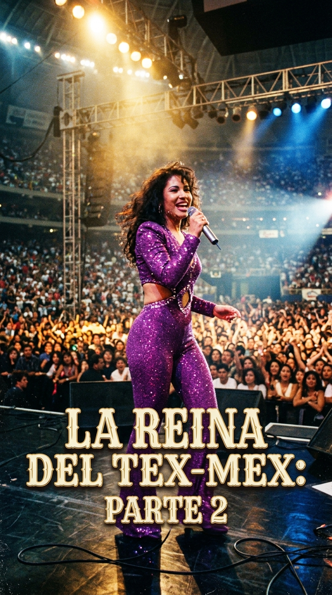
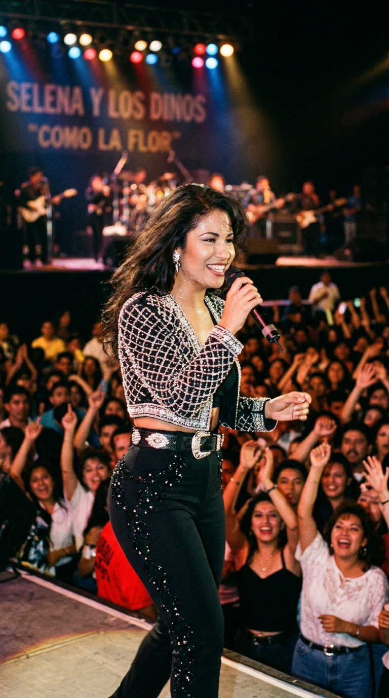
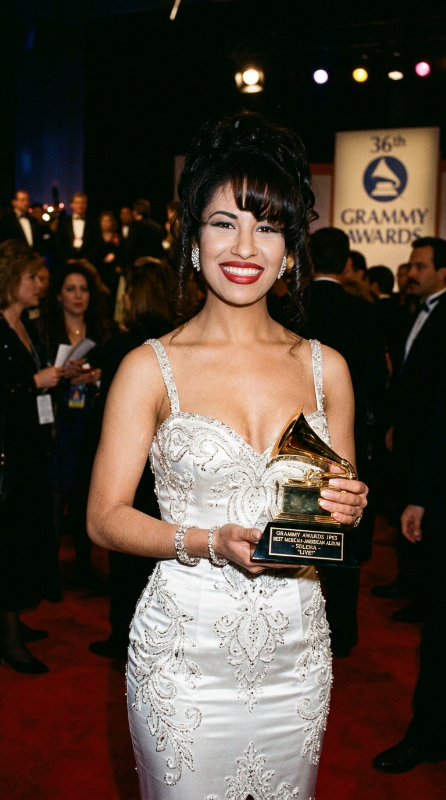
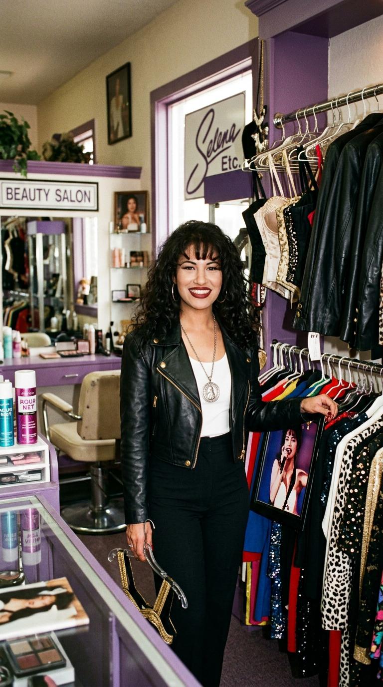
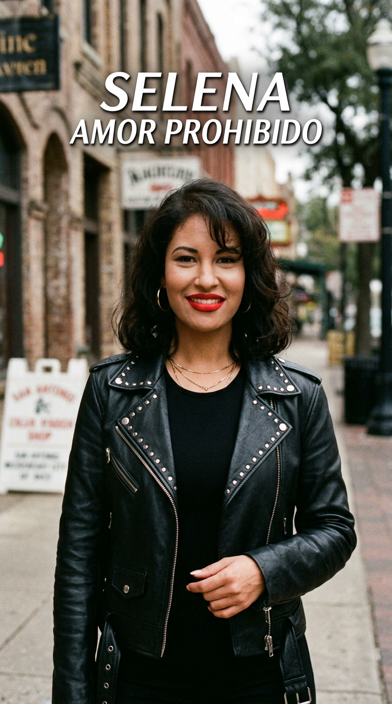
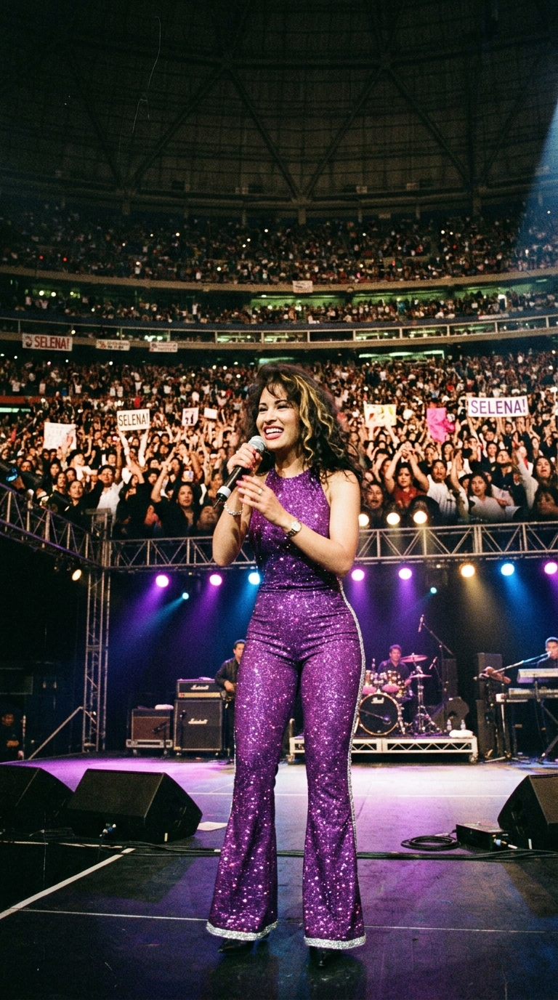
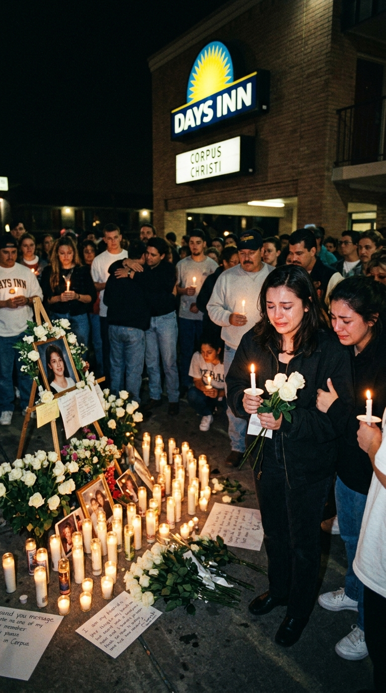
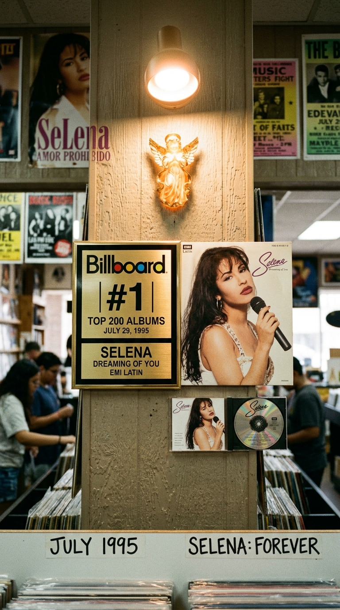

# 🌹 La Leyenda de la Reina del Tex-Mex: El Vuelo Inmortal de Selena Quintanilla
### *De la conquista de los estadios mexicanos al histórico récord del Houston Astrodome y la gloria póstuma del Billboard: la epopeya luminosa de la mujer que derribó todas las fronteras.*

---

**Por la redacción de Acordes Ocultos**  
*Tiempo de lectura estimado: 10 minutos*

---

### Prólogo: El fuego latino que cambió la historia

En la música popular de los Estados Unidos y América Latina, existen figuras que marcan una época, y existen iconos transcendentales que redefinen la identidad de millones de seres humanos. Antes de la irrupción arrolladora de **Selena Quintanilla**, la música tejana era un territorio hostil, dominado con puño de hierro por cantantes masculinos, donde una mujer al frente de una agrupación era vista por los empresarios de bailes y las emisoras de radio como una herejía comercial imposible de rentabilizar.

*Mayo de 1992: Una radiante Selena de veintiún años conquista al público de México cantando 'Como la flor' con su arrolladora presencia escénica.*

Selena no solo dinamitó aquel techo de cristal; lo transformó en una pista de baile continental. Con una sonrisa cálida que desarmaba al más escéptico, un sentido intuitivo del diseño de modas que celebraba las curvas y la belleza morena sin complejos, y una voz cargada de un terciopelo lírico capaz de transitar de la cumbia más festiva a la ranchera más desgarradora, la joven nacida en Lake Jackson y criada en Corpus Christi se erigió en el corazón latiente de la cultura bicultural méxico-americana.

Esta segunda parte de su saga biográfica narra los tres años más vertiginosos y deslumbrantes de su existencia: el florecimiento de su reinado internacional, la conquista de la alta costura y los premios Grammy, la apoteosis escénica en el Astrodome de Houston ante sesenta y siete mil almas, y la desgarradora traición que truncó su aliento terrenal pero selló su inmortalidad en el firmamento eterno de la música popular.

---

### Acto I: El milagro de «Como la flor» y la rendición de Monterrey

A comienzos de 1992, la carrera de Selena y Los Dinos experimentó una sacudida que cambiaría su escala para siempre. Hasta ese momento, la banda de los hermanos Quintanilla era un fenómeno sumamente respetado en el circuito tejano de Texas, Nuevo México y California, pero las puertas del gigantesco y exigente mercado de la República Mexicana permanecían herméticamente cerradas para ellos. La crítica musical azteca miraba con recelo a los artistas méxico-americanos de segunda y tercera generación, acusándolos con displicencia de «pochos» que hablaban un español titubeante y desfiguraban los géneros folclóricos tradicionales.

Todo cambió en mayo de 1992 con el lanzamiento de su cuarto álbum para EMI Latin, **Entre a Mi Mundo**, y la publicación del sencillo que se convertiría en su firma espiritual: *«Como la flor»*.

La canción, compuesta por su talentoso hermano y bajista **A.B. Quintanilla III** junto al corista **Pete Astudillo** tras un concierto en Bryan, Texas, nació en una habitación de hotel con un teclado barato Casio. Era una cumbia cadenciosa y nostálgica que comparaba la muerte de un amor no correspondido con una flor marchita a la que se le priva del agua. En la garganta de Selena, aquella metáfora botánica cobraba una hondura y un dramatismo apasionado que erizaba la piel.

Cuando la agrupación cruzó la frontera norte para presentarse en la Sultana del Norte, en Monterrey (Nuevo León), el escepticismo inicial de la prensa mexicana se evaporó en cuestión de segundos durante una legendaria conferencia de prensa. Selena no fingió una dicción extranjera ni intentó disimular sus errores gramaticales; respondió a cada periodista con humildad, humor y una franqueza desarmante, intercalando expresiones en inglés y español mientras reía con naturalidad.

Esa misma noche, ante un mar de más de setenta mil fanáticos que coreaban cada verso a pulmón abierto, México cayó rendido a sus pies. *«Como la flor»* superó las trescientas mil copias despachadas en tiempo récord y trepó a los primeros puestos de popularidad, convirtiendo a Selena en la primera mujer tejana en ser condecorada con múltiples discos de oro y platino en suelo mexicano.

En el plano personal, abril de 1992 marcó también un acto de enorme valentía íntima: Selena contrajo matrimonio en secreto en el juzgado del condado de Nueces con su guitarrista líder, **Chris Pérez**. Aunque el patriarca familiar, Abraham Quintanilla Jr., se había opuesto ferozmente a la relación temiendo que desestabilizara la cohesión del grupo, la devoción mutua de los jóvenes recién casados demostró ser un refugio inquebrantable de complicidad y madurez en medio de la vorágine de la fama.

---

### Acto II: La noche del Grammy blanco y el imperio de Selena Etc.

El 1 de marzo de 1994, el universo musical vivió una noche consagratoria en el majestuoso Radio City Music Hall de Nueva York. Se celebraba la 36.ª entrega anual de los **Premios Grammy**, el máximo galardón de la industria discográfica mundial.

Entre la constelación de estrellas planetarias presentes, todas las miradas convergieron en una joven de veintidós años que desfilaba por la alfombra roja enfundada en un deslumbrante vestido blanco de silueta sirena, cuajado de cuentas de cristal y bordados plateados, que ella misma había seleccionado y ajustado a mano en su taller de costura.

*1 de marzo de 1994: Selena posa radiante en Nueva York con su primer Grammy al Mejor Álbum de Música Mexicano-Americana por Selena LIVE!.*

Cuando los presentadores abrieron el sobre de la categoría al **Mejor Álbum de Música Mexicano-Americana** y pronunciaron el nombre de *Selena LIVE!* (grabado en vivo en el Memorial Coliseum de Corpus Christi el 7 de febrero de 1993), el auditorio estalló en aplausos. Subiendo al proscenio con gracia felina, Selena alzó el gramófono dorado y pronunció un emotivo discurso bilingüe donde agradeció a su familia, a su disquera EMI y a la comunidad latina por creer en su arte. Con esa estatuilla, Selena se transformó en la **primera mujer artista tejana en la historia en ganar un premio Grammy**, consagrando a la música de frontera en la élite del arte sonoro internacional.

Pero su visión creadora no se limitaba a los pentagramas. Desde niña, Selena había soñado con ser diseñadora de moda; confeccionaba a mano sus propios trajes de concierto, comprando telas en tiendas departamentales y pegando pedrería Swarovski noche tras noche en su autobús de gira.

En 1994, Selena materializó ese sueño al inaugurar sus dos exclusivas boutiques y salones de belleza: **Selena Etc.**, ubicadas en Corpus Christi y San Antonio (Texas). Las tiendas no eran simples comercios de ropa; eran templos de estilo personal donde Selena supervisaba cada patrón, diseñaba sombreros de ala ancha, chalecos de cuero bordados, cinturones con hebillas enjoyadas y líneas de cosméticos centradas en su inseparable lápiz labial rojo cereza (*Chanel Brick*).

*1994: Selena supervisa los percheros y bocetos de moda en su boutique Selena Etc. de Corpus Christi, convertida en empresaria de alta costura.*

Su éxito como empresaria autónoma llenó de orgullo a la juventud hispana: demostraba que una muchacha de orígenes humildes podía triunfar en la música y, al mismo tiempo, dirigir su propio imperio de alta costura con absoluta independencia corporativa.

---

### Acto III: El huracán de «Amor Prohibido» y el olimpo del Astrodome

En marzo de 1994 vio la luz su obra maestra discográfica: el álbum **Amor Prohibido**. Concebido bajo la producción musical de A.B. Quintanilla y los arreglos de Joe Ojeda y Ricky Vela, el disco fue una revolución sónica que fusionó la cumbia tejana con el pop bailable contemporáneo, el hip-hop noventero y el rock alternativo.

*Marzo de 1994: Selena con cazadora de cuero y camisa blanca en la histórica imagen de promoción del álbum multiplatino Amor Prohibido.*

La canción homónima, *«Amor Prohibido»*, se inspiró en la historia real de superación de los bisabuelos de Selena: un romance de clases sociales cruzadas en el México de principios del siglo XX, donde una muchacha acomodada desafió las convenciones aristocráticas para casarse con un humilde jornalero por amor. En el álbum convivían además piezas fundamentales que marcaron a varias generaciones: la irresistible pegada bailable de *«Bidi Bidi Bom Bom»*, el melodrama orquestal de ranchera moderna en *«No me queda más»* y la frescura technocumbia de *«Techno Cumbia»*.

El álbum debutó en los primeros lugares de ventas y desbancó a *Mi Tierra* de Gloria Estefan del **número uno del Billboard Top Latin Albums**, donde permaneció setenta y ocho semanas en los puestos de honor. Con más de dos millones y medio de copias vendidas solo en los Estados Unidos, *Amor Prohibido* se convirtió en uno de los álbumes latinos más vendidos de todos los tiempos.

La apoteosis visual y escénica de su reinado se produjo el domingo **26 de febrero de 1995**, durante el prestigioso festival anual *Houston Livestock Show and Rodeo*, en el colosal estadio cubierto del **Houston Astrodome**.

Ante una multitud que batió todos los récords de asistencia con **66.994 espectadores** abarrotando las gradas hasta el techo, Selena hizo su entrada triunfal sobre la arena en un carruaje blanco descubierto tirado por caballos. Vestía un atuendo que quedaría cincelado para siempre en la memoria colectiva del pop mundial: un ceñido jumpsuit morado de campana acampanada, confeccionado en terciopelo reluciente con destellos de purpurina, con un escote cruzado sobre el pecho y una torerita a juego.

*26 de febrero de 1995: Selena en su icónico jumpsuit morado reina ante 67.000 espectadores en el Houston Astrodome en su concierto más legendario.*

A lo largo de casi una hora de despliegue físico colosal, Selena ofreció una cátedra escénica irrepetible: abrió el espectáculo con un vibrante popurrí de clásicos de la música disco anglosajona (*«I Will Survive»*, *«Funkytown»*, *«Last Dance»*), bailó zapateados de cumbia con una energía inagotable y cantó con una potencia vocal impecable, mientras su risa espontánea y sus pasos de baile hacían temblar las vigas de acero del estadio. Aquella noche, Selena no solo era la reina indiscutible del Tex-Mex; era una de las mayores artistas de escenario del planeta Tierra.

---

### Acto IV: La sombra de la traición y la mañana amarga de Corpus Christi

En las primeras semanas de 1995, la vida de Selena parecía tocar el cielo. Los altos directivos de la casa matriz de EMI Records en Los Ángeles, encabezados por Charles Koppelman, le habían concedido finalmente la oportunidad por la que tanto había luchado: grabar su primer álbum *crossover* en inglés, destinado a colocarla en el mismo nivel de difusión masiva que Whitney Houston, Madonna o Mariah Carey. Selena pasaba los días y las noches en los estudios de grabación de California registrando baladas monumentales en su lengua materna como *«I Could Fall in Love»* y *«Dreaming of You»*.

Sin embargo, en el entorno de sus negocios en Texas, una sombra siniestra comenzaba a alargarse. A comienzos de marzo de 1995, el padre de Selena, Abraham Quintanilla, descubrió que faltaban importantes sumas de dinero en los balances contables de las boutiques y del club de fans oficial.

Las irregularidades apuntaban directamente a **Yolanda Saldívar**, una enfermera retirada que se había ganado la confianza ciega de Selena en 1991 al proponerle fundar el club de fans oficial, y que posteriormente había sido designada administradora general de las boutiques *Selena Etc.*. Al auditar las cuentas, la familia constató cheques falsificados, cobros indebidos a los miembros del club de admiradores y la desaparición de más de sesenta mil dólares en documentación fiscal que la mujer se negaba a entregar.

En una tensa reunión el 9 de marzo en las oficinas de Q-Productions, Abraham encaró a Saldívar y le prohibió terminantemente volver a acercarse a su hija. Sin embargo, Selena, guiada por un sentimiento de compasión humana y la urgente necesidad de recuperar los extractos bancarios y registros fiscales indispensables para su próxima declaración de impuestos, aceptó reunirse a solas con ella.

En la mañana del viernes **31 de marzo de 1995**, Selena acudió al motel **Days Inn** de Corpus Christi (ubicado junto a la autopista Navigation Boulevard), donde Saldívar se hospedaba en la habitación número 158.

Tras una discusión en el interior del cuarto donde Selena le exigió la entrega inmediata de los papeles financieros que faltaban, Saldívar sacó de su bolso un revólver Taurus calibre .38 con cañón de dos pulgadas. Cuando Selena dio media vuelta para intentar salir de la habitación y huir hacia el exterior, la mujer apretó el gatillo por la espalda.

La bala impactó en la clavícula derecha de la cantante, cercenando una arteria subclavia principal. Con una fuerza sobrehumana nacida del instinto de supervivencia, Selena logró correr más de cien metros a través del patio del motel hasta alcanzar el vestíbulo de la recepción, donde se desplomó susurrando el nombre de su atacante y el número de la habitación.

Fue trasladada de urgencia al Hospital Memorial de Corpus Christi. A pesar de los desesperados esfuerzos del equipo quirúrgico por reanimarla mediante transfusiones y toracotomía de emergencia, a las 13:05 horas de aquella fatídica mañana se certificó formalmente su muerte por choque hipovolémico derivado de herida por arma de fuego. Selena Quintanilla Pérez tenía apenas veintitrés años de edad.

*Marzo de 1995: Vigilia de lágrimas y rosas blancas en Corpus Christi, donde un continente entero lloró la partida de su reina más querida.*

La noticia cayó sobre el continente americano como un trueno devastador. Miles de personas de todo Texas, México y California colapsaron las carreteras para rendirle homenaje en el Centro de Convenciones Bayfront Plaza de Corpus Christi, donde desfilaron más de sesenta mil personas frente a su féretro custodiado por montañas de rosas blancas —sus flores favoritas—. El gobernador de Texas y futuro presidente de los Estados Unidos, George W. Bush, proclamó oficialmente el 16 de abril (fecha del nacimiento de Selena) como el **Día de Selena** en todo el estado de Texas.

---

### Epílogo: El triunfo inmortal de «Dreaming of You»

La tragedia silenció el cuerpo físico de Selena, pero desató un fenómeno cultural de proporciones gigantescas. En julio de 1995, cuatro meses después de su partida, EMI Records lanzó al mercado el esperado álbum póstumo **Dreaming of You**, combinando las canciones en inglés que había alcanzado a grabar con clásicos remasterizados en español.

El disco debutó directamente en el **puesto número uno del Billboard 200**, despachando más de **175.000 copias en su primer día en las tiendas** —un récord absoluto para una artista femenina en toda la historia de la música norteamericana en ese momento—. Selena se convirtió en la primera artista latina en debutar en la cúspide de la lista general de álbumes de los Estados Unidos.

*Julio de 1995: El histórico vinilo de Dreaming of You coronado con el disco de platino en el número 1 del Billboard 200, sellando la inmortalidad de Selena.*

Tres décadas después de aquella fatídica mañana de marzo, el brillo de Selena Quintanilla arde con más fuerza que nunca. No fue únicamente una pionera que abrió el camino comercial para figuras posteriores como Jennifer Lopez, Shakira o Selena Gomez; fue la personificación viviente de la dignidad, la dulzura y el orgullo de una comunidad que aprendió a verse hermosa y poderosa en su reflejo. Cada vez que el ritmo de *«Amor Prohibido»* o la nostalgia dulce de *«Dreaming of You»* vuelven a encenderse, la reina del Tex-Mex nos recuerda que el verdadero amor jamás muere: se transforma en una flor eterna que nunca dejará de florecer.

---

### 📚 Fuentes y Archivo Documental

* **Patoski, Joe Nick**: *Selena: Como La Flor* (Little, Brown and Company, 1996). La investigación hemerográfica y biográfica de referencia sobre los orígenes de Selena, el ascenso discográfico con EMI Latin y el impacto sociocultural en Texas y México.
* **Pérez, Chris**: *To Selena, with Love* (Celebra / Penguin Books, 2012). Testimonio íntimo del guitarrista líder y esposo de Selena, detallando su boda en 1992, la dinámica creativa en los ensayos y los últimos meses en Corpus Christi.
* **Richmond, Clint**: *Selena! The Incredible Story of the Tejano Superstar* (Pocket Books / Simon & Schuster, 1995). Crónica documental inmediata sobre el fenómeno de asistencia en el Houston Astrodome y la reacción popular tras su asesinato.
* **Expedientes Judiciales del Estado de Texas**: Causa penal N.º 95-CR-1144-F (*The State of Texas vs. Yolanda Saldivar*), Tribunal de Distrito 214 del Condado de Nueces (trasladado a Houston, octubre de 1995). Transcripción oficial de testimonios periciales balísticos y declaraciones médicas del Hospital Memorial de Corpus Christi.
* **Billboard Magazine Archive**: Informes históricos de ventas y listas de popularidad correspondientes a abril de 1994 (*Amor Prohibido* en el N.º 1 de Top Latin Albums) y julio-agosto de 1995 (*Dreaming of You* debutando en el N.º 1 del Billboard 200).
* **The Recording Academy (GRAMMYs Archive)**: Registro oficial de la 36.ª edición anual de los Grammy Awards (1 de marzo de 1994, Radio City Music Hall de Nueva York; Mejor Álbum Mexicano-Americano por *Selena LIVE!*).
