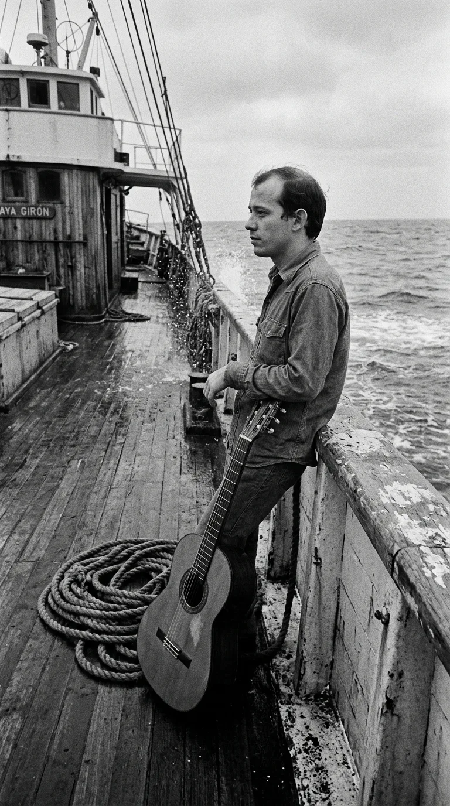
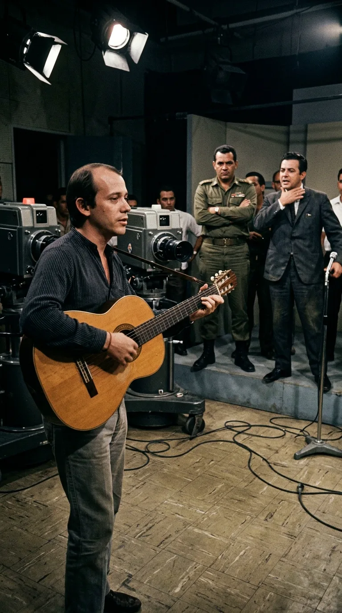
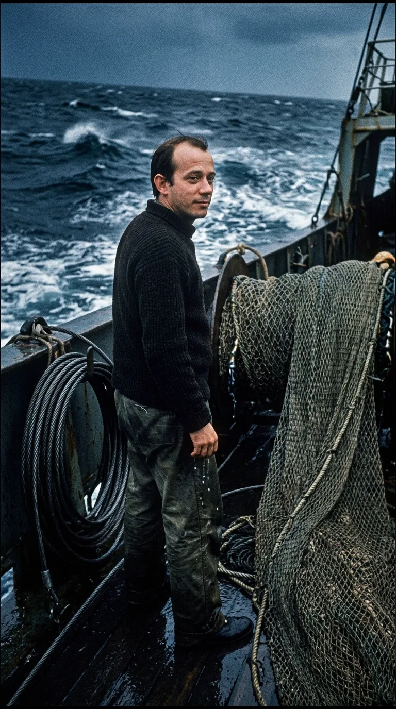
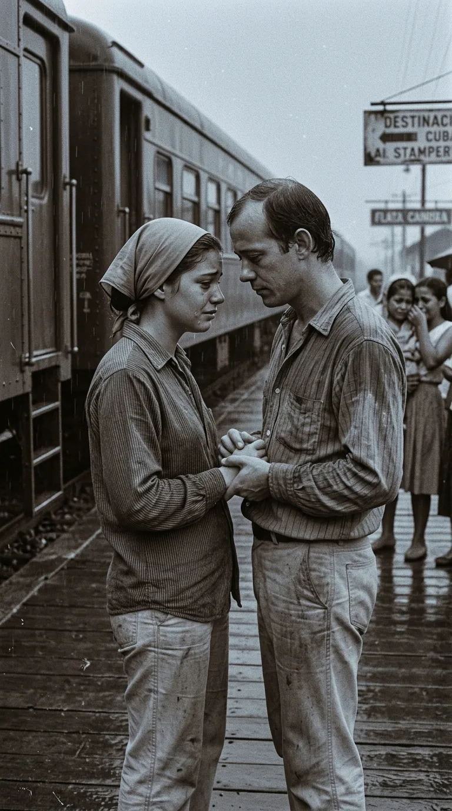
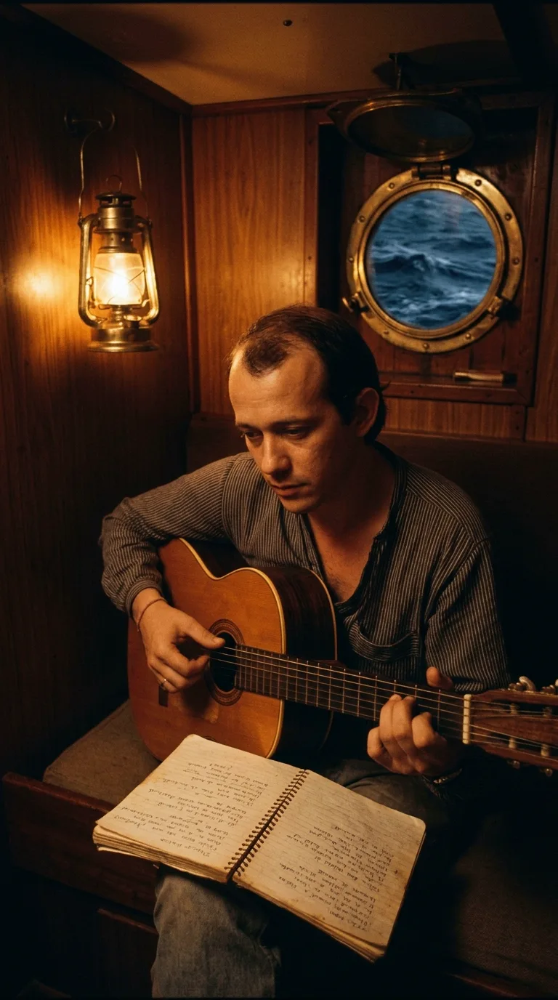
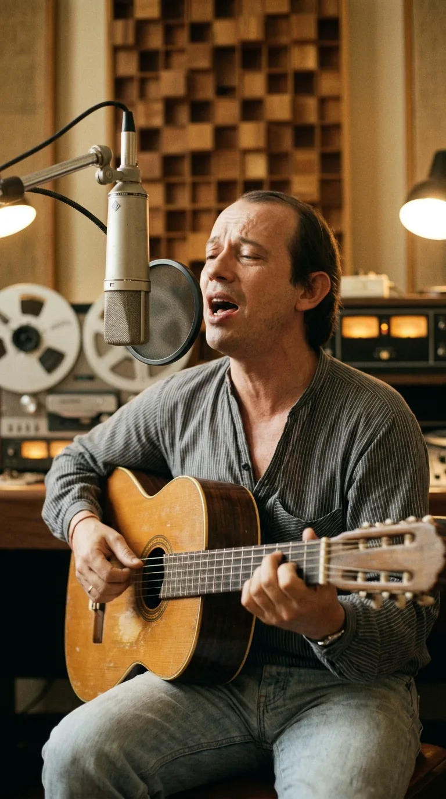

# 🌊 El Exorcismo del Océano: La Verdad Detrás de «Ojalá» de Silvio Rodríguez

### *Cómo un castigo oficial en altamar, 125 días de aislamiento en un barco pesquero y el desgarro por un amor truncado parieron el himno más incomprendido de la música en español.*

---

**Por la redacción de Acordes Ocultos**  
*Tiempo de lectura estimado: 11 minutos*

> *«Ojalá se te acabe la mirada constante, la palabra precisa, la sonrisa perfecta... Ojalá pase algo que te borre de pronto: una luz cegadora, un disparo de nieve. Ojalá por lo menos que me lleve la muerte, para no verte tanto, para no verte siempre en todos los segundos, en todas las visiones...»*  
> — **Silvio Rodríguez**

---

### Prólogo: La maldición mal entendida

Durante más de cuatro décadas, pocas canciones en la historia de la música hispanoamericana han acumulado tantas leyendas urbanas, interpretaciones descabelladas y sospechas políticas como *«Ojalá»*. 

En los años setenta y ochenta, en plena efervescencia de las dictaduras militares en el Cono Sur y en el corazón de la Guerra Fría, miles de jóvenes cantaban aquellos versos con el puño en alto en asambleas universitarias, teatros semiclandestinos y peñas de resistencia de Santiago de Chile, Buenos Aires y Montevideo. Para aquella generación asediada por la represión, la violencia poética de la letra no admitía dudas: era una diatriba en clave contra la tiranía, un grito de combate contra los dictadores de turno. Otros, enconados en el bando ideológico opuesto, aseguraban que el joven trovador cubano le deseaba la muerte en secreto a los burócratas del régimen castrista que lo censuraban; e incluso hubo teóricos que juraron que los versos iban dirigidos contra la Casa Blanca, el imperialismo o el mismísimo Fidel Castro. La vehemencia de sus imágenes —el ruego ardiente de que la tierra se abra, de que un disparo de nieve aniquile la presencia del otro— parecía encajar con una precisión sobrecogedora en la retórica de las barricadas.

Pero la historia real, celosamente preservada por su autor hasta que los años calmaron las aguas de la polarización política, es infinitamente más solitaria, humana y desgarradora. *«Ojalá»* no nació en una trinchera ideológica, ni en un mitin revolucionario, ni en los despachos de ningún ministerio cultural. Nació en la cubierta oxidada de un barco pesquero a miles de millas de tierra firme, de la pluma febril de un muchacho de apenas veintidós años que intentaba desesperadamente arrancarse del pecho el fantasma de la mujer que no lo dejaba dormir.

*A los veintidós años, Silvio Rodríguez contemplando el Atlántico en la cubierta del pesquero Playa Girón, con su guitarra como única compañera de travesía.*

---

### Acto I: La herejía de los Beatles y el castigo del salitre (1969)

El punto de partida de esta obra maestra no es la gloria artística, sino una sanción disciplinaria. Hacia mediados de 1969, Silvio Rodríguez era un joven cantautor que comenzaba a despuntar en La Habana por su talento poético descomunal y su técnica guitarrística atípica, pero también por un espíritu rebelde y una honestidad intelectual que incomodaba profundamente a la ortodoxia oficial.

Silvio conducía entonces un programa experimental en la televisión cubana titulado *Mientras Tanto*. En una época en que la influencia cultural anglosajona era vista por los comisarios políticos como una infiltración ideológica diversionista, el joven trovador cometió lo que para muchos censores fue un sacrilegio imperdonable: elogió con entusiasmo en pantalla abierta a The Beatles, transmitió su música y defendió apasionadamente la libertad creadora individual por encima de las consignas dogmáticas del realismo socialista.

La respuesta de las autoridades del Instituto Cubano de Radiodifusión (ICR) y del Consejo Nacional de Cultura fue fulminante e implacable. El programa *Mientras Tanto* fue cancelado de la noche a la mañana. Sus cintas maestras y grabaciones fueron confiscadas y archivadas bajo llave, y se le prohibió tajantemente presentarse en teatros, radios o festivales públicos. De un plumazo, el joven músico quedó reducido al ostracismo más asfixiante.

*La Habana, 1969: los censores del Instituto Cubano de Radiodifusión intervienen el programa «Mientras Tanto» tras los elogios de Silvio a The Beatles.*

Para evitar que la controversia escalara y bajo el argumento de que el joven artista necesitaba «vincularse con la clase trabajadora y desintoxicarse ideológicamente», las autoridades le ofrecieron una salida forzada que tenía todos los ribetes de un destierro laboral: enrolarse como tripulante en la Flota del Golfo, la flota pesquera de altura que operaba en aguas internacionales.

Silvio aceptó sin vacilar. El 26 de septiembre de 1969, cargando una vieja guitarra acústica de madera gastada con la tapa cuarteada, un cuaderno escolar de espiral y dos mudas de ropa de faena, subió por la estrecha pasarela del *Playa Girón*, un buque nodriza de pesca de acero remachado que zarpaba del puerto habanero rumbo a las profundidades del océano Atlántico y las costas del África occidental.

---

### Acto II: 125 días en el vientre del «Playa Girón»

Lo que aguardaba a Silvio no era un retiro bucólico de inspiración poética, sino la rutina brutal y extenuante de los hombres del mar. Durante cuatro meses y cinco días —un total de 125 jornadas ininterrumpidas sin pisar tierra firme ni ver la costa—, el trovador convivió en camarotes minúsculos y sofocantes con marineros veteranos, fogoneros y capitanes de rostro curtido por la salmuera.

Su labor diaria no tenía tregua: ayudaba en las tareas de cubierta, recogía redes kilométricas cargadas de toneladas de atún, limpiaba pescado bajo el sol canicular y montaba guardias nocturnas en medio de tempestades feroces que hacían gemir las junturas de hierro de la embarcación. No había teléfonos, ni periódicos, ni contacto con el continente. La única comunicación con el resto de la humanidad eran los escuetos mensajes telegráficos en clave morse que el operador de radio recibía en la cabina de mando.

*La cubierta del Playa Girón sorteando el fuerte oleaje del Atlántico; 125 días de faena dura, salitre y aislamiento absoluto.*

En aquella inmensidad desolada, donde el horizonte era una línea infinita de agua gris que se fundía con el cielo plomizo, el ruido ensordecedor de los motores diésel del barco se transformaba de noche en un silencio abrumador. Y en ese silencio, despojado de distracciones, de amistades y de escenarios, afloró con una fuerza incontenible la herida que Silvio creía haber enterrado en La Habana.

---

### Acto III: Emilia Sánchez, el primer temblor

Entre las olas del Atlántico, el rostro que no dejaba en paz al trovador tenía nombre, voz y mirada: Emilia Sánchez.

Silvio la había conocido tres años atrás, en 1966, en la provincia oriental de Camagüey. En aquel entonces, con apenas diecinueve años, él cumplía su servicio militar obligatorio en las Fuerzas Armadas Revolucionarias, acampado entre bateristas de artillería antiaérea y maniobras bajo el sol implacable de la llanura cubana. Emilia era una brillante y hermosa estudiante de Medicina de la Universidad de Camagüey, dueña de una inteligencia serena y una calidez que deslumbró al muchacho tímido y retraído.

Fue el primer amor total, volcánico y desmedido de su juventud. En sus días de permiso, caminaban horas enteras por las calles coloniales de la ciudad, compartían libros de poesía, soñaban despiertos bajo los aguaceros tropicales y proyectaban una vida compartida donde la medicina y el arte se abrazaran. Para Silvio, Emilia fue el despertar de la ternura y la medida de todas las cosas hermosas del mundo.

*Camagüey, 1966: el joven soldado Silvio Rodríguez junto a Emilia Sánchez, la estudiante de medicina que marcó su primer amor absoluto.*

Sin embargo, las complejidades de la época, las rigideces familiares, la distancia entre La Habana y Camagüey y los caminos profesionales divergentes de dos jóvenes que apenas descubrían la vida adulta comenzaron a tensar la relación hasta hacerla insostenible.

---

### Acto IV: La ruptura y la estación del adiós

La despedida definitiva no fue una explosión de reproches, sino la lenta y dolorosa agonía de dos personas que se aman pero reconocen la imposibilidad de seguir juntas. Hubo lágrimas, cartas apasionadas que intentaron recomponer lo roto y finalmente un adiós amargo en el andén de una estación ferroviaria, bajo el humo espeso de las locomotoras y la lluvia fría del desencanto.

Emilia continuó con su carrera médica, volcada en los hospitales y en su vocación de sanar cuerpos ajenos. Silvio regresó a La Habana para intentar dedicarse de lleno a la composición, pero el fantasma de Emilia lo persiguió por cada esquina de El Vedado y la Habana Vieja.

*El dolor de la separación en la estación ferroviaria: la distancia y los rumbos divergentes consumaron una ruptura irremediable.*

Tres años después de aquella ruptura, flotando en medio del Atlántico a miles de kilómetros de la costa, Silvio descubrió con espanto que el tiempo no había cerrado la cicatriz; la había ulcerado. La soledad oceánica actuaba como una lupa monstruosa. Cada ráfaga de viento parecía traerle el timbre exacto de la risa de Emilia; el brillo del agua bajo la luna llena le devolvía la perfección de sus ojos; en cada rincón del barco sentía su presencia fantasmal. Silvio comprendió que la memoria se había convertido en una condena biológica: mientras Emilia respirara en algún lugar de la tierra, él estaba incapacitado para volver a encontrar la calma.

---

### Acto V: El grito del exorcismo en el camarote

Fue en ese estado de desesperación psicológica y fiebre emocional, durante una noche de balanceo incesante en la litera de su camarote estrecho, cuando Silvio agarró su guitarra maltrecha. No intentaba escribir una canción de amor para recuperarla ni un poema lírico para cortejarla. Necesitaba desesperadamente ejecutar un conjuro; un exorcismo poético para arrancarla de sus entrañas antes de perder el juicio.

Así, a la luz temblorosa de una lámpara de queroseno y al ritmo sordo de los motores navales, nacieron los versos de *«Ojalá»*:

> *«Ojalá que las hojas no te toquen el cuerpo cuando caigan,  
> para que no las puedas convertir en cristal...  
> Ojalá que la lluvia deje de ser milagro que baja por tu cuerpo,  
> ojalá que la luna pueda salir sin ti...»*

*En la estrechez del camarote, bajo la luz tenue y el sonido del oleaje, Silvio vuelca su angustia en la guitarra y su libreta de espiral.*

En estas estrofas iniciales, Silvio no escupe odio: describe con asombro la cualidad casi mágica y destructiva que esa mujer poseía. Para el enamorado, Emilia tenía el poder de transformar todo lo que rozaba en cristal frágil; el universo entero parecía girar en torno a su figura. Y precisamente porque su perfección lo avasallaba, necesitaba que esa magia se extinguiera.

Pero es en el estribillo vertiginoso donde la tensión acumulada estalla con la fuerza de un rayo:

> *«Ojalá se te acabe la mirada constante,  
> la palabra precisa, la sonrisa perfecta...  
> Ojalá pase algo que te borre de pronto:  
> una luz cegadora, un disparo de nieve...  
> Ojalá por lo menos que me lleve la muerte,  
> para no verte tanto, para no verte siempre  
> en todos los segundos, en todas las visiones:  
> ojalá que no pueda tocarte ni en canciones.»*

La petición de «una luz cegadora» o «un disparo de nieve» no era un deseo criminal ni un atentado terrorista metafórico: era la súplica agónica de un alma que ruega una amnesia cósmica instantánea. Un disparo de nieve no sangra ni desgarra; congela y disuelve en blanco la memoria. Y la frase final —*«ojalá que no pueda tocarte ni en canciones»*— encierra la renuncia más trágica para un músico: preferir el silencio absoluto y la pérdida de la propia voz antes que seguir aprisionado en el recuerdo de un amor que ya no existe.

*La furia del mar abierto reflejando la tempestad interior del trovador; una plegaria desgarradora para alcanzar el olvido.*

---

### Acto VI: De altamar a los estudios Sonocentro (1975)

El 28 de enero de 1970, el *Playa Girón* atracó finalmente en el muelle de La Habana. Silvio Rodríguez bajó por la planchada con el rostro tostado por el salitre, las manos llenas de callosidades marineras y una vieja libreta escolar repleta de hojas manuscritas. En aquellos 125 días en el mar había compuesto nada menos que sesenta y dos canciones nuevas. Entre ellas se encontraban auténticas cumbres de la música iberoamericana como *Playa Girón*, *Resumen de noticias*, *Al final de este viaje* y aquel conjuro visceral titulado *Ojalá*.

La sanción oficial había fracasado estrepitosamente como castigo: el aislamiento forzado había convertido al trovador díscolo en un compositor monumental e incontenible.

Cinco años después, en 1975, Silvio entró a los legendarios estudios de grabación Sonocentro de la EGREM en La Habana para registrar su primer gran álbum solista: *Días y Flores*. Acompañado por los virtuosos instrumentistas del Grupo de Experimentación Sonora del ICAIC (GESI) y bajo la mirada atenta del ingeniero de sonido Jerónimo Labrada, Silvio se paró frente a un micrófono de condensador Neumann de válvulas con su guitarra española. Cuando cantó *«Ojalá»*, con la voz rasgada, ágil y atravesada por la urgencia de quien revive una herida viva, los técnicos en la cabina comprendieron que estaban presenciando un hito irrepetible.

*Estudios Sonocentro de la EGREM, 1975: Silvio graba «Días y Flores», inmortalizando «Ojalá» con su guitarra acústica y voz afilada.*

Al publicarse el disco, la canción se propagó como un incendio forestal por todo el continente. Pero con la popularidad masiva llegó también la inevitable distorsión de su significado. En Chile, Argentina y Uruguay, donde las juntas militares secuestraban y censuraban toda manifestación cultural contestataria, los estudiantes adoptaron *«Ojalá»* como un himno clandestino de resistencia contra los generales. La canción fue prohibida por las dictaduras, lo que multiplicó su aura mítica. Durante cuatro décadas, millones de personas creyeron a pies juntillas que se trataba de un canto político cifrado contra el tirano.

---

### Epílogo: El amanecer en la madera y la verdad de la memoria

Tuvieron que pasar más de cuarenta años para que el propio Silvio Rodríguez, ya en la madurez serena de su vida y con el sosiego que regala el tiempo, desarmara de una vez y para siempre todas las fábulas ideológicas.

En 2011, durante una recordada entrevista televisiva con el cantautor Amaury Pérez en el programa *Con 2 que se quieran*, y más tarde en las reflexiones íntimas publicadas en su bitácora digital *Segunda Cita*, Silvio zanjó el debate con una sinceridad desarmante:

> *«Ojalá la compuse a una mujer, a mi primer amor... Es una canción de desamor absoluto. Se la dediqué a Emilia Sánchez, una muchacha de Camagüey que para mí fue un amor tremendo, de esos que te marcan el alma para toda la vida. Yo estaba en el mar, en el Playa Girón, desesperado, y no podía quitármela de la cabeza. Quería olvidarla como fuera, borrarla de mi mente porque me dolía demasiado seguir viviendo con ese recuerdo encima. Todo lo demás que dijeron después —que si era política, que si era contra alguien— no tiene absolutamente nada que ver con la verdad»*.

Hoy, cuando suenan los primeros compases trepidantes del arpegio de guitarra y la voz juvenil de Silvio vuelve a cortar el aire, la verdadera grandeza de *«Ojalá»* resplandece con toda su pureza original.

Nos recuerda que las más altas cumbres de la poesía no nacen de doctrinas partidarias ni de consignas coyunturales, sino de la fragilidad más honda de la experiencia humana: la herida viva de un corazón joven que, mecido por las olas del océano y rodeado por la inmensidad de la noche, tuvo que inventar una plegaria desesperada para intentar seguir respirando.

*Un cuaderno de espiral con versos manuscritos descansa sobre la barandilla de madera del pesquero al amanecer; el mar en calma tras la tempestad del olvido.*

---

### 📚 Fuentes y Archivo Documental

1. **Rodríguez, Silvio.** *Canciones del mar*. Ediciones Ojalá / Casa de las Américas, La Habana, 1996 (Diario de navegación, crónicas y cancionero compuesto a bordo del motonave pesquero *Playa Girón*, 26 de septiembre de 1969 – 28 de enero de 1970).
2. **Rodríguez, Silvio.** *Segunda Cita*. Cuadernos y testimonios autobiográficos sobre los años de servicio militar en Camagüey y la composición de *Días y Flores* (segundacita.blogspot.com).
3. **Pérez, Amaury.** Entrevista testimonial a Silvio Rodríguez en el programa cultural *Con 2 que se quieran*, Televisión Cubana / Instituto Cubano del Arte e Industria Cinematográficos (ICAIC), La Habana, emisión de 2011.
4. **Zapata, Víctor.** *Silvio Rodríguez: Mito y realidad de la Nueva Trova*. Editorial Letras Cubanas, La Habana, 2004 (Análisis documental del proceso de censura en el programa *Mientras Tanto* y el castigo en la Flota del Golfo).
5. **Díaz Pérez, Clara.** *Sobre la guitarra, la voz y la poesía de Silvio Rodríguez*. Editorial Letras Cubanas / Instituto Cubano de la Música, La Habana, 1995.
6. **Archivo Fonográfico EGREM / ICAIC.** Fichas técnicas de producción, hojas de corte y registros sonoros del álbum *Días y Flores* (Estudios de Grabación Sonocentro, La Habana, 1975; producción musical de Silvio Rodríguez con los músicos del GESI).
