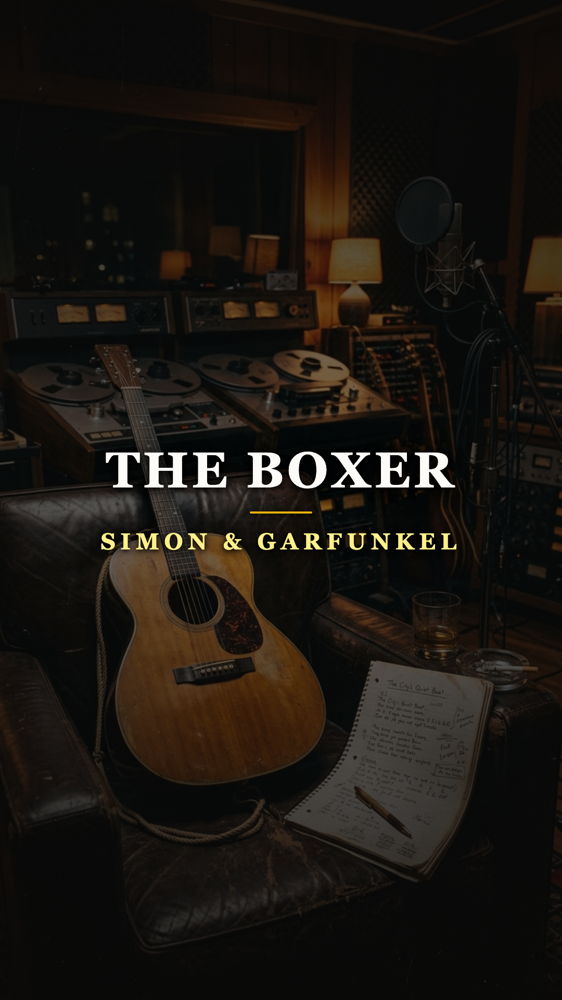
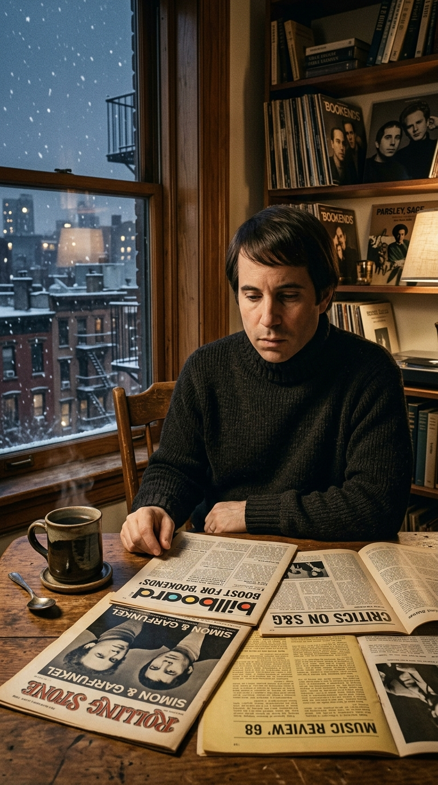
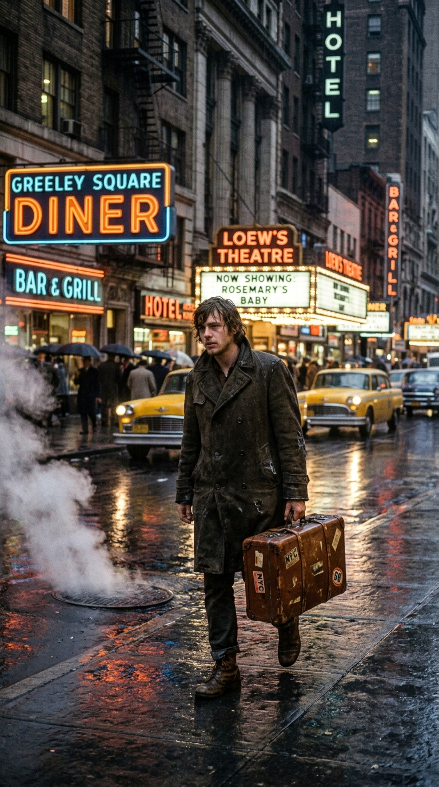
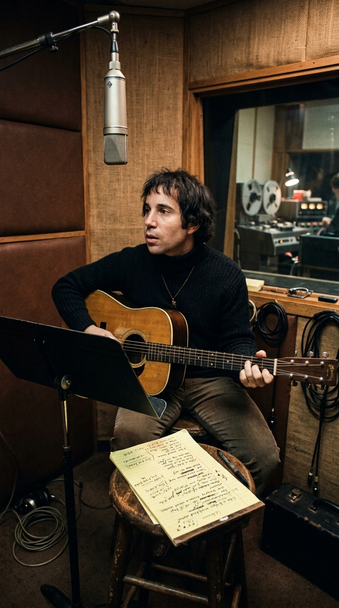
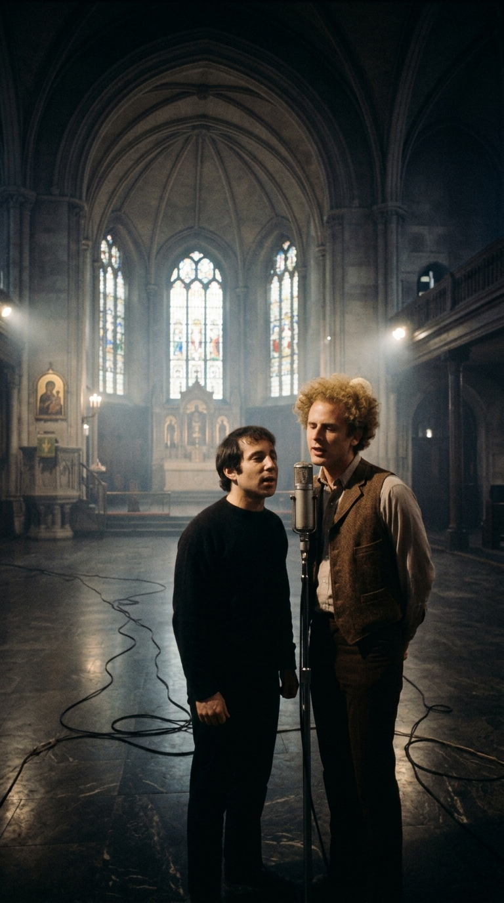
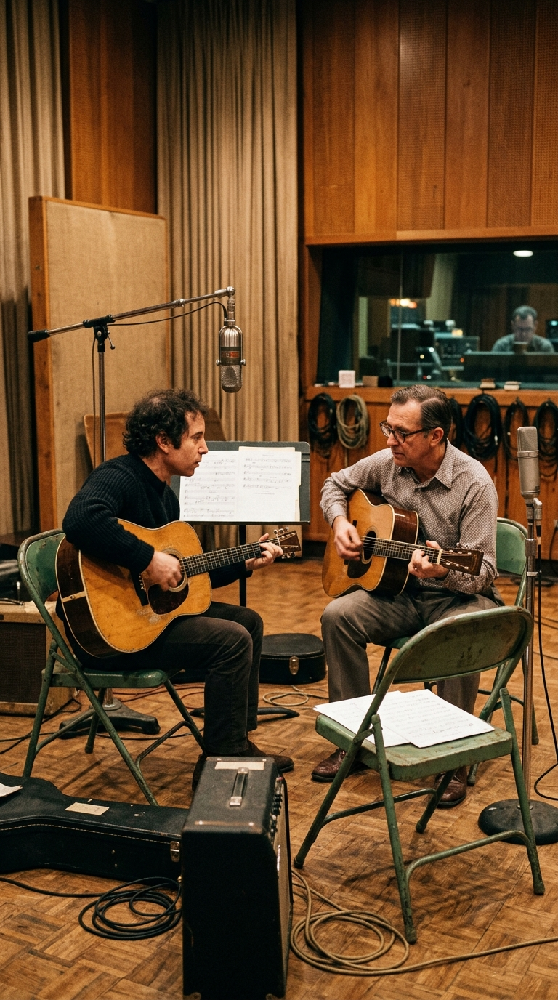
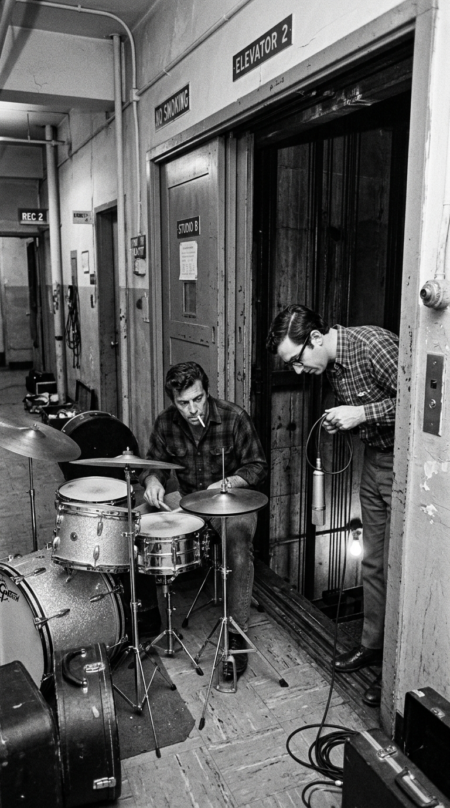
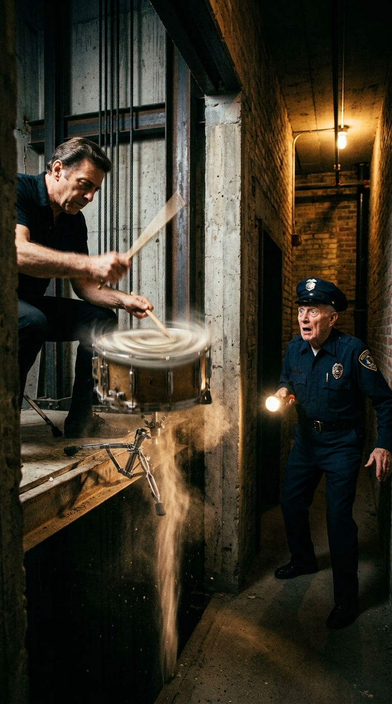
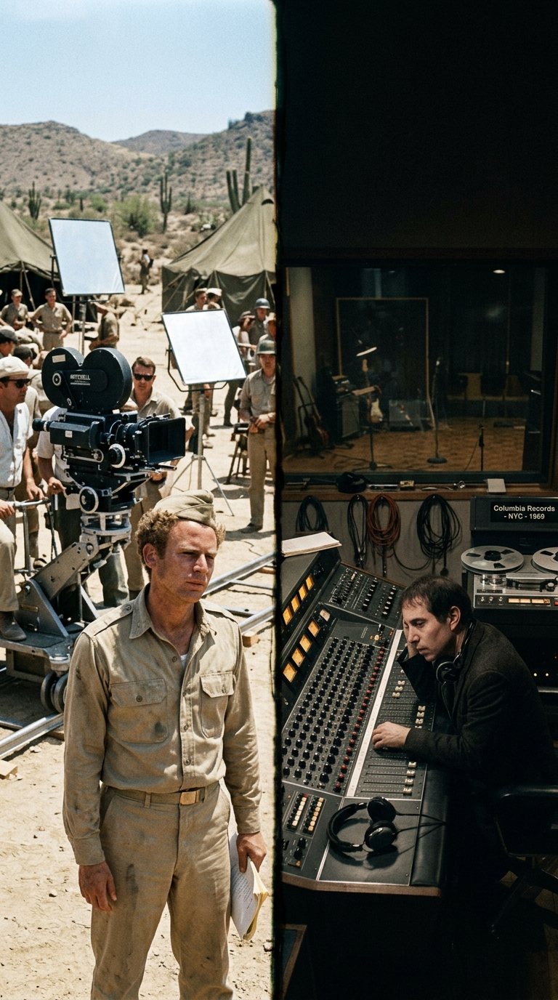
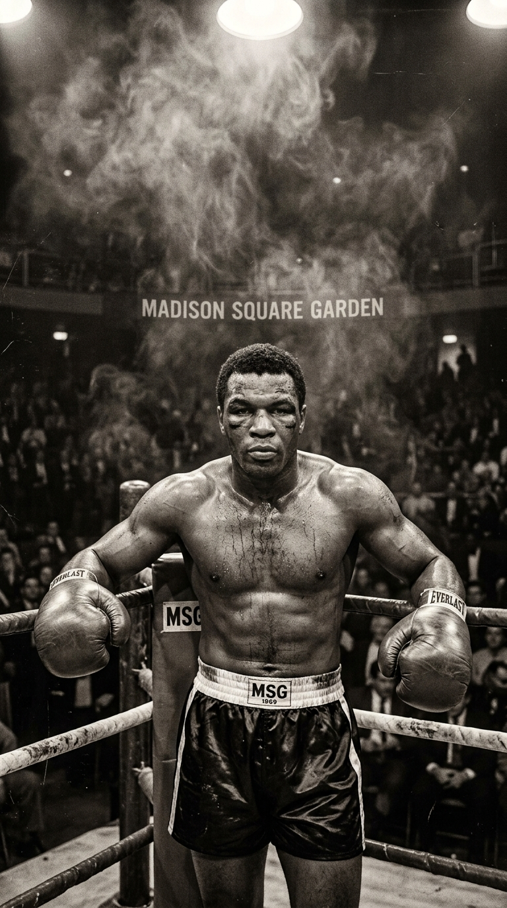

# 🥊 El Cañonazo en el Hueco del Ascensor: La Venganza Silenciosa de Paul Simon

> *«Sentía que todo el mundo me estaba moliendo a golpes... Los críticos decían que éramos blandos, que éramos pretenciosos, que no pertenecíamos a la época. La canción era sobre mí: sobre estar en el cuadrilátero, recibiendo golpe tras golpe, y negarse a besar la lona.»*  
> — **Paul Simon**, sobre la gestación de *«The Boxer»*, Manhattan, 1968.

---

*Columbia Records, 1968–1969: La odisea de más de cien horas de estudio donde una canción de folk acústico se transformó en un monumento sonoro a la resiliencia humana.*

---

### Prólogo: El muchacho que sangraba en la lona de la crítica

A finales del otoño de **1968**, la ciudad de Nueva York se deslizaba hacia uno de los inviernos más oscuros y convulsos de su historia reciente. En un amplio pero austero apartamento de Manhattan, **Paul Simon**, de apenas veintisiete años, contemplaba la nieve sucia que comenzaba a acumularse sobre las cornisas de los edificios victorianos. Sobre su mesa de trabajo de roble macizo, junto a una taza de café negro que se enfriaba lentamente, descansaba una pila desordenada de recortes de prensa musical.

Aquellas páginas no contenían elogios. Eran una colección de bofetadas verbales.

A pesar de haber coronado las listas de ventas de medio planeta con la banda sonora de *The Graduate* (*El graduado*) y su aclamado cuarto disco *Bookends*, la crítica musical de la contracultura no mostraba piedad hacia el dúo neoyorquino. En las redacciones underground de revistas como *Crawdaddy!* y *Village Voice*, mientras el mundo se incendiaba con las guitarras distorsionadas de Jimi Hendrix, los lamentos eléctricos de Cream y la insolencia rabiosa de The Rolling Stones, Simon & Garfunkel eran sistemáticamente etiquetados como una fórmula «blanda, inofensiva, almibarada y burguesa».

*Manhattan, invierno de 1968: Un Paul Simon herido en su orgullo medita en soledad la respuesta definitiva a quienes pretendían desterrarlo del canon del rock.*

Para un compositor meticuloso, obsesivo y visceralmente orgulloso de sus raíces de clase trabajadora en Queens, aquellos ataques se sentían como una agresión ilegítima. Simon no se consideraba un esteta complaciente; se sentía un gladiador que había peleado centímetro a centímetro por dominar la métrica, la armonía y la poesía popular americana. 

Fue en aquellas noches de insomnio y rabia contenida, con los dedos entumecidos sobre el mástil de su guitarra Martin, donde nació la chispa de su mayor obra maestra: una respuesta que no se daría en entrevistas de prensa ni en réplicas periodísticas, sino en el cuadrilátero invisible de la creación musical.

---

### Acto I: La Séptima Avenida y la anatomía del desengaño

Paul Simon tomó lápiz y papel y decidió no escribir sobre sí mismo con nombres y apellidos. En su lugar, recurrió a una de las figuras arquetípicas más conmovedoras y desoladoras de la mitología urbana estadounidense: el muchacho campesino que llega a la metrópoli persiguiendo un sueño de redención y termina devorado por el frío, la pobreza y la indiferencia del asfalto.

*Nueva York, 1968: La lluvia helada de Manhattan y los neones parpadeantes cobijan al muchacho desorientado que busca calor entre extraños.*

> *«I am just a poor boy, though my story's seldom told...»*  
> *(«Solo soy un muchacho pobre, aunque mi historia rara vez se cuenta...»)*

Cada línea de aquella estrofa inaugural rezumaba el dolor del propio Simon. El verso que aludía a *«a pocketful of mumbles, such are promises»* (*«un bolsillo lleno de murmullos, tales son las promesas»*) no solo retrataba los engaños de los embaucadores callejeros de la Séptima Avenida; era un dardo envenenado contra los ejecutivos discográficos y los comentaristas culturales que prometían gloria y lealtad para luego traicionar al artista al primer cambio de marea estética.

El protagonista de Simon vagaba por las zonas marginales, durmiendo en estaciones de ferrocarril y buscando consuelo en los portales sórdidos donde las trabajadoras sexuales ofrecían refugio a los desamparados. No había romanticismo folk en su pluma: era una radiografía descarnada de la soledad en la colmena humana de Nueva York, donde el frío del invierno se convertía en una herida biológica que obligaba al soñador a desear el regreso a su hogar natal.

Sin embargo, cuando la melodía avanzaba y exigía un estribillo redentor, Paul Simon se encontró contra un muro impenetrable.

---

### Acto II: El lamento del «Lie-la-lie» y la catedral secreta

A finales de 1968, en la cabina de sonido de los estudios Columbia de la Calle 30 de Nueva York —un antiguo templo eclesiástico reconvertido en sala de grabación conocido como *The Church*—, Simon tachaba furiosamente estrofa tras estrofa. No encontraba palabras en inglés que pudieran sintetizar la inmensidad de aquel desamparo sin sonar melodramáticas o retóricas.

*The Church, Calle 30: Frente a un atril repleto de tachaduras, Simon descubre que la mayor emoción no requería palabras.*

Agotado por el bloqueo lírico, se acercó al micrófono con su guitarra acústica y, simplemente para marcar la melodía en la cinta de prueba, soltó un silabeo improvisado, casi infantil:  
*«Lie-la-lie... lie-la-lie-la-lie-la-lie...»*

Era una letra comodín (*dummy lyric*), un simple relleno fonético para sustituir con versos reales a la mañana siguiente. Pero cuando Art Garfunkel y el ingeniero y coproductor **Roy Halee** rebobinaron la cinta de dos pulgadas en la consola, una electricidad helada recorrió la sala. 

Aquel tarareo despojado no era una tontería; era un lamento universal. Sonaba a la vez como un canto litúrgico de sinagoga, un himno celta ancestral y el gemido ahogado de un niño que ha dejado de llorar porque sabe que nadie vendrá a consolarlo. Irónicamente, el público lo interpretaría de inmediato como una alusión directa a las «mentiras» (*lies*) que la sociedad impone a los inocentes. Simon intentó redactar varias letras alternativas en los días posteriores, pero se rindió ante la evidencia: el silencio de las palabras era el único idioma en el que cabía la verdad de la canción.

Para inmortalizar ese coro, Roy Halee tomó una decisión acústica sin precedentes. No querían una reverberación artificial de cámara de placas. Halee, que conocía la arquitectura religiosa de la ciudad, trasladó la sesión a la **Capilla de San Pablo** (*St. Paul's Chapel*) de la Universidad de Columbia.

*Capilla de San Pablo, Columbia University: Cientos de metros de cables serpentean por el suelo de mármol para capturar la acústica de la cúpula.*

Durante una jornada memorable, extendieron bobinas de cables desde una unidad móvil hasta el interior del templo gótico. Simon y Garfunkel se colocaron bajo la imponente cúpula de mosaicos y baldosas de cerámica Guastavino. Cuando sus voces se entrelazaron en el aire cavernoso de la capilla, el sonido rebotó durante más de tres segundos completos, produciendo esa atmósfera sacra y fantasmal que hasta hoy estremece a cualquier oyente.

Pero aún faltaba el cuerpo rítmico. Y para eso, la expedición tuvo que dividirse en dos frentes insólitos: Nashville y un ascensor de Manhattan.

---

### Acto III: El secreto de Nashville y el estruendo frente al foso

En diciembre de 1968, Paul Simon viajó a Nashville para grabar las guitarras acústicas en el Estudio B de Columbia Records. Allí convocó al legendario guitarrista de sesión **Fred Carter Jr.**, conocido por su toque exquisito con leyendas del country y del rockabilly.

*Columbia Studio B, Nashville: Carter y Simon frente a frente, forjando el tintineo celestial de las guitarras entrelazadas.*

Carter le propuso a Simon un truco técnico extraordinario: mientras Simon tocaba el arpegio rítmico en afinación estándar con su Martin D-18, Carter empuñó una Martin 000-18 afinada con el sistema ***Nashville high-strung*** (reemplazando las cuerdas graves Mi, La y Re por cuerdas finas afinadas una octava más alta, similar a las cuerdas agudas de una guitarra de doce cuerdas). El entrelazamiento de ambos instrumentos no sonaba a folk tradicional; sonaba como un arpa celestial de cristal, un murmullo continuo que arrastraba la canción como una corriente de agua pura.

A esa textura le sumaron la insólita aportación del multinstrumentista **Charlie McCoy**, quien grabó un bajo de armónica alemán (*bass harmonica*) con un tono profundo, bronco y resonante que parecía el rugido sordo de una bestia herida en las entrañas de la melodía.

Sin embargo, Roy Halee sentía que la obra carecía de su clímax dramático. En el coro, tras la cadencia del *«Lie-la-lie»*, el arreglo no podía descansar en un platillo o un redoble convencional. Necesitaba un impacto físico devastador: el golpe demoledor de un guante de boxeo contra la carne, el estampido sordo de un mazo contra el pecho del mundo.

Halee llamó al baterista de sesión más célebre de la historia: **Hal Blaine**, el legendario motor rítmico de *The Wrecking Crew*.

*Edificio de Columbia Records, Calle 52: Hal Blaine instala su caja y toms en el pasillo, apuntando hacia las entrañas del pozo del ascensor.*

La sesión tuvo lugar en los pasillos de la sede corporativa de Columbia Records, en el número 49 de la Calle 52 de Nueva York. Blaine no montó su batería dentro del estudio. Guiado por Halee, colocó su caja y sus toms en el pasillo de linóleo, **justo frente a las puertas abiertas del hueco del ascensor**. Halee bajó micrófonos suspendidos por cables hacia la profundidad del foso vertical, aprovechando el pozo hueco de doce plantas como una inmensa cámara de resonancia de cemento y acero.

> *«Roy me dijo: 'Cuando Simon y Artie lleguen al final de la frase, quiero que azotes ese tambor como si estuvieras disparando un cañón'»*, recordaría Hal Blaine años después.

Cuando la pista de audio sonó por los auriculares de Blaine, el baterista descargó su baqueta de madera con una furia sobrehumana contra la caja, reforzada por una reverberación de cinta de gran compresión.

*El cañonazo acústico: El tamborazo desciende por el foso y un guardia de seguridad nocturno sale en pánico creyendo que el edificio explota.*

El estruendo fue tan ensordecedor que las vibraciones sacudieron la estructura metálica del hueco del ascensor. Justo en ese instante, las puertas automáticas de un piso intermedio se abrieron y un guardia de seguridad nocturno de avanzada edad salió disparado al pasillo, blanco como el papel y empuñando su linterna, convencido de que una bomba terrorista o una caldera acababan de volar el edificio. Blaine, con los auriculares puestos y sudando a mares, no pudo evitar una carcajada que quedó marcada para siempre en el anecdotario del rock.

Aquel sonido no era una batería: era el impacto seco del destino derribando al púgil en la lona.

---

### Acto IV: La grieta en el espejo y el vuelo hacia México

Para ensamblar semejante monumento sónico, Roy Halee tuvo que librar su propia batalla corporativa. Las mesas de 8 pistas estándar de Columbia eran incapaces de albergar las decenas de pistas vocales, los arreglos de cuerdas y metales de Ernie Freeman, las guitarras dobladas y los cañonazos del foso. Halee acudió a la oficina del presidente de Columbia, **Clive Davis**, y le exigió la compra inmediata de la **primera máquina de 16 pistas** de la compañía, un gigante analógico de tres pulgadas que costó una fortuna para la época.

Simon se instaló a vivir en el estudio. Pasó más de **cien horas reloj** revisando milímetro a milímetro cada balance, cada respiración y cada caída de aguja. 

Pero en medio de aquella fiebre de perfeccionismo, ocurrió algo que hirió de muerte al dúo.

*Dos mundos opuestos: Art Garfunkel bajo los reflectores de cine en México y Paul Simon solo y exhausto ante la consola de Nueva York.*

El director cinematográfico Mike Nichols invitó a Art Garfunkel a participar como actor en el rodaje de la película bélica *Catch-22* (*Trampa 22*). Garfunkel aceptó y tomó un vuelo hacia el calor asfixiante de Guaymas, en el desierto de Sonora (México), donde el rodaje se prolongó durante meses interminables.

Paul Simon se quedó solo en Nueva York.

Sentado ante la inmensa consola vacía, mientras el invierno se transformaba en primavera, Simon sintió una profunda sensación de traición y desamparo. Él estaba cargando con el peso titánico de la obra, protegiendo la reputación musical de ambos, mientras su mejor amigo de la infancia se probaba uniformes militares ante las cámaras de Hollywood. 

Fue en ese clima de resentimiento y abandono donde Simon escribió la estrofa final de *«The Boxer»*, la más conmovedora y autobiográfica de toda su carrera:

> *«In the clearing stands a boxer, and a fighter by his trade,*  
> *And he carries the reminders of ev'ry glove that laid him down*  
> *Or cut him till he cried out in his anger and his shame:*  
> *'I am leaving, I am leaving', but the fighter still remains...»*  
> *(«En el claro del ring se encuentra un boxeador, un luchador de profesión,*  
> *y lleva los recuerdos de cada guante que lo derribó*  
> *o lo cortó hasta que gritó en su furia y en su vergüenza:*  
> *'Me voy, me marcho'... pero el luchador todavía sigue en pie.»)*

El verso era una doble confesión desgarradora. Por un lado, retrataba a Simon proclamando que, a pesar de los golpes salvajes de los críticos, él jamás abandonaría la pelea de la música. Por el otro, era una premonición amarga de la partida de Garfunkel: Artie se marchaba, pero Paul seguiría en el cuadrilátero. La herida jamás cicatrizaría; un año más tarde, tras publicar el álbum *Bridge over Troubled Water*, el dúo más exitoso de la historia del folk anunció su separación definitiva.

---

### Epílogo: La inmortalidad del luchador herido

Lanzada como sencillo en **marzo de 1969**, *«The Boxer»* desafió todas las leyes comerciales de la radio de la época. A pesar de superar los cinco minutos de duración —una anomalía impensable para un sencillo de 45 RPM—, el tema escaló hasta el puesto número 7 del *Billboard Hot 100* y colonizó los primeros puestos en el Reino Unido, Canadá y media Europa.

*Madison Square Garden, 1969: La metáfora eterna del ser humano que sangra pero rehúsa rendirse ante la derrota.*

Los mismos críticos que meses antes se burlaban de la supuesta docilidad de Simon & Garfunkel tuvieron que capitular ante la evidencia: *«The Boxer»* no era una balada pop; era una epopeya cinematográfica sobre el alma humana, una cátedra de producción analógica que combinaba el virtuosismo de Nashville, la mística de una capilla gótica y la fuerza bruta de un cañonazo en el foso de un ascensor.

Más de medio siglo después, cuando la guitarra de Simon arranca con sus notas cristalinas y el coro del *«Lie-la-lie»* sacude los altavoces con la fuerza de un rayo, nadie piensa en las reseñas olvidadas de los periódicos de 1968. Pensamos en nuestras propias derrotas, en los golpes silenciosos que la vida propina en la mandíbula y en esa dignidad indomable que nos obliga a levantarnos una vez más de la lona.

Porque las críticas mueren al día siguiente en el cesto de la basura, pero el boxeador todavía sigue en pie.

---

### 💬 La Pregunta para Nuestra Comunidad

La genialidad de *«The Boxer»* radica en transformar una experiencia de rechazo y humillación personal en el himno definitivo a la resistencia y el coraje frente a la adversidad.

**¿En qué momento difícil de tu vida te ha servido el grito del «Lie-la-lie» para no tirar la toalla y seguir luchando? ¿Qué recuerdo o emoción se dispara en tu pecho cada vez que suena este monumento del rock?**

*Te leemos en los comentarios de nuestra publicación semanal.*

---

### 📚 Fuentes y Archivo Documental

Para la rigurosa reconstrucción histórica, técnica y biográfica de esta crónica, la redacción de *Acordes Ocultos* ha consultado y contrastado las siguientes fuentes documentales:

1. **Simon, Paul.** Entrevistas autobiográficas para la revista *Rolling Stone* (edición especial de Jon Landau, 1972) y su extensa conversación retrospectiva con Tony Schwartz para la revista *Playboy* (febrero de 1984), donde abordó en detalle la metáfora del cuadrilátero y las críticas de 1968.
2. **Garfunkel, Art.** *What Is It All but Luminous: Notes from an Underground Man*. Alfred A. Knopf, Nueva York, 2017. Memorias oficiales que relatan la sesión en St. Paul's Chapel y el conflicto derivado del rodaje de *Catch-22* en Guaymas, México.
3. **Carlin, Peter Ames.** *Homeward Bound: The Life of Paul Simon*. Henry Holt and Co., Nueva York, 2016. Biografía de referencia sobre los meses de grabación de *Bridge over Troubled Water* y la fractura emocional del dúo.
4. **Blaine, Hal & David Goggin.** *Hal Blaine & The Wrecking Crew: The Story of the World's Most Recorded Musician*. MixBooks, Emeryville (CA), 1990. Testimonio directo de la legendaria sesión de batería frente al hueco del ascensor de Columbia Records y la anécdota del guardia de seguridad.
5. **Halee, Roy.** *Audio Engineering Society (AES) Papers & Columbia 30th Street Studio Logs*. Archivo de entrevistas sobre microfoneo, acústica de salas, la compra de la máquina de 16 pistas y las decisiones de mezcla para *«The Boxer»* (1968–1969).
6. **Eliot, Marc.** *Paul Simon: A Life*. Birch Lane Press, Nueva York, 1997. Análisis pormenorizado de las sesiones en Nashville con Fred Carter Jr., el uso del *Nashville high-strung* y la armónica baja de Charlie McCoy.
7. **Davis, Clive & Anthony DeCurtis.** *The Soundtrack of My Life*. Simon & Schuster, Nueva York, 2013. Memorias del expresidente de Columbia Records con los registros de producción y el impacto de la canción en la industria fonográfica internacional.
