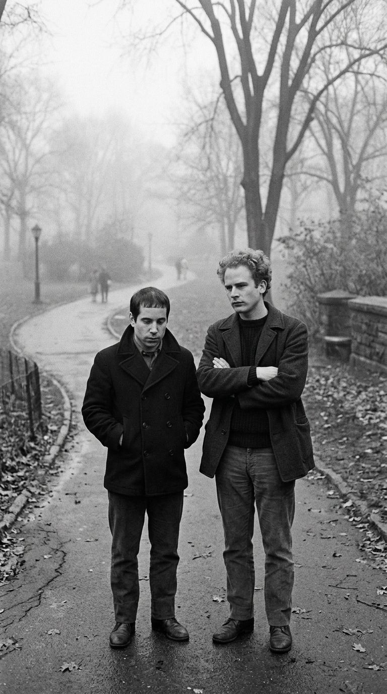
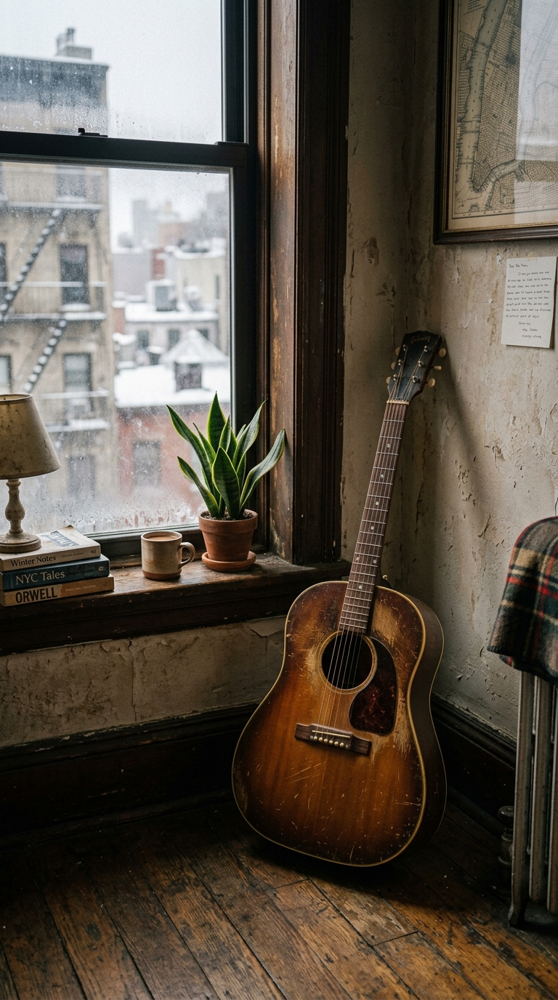
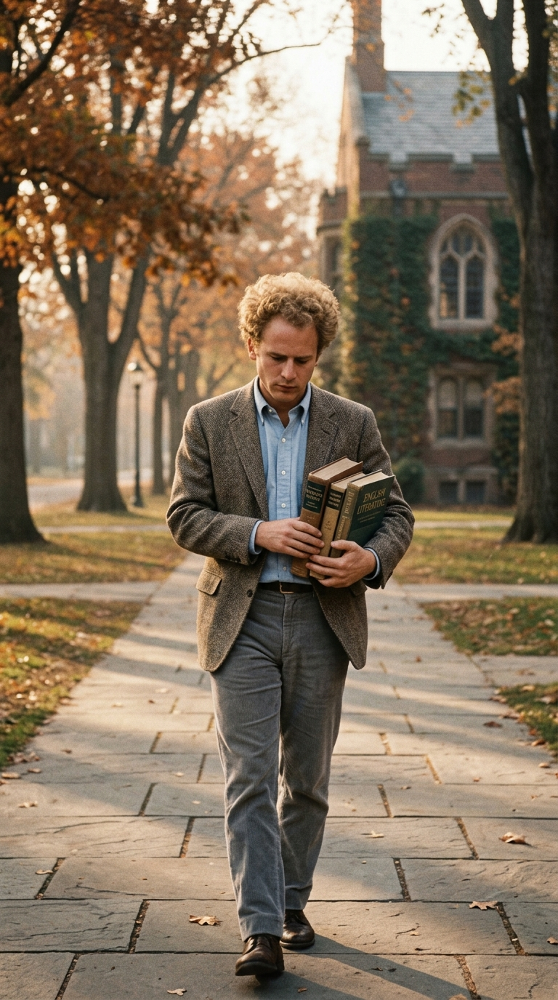
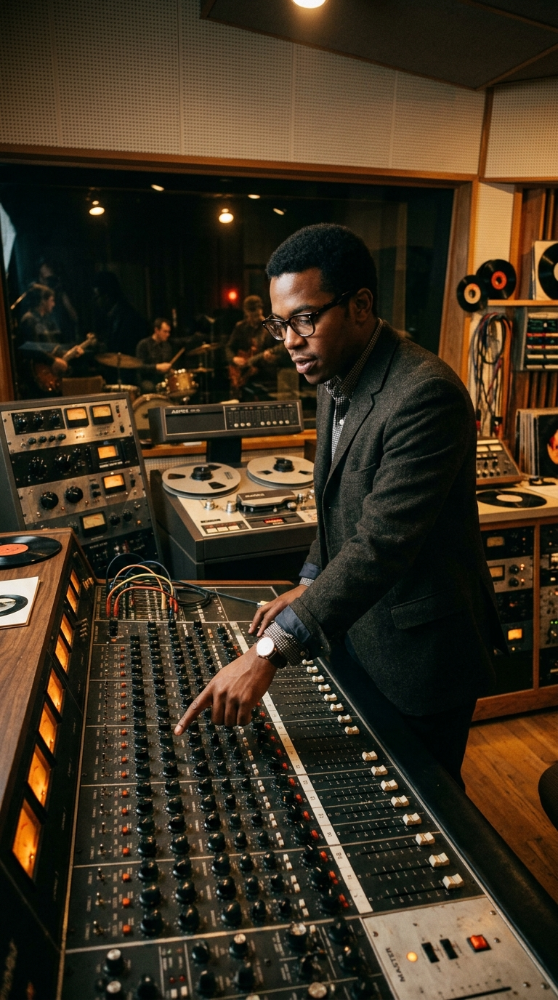
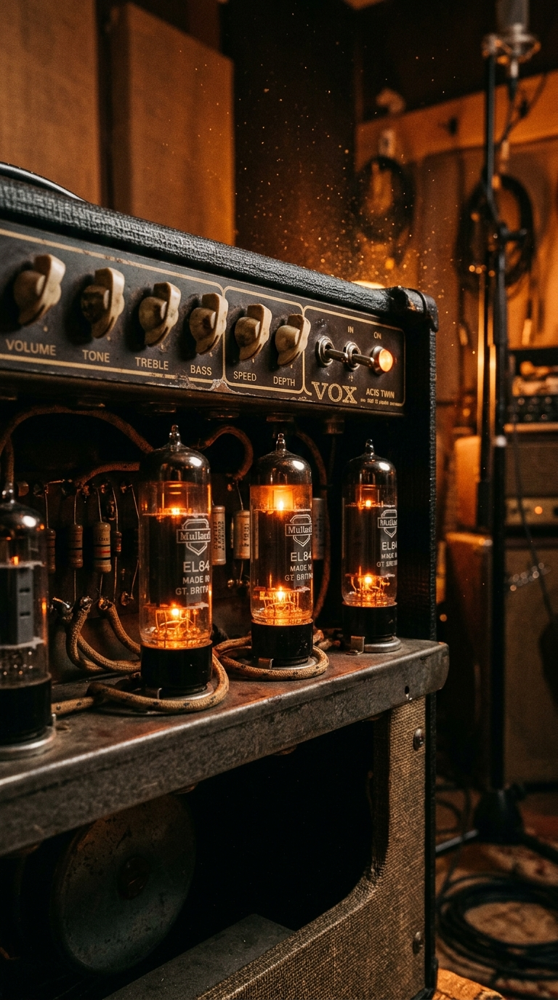
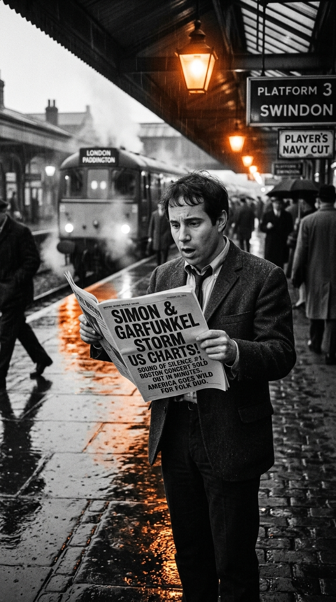
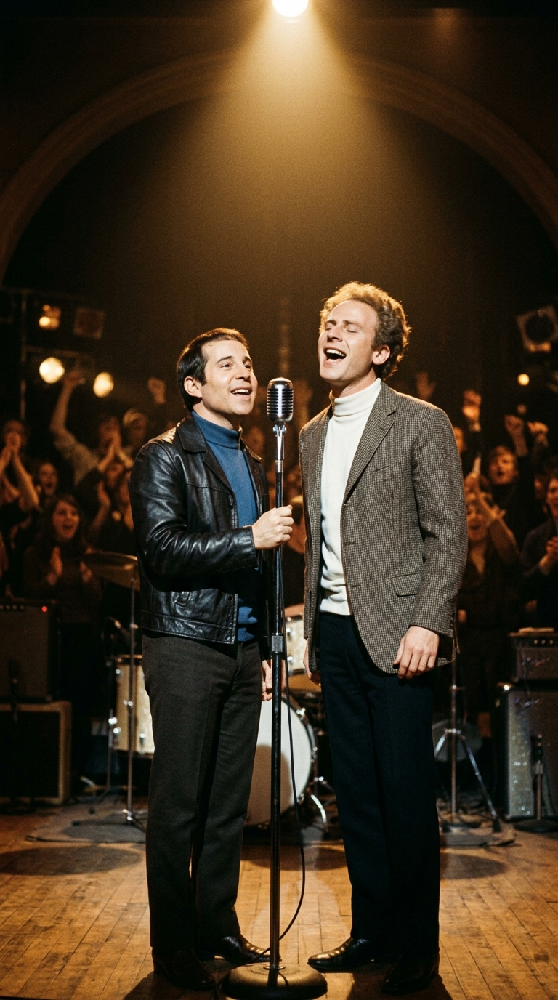

# 🎙️ El Rescate del Silencio: Cómo una Canción Fracasada Cambió la Historia del Folk Rock

> *«Habíamos fracasado. El álbum debut vendió apenas dos mil copias y nos sentimos tan avergonzados que decidimos separarnos. Yo me marché a Inglaterra con una maleta y una guitarra, tocando en sótanos por cinco libras la noche. Para mí, Simon & Garfunkel era un recuerdo enterrado... hasta que una tarde entré a un quiosco de Londres y vi mi nombre en el número uno del mundo.»*  
> — **Paul Simon**, sobre el insólito rescate de *«The Sound of Silence»*, 1966.

---

*Nueva York, 1964–1965: La epopeya de un fracaso comercial absoluto que, gracias a la audacia clandestina de un productor visionario y a espaldas de sus propios autores, reinventó el sonido de toda una generación.*

---

### Prólogo: El grifo que goteaba en la penumbra de Queens

A finales del otoño de **1963**, el mundo occidental se encontraba paralizado por el estupor. El asesinato del presidente John F. Kennedy en Dallas, el 22 de noviembre, había quebrado la confianza de la juventud estadounidense, inaugurando una era de escepticismo, luto y desencanto político.

En un modesto apartamento de tres habitaciones en el barrio obrero de Kew Gardens Hills, en Queens (Nueva York), un joven de veintidós años llamado **Paul Simon** buscaba refugio de la conmoción nacional en el rincón más insólito de la casa: el cuarto de baño.

Simon descubrió que si cerraba la puerta con pestillo, apagaba todas las luces y abría ligeramente el grifo del lavamanos, el goteo rítmico del agua sobre la porcelana y la acústica brillante de los azulejos creaban un efecto de reverberación natural íntimo y sagrado. Con las rodillas apoyadas contra la bañera y los dedos acariciando el mástil de su guitarra acústica en la más absoluta oscuridad, comenzó a entonar una frase que sonaba como una confidencia en medio de la noche:

> *«Hello darkness, my old friend,*  
> *I've come to talk with you again...»*  
> *(«Hola, oscuridad, vieja amiga mía,*  
> *he venido a hablar contigo otra vez...»)*

*Queens, invierno de 1964: En la soledad más absoluta, Paul Simon forja los primeros acordes de un tema que hablaba sobre la incapacidad humana para comunicarse.*

La letra no narraba una historia de amor ni una protesta política explícita. Era una radiografía poética sobre la incomunicación en las grandes metrópolis: millones de personas apiñadas en trenes subterráneos y calles congestionadas, *«hablando sin comunicarse, escuchando sin oír»*, incapaces de conmoverse ante el dolor ajeno. 

Cuando su compañero de escuela y amigo de infancia, **Art Garfunkel**, escuchó la melodía en su dormitorio, las armonías vocales encajaron de forma casi telúrica. Sus voces, afinadas desde los tiempos en que imitaban a The Everly Brothers bajo el pseudónimo colegial de *Tom & Jerry*, creaban una tercera entidad etérea: un lamento coral que parecía flotar sobre el tiempo.

Estaban listos para conquistar el mundo. O al menos, eso creían.

---

### Acto I: El fracaso estrepitoso y la huida a Inglaterra

En marzo de **1964**, gracias a una audición concertada por el influyente promotor de folk Tom Wilson, Simon & Garfunkel entraron por primera vez a los legendarios estudios **Columbia 30th Street Studio** de Manhattan, la famosa iglesia desacralizada con techos de treinta metros de altura por donde habían pasado leyendas como Miles Davis y Glenn Gould.

Acompañados únicamente por la guitarra acústica de Paul y un contrabajo de sesión tocado discretamente por Joe Mack, grabaron *«The Sound of Silence»* en tres tomas desnudas y solemnes. Aquella pieza fue elegida como la piedra angular de su primer álbum de larga duración, publicado el **19 de octubre de 1964** bajo el título de ***Wednesday Morning, 3 A.M.***.

*Central Park, 1964: La mirada melancólica de dos jóvenes neoyorquinos antes de que la indiferencia de la industria aplastara sus ilusiones.*

El resultado comercial fue una catástrofe devastadora.

Estados Unidos acababa de ser barrido por el tsunami de la **Beatlemanía**. Las emisoras de radio juveniles solo querían el brillo eléctrico, el ritmo acelerado y los estribillos contagiosos de la invasión británica liderada por The Beatles, The Rolling Stones y The Kinks. Un disco de folk acústico introspectivo, con dos muchachos de Queens vestidos con trajes oscuros y corbatas finas como seminaristas, resultaba completamente anacrónico para los ejecutivos de las tiendas de discos.

*Wednesday Morning, 3 A.M.* vendió escasamente **dos mil copias** en todo el país. Fue un fracaso tan rotundo que la discográfica Columbia retiró de inmediato todo presupuesto de promoción y archivó el máster en los depósitos de Nueva Jersey.

Avergonzados, arruinados y convencidos de que sus carreras en la música habían terminado antes de empezar, el dúo se disolvió.

Art Garfunkel, que poseía un intelecto privilegiado para las matemáticas, abandonó las partituras y se matriculó en la Universidad de Columbia para cursar una maestría en arquitectura e historia de las matemáticas. 

*Columbia University, 1965: Garfunkel camina entre libros de cálculo y planos arquitectónicos, resignado a que su voz jamás volvería a sonar en un estudio profesional.*

Paul Simon, por su parte, no soportaba contemplar las tiendas de discos de Nueva York donde sus álbumes acumulaban polvo en las gavetas de saldos a noventa y nueve centavos. Con apenas unos dólares en el bolsillo, empacó su guitarra acústica Martin en un estuche de cartón, compró un billete de barco hacia el Reino Unido y se instaló en un diminuto cuarto de alquiler en Brentwood, Essex.

Durante casi un año y medio, Simon vivió como un trovador nómada y solitario: viajaba en autobuses de segunda clase por ciudades industriales como Liverpool, Newcastle y Manchester, cantando en sótanos de cerveza y clubes de folk provincianos frente a obreros que le arrojaban monedas al final de la noche.

Simon & Garfunkel era ya una entrada muerta en el obituario de la música folk. Pero un hombre en Nueva York se negaba a dejar morir la canción.

---

### Acto II: La intuición rebelde de Tom Wilson

Aquel hombre era **Tom Wilson**.

Hijo de un predicador afroamericano y formado en economía en la prestigiosa Universidad de Harvard, Wilson era una de las figuras más singulares, visionarias y arriesgadas de la industria musical estadounidense. A pesar de los prejuicios raciales de la época, se había convertido en el productor estrella del catálogo de jazz y folk de Columbia Records, habiendo trabajado con titanes de la talla de John Coltrane, Sun Ra y Bob Dylan.

*Columbia Records, 1965: El oído prodigioso de Tom Wilson detecta la chispa eléctrica capaz de rescatar una obra maestra olvidada en los archivos.*

Wilson entendía mejor que nadie que la música popular estaba viviendo una mutación tectónica. En enero de 1965 había producido el álbum *Bringing It All Back Home* de Bob Dylan, donde las guitarras acústicas del trovador de Minnesota fueron sustituidas por una banda eléctrica furiosa. Y el **15 de junio de 1965**, en ese mismo estudio de la Calle 30, Wilson había dirigido la histórica sesión donde Dylan grabó *«Like a Rolling Stone»*, la canción que inauguró oficialmente la era del **folk rock**.

Esa misma tarde, tras despedir a los músicos de Dylan, Wilson subió a su oficina de la Calle 52 a revisar los informes de emisión radial de la costa este.

Algo insólito estaba ocurriendo.

Dos emisoras universitarias —la estación **WBZ** de Boston y una pequeña frecuencia de **Cocoa Beach** en Florida— habían comenzado a programar de forma espontánea la versión acústica de *«The Sound of Silence»* a altas horas de la madrugada. Los oyentes nocturnos, en su mayoría estudiantes universitarios agobiados por los reclutamientos militares de la Guerra de Vietnam, llamaban por teléfono a las cabinas de los locutores exigiendo que repitieran la canción una y otra vez.

Wilson bajó a toda prisa a la sala de archivos de Columbia y pidió que desenterraran la cinta máster original de dos pulgadas grabada por Simon y Garfunkel catorce meses atrás. 

Al escucharla a solas por los monitores Altec, comprendió el enigma: las voces de Paul y Artie eran sublimes y la poesía era inmortal, pero la producción acústica carecía de la tracción física necesaria para cruzar las emisoras comerciales de AM. 

Entonces, tomó una decisión temeraria, ilegal según los códigos no escritos de la relación entre artista y productor: **rescataría la canción inyectándole electricidad por su cuenta, sin pedir permiso, sin consultar a los autores y a espaldas de la compañía**.

---

### Acto III: La conspiración eléctrica del 15 de junio

Aquel mismo atardecer del **15 de junio de 1965**, Tom Wilson descolgó el teléfono y convocó de urgencia en el Estudio A de Columbia a los mismos músicos de sesión que acababan de terminar de grabar con Bob Dylan.

Entraron por la puerta cuatro titanes de la escena de Nueva York:
* **Al Gorgoni**, virtuoso guitarrista rítmico.
* **Vinnie Bell**, pionero del sonido de guitarra eléctrica de doce cuerdas.
* **Joe Mack**, bajista de precisión quirúrgica con su Fender Precision Bass.
* **Buddy Salzman**, uno de los bateristas de sesión más cotizados de Manhattan.

*El injerto eléctrico: Conectando los amplificadores Fender y la batería de estudio sobre una cinta acústica grabada a pulso humano.*

Wilson colocó la cinta de 1964 en la máquina de reproducción y les explicó la misión:  
*«Miren, muchachos. Tenemos esta pista acústica de dos chicos que ya no existen como grupo. La melodía es oro puro, pero necesita músculo. Quiero que sobregraben bajo, batería y guitarras eléctricas por encima, como si fuéramos una banda de rock tocando con ellos en vivo»*.

El desafío técnico era gigantesco y rayaba en lo imposible. 

En 1964, Paul Simon había tocado su guitarra acústica con arpegios libres, sin metrónomo ni claqueta (*click track*). A medida que la canción avanzaba hacia el final, llevado por la emoción lírica, **Simon aceleraba inconscientemente el tempo**, variando varios compases a lo largo de los tres minutos. Si los músicos de sesión tocaban con un pulso rígido, la mezcla terminaría sonando como un choque de trenes rítmico.

El baterista **Buddy Salzman** asumió una responsabilidad titánica: se ajustó los auriculares de cuero, cerró los ojos y se concentró exclusivamente en el rasgueo original de los dedos de Paul Simon. Con una sensibilidad asombrosa, Salzman moduló el golpe de sus baquetas siguiendo las fluctuaciones orgánicas de la guitarra de Simon, comenzando con un pulso tímido en el charles y desatando un redoble firme de caja y bombo a partir de la tercera estrofa.

*La cabina de mezcla: Tom Wilson y los ingenieros logran la sincronización milimétrica entre las guitarras eléctricas y las voces originales.*

Por encima de la base, Vinnie Bell deslizó los arpegios centelleantes de una guitarra eléctrica de doce cuerdas con una ligera reverberación de cámara que complementaba a la perfección el rasgueo acústico, mientras Al Gorgoni añadía acordes de apoyo punzantes.

En apenas unas horas de trabajo febril, el milagro estaba consumado. Tom Wilson fusionó las pistas nuevas con las voces originales y envió la mezcla directamente a la fábrica de prensado de sencillos de Columbia.

En la etiqueta del disco de vinilo de 45 RPM colocaron el nuevo título: *«The Sounds of Silence»* (con una 's' final añadida por error editorial).

Y el disco fue lanzado al mercado en septiembre de 1965.

Paul Simon seguía durmiendo en un piso húmedo de Essex, ignorando por completo que su destino ya no le pertenecía.

---

### Acto IV: La llamada en la cabina y el quiosco de Londres

Durante los meses de otoño de 1965, la nueva versión eléctrica de *The Sound of Silence* protagonizó una de las escaladas más vertiginosas y misteriosas en la historia de la revista *Billboard*.

Comenzó sonando en las emisoras de rock de Boston, saltó a Filadelfia, conquistó Chicago y a finales de noviembre ya sonaba a todas horas en las radios de Nueva York, Los Ángeles y San Francisco. Las centralitas de las emisoras colapsaban con llamadas de adolescentes fascinados por aquella extraña mezcla entre la mística litúrgica de las voces y la fuerza rítmica del bajo eléctrico.

El **1 de enero de 1966**, la canción alcanzó oficialmente el **puesto número uno del Billboard Hot 100**, desbancando a *«I Got You (I Feel Good)»* de James Brown y a *«We Can Work It Out»* de The Beatles.

*Londres, enero de 1966: Frente a un puesto de periódicos, Paul Simon contempla atónito la portada de la revista Billboard con su nombre en la cima del planeta.*

Aquella misma semana, Paul Simon caminaba por los andenes de una estación de tren en las afueras de Londres tras haber ofrecido un concierto ante una docena de personas en un sótano parroquial. Con los bolsillos cargados de monedas sueltas y las manos heladas por el invierno británico, se acercó a un quiosco de prensa internacional para comprar periódicos musicales.

Desplegó el último ejemplar importado de la revista *Billboard*.

Allí, en la página central de clasificaciones discográficas, en letras de molde negro y coronando la lista de las cien canciones más populares de los Estados Unidos, leyó una línea que le provocó un vértigo absoluto:  
**#1: SIMON & GARFUNKEL — THE SOUND OF SILENCE**.

Simon se quedó paralizado en medio del andén, convencido de que se trataba de una alucinación o de un error tipográfico grotesco. Apenas unos minutos después, una operadora internacional lo localizó a través del teléfono público del club folclórico donde se hospedaba.

Al otro lado de la línea transatlántica, con la voz entrecortada por la emoción y el asombro, estaba Art Garfunkel desde una cabina de Manhattan:  
*—¡Paulie! ¿Dónde demonios has estado? ¡Vuelve a casa de inmediato! ¡Somos el número uno de América!*

*—Artie... ¿de qué estás hablando?* —atinó a responder Simon, todavía en shock—. *Ese disco murió hace más de un año.*

*—No, Paulie. No está muerto. Tom Wilson le metió guitarras eléctricas, bajo y batería. Suena enorme. La radio no para de tocarla. Las tiendas no dan abasto. ¡Tienes que tomar el primer avión a Nueva York!*

---

### Epílogo: El sonido que jamás volvió a callar

Paul Simon regresó a Nueva York en los primeros días de enero de 1966. Aunque su reacción inicial al escuchar la batería y las guitarras eléctricas añadidas a su canción fue de recelo purista —temía que los puristas del folk lo acusaran de traición comercial—, bastó una conversación con Tom Wilson para que comprendiera la magnitud del hallazgo.

Wilson no había destruido la obra; la había salvado del olvido absoluto. Había tendido un puente de acero y electricidad para que la poesía íntima de dos muchachos de Queens pudiera cruzar el abismo del tiempo y dialogar con millones de almas en todo el planeta.

Aquel rescate fortuito obligó a Simon & Garfunkel a reunirse en los estudios de Columbia para grabar a toda prisa un nuevo álbum de larga duración, titulado precisamente *Sounds of Silence*, inaugurando una de las alianzas artísticas más gloriosas y laureadas en la historia de la cultura occidental. 

Dos años más tarde, el director Mike Nichols convertiría la canción en el corazón cinematográfico de la película *El graduado* (*The Graduate*, 1967), fijando para siempre en la memoria colectiva la mirada desorientada de Dustin Hoffman mientras avanzaba por las pasarelas del aeropuerto de Los Ángeles al compás de *«Hello darkness, my old friend»*.

*El monumento sonoro: Dos voces unidas por una casualidad histórica que enseñó al mundo que a veces el silencio es la única forma de gritar la verdad.*

Más de sesenta años después de aquella tarde en que un productor rebelde se atrevió a desobedecer las reglas de una discográfica, la melodía de *«The Sound of Silence»* sigue viva en miles de versiones, idiomas y escenarios de todo el mundo.

Nos recuerda que el arte verdadero es una fuerza indomable que escapa incluso a la voluntad de sus creadores; y que en los momentos más oscuros de la vida, cuando creemos que nuestras ilusiones yacen enterradas para siempre en un cajón olvidado, basta la chispa de un acorde audaz para rescatarnos del silencio y devolvernos la inmortalidad.

---

### 💬 La Pregunta para Nuestra Comunidad

*«The Sound of Silence»* nació del fracaso más humillante y terminó convertida en una de las obras más sagradas de la humanidad gracias a un rescate involuntario.

**¿Qué emoción despierta en ti ese acorde inicial y el mítico 'Hello darkness, my old friend'? ¿Prefieres la versión acústica original y despojada o la fuerza eléctrica que Tom Wilson creó en 1965?**

*Te leemos en los comentarios de nuestra publicación semanal.*

---

### 📚 Fuentes y Archivo Documental

Para la rigurosa reconstrucción histórica, técnica y documental de esta crónica, la redacción de *Acordes Ocultos* ha consultado y contrastado las siguientes fuentes de archivo:

1. **Simon, Paul.** Entrevistas autobiográficas en *The Rolling Stone Interview* con Jon Landau (revista *Rolling Stone*, 1972) y conversaciones con Paul Zollo para *Songwriters on Songwriting* (Da Capo Press, 1997), donde relata la gestación del tema en el baño de Queens y su sorpresa en el quiosco de Londres.
2. **Garfunkel, Art.** *What Is It All but Luminous: Notes from an Underground Man*. Alfred A. Knopf, Nueva York, 2017. Memorias directas sobre las primeras sesiones en Columbia 30th Street Studio, su separación temporal para estudiar matemáticas y la histórica llamada transatlántica de 1966.
3. **Carlin, Peter Ames.** *Homeward Bound: The Life of Paul Simon*. Henry Holt and Co., Nueva York, 2016. Biografía de referencia que documenta las cifras de ventas iniciales de *Wednesday Morning, 3 A.M.* y la estancia de Simon en los clubes de folk de Inglaterra.
4. **Eliot, Marc.** *Paul Simon: A Life*. Birch Lane Press, Nueva York, 1997. Análisis de la intervención de Tom Wilson, los registros de emisión radial en Boston (WBZ) y Florida, y el proceso de remezcla en junio de 1965.
5. **Gorgoni, Al & Bell, Vinnie.** *Session Logs & Musician Guild Archives of New York City (AFM Local 802)*. Diarios de grabación del 15 de junio de 1965 en Columbia Studios que detallan la participación de los músicos de Bob Dylan en el *overdub* eléctrico de *«The Sound of Silence»*.
6. **Billboard Magazine Archives.** *Hot 100 National Charts*. Archivos de las ediciones de septiembre de 1965 a enero de 1966, con el ascenso del sencillo hasta el número 1 mundial.
7. **Simons, David.** *Studio Stories: How the Great New York Records Were Made*. Backbeat Books, San Francisco, 2004. Crónica técnica sobre la acústica de Columbia 30th Street Studio, la sincronización rítmica del baterista Buddy Salzman y la ingeniería analógica de la época.
