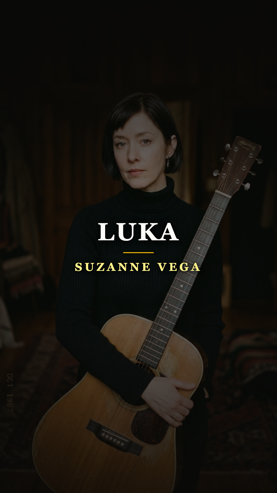
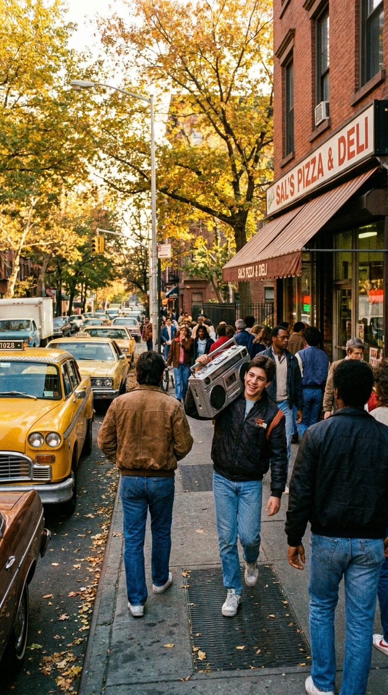
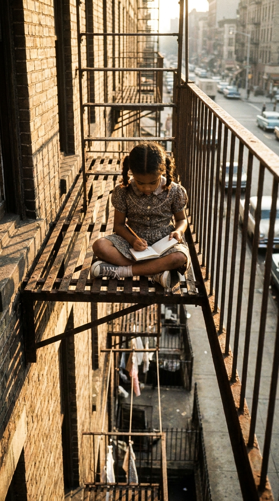
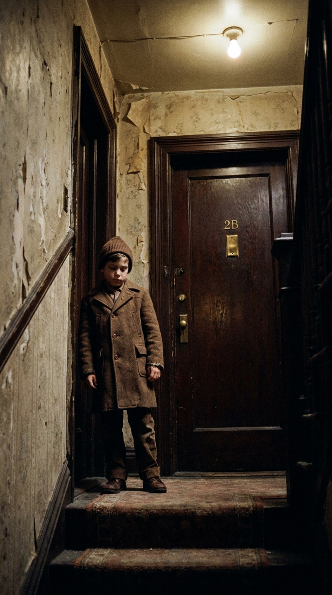
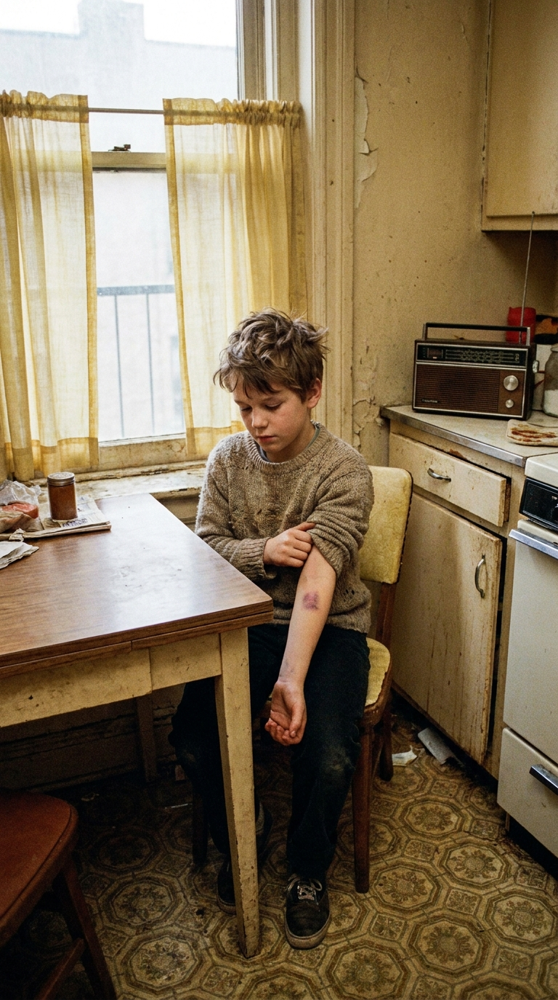
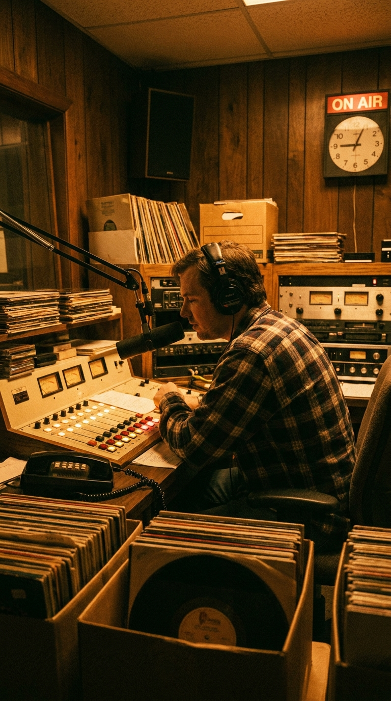
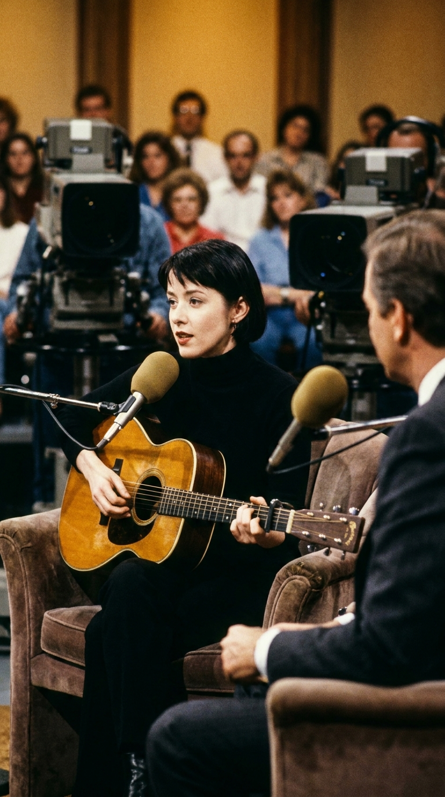
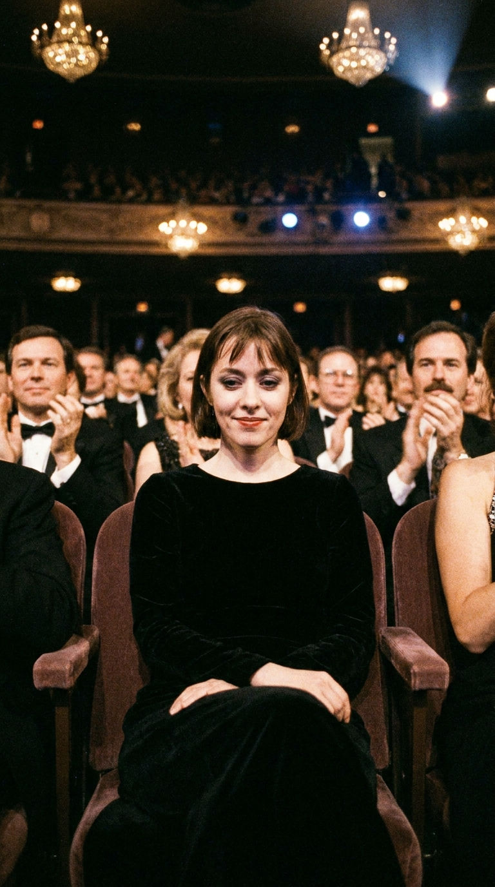
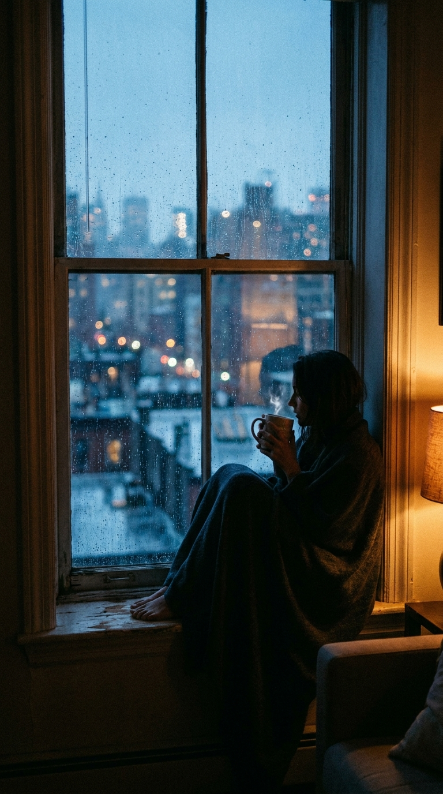
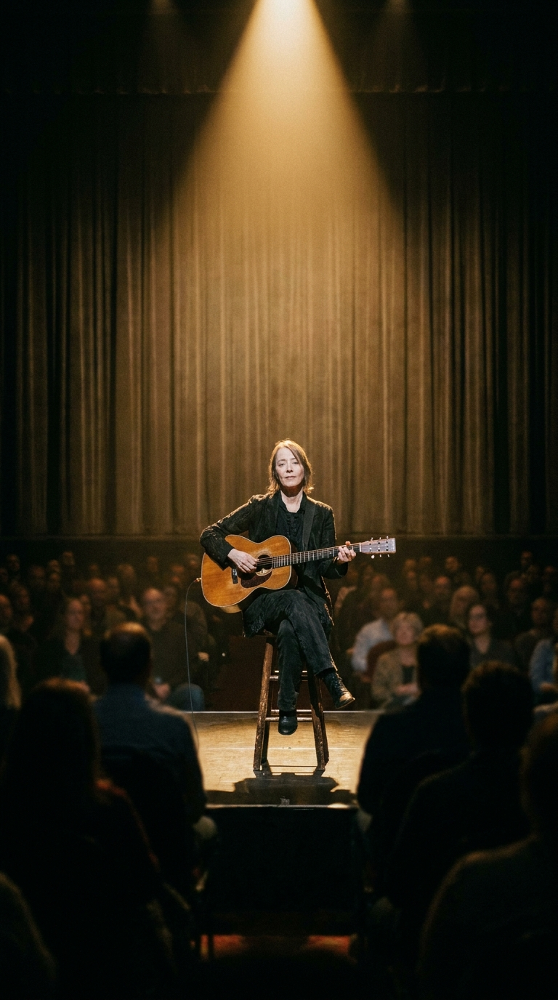

# El Secreto Detrás de la Puerta: Cómo Suzanne Vega Camufló su Propio Infierno en un Himno Pop

> *«My name is Luka, I live on the second floor... Yes, I think I'm okay, I walked into the door again. If you ask that's what I'll say.»*  
> — **Suzanne Vega, 1987**

---

### Prólogo: El brillo del pop y el secreto del rellano

En el verano de 1987, una cadencia rítmica irresistible y un rasgueo de guitarra acústica cristalina inundaron las emisoras de radio de costa a costa en los Estados Unidos. La canción ascendió de manera meteórica hasta el número tres del *Billboard Hot 100*, se instaló en la rotación pesada de MTV y terminó tarareada por millones de conductores y peatones que movían la cabeza al compás en las esquinas soleadas de Nueva York. Poseía la inercia contagiosa de los grandes himnos del pop moderno: una instrumentación ligera, un estribillo luminoso y una melodía diáfana concebida para el disfrute cotidiano.

Sin embargo, debajo de aquel barniz armónico latía un enigma sobrecogedor. Aquella voz sobria y desprovista de artificios no cantaba una historia de amor de instituto ni una celebración festiva de fin de semana. Cantaba en primera persona, encarnando la mirada temerosa y resignada de un niño vulnerable que aprendía a bajar la mirada en los descansillos y a justificar moretones con excusas ensayadas: *«Fue por torpeza mía, choqué otra vez contra la puerta»*. La radio comercial de masas, por primera vez en su historia, estaba transmitiendo el testimonio crudo del abuso infantil a la hora del almuerzo, camuflado en una tonada radiante.

---

### Acto I: El Spanish Harlem y la infancia tras la mirilla

Para comprender el origen de la herida, es necesario descender a los complejos de viviendas del East Harlem de finales de los años sesenta. Suzanne Nadine Vega creció en un entorno marcado por la precariedad y la constante volatilidad emocional. Su madre, Pat Schumacher, se había separado poco después de su nacimiento, y Suzanne fue criada bajo la convicción de que el escritor puertorriqueño Edgardo Vega Yunqué —su padrastro— era su verdadero padre biológico, una verdad que se fracturó traumáticamente a sus nueve años.

En aquel hogar donde el arte y la literatura convivían con estallidos repentinos de cólera y castigos físicos desmedidos, la pequeña Suzanne aprendió a sobrevivir haciéndose invisible. Pasaba horas en las escaleras de incendios de metal herrumbroso, con una libreta escolar apoyada en las rodillas, aprendiendo a registrar la realidad sin levantar la voz. En un edificio de apartamentos ruidoso, donde las paredes transmitían gritos nocturnos y golpes sordos, el código no escrito de los inquilinos era el silencio: nadie preguntaba por el llanto de la noche anterior, y las miradas se esquivaban en el ascensor. Aquella atmósfera opresiva no era una ficción literaria lejana; era el aire cotidiano que respiraba la futura compositora.

---

### Acto II: Una melodía luminosa para una herida clandestina

A mediados de la década de 1980, mientras Suzanne actuaba en el circuito de folk acústico del Greenwich Village —en locales emblemáticos como *The Speakeasy* y *Folk City*—, la composición comenzó a tomar forma en su guitarra acústica Martin. Había observado en su vecindario a un muchacho delgado llamado Luka, que jugaba apartado de los demás niños y parecía cargar una melancolía que no correspondía a su edad. El nombre le sirvió como máscara, pero la voz que emergió del papel pertenecía a sus propias entrañas.

La genialidad psicológica del tema radicó en una decisión estilística contraria a todo sensacionalismo: adoptar la perspectiva psicológica exacta de la víctima. En lugar de componer un lamento dramático o un manifiesto moralista con grandes orquestaciones melodramáticas, Suzanne escribió la canción con una serenidad casi cotidiana. El protagonista no pide compasión, ni exige venganza; simplemente ruega que no intervengan para evitar que el castigo empeore:

> *«They only hit until you cry, and after that you don't ask why... You just don't argue anymore.»*  
> *(«Solo te pegan hasta que lloras, y después de eso ya no preguntas por qué... Simplemente dejas de discutir.»)*

Bajo la producción de Steve Addabbo y el legendario guitarrista Lenny Kaye (mano derecha de Patti Smith), las sesiones en los estudios *Bearsville Sound* y *RPM* de Nueva York vistieron el relato con guitarras cristalinas de doce cuerdas y una percusión sobria y elegante. Crearon así un caballo de Troya sonoro perfecto: una canción que seducía al oído antes de que la conciencia del oyente comprendiera la tragedia que acababa de asimilar.

---

### Acto III: El fenómeno de 1987: romper el tabú en la radio comercial

El lanzamiento de *«Luka»* como sencillo del álbum *Solitude Standing* en la primavera de 1987 desató una auténtica revolución sociológica. Hasta ese momento, la violencia intrafamiliar y el maltrato hacia los menores eran tratados en los medios de comunicación como asuntos privados o notas policiales marginales, sepultados bajo la vergüenza familiar y el pudor social.

De pronto, las emisoras de radio comenzaron a recibir llamadas desconcertadas de oyentes que, tras semanas tarareando la melodía, prestaban atención a los versos: *«Si escuchas algo tarde por la noche, una pelea o un estruendo, por favor no me preguntes qué fue»*. El impacto fue sísmico. Organizaciones no gubernamentales y líneas telefónicas de asistencia contra el abuso infantil en Estados Unidos, como *Childhelp* y *The National Child Abuse Hotline*, reportaron incrementos sin precedentes en el volumen de llamadas y denuncias ciudadanas.

Por primera vez, niños y adolescentes atrapados en dinámicas de abuso encontraban en una canción de radio una validación pública de su sufrimiento. No estaban locos, no eran «torpes», ni merecían los golpes: la voz en la radio estaba describiendo con milimétrica precisión su propio infierno doméstico.

---

### Acto IV: La armadura pública y la doble vida del éxito

Con el éxito internacional llegaron las giras mundiales, tres nominaciones al premio Grammy en 1988 (incluyendo Grabación del Año y Canción del Año) y el premio al Mejor Video Femenino en los MTV Video Music Awards. Frente a las cámaras de los programas nocturnos de entrevistas y los periodistas de la prensa musical, Suzanne Vega mantuvo una compostura inalterable: vestida de negro riguroso, con su corte de pelo geométrico y una mirada serena que parecía observar todo desde una distancia prudencial.

Durante años, cuando los periodistas le preguntaban incansablemente si la canción era real, Vega ofrecía una respuesta calculada y distante: aseguraba que Luka era un niño de su antiguo edificio en Nueva York al que veía jugar desde la distancia, un personaje ficticio ensamblado con retazos de observación urbana. Aquella respuesta le permitía proteger a su familia, esquivar el morbo de los tabloides y preservar una barrera de intimidad frente a una industria que devoraba las vulnerabilidades de sus creadores.

Pero en la soledad de las habitaciones de hotel y las plateas de las ceremonias de premiación, el contraste resultaba demoledor. El mundo entero aplaudía un éxito millonario construido sobre el dolor más silenciado de su propia niñez, mientras ella debía sonreír cortésmente y fingir que todo era un mero ejercicio de empatía poética.

---

### Acto V: La confesión tardía: cuando el velo cayó

El tiempo, sin embargo, desmantela las armaduras más resistentes. Décadas más tarde, tras el fallecimiento de sus padres y con la serenidad que otorga la madurez vital y artística, Suzanne Vega decidió descorrer finalmente el velo de protección en ensayos autobiográficos y entrevistas retrospectivas.

La confesión fue tan honesta como desgarradora: el niño del segundo piso que se tropezaba contra las puertas nunca fue un vecino lejano. Luka era ella misma. Era la niña aterrorizada que temblaba al oír los pasos de su padrastro acercándose por el pasillo; la menor que creció sintiendo que cada golpe era culpa de su propia insuficiencia; la joven que descubrió en las seis cuerdas de una guitarra el único espacio sagrado donde la violencia no podía alcanzarla.

> *«Al escribir Luka utilicé el nombre de un niño del barrio para construir un escudo. Pero la herida, la vergüenza y el miedo eran míos. Tuve que llamarlo de otra manera para atreverme a decir en voz alta lo que nadie en mi casa se atrevía a nombrar.»*  
> — **Suzanne Vega**

La ficción no había sido un engaño, sino una herramienta de supervivencia. Al bautizar su tragedia con otro nombre, pudo cantarla frente a millones de personas sin desmoronarse en el intento.

---

### Epílogo: El refugio inexpugnable de una canción

Casi cuatro décadas después de su estreno, *«Luka»* permanece como una de las obras cumbres del cancionero popular del siglo XX. Trascendió las modas de producción de los ochenta porque no apeló al efectismo sonoro, sino a la más honda verdad humana: la resiliencia de la infancia frente a la crueldad adulta.

Cuando Suzanne Vega sube hoy al escenario, sola bajo el foco cenital con su guitarra acústica, el tiempo parece suspenderse. Ya no hay máscaras que sostener ni secretos que ocultar en el rellano. Aquellos acordes que nacieron en la penumbra de un edificio del Spanish Harlem ya no son el llanto reprimido de una niña asustada, sino un faro indestructible para cualquiera que haya tenido que justificar alguna vez sus heridas frente al espejo.

---

### 💬 Comunidad y Reflexión

¿Conocías la verdadera historia detrás del éxito más luminoso de Suzanne Vega? ¿Qué sentiste la primera vez que descubriste la desgarradora letra oculta tras su contagioso ritmo de guitarra?

Te leemos en los comentarios de nuestra comunidad en **Acordes Ocultos**.

---

### 📚 Fuentes y Archivo Documental

* **Vega, Suzanne**: *The Passionate Eye: The Collected Writing of Suzanne Vega*, Spike / Avon Books, Nueva York, 1999.
* **The New York Times**: *«Suzanne Vega's Songs of the Subtly Stressed»*, archivo hemerográfico de Stephen Holden, 3 de mayo de 1987.
* **Rolling Stone Magazine**: *«Suzanne Vega: Solitude and Standing Firm»*, entrevista de David Browne, Edición 503, julio de 1987.
* **Billboard Archives**: Historial de listas y certificaciones de *Solitude Standing* y el sencillo *«Luka»*, Billboard Hot 100, 1987–1988.
* **National Committee for Prevention of Child Abuse (NCPCA)**: Informes de impacto social y volumen de atención en líneas telefónicas vinculadas a la difusión de *«Luka»*, Chicago, 1988.
* **MTV Archives**: Cobertura de los MTV Video Music Awards 1988 (*Best Female Video* otorgado a *«Luka»*, dirigido por Michael Patterson y Candace Reckinger).
