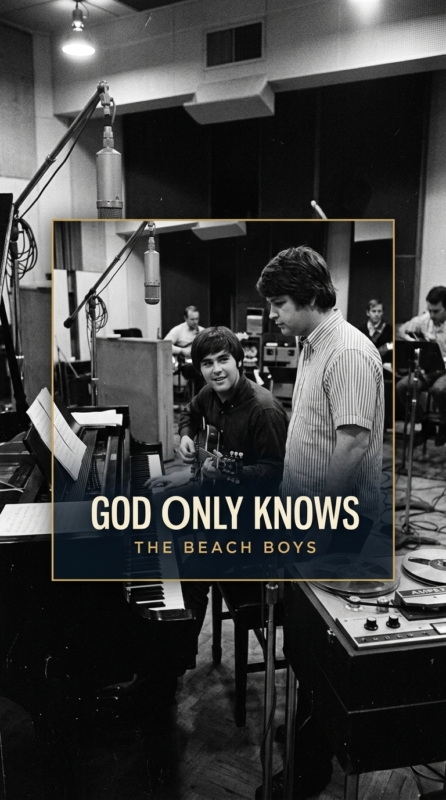
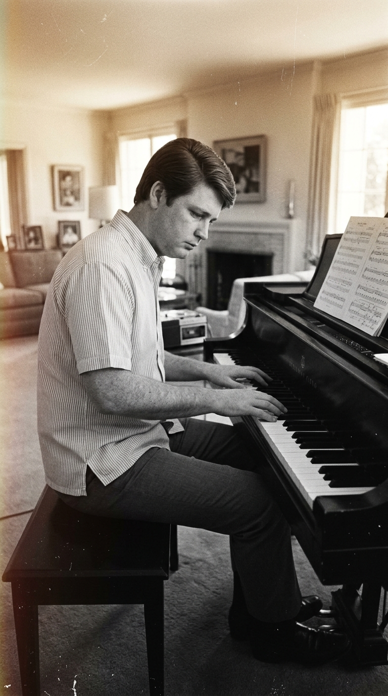
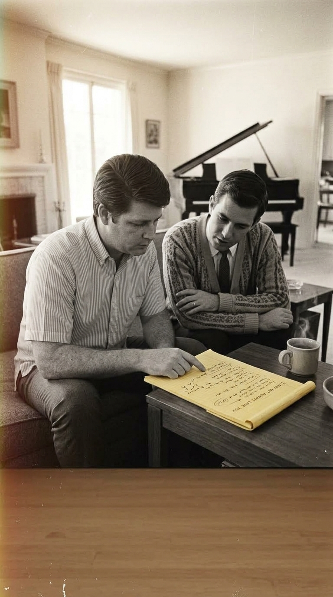
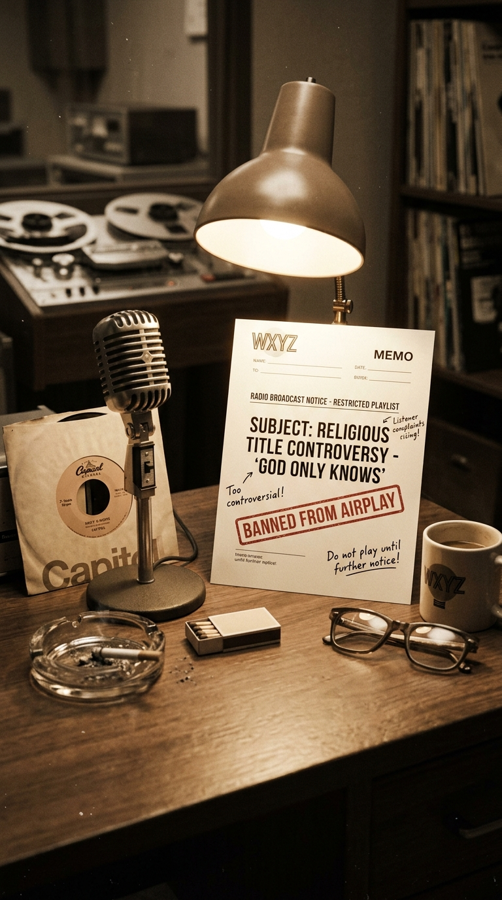
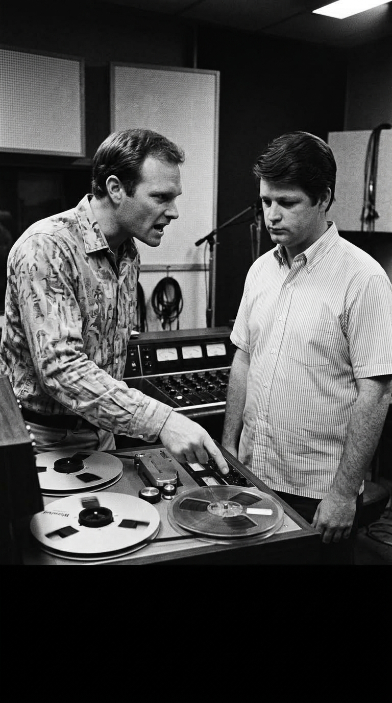
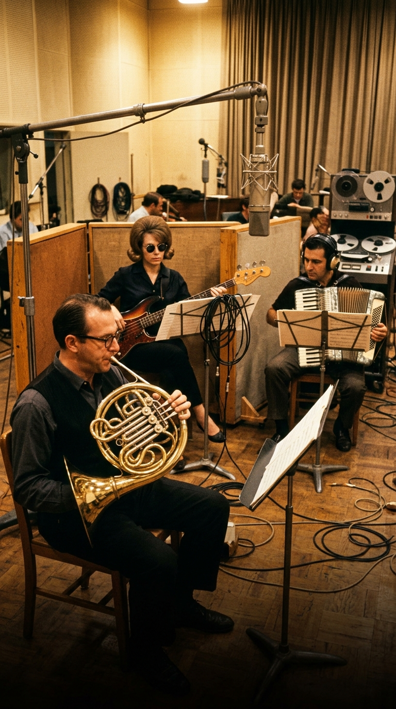
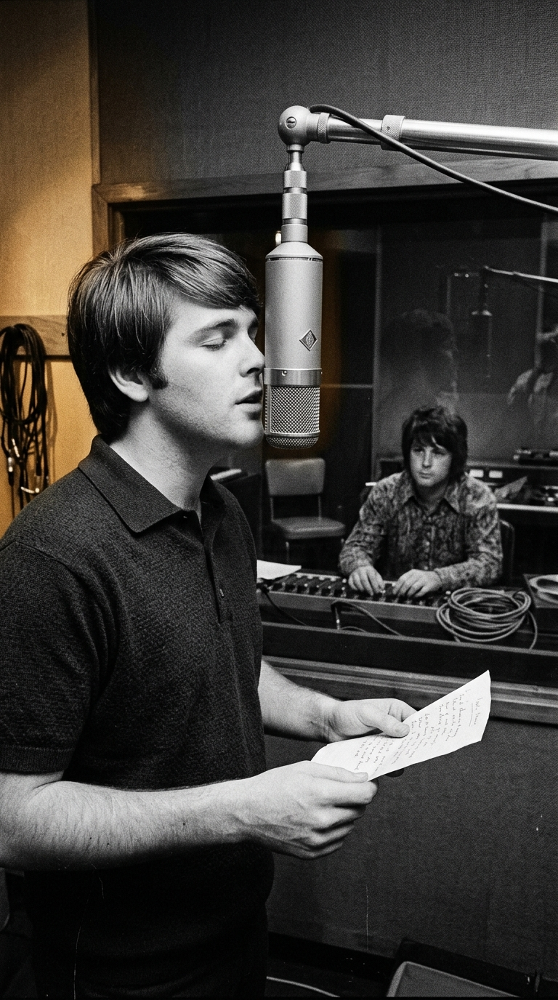
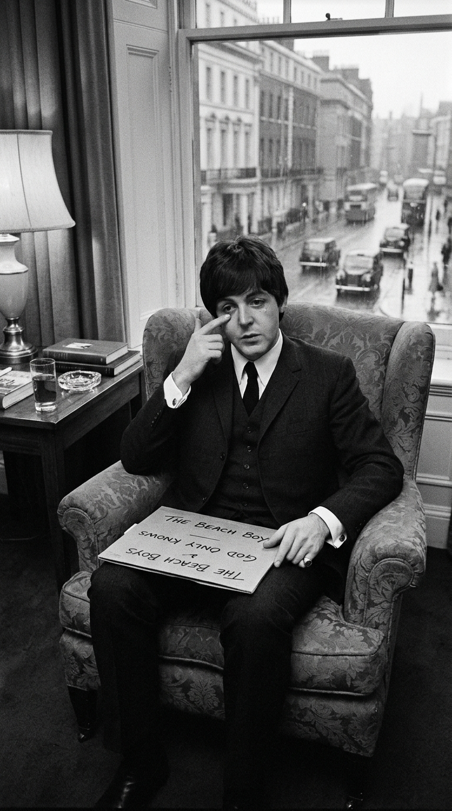
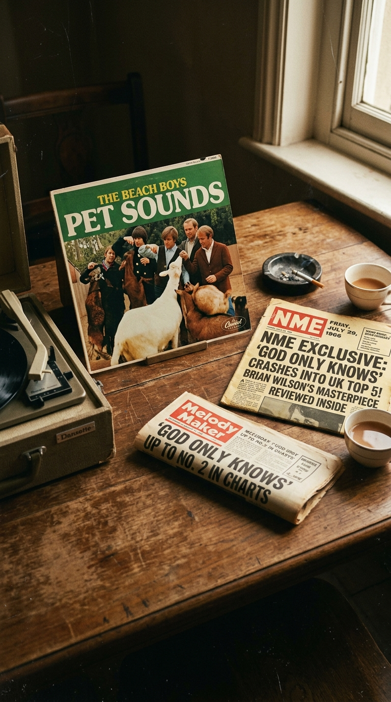
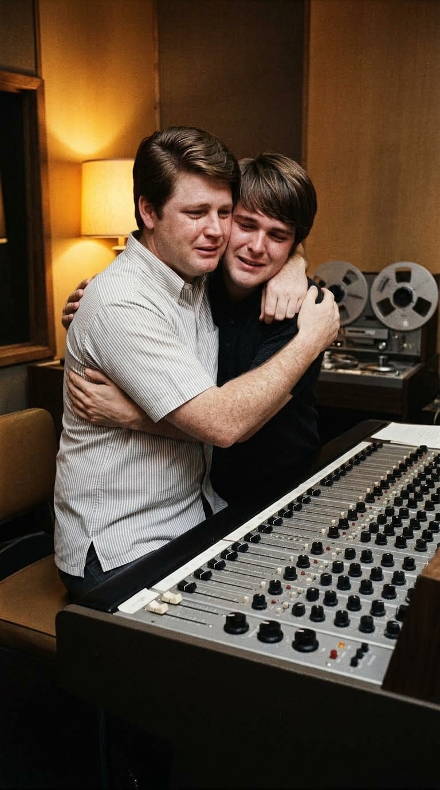

# La Canción Sagrada que las Radios Intentaron Censurar: El Milagro de «God Only Knows»

> *«I may not always love you, but long as there are stars above you, you never need to doubt it. I'll make you so sure about it... God only knows what I'd be without you.»*  
> — **Brian Wilson & Tony Asher, 1966**

---

### Prólogo: El acorde que descendió del cielo

A comienzos de 1966, en una colina de Beverly Hills, un joven de apenas veintitrés años se sentaba al piano con la mirada fija en el vacío y el corazón abrumado por una exigencia sobrehumana. Brian Wilson había decidido retirarse de las agotadoras giras de The Beach Boys para encerrarse en el estudio de grabación. Su ambición no era simplemente componer otro éxito sobre tablas de surf, coches trucados y romances playeros bajo el sol de California; su misión era concebir una sinfonía de bolsillo capaz de rozar lo divino, una plegaria secular que sirviera como bálsamo para el alma de una juventud desconcertada.

Lo que Brian no sospechaba en aquellas madrugadas de fiebre creativa era que la obra cumbre de su existencia tropezaría contra el muro más infranqueable de la sociedad estadounidense de su tiempo: el tabú religioso, el pánico de las cadenas de radiodifusión y la feroz resistencia interna de su propia banda.

---

### Acto I: El bloc amarillo y el verso imposible

Para dar forma lírica a la música que retumbaba en su cabeza, Brian no acudió a sus colaboradores habituales. Reclutó a Tony Asher, un joven redactor publicitario al que había conocido fugazmente en los pasillos de una productora audiovisual. Encerrados en la sala de estar de Wilson, ambos comenzaron a trabajar sobre un bloc de notas legal amarillo, buscando una honestidad emocional que el pop de la época rara vez se atrevía a rozar.

El arranque de la canción desafiaba todas las leyes de la balada romántica tradicional:

> *«I may not always love you...»*  
> *(«Quizá no siempre te ame...»)*

Asher temía que una apertura tan contradictoria y vulnerable alienara al público juvenil. Pero Brian vislumbró de inmediato su brillantez psicológica: la fragilidad de esa primera confesión humana era el trampolín perfecto para el estallido de devoción incondicional que seguía de inmediato: *«Pero mientras haya estrellas sobre ti, jamás tendrás que dudarlo»*.

Sin embargo, el verdadero terremoto residía en el título. En 1966, pronunciar la palabra *«God»* (Dios) en el título de una canción de música popular secular era considerado una blasfemia inadmisible por los sectores conservadores de los Estados Unidos. Ningún artista comercial se había atrevido a cruzar esa frontera.

---

### Acto II: El memorándum de la censura y la furia de Mike Love

El pánico se apoderó de los ejecutivos de Capitol Records en cuanto recibieron la maqueta. Los directores de programación de las poderosas cadenas de radio del *Bible Belt* (el cinturón bíblico del sur y medio oeste norteamericano) enviaron memorandos formales advirtiendo que vetarían el disco si salía al aire: consideraban que invocar el nombre del Creador en una pieza de entretenimiento juvenil rozaba el sacrilegio comercial.

La tensión estalló con violencia dentro del propio seno de The Beach Boys cuando el resto del grupo regresó de una gira por Japón para registrar las voces de las nuevas pistas. Mike Love, vocalista principal y primo de los hermanos Wilson, escuchó los complejos arreglos sinfónicos de *Pet Sounds* y montó en cólera contra Brian en la sala de control de *Western Studios*:

> *«¿Quién diablos va a escuchar esta basura? ¿Acaso estás haciendo música para los oídos de un perro? ¡No te metas con la fórmula que nos da de comer!»*  
> — **Mike Love a Brian Wilson, 1966**

Love temía que el alejamiento del surf pop arruinara la carrera del grupo, y el título *«God Only Knows»* representaba, a sus ojos, un suicidio comercial garantizado ante los programadores radiales.

---

### Acto III: The Wrecking Crew y la arquitectura de lo ingrávido

Aislándose de las recriminaciones familiares, Brian Wilson se refugió en el Estudio 3 de *Western Recorders* el 10 de marzo de 1966, rodeado por los virtuosos músicos de sesión de *The Wrecking Crew*. Lo que Brian orquestó aquella tarde no tenía precedentes en la historia de la música ligera.

En lugar de limitarse a guitarras y baterías convencionales, Brian convocó al maestro Alan Robinson para interpretar una melancólica melodía en corno francés; introdujo un acordeón tocado por Leonard Hartman; campanas de trineo y percusiones que simulaban cascos de caballo; y una arquitectura de bajo diseñada entre Carol Kaye y Lyle Ritz que evitaba deliberadamente caer en la nota tónica fundamental. La música parecía flotar en el aire, suspendida en una ingravidez armónica que producía una conmovedora sensación de vulnerabilidad y misterio.

---

### Acto IV: La humildad de Brian y la voz de Carl

Terminada la pista instrumental, Brian Wilson entró en la cabina de aislamiento para grabar la voz solista. Cantó la melodía una y otra vez durante horas. Sin embargo, al sentarse frente a los monitores para evaluar la interpretación, Brian bajó la cabeza. Sentía que su propia voz, cargada de las tensiones, ansiedades y dolores que comenzaban a atormentar su mente, no poseía la pureza virginal que la plegaria demandaba.

En un gesto de humildad fraternal irrepetible, Brian apagó el micrófono y llamó a su hermano menor, Carl Wilson, de apenas diecinueve años:

> *«Carl, ven aquí. Tienes que cantarla tú. Tu corazón es más limpio que el mío; tu voz tiene el alma que Dios necesita escuchar.»*

Con los ojos cerrados frente al micrófono Neumann U47, Carl entregó una interpretación de una ternura sobrecogedora, desprovista de vibratos afectados o manierismos teatrales. En el clímax final, las voces de Brian, Carl y Bruce Johnston se entrelazaron en un canon contrapuntístico de tres partes que emulaba las polifonías del Renacimiento sacro, culminando una de las mayores hazañas vocales del siglo XX.

---

### Acto V: Las lágrimas de Paul McCartney y el exilio a la cara B

En mayo de 1966, Bruce Johnston viajó a Londres con varias copias en acetato de *Pet Sounds*. En una suite privada de hotel, organizó una sesión de escucha exclusiva para los líderes de la vanguardia británica: John Lennon y Paul McCartney.

Al sonar los últimos compases de *«God Only Knows»*, el silencio en la habitación fue absoluto. Paul McCartney tenía lágrimas corriendo por sus mejillas. Pidió que volvieran a colocar la aguja al inicio del surco una y otra vez. Años más tarde, McCartney declararía públicamente y en innumerables ocasiones: *«God Only Knows es la mejor canción jamás escrita. Me hizo llorar la primera vez que la escuché y me inspiró directamente para escribir 'Here, There and Everywhere'»*.

A pesar de la admiración unánime de los genios británicos, el miedo corporativo prevaleció en Estados Unidos. Capitol Records, temerosa de las amenazas de boicot radial en el interior del país, relegó la canción a la cara B del sencillo *«Wouldn't It Be Nice»*.

Mientras en Estados Unidos las emisoras titubeaban y la censura sofocaba su difusión inicial confinándola al puesto 39, en el Reino Unido la canción fue editada como cara A estelar, catapultándose de inmediato hasta el número dos de las listas y transformando para siempre la historia del arte sonoro.

---

### Epílogo: El triunfo de lo eterno sobre el dogma

El tiempo ha puesto a cada elemento en su justo lugar. Los censores que intentaron amordazar la invocación de Dios en la radio han sido olvidados por la historia, mientras que la obra de Brian y Carl Wilson resuena hoy con la misma pureza deslumbrante de hace sesenta años.

*«God Only Knows»* demostró que el pop podía ser un vehículo de elevación espiritual sin recurrir al dogma ni a la hipocresía institucional. Bastaron el talento herido de dos hermanos, un corno francés y la honestidad radical de admitir que, sin amor, el universo entero pierde su sentido.

---

### 💬 Comunidad y Reflexión

¿Sabías que Brian Wilson cedió la voz principal a su hermano Carl porque consideraba que su propia voz no era lo suficientemente pura? ¿Qué emoción te despiertan esos acordes cada vez que los escuchas?

Te leemos en los comentarios de **Acordes Ocultos**.

---

### 📚 Fuentes y Archivo Documental

* **Wilson, Brian & Greenman, Ben**: *I Am Brian Wilson: A Memoir*, Da Capo Press, Boston, 2016.
* **Granata, Charles L.**:\ *Wouldn't It Be Nice: Brian Wilson and the Making of the Beach Boys' Pet Sounds*, A Cappella Books, Chicago, 2003.
* **Miles, Barry**: *Paul McCartney: Many Years From Now*, Henry Holt and Company, Nueva York, 1997.
* **Billboard & Record Retailer Archives**: Datos de listas de éxitos en Estados Unidos y Reino Unido para *«Wouldn't It Be Nice» / «God Only Knows»*, verano de 1966.
* **Asher, Tony**: Testimonios documentales sobre las sesiones de composición de *Pet Sounds*, entrevistas de archivo de la BBC, 1995.
* **Capitol Records Archive**: Documentos de correspondencia y memorandos internos de distribución sobre la polémica por el título *«God Only Knows»*, Los Ángeles, 1966.
