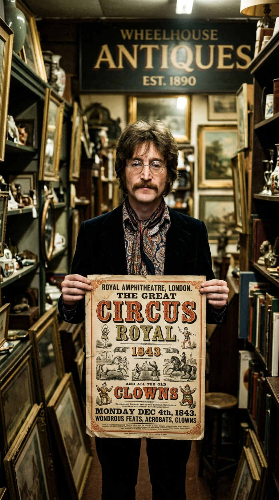
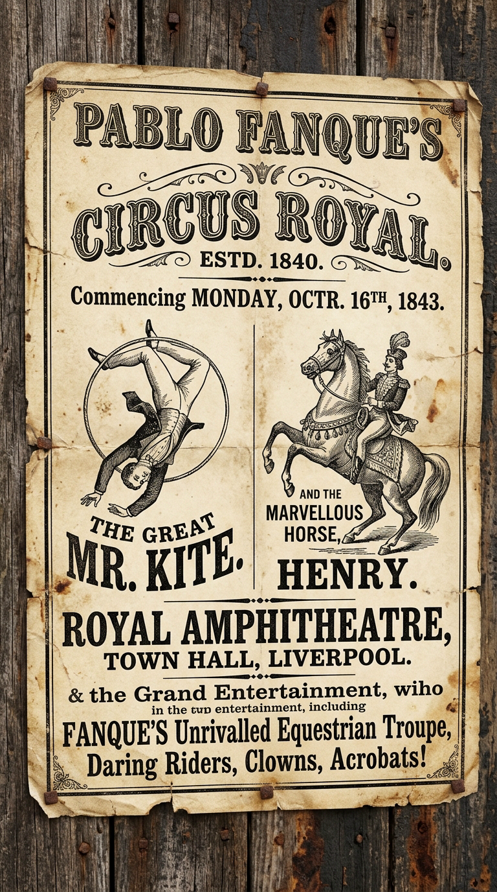
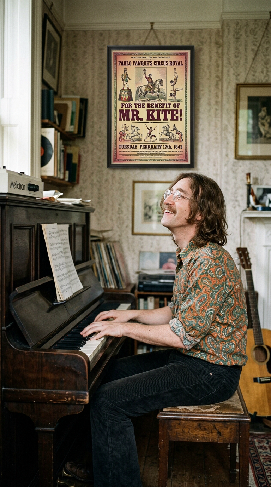
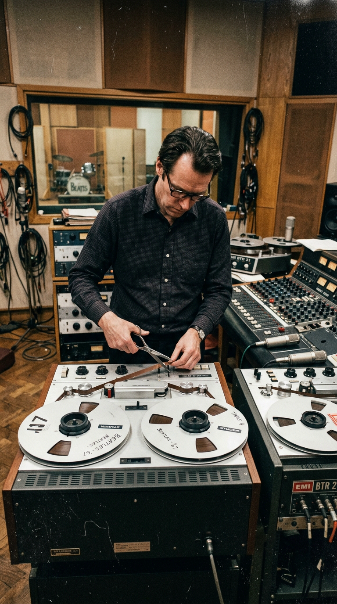
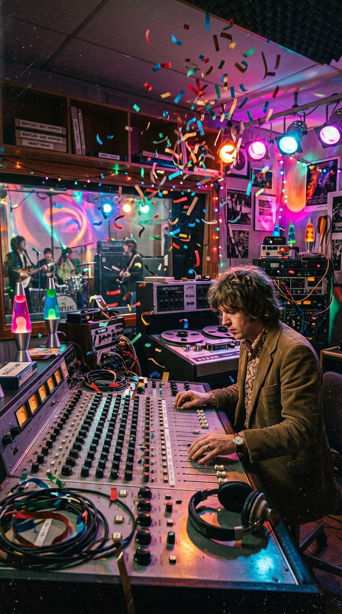
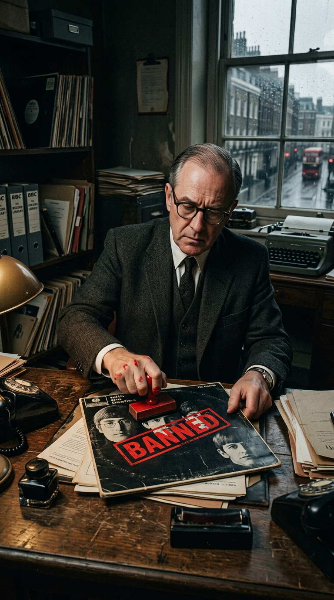
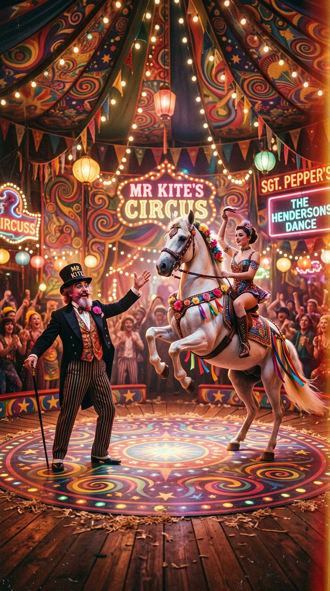

# El Cartel Victoriano que Enloqueció a la BBC: La Verdad Detrás de "Being for the Benefit of Mr. Kite!"

> *"Le dije a George Martin: 'Quiero oler el aserrín en el suelo, George. Quiero sentir el olor de los animales y el sudor de los trapecistas. Haz que suene como un circo de verdad, pero como un circo visto en un sueño'."*  
> — **John Lennon**, recordando la concepción de *"Being for the Benefit of Mr. Kite!"* en Abbey Road, 1967.

---

## Prólogo: La Tarde Gris en Sevenoaks

La historia de una de las piezas más audaces, desconcertantes y vanguardistas del rock psicodélico no comenzó en un templo místico de la India, ni bajo los efectos calculados de un laboratorio químico, ni en medio de una sesión nocturna en los estudios de Abbey Road. Comenzó, como tantas otras maravillas cotidianas de The Beatles, en una tarde fría y nublada de invierno en la campiña inglesa, en el interior polvoriento de una tienda de antigüedades.

El 30 de enero de 1967, The Beatles se encontraban en Sevenoaks, en el condado de Kent, filmando las secuencias exteriores de los cortometrajes promocionales para *"Strawberry Fields Forever"* y *"Penny Lane"*. Durante una pausa en el rodaje, aprovechando que el equipo técnico ajustaba las cámaras entre los árboles deshojados de Knole Park, John Lennon cruzó la calle empedrada y entró a curiosear en una pequeña tienda de objetos antiguos regentada por un anticuario local.

*Kent, enero de 1967. John Lennon descubre el cartel victoriano de 1843: un pedazo de papel amarillento que transformaría para siempre la historia del pop.*

En un rincón del local, apoyado contra una pila de muebles victorianos, un póster impreso en papel amarillento y desgastado por el paso de más de un siglo atrapó de inmediato su mirada miope. Era un cartel de feria tipográfico, impreso con tinta negra y adornado con grabados xilográficos de jinetes acróbatas, caballos engalanados y payasos en posturas gimnásticas. Anunciaba la llegada del prestigioso circo de Pablo Fanque a la localidad de Rochdale, en Lancashire, para una función benéfica extraordinaria que tendría lugar la noche del martes 14 de febrero de 1843.

Fascinado por la prosa pomposa, teatral y arcaica de la Inglaterra decimonónica, Lennon compró el cartel por unas pocas libras, lo enrolló con cuidado bajo el brazo y se lo llevó a su mansión de Kenwood, en Weybridge. En ese pedazo de papel descolorido dormían, esperando ser despertados, los fantasmas más coloridos de la era victoriana.

---

## Acto I: Pablo Fanque, Mr. Kite y la Alquimia de Kenwood

Al llegar a su casa de Weybridge, Lennon colgó el cartel enmarcado en la pared de su sala de música, justo al lado de su piano vertical. Mientras el mundo exterior aguardaba con impaciencia el próximo movimiento de la banda tras haber anunciado que jamás volverían a realizar giras en directo, John pasaba horas sentado frente al teclado, observando fijamente las líneas tipográficas del afiche de 1843.

*El cartel original de 1843: cada personaje, caballo y acrobacia de la canción estaba impreso en este histórico pliego de feria.*

El contenido del póster era un monumento a la retórica publicitaria del siglo XIX. Pablo Fanque —cuyo nombre real era William Darby— fue una figura verdaderamente legendaria: el primer propietario de circo de raza negra en la historia británica, un maestro ecuestre sumamente respetado que dirigió una de las compañías de entretenimiento más exitosas de la era victoriana durante más de tres décadas. La función anunciada en el cartel era una noche benéfica (*a benefit night*) en honor de uno de sus artistas estrella: William Kite, un consumado acróbata y jinete cómico que provenía de una distinguida estirpe circense.

Lennon comenzó a cantar en voz alta las frases exactas grabadas en la madera del cartel, acompañándose con acordes sincopados en el piano:

> *"Being for the benefit of Mr. Kite,*  
> *There will be a show tonight on trampolines.*  
> *The Hendersons will all be there,*  
> *Late of Pablo Fanque's Fair, what a scene!"*

*Lennon frente al piano vertical en su mansión de Kenwood: leyendo en voz alta el cartel, la melodía fluyó como un conjuro decimonónico.*

Casi cada elemento lírico de la canción fue extraído textualmente del impreso decimonónico: la presencia de *"Mr. J. Henderson"* (un célebre jinete y malabarista de la compañía), las piruetas desafiando al peligro (*"somersaults on solid ground"*), los saltos sobre diez barriles (*"over ten hogsheads"*), y la promesa solemne de que el espectáculo superaría a cualquier otro presentado en el condado. 

Solo un detalle crucial fue transformado por la imaginación de John: en el cartel original, el caballo acróbata que bailaba el vals sobre sus patas traseras se llamaba *"Zanthus"*. Lennon, buscando un nombre que sonara más entrañable y típicamente inglés, lo rebautizó al vuelo como *"Henry the Horse"*. No sospechaba que aquel inocente cambio de nombre desataría, meses después, una tormenta de censura institucional.

---

## Acto II: *"Quiero Oler el Aserrín"*: El Desafío de Abbey Road

En febrero de 1967, durante las sesiones cumbre de *Sgt. Pepper's Lonely Hearts Club Band* en los estudios EMI de Abbey Road, John Lennon presentó la idea a George Martin, el productor y arreglista prodigioso del cuarteto. 

La descripción que John hizo de lo que escuchaba en su mente no contenía términos musicales convencionales. Fiel a su estilo intuitivo y poético, Lennon no habló de armaduras, compases ni modulaciones. Miró a Martin a los ojos y le soltó una de sus demandas más memorables:  
*"George, quiero oler el aserrín en el suelo. Quiero sentir el olor de los animales, el calor de la carpa y el sudor de los trapecistas. Necesito que la música gire en el aire como un tiovivo fuera de control, pero que parezca que lo estamos soñando"*.

*Abbey Road, febrero de 1967. George Martin y Geoff Emerick enfrentan el reto: construir una atmósfera circense jamás escuchada en la música moderna.*

Para George Martin y su audaz ingeniero de sonido, el joven Geoff Emerick de veintiún años, aquella petición representaba una odisea técnica. En 1967, los sintetizadores comerciales modernos aún no existían en las sesiones de música pop; no había teclados digitales con bancos de sonido de feria, ni samplers donde cargar efectos pregrabados. Todo debía inventarse de la nada sobre cinta magnética analógica de cuatro pistas.

Martin reunió a una variedad asombrosa de instrumentos de teclado: él mismo tocó un órgano Hammond, un piano vertical tack y un armonio; Lennon tocó otro armonio; e incorporaron un **órgano de vapor Wurlitzer** y un calíope mecánico de feria. Sin embargo, al escuchar las pistas básicas grabadas en la consola REDD.51 de Studio Two, John frunció el ceño: aquello sonaba demasiado prolijo, demasiado convencional, como una banda de feria de iglesia y no como la alucinación caleidoscópica que él perseguía.

---

## Acto III: Las Cintas al Viento: El Experimento Aleatorio

Fue entonces cuando a George Martin se le ocurrió una de las ideas más revolucionarias y vanguardistas de la historia de la producción musical, inspirada directamente en las técnicas de *musique concrète* de la vanguardia francesa y en los experimentos de corte y confección literaria (*cut-up technique*) de William Burroughs.

Martin envió a los archiveros de EMI a rastrear en la biblioteca de efectos sonoros de Abbey Road todas las grabaciones existentes de antiguos órganos de vapor victorianos, calíopes de desfiles callejeros y marchas militares de John Philip Sousa grabadas en cilindros y cintas de acetato. Una vez recopiladas las cintas magnéticas, Martin tomó una decisión insólita: le pidió a Geoff Emerick un par de tijeras de empalmar cinta.

*El azar como herramienta estética: fragmentos de calíopes de vapor arrojados al aire de Abbey Road para destruir el orden convencional del sonido.*

Frente a la mirada atónita de los Beatles, George Martin cortó las cintas de los calíopes en docenas de pedazos pequeños de aproximadamente quince pulgadas de largo. Acto seguido, las tomó entre sus manos, las lanzó al aire de la sala de control, dejándolas caer como confeti multicolor sobre la alfombra, y le ordenó a Emerick:  
*"Recógelas todas y pégalas de nuevo en cualquier orden. Si alguna cinta queda al revés, déjala al revés. Si una marcha militar queda pegada contra un vals de organillo, que así sea"*.

Emerick empalmó meticulosamente los trozos dispersos. Cuando cargaron el carrete reconstruido al azar en la máquina de cinta Studer y presionaron *Play*, un torbellino sonoro desconcertante inundó la sala: notas de órganos de vapor que subían a destiempo, acordes invertidos que respiraban hacia atrás, campanas y silbatos que aparecían y desaparecían en una vorágine de ensueño. John Lennon pegó un salto en el sofá de la sala de control y gritó entusiasmado:  
*"¡Eso es, George! ¡Exactamente eso es lo que quería! ¡Ahí está el aserrín!"*.

Aquel collage sonoro aleatorio fue superpuesto en la sección instrumental intermedia y en el épico desenlace de la canción, donde Paul McCartney ideó una línea de bajo ágil y cromática, mientras George Harrison, Ringo Starr y Neil Aspinall tocaban armónicas bajas afinadas en acordes densos que subrayaban los saltos gimnásticos de Mr. Henderson.

---

## Acto IV: La Paranoia de la BBC y el Caso de "Henry the Horse"

En mayo de 1967, cuando *Sgt. Pepper's Lonely Hearts Club Band* fue entregado a las emisoras de radio británicas, la crítica y el público quedaron deslumbrados por la sofisticación del álbum. Sin embargo, en los oscuros despachos de la British Broadcasting Corporation (BBC), una comisión de censores morales examinaba cada surco del vinilo con lupa inquisitorial, obsesionados con encontrar mensajes ocultos que promovieran el consumo de sustancias psicodélicas.

La BBC vetó de inmediato el tema de cierre del disco, *"A Day in the Life"*, debido a la frase *"I'd love to turn you on"*. Pero para asombro mayúsculo de The Beatles, los censores fijaron también sus ojos en *"Being for the Benefit of Mr. Kite!"*. 

*Los censores de la BBC en 1967: convencidos de que 'Henry the Horse' era una metáfora de la heroína, vetaron la canción sin conocer el circo victoriano.*

El motivo de la prohibición fue la mención repetida de *"Henry the Horse"*:
> *"The celebrated Mr. K.*  
> *Performs his feat on Saturday at Bishopsgate.*  
> *The Hendersons will dance and sing*  
> *As Henry the Horse dances the waltz!"*

En el argot clandestino de las calles de Londres y Nueva York de finales de los sesenta, la palabra *"horse"* se utilizaba con frecuencia como jerga callejera para referirse a la heroína (*"horse"* = caballo = heroína). Los directivos de la BBC concluyeron con triunfalismo que John Lennon había introducido una metáfora descarada sobre un colocón de opiáceos, donde el caballo que "baila el vals" representaba el trance inducido por la droga.

La canción fue retirada de las listas de difusión de la radio pública británica. Cuando los periodistas le preguntaron a Lennon por la controversia, John no pudo contener la incredulidad y la risa amarga:  
*"Es una estupidez ridícula. Jamás en mi vida se me habría ocurrido pensar en la heroína al escribir sobre un caballo. Tenía el maldito cartel victoriano de 1843 clavado frente a mis ojos. ¡El caballo existió de verdad hace más de cien años en Rochdale! Si los burócratas de la BBC salieran un poco más a la calle o leyeran libros de historia en vez de buscar monstruos debajo de sus camas, sabrían que Henry simplemente estaba bailando en un circo"*.

El cartel victoriano de Pablo Fanque, conservado intacto por la familia Lennon, fue la prueba documental irrefutable que dejó en ridículo a los censores: cada nombre, cada acrobacia y cada detalle procedían del archivo hemerográfico de la era de la reina Victoria, antes siquiera de que el término "droga recreativa" fuera concebido en la cultura moderna.

---

## Acto V: El Legado de una Maravilla Ilusionista

*"Being for the Benefit of Mr. Kite!"* permanece como una de las obras cumbre de la experimentación sonora de *Sgt. Pepper*. En ella convergen de manera insólita tres siglos de tradición británica: la nostalgia teatral victoriana del siglo XIX, la maestría compositiva pop del cuarteto de Liverpool y las técnicas de música concreta y deconstrucción de vanguardia que definirían la música experimental del siglo XX.

*El triunfo de la imaginación: la pista convirtió una modesta función benéfica de 1843 en un carnaval sonoro eterno.*

Décadas más tarde, en sus giras mundiales en solitario, Paul McCartney incorporó la canción a su repertorio en vivo, rindiendo tributo a su compañero desaparecido. Al escucharla hoy, con ese bajo galopante, las armónicas resonando como fuelles de carbón y esa lluvia de cintas cortadas a mano flotando en el estéreo, el milagro se consuma una y otra vez: cerramos los ojos y, tal como John le exigió a George Martin hace casi sesenta años, todavía podemos oler el aserrín fresco esparcido sobre la arena del circo.

---

### 📚 Fuentes y Archivo Documental

1. **Lewisohn, Mark** (1988). *The Complete Beatles Recording Sessions: The Official Story of the Abbey Road Years 1962–1970*. Harmony Books, Nueva York.
2. **Martin, George & Hornsby, Jeremy** (1979). *All You Need Is Ears*. St. Martin's Press, Nueva York.
3. **Emerick, Geoff & Massey, Howard** (2006). *Here, There and Everywhere: My Life Recording the Music of The Beatles*. Gotham Books, Penguin Group, Nueva York.
4. **MacDonald, Ian** (1994). *Revolution in the Head: The Beatles' Records and the Sixties*. Fourth Estate / Pimlico, Londres.
5. **Davies, Hunter** (1968 / reed. 2009). *The Beatles: The Authorized Biography*. W. W. Norton & Company.
6. **Miles, Barry** (1997). *Paul McCartney: Many Years from Now*. Henry Holt and Company, Nueva York.
7. **Turner, Steve** (2005). *A Hard Day's Write: The Stories Behind Every Beatles Song*. HarperCollins, Nueva York.
8. **Archivo Municipal de Rochdale** (1843). *Pablo Fanque's Circus Royal Playbill for the Benefit of Mr. Kite*. Rochdale Library and Local History Archive, Lancashire.
