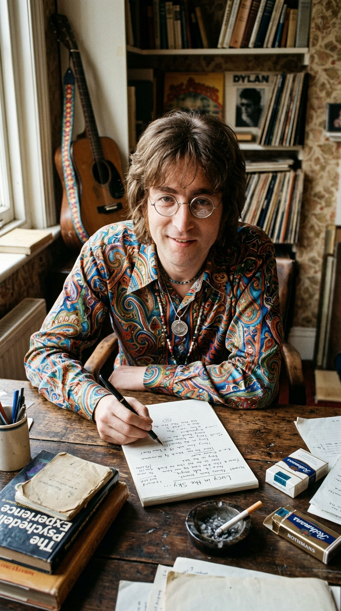
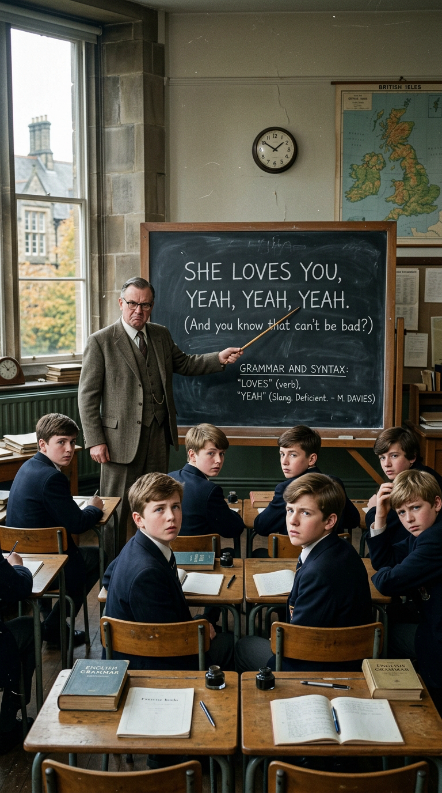
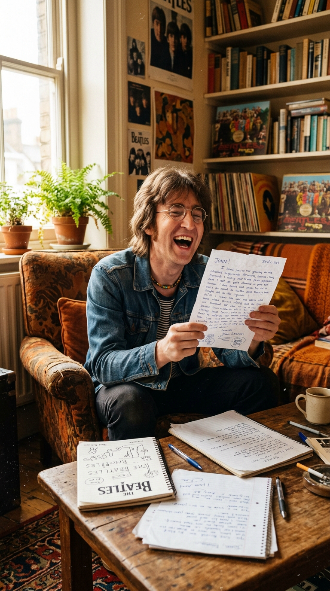
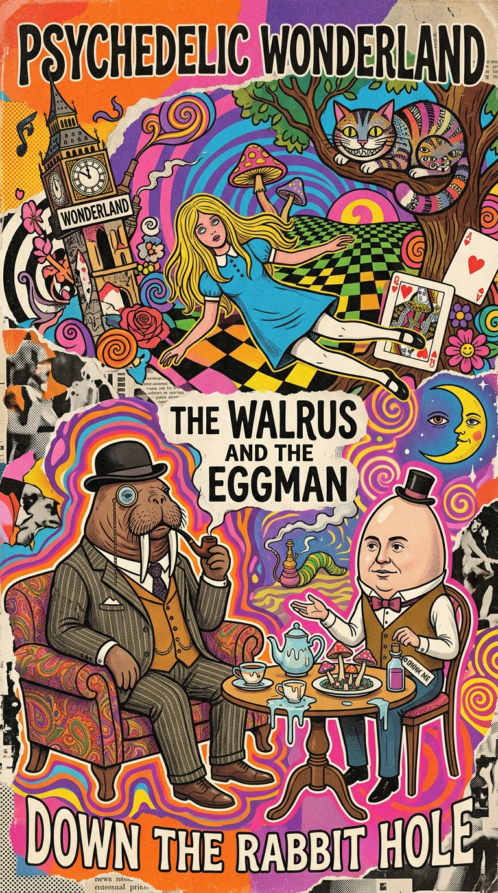
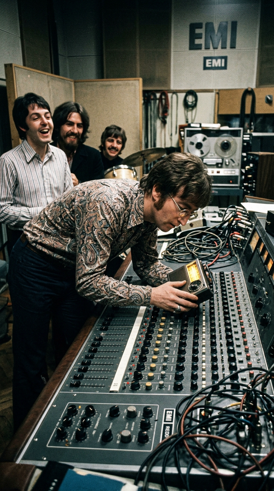
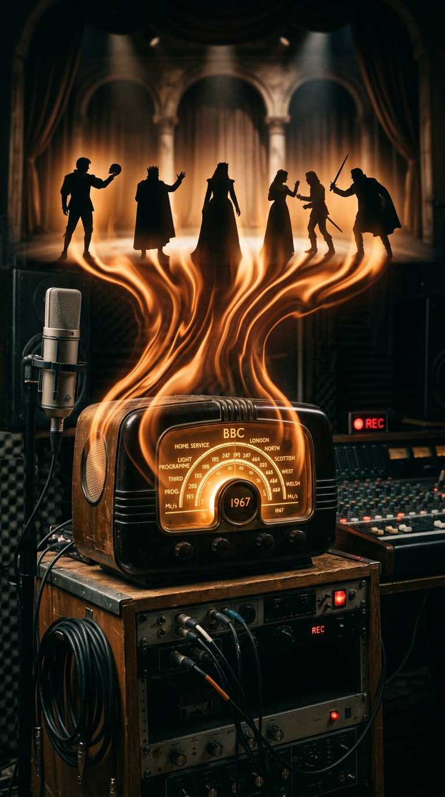
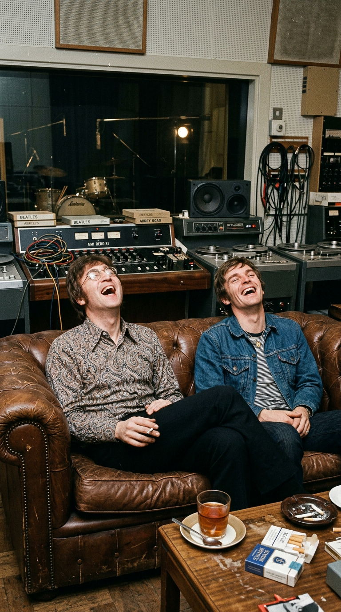

# El Gran Acertijo de Lennon: La Venganza Surrealista Detrás de "I Am the Walrus"

> *"Dejemos que esos capullos de profesores se rompan la cabeza intentando descifrar esto. A ver qué carajo le sacan de sentido ahora."*  
> — **John Lennon** a su amigo de la infancia Pete Shotton, tras terminar la letra de *"I Am the Walrus"*, Kenwood, septiembre de 1967.

---

## Prólogo: La Trampa para los Eruditos

Pocas cosas enfurecían y divertían tanto a John Lennon como la solemnidad pretenciosa de los críticos literarios, los intelectuales de cátedra y los hermeneutas que pretendían diseccionar sus canciones como si fueran códices bíblicos medievales. A mediados de 1967, tras el impacto cultural telúrico de *Sgt. Pepper's Lonely Hearts Club Band*, la prensa británica y los círculos académicos de Oxford, Cambridge y Londres comenzaron a coronar a The Beatles no como músicos populares, sino como los profetas de una nueva era civilizatoria. Cada verso, cada metáfora de doble sentido y cada juego de palabras lennoniano eran analizados en tratados de filosofía, tesis universitarias y suplementos culturales con una gravedad casi sacerdotal.

Lennon, criado en las calles ásperas de Liverpool con un humor cáustico, proletario y visceralmente antiautoritario, contemplaba aquella veneración escolástica con una mezcla de perplejidad y desdén. ¿Cuándo se había jodido tanto el espíritu del rock and roll como para que cuatro tipos tocando guitarras eléctricas fueran tratados como sacerdotes de la alta semiótica?

*Surrey, otoño de 1967. John Lennon en su estudio de Kenwood: la mente más ácida del pop afilando la pluma para la mayor travesura de su carrera.*

La chispa definitiva que detonó la creación de *"I Am the Walrus"* no fue una iluminación cósmica ni un manifiesto político. Fue una carta modesta escrita a mano, enviada por un adolescente desde las aulas de su propio pasado.

---

## Acto I: La Carta de Quarry Bank

En los primeros días del otoño de 1967, el cartero depositó en la mansión de Kenwood, en Weybridge, una carta remitida por un estudiante llamado Colin Kelly. El muchacho le escribía desde la **Quarry Bank Grammar School** de Liverpool, el mismo instituto de educación secundaria donde John Lennon había cursado sus estudios adolescentes entre suspensiones constantes, caricaturas burlonas de los profesores y expulsiones por rebeldía.

En su misiva, el joven Kelly le contaba una anécdota que a John le pareció tan cómica como insultante: su profesor de literatura inglesa, el señor Dave Darnell, había dedicado varias semanas del trimestre lectivo a obligar a toda la clase a analizar y desgranar minuciosamente los *"significados ocultos, los símbolos esotéricos y la imaginería poética"* de las canciones de The Beatles.

*Un aula de literatura en 1967: la academia intentando domesticar la insolencia juvenil de The Beatles bajo categorías escolásticas.*

Lennon leyó la carta junto a su amigo íntimo de la infancia **Pete Shotton**, con quien solía fumar cigarrillos a escondidas detrás de los cobertizos de Quarry Bank en los años cincuenta. John estalló en una carcajada estruendosa, sacudió la cabeza y miró a Shotton con una chispa diabólica en los ojos:  
*"¡Es increíble, Pete! ¿Te imaginas a esos viejos pedantes en Quarry Bank perdiendo el tiempo con nuestras letras? Vamos a hacer una cosa: voy a escribir la sarta de tonterías más absurda, enrevesada, surrealista e indescifrable que un ser humano haya escuchado jamás. Vamos a ver qué demonios le sacan de sentido esos idiotas cuando la escuchen"*.

*Lennon y Pete Shotton en Kenwood: el pacto travieso de dos muchachos de Liverpool para burlarse de la pedantería de los eruditos.*

---

## Acto II: El Rompecabezas del Disparate

Aquella misma tarde, sentado al piano de cola de Kenwood, Lennon comenzó a ensamblar lo que él mismo definía como un collage de retazos inconexos. Para garantizar que la letra fuera intrínsecamente imposible de descifrar por ningún método analítico racional, combinó tres fragmentos de canciones distintas que tenía pendientes en sus cuadernos y comenzó a arrojar sobre el papel imágenes deliberadamente inconexas:

1. **La sirena de la policía**: A unos cientos de metros de su casa en Weybridge, una patrulla de policía solía encender su sirena de dos notas (*"nee-naa, nee-naa"*). Lennon capturó ese intervalo musical de semitono descendente y lo utilizó como la base rítmica hipnótica sobre la que construiría el verso de apertura: *"I am he as you are he as you are me and we are all together"*.
2. **Lewis Carroll y la morsa engañosa**: Devoto lector de Lewis Carroll desde su niñez, Lennon introdujo la figura de la morsa inspirándose en el poema *"The Walrus and the Carpenter"* de *A través del espejo y lo que Alicia encontró allí*. Irónicamente, John admitió años más tarde que solo tiempo después comprendió que la morsa era el villano devorador de ostras del poema, mientras que el carpintero representaba la figura del trabajador engañado: *"Me equivoqué de personaje; debí haber cantado 'I am the Carpenter', pero 'I am the Walrus' sonaba infinitamente mejor"*.
3. **Eric Burdon y el "Hombre Huevo"**: La célebre línea *"I am the eggman"* provino de una íntima y delirante confesión privada que le hizo su amigo **Eric Burdon**, vocalista de The Animals. Burdon le había relatado a John en una fiesta que, en sus juegos eróticos juveniles en Newcastle, tenía la costumbre fetichista de romper huevos crudos sobre el abdomen de sus amantes. Para John, la imagen era tan ridículamente surrealista que decidió inmortalizar a Burdon para siempre como "el hombre huevo".
4. **Rimas infantiles y comida de perro**: Cuando a Lennon le faltaba una rima para el tercer verso, Pete Shotton le recordó un viejo canturreo de patio de recreo que los niños de Liverpool coreaban para asquearse mutuamente:  
   *"Yellow matter custard, green slop pie, all mixed together with a dead dog's eye..."*  
   Lennon, fascinado por la cadencia rítmica, la adaptó de inmediato al texto: *"Yellow matter custard, dripping from a dead dog's eye / Crabalocker fishwife, pornographic priestess..."*.

*La arquitectura del absurdo: versos infantiles de patio de recreo, parodias literarias y anécdotas privadas soldadas en una pesadilla cómica.*

Cuando terminaron de escribir la letra, John soltó el bolígrafo sobre el piano, miró a Shotton y exclamó triunfal: *"A ver qué carajo le sacan de sentido los profesores a esto ahora"*.

---

## Acto III: El Caos Orquestal en Abbey Road

El 5 de septiembre de 1967, The Beatles entraron a Studio Two en Abbey Road para comenzar la grabación de la pista. Lo que John había concebido como una broma mordaz se transformó, bajo la batuta visionaria del productor **George Martin**, en una de las mayores hazañas sonoras de la música del siglo XX.

Martin arregló una instrumentación orquestal colosal y deliberadamente disonante: dieciséis instrumentos de cuerda (violines, violas y violonchelos tocando notas chirriantes y glissandos ascendentes) y un coro de dieciséis cantantes de cámara profesionales conocidos como **The Mike Sammes Singers**. 

Los coristas, habituados a interpretar jingles publicitarios impecables y baladas ligeras para la BBC, quedaron estupefactos ante las partituras que Martin les entregó. Sus instrucciones eran cantar notas desgarradas, imitar relinchos de caballos, gritar en falsete agudo y corear fonemas ridículos diseñados por Lennon:  
*"Oompah, oompah, stick it up your jumper!"*  
*"Everybody's got one, everybody's got one..."*  
*"Ho-ho-ho, he-he-he, ha-ha-ha!"*

El violonchelo descendente marcaba un pulso ominoso mientras el piano eléctrico Fender Rhodes, distorsionado a través de un amplificador a válvulas, le otorgaba a la canción una textura pantanosa, densa y pesada. Pero faltaba el golpe maestro: la intervención del azar radiofónico.

---

## Acto IV: La Invocación de Shakespeare por la BBC

La noche del **29 de septiembre de 1967**, durante la sesión final de mezcla en mono de *"I Am the Walrus"*, John Lennon consideró que el final orquestal, por grandioso que fuera, aún sonaba demasiado predecible. Necesitaba un elemento exterior, una interferencia caótica que rompiera por completo la cuarta pared de la grabación.

En la sala de control, Lennon descubrió una radio de transistores portátil conectada a una antena improvisada. Le pidió al ingeniero Ken Scott que soldara un cable desde la salida de auriculares de la radio directamente a uno de los canales auxiliares de la consola de mezcla REDD.51 de Abbey Road.

*Abbey Road, 29 de septiembre de 1967. John manipula el dial de la radio: la señal viva de la BBC inyectada directo al master de la canción.*

Lennon comenzó a girar lentamente la perilla de sintonización del dial AM mientras la cinta corría. La estática crepitaba por los altavoces de la cabina. De repente, la aguja captó con absoluta claridad una transmisión en directo por el canal cultural **BBC Third Programme**: se trataba de una emisión radiofónica dramatizada de ***El rey Lear*** (*King Lear*), la tragedia inmortal de William Shakespeare, interpretada por The Royal Shakespeare Company.

Por un milagro inexplicable de sincronía cósmica, los actores declamaban en ese preciso instante la desgarradora escena de la muerte de Oswald a manos de Edgar (Acto IV, Escena 6):

> **Oswald**: *"Slave, thou hast slain me: villain, take my purse... If ever thou wilt thrive, bury my body..."*  
> **Edgar**: *"I know thee well: a serviceable villain; as duteous to the vices of thy mistress as badness would desire."*  
> **Gloucester**: *"What, is he dead?"*  
> **Edgar**: *"Sit you down, father; rest you."*

*La tragedia de Lear y la psicodelia de Lennon colisionando en el éter: el lamento de Oswald inmortalizado en el fundido de Abbey Road.*

Las frases fúnebres de Shakespeare —*"¡Esclavo, me has matado!"*, *"¿Qué, ha muerto?"*, *"Descansa, padre"*— encajaron de manera casi sobrehumana con los lamentos corales de los Mike Sammes Singers, los glissandos de cuerda y el fade-out de la batería de Ringo. Aquella transmisión en vivo no se grabó en una pista separada; fue capturada e impresa directamente en la mezcla mono final en tiempo real, volviendo imposible de recrear jamás en estéreo con la misma textura irrepetible.

---

## Acto V: El Triunfo de la Ironía

Cuando *"I Am the Walrus"* fue lanzada en noviembre de 1967 como cara B del sencillo monumental *"Hello, Goodbye"* y como pieza central de la película y EP *Magical Mystery Tour*, el plan de John Lennon funcionó con una precisión matemática que superó incluso sus más disparatadas expectativas.

*The Beatles en 'Magical Mystery Tour': la imagen de la morsa como ícono de la burla más sofisticada de la historia del pop.*

Los mismos críticos y profesores a los que John había querido engañar cayeron en la trampa con una ingenuidad conmovedora. En los periódicos de Londres y Nueva York, los críticos escribieron ensayos kilométricos analizando la "profunda alienación posmoderna" del *"semolina pilchard"* y la "angustia existencial sartreana" de los versos sobre la torre Eiffel. Sociólogos británicos publicaron monografías interpretando a la "morsa" como una crítica encubierta al imperialismo de la Commonwealth, y teólogos especularon con que *"I am the eggman"* era una referencia al huevo cósmico de la mitología hindú o una alegoría de la resurrección crística.

Lennon leyó cada una de aquellas reseñas desde su sofá de Kenwood mientras sostenía una taza de té, riéndose a carcajadas hasta que le dolieron las costillas. Había logrado el truco ilusionista definitivo: demostrar que cuando una obra de arte se envuelve con suficiente misterio y genialidad estética, el ser humano proyectará en ella sus propias obsesiones intelectuales, sin sospechar que detrás del telón solo hay un muchacho travieso guiñándole un ojo al mundo.

---

## Epílogo: El Arte del Desconcierto

Más de medio siglo después de su aparición, *"I Am the Walrus"* sigue siendo un hito insuperable de la vanguardia pop. Lo que nació como una revancha personal contra un maestro de escuela de Liverpool se convirtió, gracias a la alquimia sonora de Abbey Road y al descaro irreverente de John Lennon, en una de las piezas musicales más fascinantes, influyentes y magnéticas del siglo XX.

La canción nos recuerda una verdad liberadora que la cultura contemporánea a menudo olvida: que el arte no siempre necesita ser descifrado como un problema de matemáticas ni domesticado con explicaciones lógicas. A veces, la belleza reside precisamente en el disparate absoluto, en el choque violento de palabras que bailan en el aire como fuegos artificiales, y en el placer inmenso de mirar a los sabios del mundo a los ojos y decirles, con una sonrisa burlona:  
*Goo goo g'joob*.

---

### 📚 Fuentes y Archivo Documental

1. **Shotton, Pete & Schaffner, Nicholas** (1983). *John Lennon: In My Life*. Stein and Day, Nueva York.
2. **Lewisohn, Mark** (1988). *The Complete Beatles Recording Sessions: The Official Story of the Abbey Road Years 1962–1970*. Harmony Books, Nueva York.
3. **Martin, George & Hornsby, Jeremy** (1979). *All You Need Is Ears*. St. Martin's Press, Nueva York.
4. **MacDonald, Ian** (1994). *Revolution in the Head: The Beatles' Records and the Sixties*. Pimlico / Random House, Londres.
5. **Burdon, Eric** (2001). *Don't Let Me Be Misunderstood: A Memoir*. Thunder's Mouth Press, Nueva York.
6. **Miles, Barry** (1997). *Paul McCartney: Many Years from Now*. Henry Holt and Company, Nueva York.
7. **BBC Archives** (1967). *Third Programme Broadcast Logs: The Tragedy of King Lear, produced by Charles Lefeaux, Sept 29, 1967*. BBC Written Archives Centre, Caversham, Reading.
8. **Shakespeare, William** (1608). *The Tragedy of King Lear* (Act IV, Scene 6). First Folio Edition.
