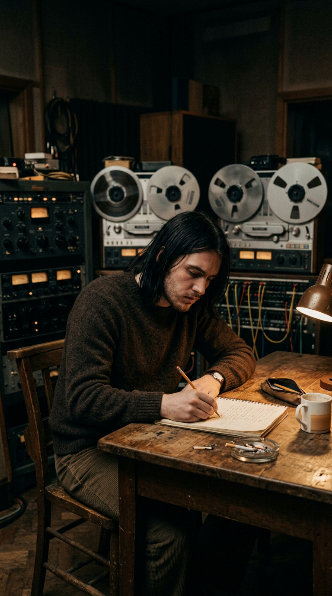
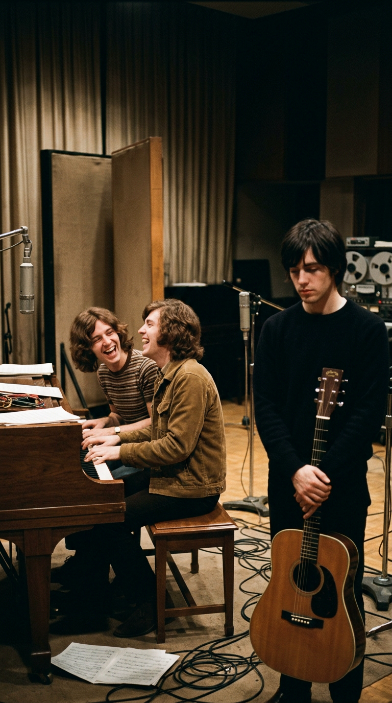
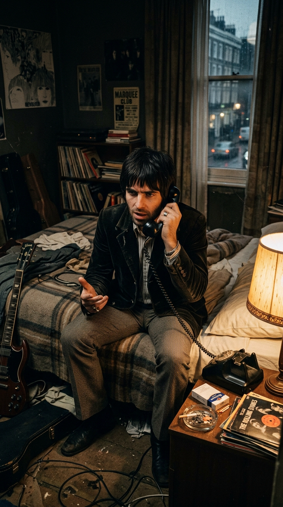
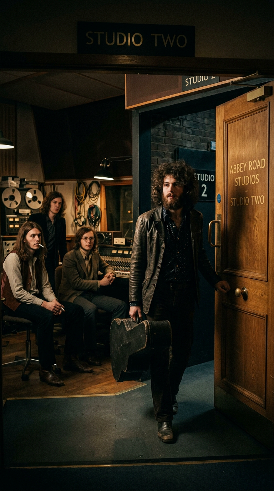
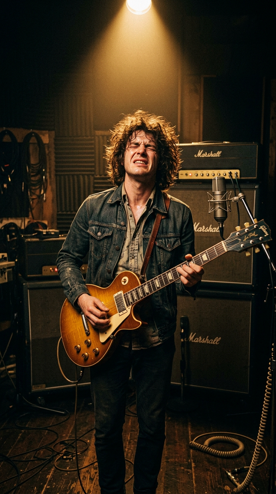
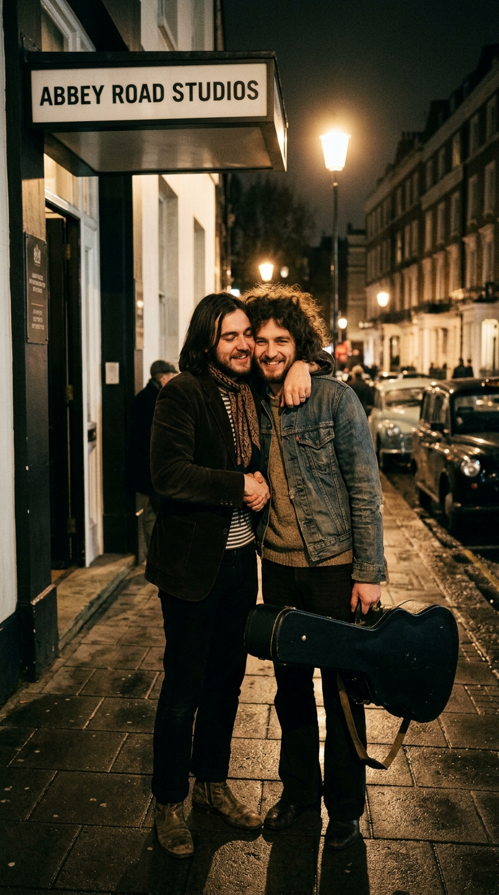
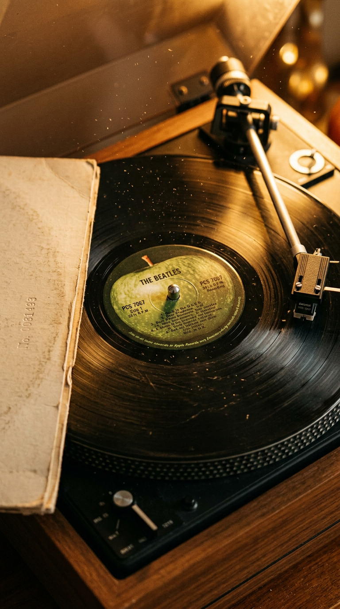

# El Llanto de la Guitarra: Cómo Eric Clapton y George Harrison Salvaron una Obra Maestra en Abbey Road

> *"Me parecía que John y Paul estaban tan metidos en sus propios mundos que no se preocupaban por mis temas. Les daba igual. Así que le dije a Eric: 'Ven y toca en la sesión'. Él me dijo: '¡Oh, no, no puedo hacer eso! Nadie toca jamás en los discos de los Beatles'. Y yo le respondí: 'Mira, es mi canción y quiero que toques tú'. Y cuando Eric entró al estudio, los demás se portaron como angelitos."*  
> — **George Harrison**, recordando el 6 de septiembre de 1968 en *The Beatles Anthology*.

---

## Prólogo: La Sombra del Tercer Beatle

En el otoño de 1968, los muros de los estudios EMI en Abbey Road ya no albergaban la camaradería jovial de cuatro muchachos de Liverpool que se reían juntos de las insolencias de la prensa. Albergaban un polvorín. Las sesiones del álbum doble conocido popularmente como el *White Album* transcurrían bajo una atmósfera densa, gélida y amarga, corroída por el hastío, el agotamiento creativo tras el regreso de su retiro espiritual en Rishikesh, y las tensiones causadas por la presencia constante de Yoko Ono junto a John Lennon en el estudio. Ringo Starr, superado por el ambiente tóxico y las reprimendas técnicas de Paul McCartney, había llegado a abandonar la banda durante dos semanas en agosto, refugiándose en el yate de su amigo Peter Sellers en el Mediterráneo.

*Abbey Road, septiembre de 1968. George Harrison en la soledad de Studio Two: incomprendido por Lennon y McCartney, decidido a reclamar su lugar como compositor mayor.*

En medio de aquel campo de batalla silencioso, George Harrison libraba su propia guerra invisible. Con veinticinco años, George ya no era el dócil guitarrista menor subordinado al titánico binomio Lennon/McCartney. Su inmersión en la filosofía hindú, el sitar y la literatura mística oriental habían ensanchado su sensibilidad hasta convertirlo en un compositor de una profundidad lírica conmovedora. Sin embargo, en el orden jerárquico del cuarteto, continuaba recibiendo el trato de un hermano pequeño al que se le concede, por cortesía o desgano, un par de pistas de relleno al final de cada disco.

Cuando Harrison llevó al estudio una de las melodías más desgarradoras y filosóficas que jamás brotaron de su pluma —*"While My Guitar Gently Weeps"*—, se topó con el muro de la indiferencia. Lo que sucedió a continuación no solo salvó la canción de la mediocridad o el descarte; fue una de las jugadas diplomáticas más brillantes y audaces en los anales del rock clásico.

---

## Acto I: El Oráculo del *I Ching* y el Amor Latente

La concepción de *"While My Guitar Gently Weeps"* ocurrió en la primavera de 1968, durante una visita de George a la casa de campo de sus padres en Warrington. Harrison se encontraba leyendo con devoción el *I Ching* (el milenario *Libro de las Mutaciones* chino), fascinado por el concepto oriental de la **sincronicidad y la causalidad universal**: la noción budista y taoísta de que nada ocurre por azar y que cada acontecimiento está intrínsecamente vinculado con el estado presente del cosmos.

*"La concepción oriental dice que cualquier cosa que suceda en un momento determinado está conectada con todo lo demás"*, explicaría George en su autobiografía *I Me Mine*. *"En Occidente creemos en la coincidencia: 'Esto pasó por casualidad'. En Oriente creen que todo tiene un sentido subyacente"*.

Para poner a prueba aquella filosofía, Harrison decidió realizar un experimento poético radical: fue hacia la biblioteca de su madre, extendió la mano y tomó un libro al azar. Se prometió solemnemente que escribiría una canción a partir de las dos primeras palabras que leyera en la página que abriera. 

El libro se abrió en una página aleatoria. Las dos primeras palabras que sus ojos enfocaron fueron: **"gently weeps"** (llora suavemente).

Harrison cerró el libro, tomó su guitarra acústica Gibson J-200 y comenzó a rasguear una progresión descendente en La menor. Las palabras fluyeron no como un poema de desamor romántico, sino como una meditación compasiva sobre la ceguera espiritual del ser humano, la desconexión del hombre moderno frente a la fuente primordial del amor y, de manera muy íntima, la dolorosa desintegración de la hermandad que una vez unió a The Beatles:

> *"I look at you all, see the love there that's sleeping,*  
> *While my guitar gently weeps.*  
> *I look at the floor and I see it needs sweeping,*  
> *Still my guitar gently weeps..."*  
>  
> *(Los miro a todos, veo el amor que está dormido ahí,*  
> *mientras mi guitarra llora suavemente.*  
> *Miro al suelo y veo que necesita ser barrido,*  
> *y aun así mi guitarra llora suavemente...)*

---

## Acto II: La Indiferencia y el Boicot Silencioso

En agosto de 1968, George grabó una toma acústica solitaria en Studio Two, acompañado únicamente por su guitarra y un armonio (una joya minimalista que décadas después conmovería al mundo en el proyecto *Anthology 3* y en el espectáculo *Love* del Cirque du Soleil). Pero cuando intentó montar la versión eléctrica completa con la banda, la sesión se convirtió en una pesadilla.

John Lennon y Paul McCartney no mostraron el menor interés. Tocaban las partes rítmicas con desgano evidente, bostezaban entre tomas o se concentraban en discutir sus propias canciones. Durante días, The Beatles grabaron múltiples versiones que carecían de alma, fuerza o dinamismo. John apenas prestó atención al arreglo y Paul intentaba imponer líneas de piano convencionales que desdibujaban el dramatismo de la pista.

*El ambiente gélido del White Album: Lennon y McCartney trataban las obras de George con negligencia, consumidos por sus propios egos.*

Harrison regresó a su hogar en Esher frustrado, herido y exhausto. Sabía que tenía entre manos una obra monumental, pero comprendía también que, dentro de la dinámica de poder de The Beatles, no tenía el peso político para exigirles a John y Paul la entrega total que la pieza demandaba. Si quería que los Beatles respetaran su música, necesitaba un catalizador exterior; un golpe de efecto que descolocara el tablero.

---

## Acto III: El Viaje a Londres y la Estrategia del Invitado

La mañana del **viernes 6 de septiembre de 1968**, George Harrison conducía su automóvil deportivo desde Surrey hacia los estudios de Abbey Road en Londres. A su lado, en el asiento del copiloto, viajaba su amigo íntimo Eric Clapton, el prodigioso guitarrista que acababa de consagrarse mundialmente con Cream y al que las paredes del metro londinense aclamaban con el célebre grafiti: *"Clapton is God"*.

*6 de septiembre de 1968: en la intimidad de un automóvil bajo la lluvia, Harrison lanza la invitación más arriesgada de su carrera.*

Mientras sorteaban el tráfico bajo una llovizna persistente, George miró a Clapton y le soltó a bocajarro:  
*"Eric, hoy vamos a Abbey Road. Quiero que vengas al estudio y toques la guitarra líder en mi canción"*.

Clapton se quedó helado. La propuesta le pareció una auténtica locura diplomática:  
*"¡Oh, no, George! ¡De ninguna manera! Nadie toca jamás en los discos de los Beatles. Sería una falta de respeto espantosa. John y Paul me odiarán, dirán que qué demonios hago ahí metiendo las narices en sus sesiones"*.

Harrison no dio su brazo a torcer. Con una firmeza inusitada, le clavó la mirada y replicó:  
*"Mira, Eric: la canción no es de John ni de Paul. La canción es mía. Yo la escribí y yo quiero que toques tú. No les pidas permiso; ven conmigo"*.

George había calculado con precisión psicológica milimétrica el efecto que la presencia de Clapton causaría en el grupo. Los Beatles podían permitirse maltratar a su propio guitarrista por costumbre y arrogancia familiar; pero ante la mirada atenta del instrumentista más admirado y respetado del Reino Unido, el orgullo herido y la etiqueta británica los obligarían a comportarse de manera impecable.

---

## Acto IV: La Llegada del "Dios" y el Solo de "Lucy"

Cuando George Harrison abrió la pesada puerta de Studio Two en Abbey Road y Eric Clapton entró en la sala cargando el estuche de su guitarra eléctrica, el ambiente en el estudio se transformó en un segundo. 

La atmósfera densa y pesada se disipó de golpe. John Lennon, Paul McCartney y Ringo Starr enderezaron la postura, sonrieron con amabilidad extrema y se mostraron solícitos y extraordinariamente profesionales. Tal como Harrison había anticipado, se portaron *"como angelitos"*.

*La llegada de Clapton a Abbey Road: la presencia del invitado de honor impuso una cortesía y una concentración inmediatas en la sala.*

Paul McCartney se sentó al piano de cola Blüthner y concibió esa icónica introducción melancólica de acordes staccato que establece el pulso fúnebre de la canción. John Lennon tomó la guitarra rítmica aportando arpegios precisos, y Ringo Starr imprimió en la batería un compás marcial, pesado y arrastrado, lleno de peso emocional en los platillos.

Con la banda tocando al límite de su capacidad, Eric Clapton conectó a un amplificador Fender su legendaria guitarra: **"Lucy"**, una **Gibson Les Paul Standard de 1957**, de acabado rojo cereza brillante (*cherry red*), que él mismo le había regalado a George unas semanas antes tras comprarla en Manhattan.

*El clímax de Studio Two: Clapton hace rugir a 'Lucy' en un solo desgarrador que parece llorar en cada estiramiento de cuerda.*

La interpretación de Clapton fue sublime. Grabó un solo fluido, visceral, lleno de bending dramáticos y notas suspendidas en el aire que parecían literalmente gemir de angustia. Cada nota dialogaba con la voz madura, firme y cargada de dolor existencial de Harrison ante el micrófono Neumann U67. En una sola tarde, la canción que Lennon y McCartney habían desdeñado como una maqueta prescindible se transformó en la cumbre musical más incandescente de las sesiones del *White Album*.

---

## Acto V: El Bamboleo Analógico de Ken Scott

Cuando la sesión de grabación finalizó y escucharon las tomas preliminares en la sala de control, Eric Clapton seguía sintiendo un escrúpulo artístico:  
*"Hay un problema, George"*, advirtió Clapton al escuchar la reproducción. *"El solo suena fantástico, pero suena demasiado a mí, suena a Cream. No suena bastante 'Beatle'. La gente sabrá de inmediato que no es una guitarra de los Beatles"*.

Harrison quería que la guitarra de Clapton se integrara de forma natural en el tapiz sonoro psicodélico de la banda sin perder su fuerza demoledora. Fue entonces cuando el joven ingeniero de sonido **Ken Scott** ideó una solución técnica magistral.

*Ken Scott manipulando el oscilador en la cabina de control: el bamboleo manual del ADT confirió al solo su textura acuosa y única.*

Scott decidió pasar la pista del solo de Clapton a través del sistema **ADT (Artificial Double Tracking)**, el invento patentado por el ingeniero de Abbey Road Ken Townsend para duplicar voces artificialmente mediante dos máquinas de cinta sincronizadas. Sin embargo, en lugar de dejar el desfase fijo, Ken Scott colocó sus dedos sobre el oscilador de frecuencia variable (VFO) que controlaba la velocidad del motor de la grabadora Studer.

Durante toda la duración del solo, Scott moduló la perilla de velocidad hacia arriba y hacia abajo con la mano, milímetro a milímetro, en tiempo real. Aquella manipulación analógica manual provocó una alteración constante y ondulante en el tono y la afinación de la guitarra, creando un característico **bamboleo acuoso, lloroso y trémulo** (*wobble*). La guitarra de Clapton ya no solo sonaba magistral: sonaba como un instrumento flotando en un sueño melancólico. Era, con exactitud poética, una guitarra llorando suavemente.

---

## Epílogo: El Vuelo del Ave Solitaria

Cuando el *White Album* llegó a las tiendas en noviembre de 1968, la crítica internacional coincidió de inmediato en que *"While My Guitar Gently Weeps"* constituía uno de los pináculos absolutos del disco. La canción no solo demostró al mundo que George Harrison poseía una estatura autoral a la par de John Lennon y Paul McCartney; marcó también el inicio del camino que lo llevaría, apenas un año después, a entregar *"Something"* y *"Here Comes the Sun"* en *Abbey Road*, y poco más tarde su catedralicia obra maestra solista en triple vinilo: *All Things Must Pass* (1970).

*La redención de George Harrison: la obra que rescató la hermandad de la música sobre las grietas del ego humano.*

El pacto secreto entre Harrison y Clapton trascendió la sesión de aquel 6 de septiembre. Por razones contractuales con sus respectivas compañías discográficas, la participación de Eric Clapton en el álbum no fue acreditada en la portada del *White Album* en 1968, convirtiéndose en el secreto a voces más venerado por los melómanos de la época. Años más tarde, Clapton devolvería el favor invitando a George a participar en Derek and the Dominos y compartiendo escenarios a lo largo de toda una vida.

La guitarra de "Lucy" sigue llorando en los altavoces de millones de personas en cada rincón del planeta. Pero ya no llora de tristeza o soledad: llora de emoción pura, recordándonos aquel día en que la amistad, el genio y el coraje de un artista incomprendido lograron doblegar a las tensiones más destructivas del mundo para legarle a la humanidad una llamarada inmortal de belleza.

---

### 📚 Fuentes y Archivo Documental

1. **Harrison, George** (1980 / reed. 2002). *I Me Mine*. Phoenix / Chronicle Books, San Francisco.
2. **The Beatles** (2000). *The Beatles Anthology*. Chronicle Books, San Francisco.
3. **Lewisohn, Mark** (1988). *The Complete Beatles Recording Sessions*. Harmony Books, Nueva York.
4. **Clapton, Eric** (2007). *Clapton: The Autobiography*. Broadway Books / Century, Londres.
5. **Scott, Ken & Owsinski, Bobby** (2012). *Abbey Road to Ziggy Stardust: Off the Record with The Beatles, Bowie, Elton & So Much More*. Alfred Music.
6. **Emerick, Geoff & Massey, Howard** (2006). *Here, There and Everywhere: My Life Recording the Music of The Beatles*. Gotham Books, Nueva York.
7. **MacDonald, Ian** (1994). *Revolution in the Head: The Beatles' Records and the Sixties*. Pimlico, Londres.
8. **Leng, Simon** (2006). *While My Guitar Gently Weeps: The Music of George Harrison*. Hal Leonard Corporation.
