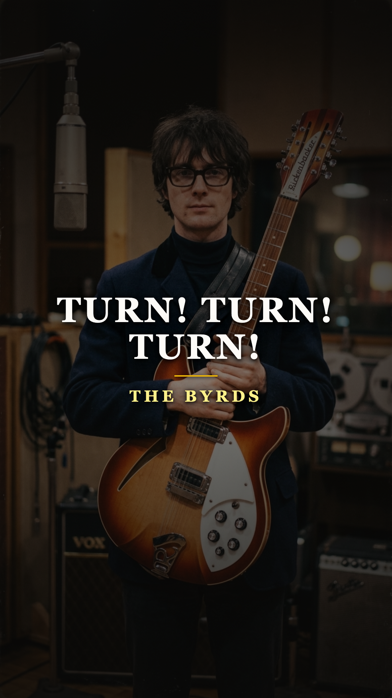
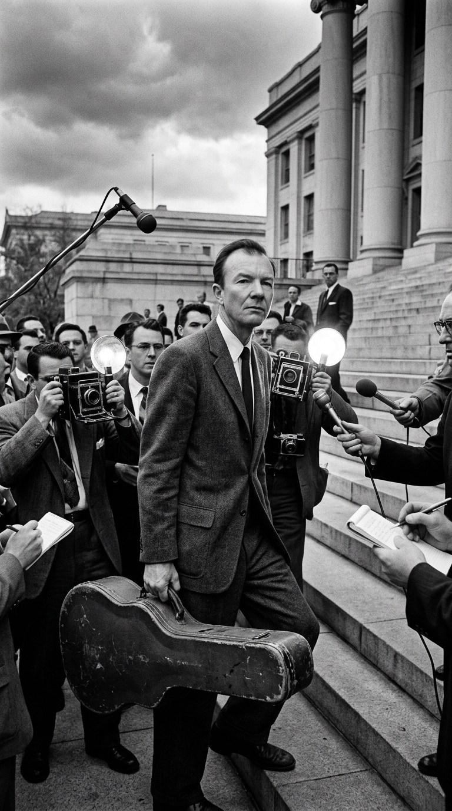
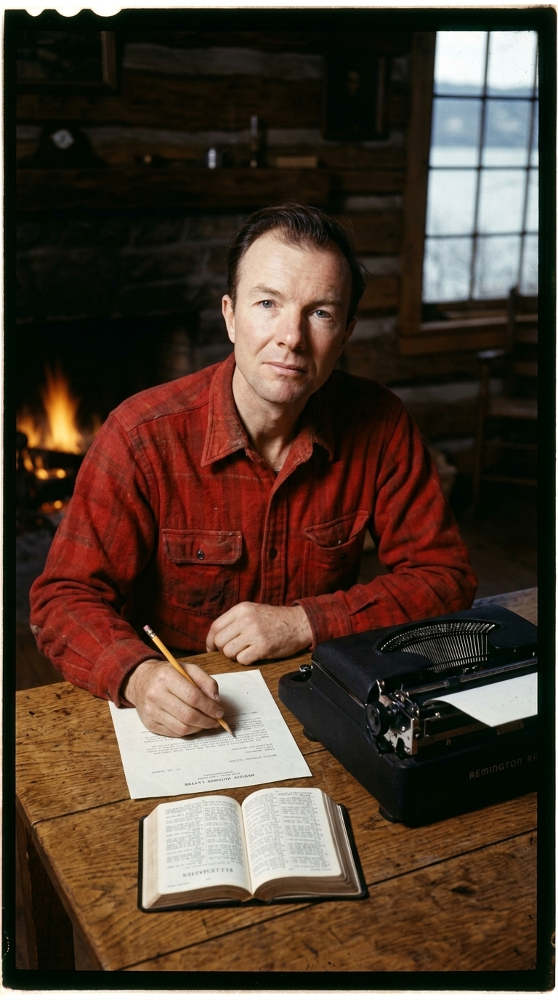
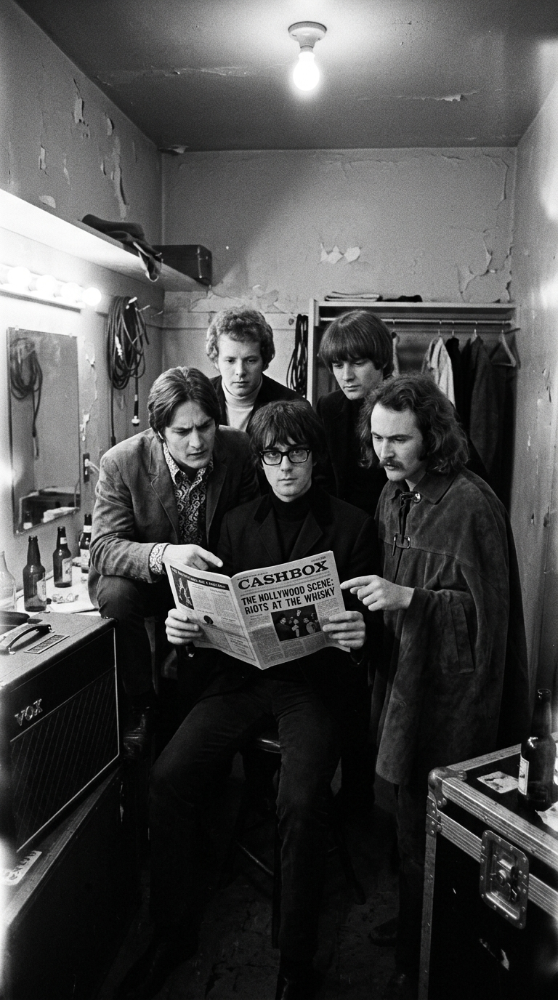
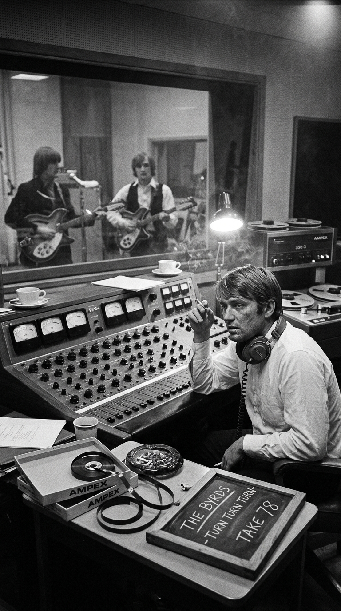
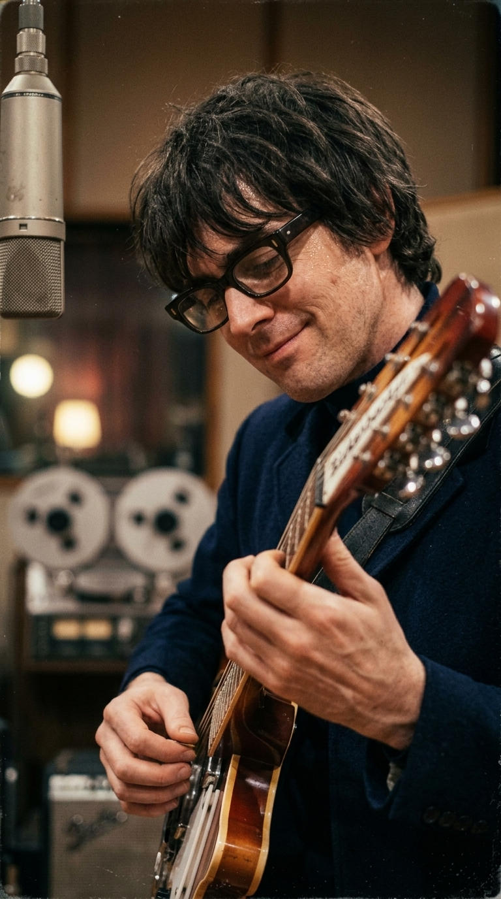
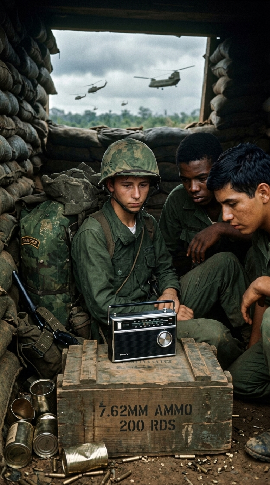
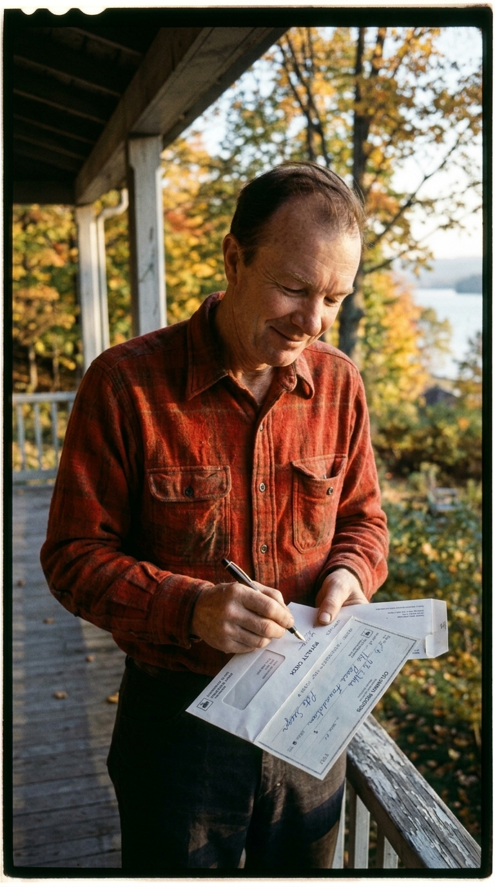

# 🕊️ El Salmo Milenario que Venció a la Guerra: La Odisea de The Byrds y «Turn! Turn! Turn!»
### *Cómo un texto bíblico de tres mil años atribuido al Rey Salomón, la furia de Pete Seeger contra la censura del macartismo y setenta y ocho tomas al límite en Hollywood forjaron el número uno más insólito y necesario de la historia del rock.*

---

**Por la redacción de Acordes Ocultos**  
*Tiempo de lectura estimado: 7 minutos*

---

### Prólogo: Cuatro acordes de campana sobre el lodo de Da Nang

A finales de noviembre de 1965, las radios portátiles de transistores en las trincheras improvisadas de **Da Nang** y en los dormitorios juveniles de todo el mundo anglosajón comenzaron a emitir un tintineo eléctrico inconfundible. Sonaba como un carillón de campanas de cristal suspendido en el aire, seguido por una armonía vocal a tres voces que parecía descender de una catedral gótica:

> *«To everything (turn, turn, turn)  
> there is a season (turn, turn, turn)  
> and a time to every purpose under heaven...»*

Aquella cadencia luminosa no hablaba de autos deportivos, ni de romances adolescentes en las playas de California. Sus versos enumeraban, con una solemnidad implacable, las mareas inmutables de la existencia humana: un tiempo para nacer y un tiempo para morir; un tiempo para plantar y un tiempo para arrancar lo plantado; un tiempo para la guerra y un tiempo para la paz.

El autor de esas palabras no era una estrella del rock de Sunset Strip; llevaba casi **tres mil años sepultado**.

El 4 de diciembre de 1965, **The Byrds** alcanzaron la cima del **Billboard Hot 100** con **«Turn! Turn! Turn!»**, estableciendo un récord que nadie jamás podrá arrebatarles: es la canción con la letra más antigua de toda la civilización en alcanzar el número uno de las listas modernas. Pero detrás de su triunfo incontestable se escondía una batalla feroz contra la persecución política, una humillación profesional que la banda necesitaba lavar a cualquier precio y una de las sesiones de grabación más extenuantes de las que se tenga memoria en la historia del pop.

---

### Acto I: La carta del editor y la venganza de Pete Seeger

Para hallar el origen de la canción es indispensable retroceder a los años más siniestros de la Guerra Fría en los Estados Unidos. A finales de la década de 1950, el folklorista y activista **Pete Seeger** vivía con una diana en la espalda. Perseguido por el **Comité de Actividades Antiestadounidenses (HUAC)** en plena histeria del macartismo, Seeger había sido incluido en las listas negras, vetado de las cadenas de radio y televisión, y procesado judicialmente por negarse a delatar a sus camaradas sindicalistas.

*Años 50: Pete Seeger con su emblemático banjo. Perseguido por el gobierno estadounidense, su compromiso moral encendió la mecha de la canción.*

Sobrevivía dando recitales clandestinos en pequeñas escuelas y campamentos obreros con su banjo de cinco cuerdas, en cuyo parche de piel lucía una inscripción desafiante: *«Esta máquina rodea el odio y lo obliga a rendirse»*.

Un día de 1959, Seeger recibió una carta irritada de su editor musical en Nueva York. La misiva venía a decirle en tono condescendiente:  
—*«Pete, estamos hartos de tus canciones de protesta. No puedes seguir escribiendo himnos sobre mineros y marchas por la paz; eso no vende discos. La gente quiere bailar y olvidar sus problemas. Si quieres que la editorial te pague, escríbenos una canción comercial de amor»*.

Seeger leyó la carta con una mezcla de indignación y socarronería. Abrió su cuaderno de notas, sacó un fajo de papeles arrugados del bolsillo de su camisa de leñador y exclamó para sus adentros: *«¿Queréis una canción que no sea mía? Os la voy a dar. A ver si os atrevéis a censurar al mismísimo Rey Salomón»*.

*1959: Con el Eclesiastés en la mano, Seeger escribe la melodía circular en quince minutos, desafiando a los ejecutivos que le pedían banalidades comerciales.*

Tomó los versos del capítulo 3 del **Libro del Eclesiastés** bíblico, texto sapiencial milenario redactado en Judea hacia el siglo X antes de Cristo. En apenas quince minutos al piano, concibió una melodía circular basada en arpegios de folk ancestral, intercalando la palabra *«Turn!»* (Gira, cambia, evoluciona) como un recordatorio del eterno retorno cósmico.

El texto original permaneció casi intacto, salvo por una sola frase. En el último compás, donde la Biblia dictaba fríamente: *«Tiempo para la guerra y tiempo para la paz»*, Seeger sintió la urgencia moral de intervenir y añadió de su propio puño y letra seis palabras que cambiaron el sentido de la historia:

> *«A time for peace...  
> I swear it's not too late.»*  
> *(«Un tiempo para la paz... juro que no es demasiado tarde»).*

---

### Acto II: La espina clavada de The Byrds

A principios de 1965, la juventud musical de Los Ángeles estaba fascinada por el impacto de The Beatles. En los clubes de Sunset Strip como *Ciro's*, un quinteto de muchachos de aspecto bohemio comenzó a fusionar la poesía letrística del folk con la electricidad palpitante del beat británico: **The Byrds**, integrados por **Jim (Roger) McGuinn** (guitarra líder y voz), **David Crosby** (guitarra rítmica y armonías), **Gene Clark** (pandereta y voz principal), **Chris Hillman** (bajo) y **Michael Clarke** (batería).

Su primer sencillo, una versión electrificada de *«Mr. Tambourine Man»* de Bob Dylan, fue un fenómeno descomunal que alcanzó el número uno mundial. Sin embargo, detrás de las sonrisas en las portadas de las revistas, los miembros de la banda cargaban con una humillación secreta que les carcomía el orgullo.

*1965: En la carretera, The Byrds debaten su futuro. Heridos en su amor propio, se juraron demostrar que eran una banda real sin músicos de alquiler.*

El productor de Columbia Records, **Terry Melcher** (hijo de la actriz Doris Day), no confiaba en la solvencia técnica del grupo novato. A espaldas de la banda, contrató a los veteranos músicos de sesión de **The Wrecking Crew** para grabar las pistas instrumentales de su álbum debut, permitiendo únicamente que McGuinn tocara su guitarra. Durante meses, los críticos y colegas de profesión los tacharon con desdén de ser una «creación de laboratorio publicitario», un producto prefabricado que no sabía tocar sus propios instrumentos en el estudio.

Cuando llegó el momento de preparar el segundo larga duración en el otoño de 1965, la banda se plantó ante Melcher con un ultimátum irrevocable:  
—*«Nadie toca en este disco excepto nosotros cinco. Si fallamos, nos hundimos nosotros. Pero seremos nosotros»*.

Fue la novia de McGuinn, Dolores DePina, quien sugirió rescatar la melodía de Seeger que Jim había tocado dos años antes como arreglista acústico para la cantante Judy Collins. McGuinn tomó su guitarra y aceleró el tempo, transformando la balada contemplativa en una marcha vibrante y electrizante.

---

### Acto III: Setenta y ocho tomas en los estudios Columbia

Las sesiones comenzaron en los míticos **Columbia Studios** de Hollywood. Lo que debía ser una grabación rápida se convirtió en un calvario de sudor, nervios destrozados y dedos sangrantes.

*Otoño de 1965, Columbia Studios: Entre discusiones y agotamiento físico, The Byrds se encierran durante cinco días en busca de la toma perfecta.*

Terry Melcher era un perfeccionista implacable que exigía una precisión rítmica milimétrica. En 1965 no existían pistas de metrónomo digital (click tracks) ni ordenadores para corregir la afinación. El baterista Michael Clarke, que venía del mundo de las congas y tocaba con un estilo intuitivo y libre, sufría enormes dificultades para mantener un compás constante durante los tres minutos y medio de la pieza.

Cada vez que el tempo fluctuaba una fracción de segundo o una de las complejas armonías vocales a tres voces entre McGuinn, Crosby y Clark perdía el empaste angelical, Melcher detenía la cinta roja desde la cabina de control:  
—*«¡Corten! El tempo se acelera en el puente. Otra vez desde el principio»*.

Fueron cinco días agotadores. Se fumaron cientos de cigarrillos en la penumbra de la sala, las discusiones entre Crosby y Melcher rozaron la agresión física y el bajista Chris Hillman llegó a tocar con ampollas abiertas en los dedos. Veinte tomas... cuarenta tomas... sesenta tomas.

Fue en la **toma número setenta y ocho** donde ocurrió la transmutación. La banda entró en un estado de trance colectivo. Clarke clavó un patrón rítmico marcial y solemne; Hillman dibujó un bajo fluido y elástico que sostenía la base sin titubeos; y las tres voces se fundieron en un bloque cristalino donde resultaba imposible distinguir dónde terminaba un cantante y comenzaba el otro.

*El secreto sónico: Jim McGuinn y su Rickenbacker 360/12 conectada en serie a dos compresores Fairchild 660, inventando el timbre más luminoso del rock.*

Pero el alma mágica de la pista radicaba en el instrumento de Jim McGuinn: una **Rickenbacker 360/12** de doce cuerdas en acabado *sunburst*. Para lograr que las cuerdas dobles no sonaran dispersas, el ingeniero de sonido conectó la guitarra directamente a la consola de grabación pasando la señal por **dos compresores a válvulas Fairchild 660 en serie**. El resultado fue el legendario sonido *«jingle-jangle»*: un sustain infinito, metálico y puro que brillaba como oro líquido.

---

### Acto IV: La plegaria de una generación en la jungla

El lanzamiento del sencillo coincidió con un punto de inflexión trágico en la historia de los Estados Unidos. En marzo de 1965, la administración del presidente Lyndon B. Johnson había iniciado el envío masivo de tropas de combate a Vietnam y desatado los bombardeos masivos de la Operación Rolling Thunder. Para el otoño de ese mismo año, más de **ciento ochenta mil soldados jóvenes** chapoteaban en los arrozales del sudeste asiático y la sangrienta Batalla del Valle de Ia Drang llenaba las portadas de ataúdes envueltos en banderas de barras y estrellas.

*Finales de 1965: Mientras «Turn! Turn! Turn!» sonaba en las radios, miles de jóvenes eran arrojados al infierno de la jungla vietnamita.*

En medio de la angustia y las primeras marchas multitudinarias de protesta en Washington y Berkeley, «Turn! Turn! Turn!» dejó de ser un simple éxito pop para convertirse en un **salmo laico y un escudo moral**. Cuando las emisoras radiaban aquel verso ancestral de que había *«un tiempo para matar y un tiempo para curar... un tiempo para la paz»*, los reclutas en los barracones y las madres en sus cocinas encontraban un consuelo que ningún discurso político era capaz de proporcionar.

El 4 de diciembre de 1965, la canción desbancó del número uno del Billboard Hot 100 a *«I Got You (I Feel Good)»* de James Brown, coronando a The Byrds como los reyes indiscutibles del folk-rock planetario.

---

### Epílogo: La lección moral de Pete Seeger

La consagración de la canción generó una catarata de ingresos por derechos de autor y reproducción mecánica. Como compositor oficial registrado, **Pete Seeger** comenzó a recibir cheques por decenas de miles de dólares en el buzón de su modesta cabaña de madera en Beacon, junto al río Hudson.

Para un hombre que había sido boicoteado por la industria y que apenas tenía dinero para pagar la calefacción de su familia, aquel dinero representaba la riqueza con la que cualquier artista soñaba.

Seeger no se quedó con un solo centavo de lo que no consideraba fruto de su propio trabajo. Fiel a sus principios innegociables, declaró que la inmensa mayoría de la letra pertenecía al patrimonio espiritual de la humanidad:

> *«Yo no escribí esas palabras; las escribió un sabio de Jerusalén hace tres mil años. Sería un ladrón y un hipócrita si me enriqueciera con una plegaria por la paz en mitad de una masacre»*.

*La dignidad de un trovador: Pete Seeger donó el 45% de sus regalías millonarias a comités pacifistas y movimientos de objeción de conciencia.*

Seeger firmó una cesión irrevocable para donar el **45% de todas las regalías mundiales** generadas por la canción a la **War Resisters League** (Liga de Resistentes a la Guerra) y a comités de ayuda humanitaria para las víctimas civiles de los bombardeos en Vietnam.

*El eco eterno: Tres mil años después, las palabras de Salomón y la Rickenbacker de The Byrds nos recuerdan que las armas callan, pero la música sobrevive a los imperios.*

The Byrds continuaron su vuelo, transformándose más tarde en pioneros del rock psicodélico con *«Eight Miles High»* y del country-rock con *Sweetheart of the Rodeo*. Pero ninguna de sus obras maestras posteriores alcanzaría la trascendencia espiritual de aquel salmo grabado con las manos sangrantes en setenta y ocho tomas.

Tres mil años después de ser redactado, aquel proverbio sigue girando en el dial de la historia. Nos recuerda, con la dulzura inmarcesible de doce cuerdas eléctricas, que las guerras y los tiranos pasan como el humo, pero la promesa de la paz siempre aguarda a la vuelta de la esquina: *juro que nunca es demasiado tarde*.

---

### 💬 El eco en la memoria

¿Qué sientes al escuchar el tintineo de la Rickenbacker en *«Turn! Turn! Turn!»* sabiendo que una letra de tres mil años sirvió de refugio moral contra la guerra de Vietnam? ¿Crees que la música de hoy sigue teniendo el coraje de enfrentarse a los conflictos armados? Comparte tu voz en la conversación.

---

### 📚 Fuentes y Archivo Documental

* **Seeger, Pete** (1993). *Where Have All the Flowers Gone: A Singer's Stories, Songs, Seeds, Robberies*. Sing Out! Publications, Bethlehem, PA.
* **McGuinn, Roger**: Testimonios y notas técnicas sobre la Rickenbacker 360/12 y las sesiones en Columbia Studios. *Guitar Player Magazine* (septiembre de 2004) y *The Folk Den Project* (Library of Congress American Folklife Center).
* **Einarson, John** (2005). *Mr. Tambourine Man: The Life and Legacy of The Byrds' Gene Clark*. Backbeat Books.
* **Rogan, Johnny** (1998). *The Byrds: Timeless Flight Revisited — The Sequel*. Rogan House, Londres.
* **Wilkinson, Alec** (2009). *The Protest Singer: An Intimate Portrait of Pete Seeger*. Alfred A. Knopf, Nueva York.
* **Columbia Records Recording Archives** (1965). *Session Sheets: Studio A, Hollywood, CA — Producer: Terry Melcher, Engineer: Ray Gerhardt*.
* **Billboard Magazine** (Noviembre-Diciembre 1965). *Hot 100 Singles Charts & Review Columns*.
* **La Santa Biblia** (Traducción ecuménica). *Libro del Eclesiastés (Qohélet), Capítulo 3, Versículos 1-8*.
