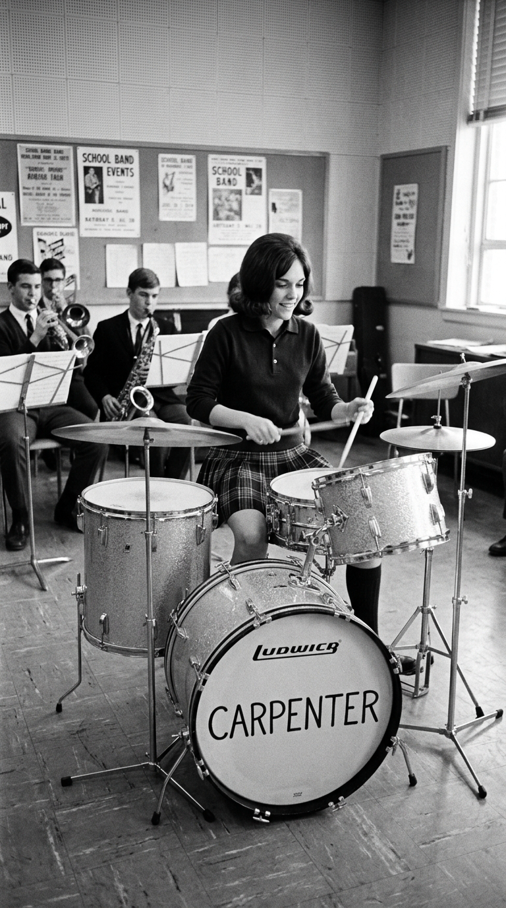
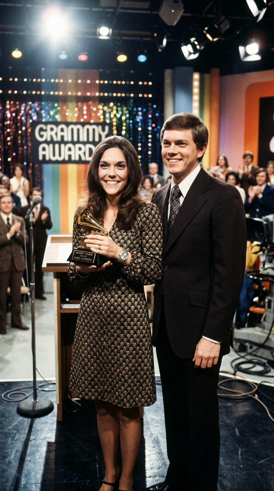
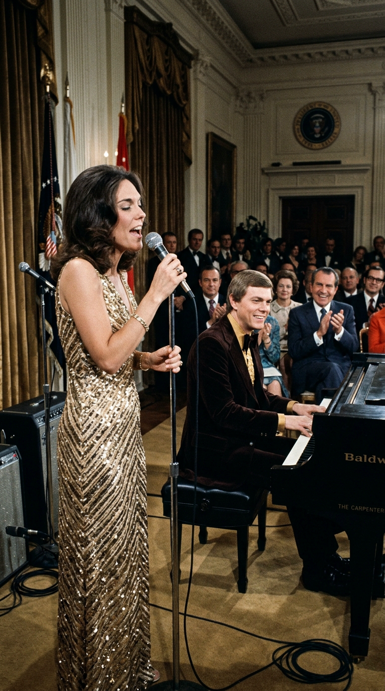
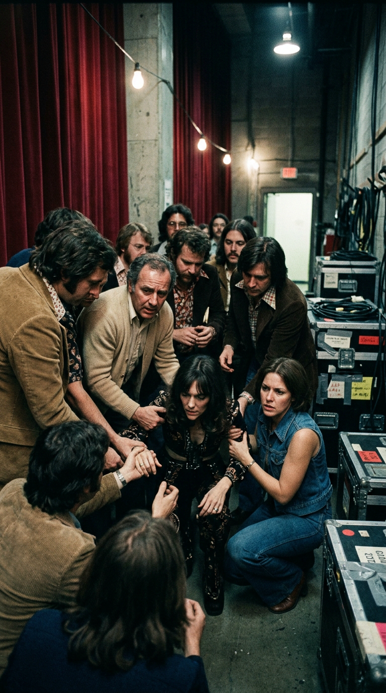
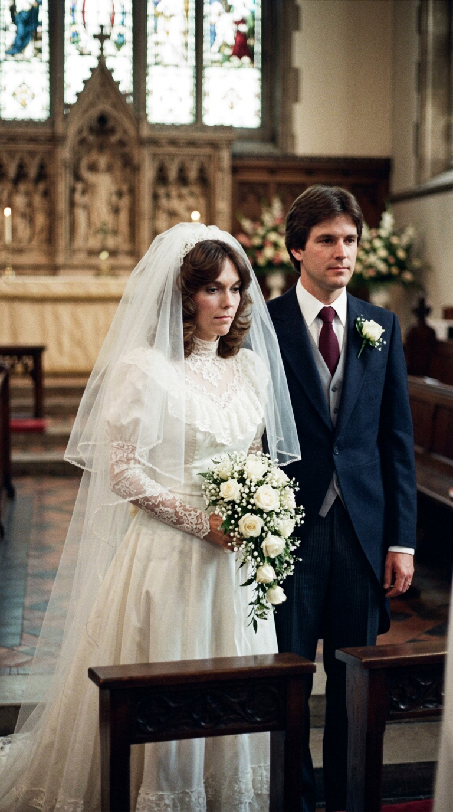

# 🕊️ La Voz más Dulce, la Lucha más Amarga: El Vuelo Quebrado de Karen Carpenter
### *Detrás del terciopelo vocal que conmovió a una era y del prodigio rítmico que asombró a los bateristas del mundo, se libraba una desgarradora batalla en las sombras: la vida y despedida prematura de una leyenda eterna.*

---

**Por la redacción de Acordes Ocultos**  
*Tiempo de lectura estimado: 10 minutos*

---

### Prólogo: El terciopelo y la herida invisible

En la historia de la música popular del siglo XX, pocas voces han poseído una capacidad de consuelo tan instantánea, cristalina y humana como la de **Karen Carpenter**. No necesitaba pirotecnias vocales desmedidas, gorgoritos operísticos ni aspavientos de diva; su grandeza residía en una sencillez milagrosa. Cuando Karen se situaba a dos centímetros de la rejilla de un micrófono y dejaba escapar las primeras notas de su registro de contralto, el oyente no escuchaba a una estrella lejana desde la tarima de un estadio: sentía que una amiga íntima se había sentado al borde de su cama en mitad de la noche para susurrarle al oído que el dolor del mundo tenía solución.

*Principios de los años 70: Karen Carpenter en la plenitud de su encanto, iluminando los escenarios con una sonrisa radiante y su calidez inconfundible.*

Sin embargo, detrás de aquella fachada de armonía celestial, sonrisas televisivas y ventas astronómicas de discos que decoraron los hogares de millones de familias, se libraba una de las tragedias más punzantes y silenciosas que jamás haya presenciado la industria del espectáculo. Karen era un alma generosa y vulnerable atrapada en una jaula de perfeccionismo familiar, juicios estéticos implacables y soledad afectiva.

Mientras el mundo la aclamaba como el símbolo de la pureza juvenil de los Estados Unidos, su cuerpo se consumía lentamente en una batalla despiadada contra un enemigo que en aquel entonces ni siquiera tenía nombre en las conversaciones cotidianas: la anorexia nerviosa. Esta es la crónica verídica, rigurosa y conmovedora de una mujer que solo quería ser amada por quien era, y cuya partida prematura derribó para siempre el tabú sobre los trastornos del alma.

---

### Acto I: El compás escondido en Downey y la baterista que cantaba

Nacida en New Haven, Connecticut, el 2 de marzo de 1950, Karen creció a la sombra de su talentoso hermano mayor, **Richard Carpenter**. Desde la infancia temprana, la dinámica familiar giró en torno al prodigio pianístico de Richard: un virtuoso de la armonía clásica a quien su madre, Agnes Carpenter, consideraba el elegido para la gloria musical. En busca de un ambiente más propicio para la carrera artística de Richard, la familia se mudó en 1963 a la soleada y suburbana ciudad de **Downey**, en el condado de Los Ángeles.

Fue allí, en los pasillos de la **Downey High School**, donde se produjo el descubrimiento que cambiaría el destino de Karen. Para eludir las obligatorias y extenuantes clases matutinas de gimnasia, la joven de catorce años solicitó ingresar en la banda de marcha escolar como percusionista tocando la glockenspiel. Sin embargo, su mirada siempre se desviaba con fascinación hipnótica hacia la batería del aula de música.

*1964: En la sala de música de Downey High School, la joven Karen descubre su pasión intuitiva y descomunal dominio de la batería.*

Un día, tras insistirle al director de la banda, Karen se sentó frente a una batería Ludwig. Lo que ocurrió a continuación dejó boquiabiertos a profesores y compañeros: sin haber recibido una sola lección formal en su vida, Karen tomó las baquetas con agarre tradicional de jazz (*traditional grip*) y comenzó a ejecutar polirritmias complejas, cambios de métrica en compases de 5/4 y redobles de caja con una naturalidad y una precisión cronométrica asombrosas.

> —*«La gente solía pensar que mi hermano era el único genio de la familia»*, recordaría Karen en una entrevista televisiva a mediados de los setenta. *«Pero cuando agarré esas baquetas supe exactamente quién era yo. Yo no me consideraba una cantante. Me consideraba, con orgullo absoluto, una baterista que cantaba»*.

Grandes maestros del instrumento como Buddy Rich y Hal Blaine quedarían anonadados años después ante la técnica depurada de Karen, elogiando su solvencia con el pedal de bombo y su sincronía perfecta. Junto a Richard al piano y a su amigo Wes Jacobs al contrabajo, formaron el Richard Carpenter Trio, ganando el prestigioso concurso *Battle of the Bands* en el Hollywood Bowl en 1966.

No obstante, cada vez que Karen se colocaba detrás del micrófono para cantar mientras marcaba el pulso con sus tambores, una atmósfera mágica se apoderaba de la sala. Su voz no era la de una adolescente cualquiera; poseía una tesitura baja, rica en matices graves, con un centro tímbrico tan denso y aterciopelado que parecía haber vivido cien vidas. En 1969, aquella cinta maqueta llegó a los escritorios del mítico sello **A&M Records**. Su cofundador, el célebre trompetista **Herb Alpert**, reconoció de inmediato el diamante que tenía en las manos y les firmó un contrato discográfico sin dudarlo.

---

### Acto II: El toque de Bacharach y la rendición del planeta

El álbum debut del dúo, *Offering* (luego retitulado *Ticket to Ride*), apenas tuvo repercusión comercial, pero Herb Alpert mantuvo su fe inquebrantable en ellos. A comienzos de 1970, el afamado compositor **Burt Bacharach** se cruzó con Alpert en los pasillos de A&M y le comentó que tenía una vieja melodía compuesta en 1963 junto al letrista **Hal David** que nunca había encontrado su versión definitiva: *(They Long to Be) Close to You*.

Bacharach se la había entregado originalmente a Richard Chamberlain y luego a Dionne Warwick, pero las grabaciones habían pasado desapercibidas como simples piezas orquestales menores. Alpert le ofreció la partitura a Richard Carpenter, advirtiéndole que no se sintiera obligado a copiar los arreglos previos:
—*«Tómala, Richard. Desmóntala por completo, haz con ella lo que quieras y enséñame cómo suena con la voz de tu hermana»*.

Richard se encerró en el piano de la casa de Downey y concibió una de las obras cumbres del pop orquestal de todos los tiempos. Diseñó una introducción de piano cadenciosa y flotante, eliminó la grandilocuencia melodramática y estructuró capas de armonías vocales multicapa donde Karen y él grabaron docenas de pistas sobrepuestas para crear un coro celestial.

Cuando entraron al Estudio A de A&M Records, Karen se sentó tras su batería Ludwig para grabar la base rítmica junto a los legendarios músicos de sesión de *The Wrecking Crew*. Luego, se aproximó al micrófono para registrar la toma vocal principal. Burt Bacharach, presente en el estudio, quedó conmovido hasta las lágrimas: la vulnerabilidad que Karen imprimió al verso inicial (*«Why do birds suddenly appear / Every time you are near?...»*) transformaba una simple canción de amor en una súplica de devoción casi mística.

*1970: Karen y Richard Carpenter alzan sus dos primeros premios Grammy tras coronar las listas planetarias con Close to You.*

El impacto social fue arrollador. Publicada en mayo de 1970, *(They Long to Be) Close to You* escaló de forma fulgurante hasta el **puesto número uno del Billboard Hot 100** el 25 de julio de 1970, adueñándose de la cima durante cuatro semanas consecutivas. Fue el himno que consagró a **The Carpenters** como el mayor fenómeno comercial del momento, vendiendo millones de copias físicas y cosechando dos premios Grammy: *Mejor Artista Nuevo* y *Mejor Interpretación Vocal por un Dúo o Grupo*.

Sucesivos números uno como *«We've Only Just Begun»*, *«Rainy Days and Mondays»*, *«Superstar»* y *«Top of the World»* convirtieron a los hermanos en la realeza incontestable del pop internacional. Entre 1970 y 1975, no existía un rincón de Occidente o de Japón donde la voz de Karen no resonara a diario.

---

### Acto III: La sonrisa en la Casa Blanca y la cárcel de la mirada ajena

En mayo de 1973, en el pináculo de su popularidad, el presidente de los Estados Unidos, **Richard Nixon**, invitó a los hermanos Carpenter a ofrecer un recital de gala exclusivo en la Casa Blanca en honor al canciller de la República Federal de Alemania, Willy Brandt. Tras la actuación en el Salón Este, Nixon tomó el micrófono ante las cámaras de televisión y proclamó solemnemente que The Carpenters representaban *«la cara más pura, sana y ejemplar de la juventud norteamericana»*.

*Mayo de 1973: Karen y Richard Carpenter recibidos por el presidente Richard Nixon en la Casa Blanca como embajadores de la juventud inmaculada.*

Aquella etiqueta de «hijos perfectos de América» se convirtió, paradójicamente, en una celda de castigo para Karen. Detrás de escena, la maquinaria corporativa y los promotores comenzaron a ejercer una presión implacable para que Karen abandonara definitivamente la batería durante los conciertos:
—*«¡No puedes quedarte escondida detrás de los platillos y los tambores! La gente paga para ver a la chica hermosa que canta al frente, no para verla sudar tocando la caja»*.

Para Karen, ser despojada de su instrumento significó perder su armadura protectora. Sentirse expuesta en el centro del proscenio, bajo los focos y ante las miradas escrutadoras de decenas de miles de personas, disparó una profunda inseguridad sobre su cuerpo. Un día, al leer una reseña periodística que describía su figura como «rellenita» (*chubby*), algo se quebró en su interior.

Karen comenzó a someterse a dietas extremas, desterrando los carbohidratos y reduciendo su ingesta a una porción microscópica de ensalada y té helado al día. Lo que comenzó como un régimen disciplinado derivó en una implacable **anorexia nerviosa**, un trastorno psicológico prácticamente desconocido para la medicina popular de los años setenta, caracterizado por una dismorfia corporal severa y una necesidad desesperada de control en un entorno donde su familia y sus managers decidían cada minuto de su agenda.

*1975: La extrema fragilidad física de Karen obliga a cancelar giras internacionales y provoca su ingreso de urgencia en el hospital.*

En septiembre de 1975, el cuerpo de Karen no pudo resistir más. Pesando apenas **cuarenta kilos** y presentando un cuadro severo de deshidratación y agotamiento cardíaco, colapsó en la casa de sus padres en Downey, forzando la cancelación fulminante de una extensa gira de conciertos por el Reino Unido y Europa. Su hospitalización fue disfrazada ante la prensa como «fatiga física», pero en la intimidad de su círculo cercano la alarma era total: la voz más luminosa del planeta se estaba apagando por inanición.

---

### Acto IV: La aventura solista en Manhattan y la traición del matrimonio

Hacia 1979, mientras su hermano Richard se internaba en una clínica de rehabilitación en Topeka, Kansas, para superar una severa dependencia a los sedantes metacualona (*Quaaludes*), Karen sintió por primera vez la imperiosa necesidad de emanciparse artísticamente y buscar su propia identidad lejos de la sombra protectora y asfixiante de su familia.

Viajó a Nueva York y se puso en manos del célebre productor **Phil Ramone** para grabar su primer álbum solista. Durante aquellas sesiones en los estudios A&R de Manhattan, rodeada por virtuosos del calibre de Billy Joel, Steve Gadd y los músicos de sesión de Paul Simon, Karen floreció. Se atrevió a cantar canciones de corte disco y funk, exploró registros vocales más altos y sensuales, y disfrutó de una libertad vital que jamás había experimentado en California.

> —*«Vi a una mujer redescubriendo su valor»*, escribiría Phil Ramone en sus memorias *Making Records*. *«Karen tenía un sentido del humor brillante, una vitalidad desbordante cuando se sentía respetada como artista autónoma. Ese disco era su declaración de independencia»*.

Sin embargo, cuando Karen presentó el álbum terminado a comienzos de 1980 ante los ejecutivos de A&M Records, su madre Agnes y su hermano Richard, la respuesta fue despiadada. Calificaron el material de «inadecuado, obsceno para la imagen de The Carpenters y vocalmente débil». El disco fue vetado y archivado en las bóvedas de la compañía (no vería la luz oficialmente hasta 1996, trece años después de su muerte). Aquel rechazo familiar fue un golpe mortal a su autoestima.

Buscando desesperadamente el calor y la estabilidad afectiva que la música no lograba brindarle, Karen conoció pocos meses después al promotor inmobiliario **Thomas James Burris**. Tras un noviazgo fugaz de apenas dos meses, contrajeron matrimonio en agosto de 1980 en el Hotel Beverly Hills. Karen soñaba con formar un hogar y tener hijos, que era el mayor anhelo de su vida privada.

*1980: Karen sumida en el desencanto y la soledad tras descubrir los engaños económicos y personales de su tormentoso matrimonio con Tom Burris.*

La desilusión no tardó en tornarse en pesadilla. Burris no solo le ocultó antes de la boda que se había sometido a una vasectomía irreversible —negándole para siempre la posibilidad de ser madre—, sino que además dilapidaba su fortuna personal en deudas y lujos ostentosos, tratándola con una crueldad psicológica constante. A finales de 1981, hundida en una tristeza insondable, Karen presentó la demanda de divorcio.

---

### Epílogo: El suspiro final y el despertar de una conciencia mundial

A comienzos de 1982, consciente de que su vida pendía de un hilo, Karen decidió buscar ayuda profesional en Nueva York con el reputado psicoterapeuta **Steven Levenkron**, especialista en trastornos de la conducta alimentaria. Se sometió a un tratamiento intensivo que incluyó varios meses de internación en el Hospital Lenox Hill, donde se le administró hiperalimentación intravenosa (alimentación parenteral directa al torrente sanguíneo).

Hacia el otoño de 1982, Karen había ganado casi quince kilos y presentaba un semblante optimista. En noviembre regresó a Downey anunciando a sus allegados que se sentía curada, preparada para retomar su carrera musical junto a Richard y dispuesta a firmar la liquidación definitiva de su divorcio.

Sin embargo, el daño invisible causado por casi una década de privación extrema, el consumo abusivo de laxantes y hormonas tiroideas para acelerar el metabolismo, y el uso crónico de jarabe de ipecacuana para inducir el vómito, habían debilitado fatalmente las paredes musculares de su corazón.

En la mañana del **4 de febrero de 1983**, mientras se preparaba en el vestidor de la casa de sus padres en Downey para firmar los documentos de divorcio con su abogado, Karen Carpenter se desplomó en el suelo de moqueta. Su madre la encontró inconsciente a las 8:50 de la mañana. Los paramédicos intentaron reanimarla durante el traslado al Downey Community Hospital, pero a las 9:51 horas se certificó formalmente su fallecimiento debido a un colapso cardíaco fulminante causado por las secuelas físicas de la anorexia nerviosa. Tenía apenas treinta y dos años.

*Un memorial íntimo rodeado de rosas blancas y cirios encendidos, custodiando la memoria de la voz que transformó la tristeza en arte universal.*

La muerte de Karen Carpenter sacudió los cimientos de la sociedad occidental como un mazazo de realidad. Hasta aquel 4 de febrero de 1983, la anorexia y la bulimia eran condiciones tabú, estigmas silenciados en la vergüenza familiar. La partida de la cantante forzó a la comunidad médica, a los medios de comunicación y a millones de familias en todo el planeta a abrir los ojos, impulsando investigaciones científicas, fundaciones de apoyo psicológico y centros de tratamiento que han salvado la vida de incontables personas desde entonces.

Karen Carpenter nos dejó demasiado pronto, pero su canto permanece inmune al paso del tiempo. Cada vez que su voz cálida y perfecta resuena en un altavoz entonando *(They Long to Be) Close to You*, no escuchamos una tragedia consumada; escuchamos el vuelo ingrávido de un alma noble que, a través de sus heridas más hondas, aprendió a acariciar el corazón de la humanidad entera.

---

### 📚 Fuentes y Archivo Documental

* **Coleman, Ray**: *The Carpenters: The Untold Story* (HarperCollins, 1994). Biografía autorizada con acceso irrestricto a los archivos familiares, diarios de Richard Carpenter y testimonios del círculo íntimo en Downey.
* **Schmidt, Randy L.**: *Little Girl Blue: The Life of Karen Carpenter* (Chicago Review Press, 2010). Investigación exhaustiva y clínica sobre la evolución psicológica de la anorexia de Karen, las sesiones solistas con Phil Ramone y el matrimonio con Tom Burris.
* **Ramone, Phil & Charles L. Granata**: *Making Records: The Scenes Behind the Music* (Hyperion, 2007). Memorias del productor discográfico detallando la gestación del álbum solista de Karen en Nueva York (1979-1980) y la censura de A&M Records.
* **Levenkron, Steven**: *Treating and Overcoming Anorexia Nervosa* (Warner Books, 1982). Registro de las aproximaciones psicoterapéuticas empleadas durante el tratamiento de Karen Carpenter en Manhattan.
* **Bacharach, Burt**: *Anyone Who Had a Heart: My Life and Music* (Harper, 2013). Testimonio sobre la cesión de la partitura de *(They Long to Be) Close to You* a Herb Alpert y su reacción al escuchar la toma vocal de Karen en el Estudio A.
* **Oficina Forense del Condado de Los Ángeles**: Informe de autopsia oficial y certificado de defunción N.º 1983-01824 (febrero 1983), acreditando insuficiencia cardíaca por toxicidad metabólica derivada de anorexia nerviosa.
* **Billboard Magazine Archive**: Registros históricos de popularidad del Billboard Hot 100 (julio - agosto 1970; cuatro semanas en el N.º 1).
