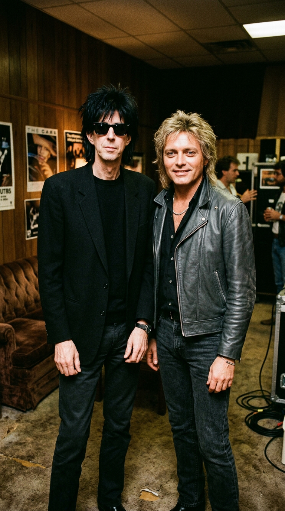
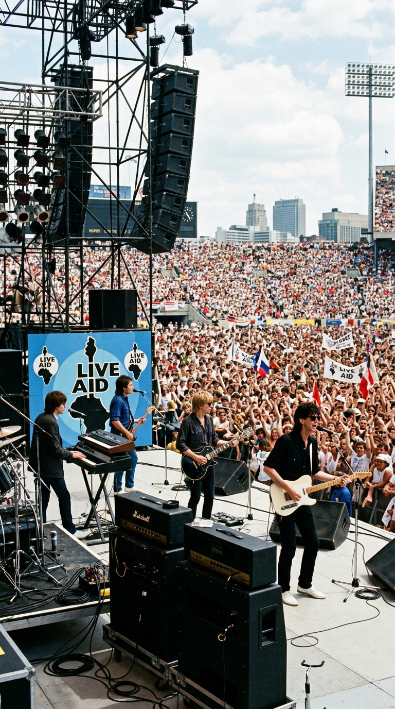
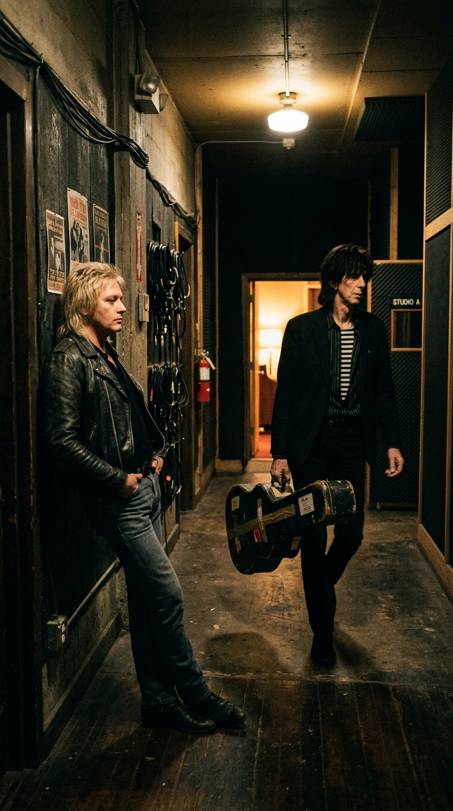
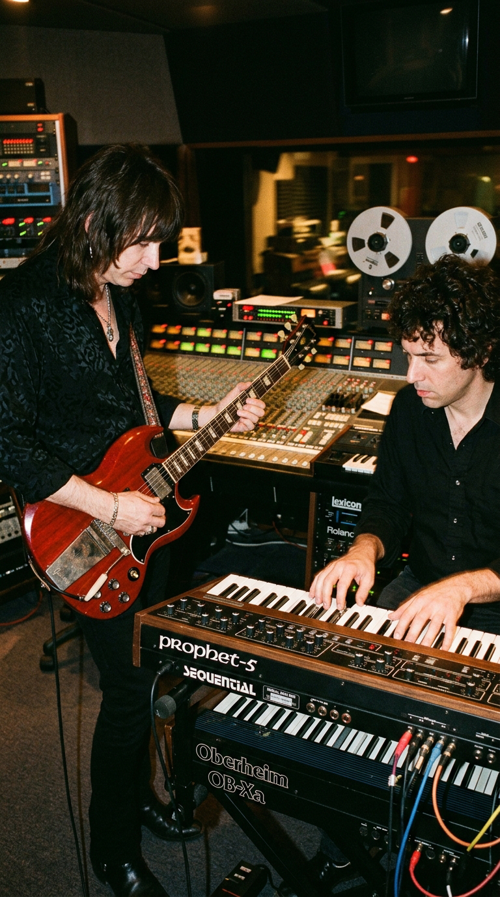
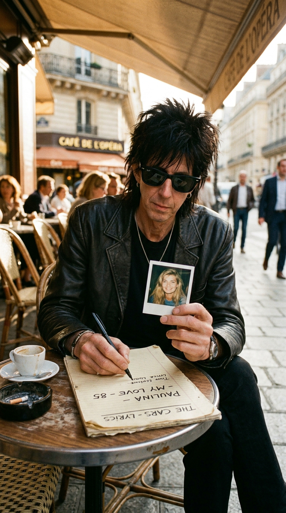
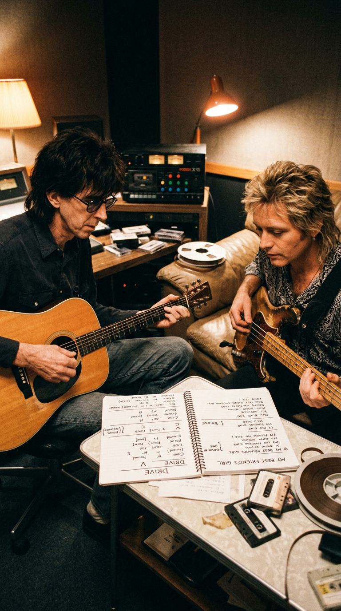
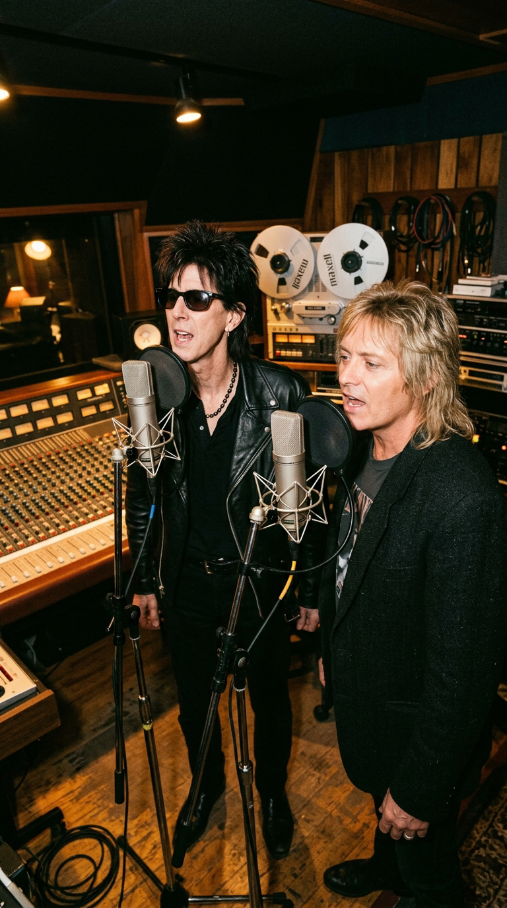
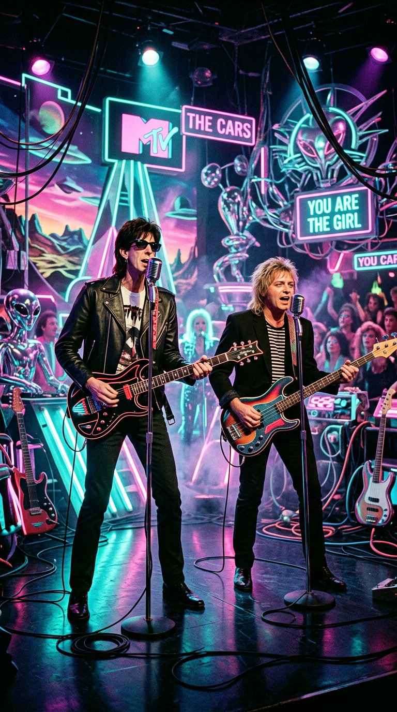
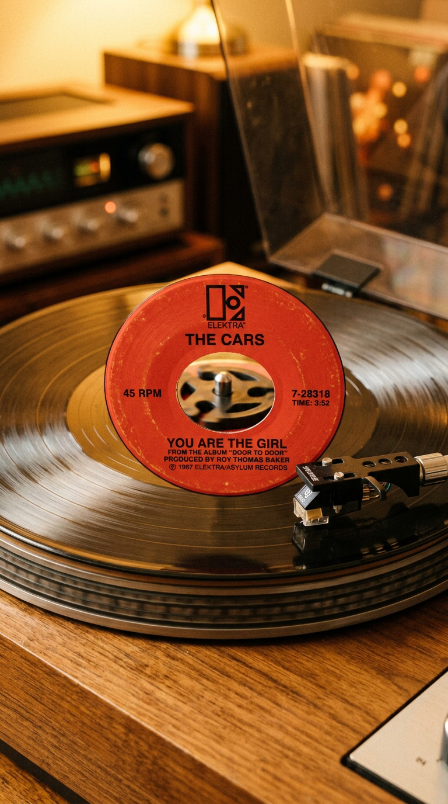

# El Último Pacto de The Cars: Cómo Ric Ocasek y Benjamin Orr Salvaron "You Are the Girl"

> *"Éramos como el agua y el aceite, pero cuando nuestras voces se juntaban ante el micrófono, ocurría algo que ninguno de los dos podía lograr por separado. 'You Are the Girl' fue nuestro último intento de abrazarnos antes de que todo se viniera abajo."*  
> — **Ric Ocasek**, entrevista para *Musician Magazine*, octubre de 1987.

---

## Prólogo: La Paradoja de los Dos Rostros

Pocas bandas en la historia de la música moderna definieron con tanta precisión el sonido, la estética y el pulso vanguardista de la transición entre los años setenta y ochenta como The Cars. Surgidos de los clubes universitarios de Boston en 1976, el quinteto liderado por Ric Ocasek y Benjamin Orr logró una alquimia sonora irrepetible: combinaron la crudeza del punk, la elegancia maquinal de los sintetizadores New Wave, los riffs afilados del hard rock y la pegada melódica del mejor pop de radiofórmula.

*1987: Ric Ocasek y Benjamin Orr. Dos titanes del New Wave frente a frente en la última encrucijada de su hermandad artística.*

Pero el verdadero secreto de The Cars residía en una dualidad fascinante que ninguna otra banda de su generación poseía. Tenían dos líderes carismáticos y complementarios que parecían representar dos polos opuestos del alma humana: por un lado, **Ric Ocasek**, un gigante flaco de casi dos metros, con gafas negras permanentes, pelo azabache cardado y una sensibilidad intelectual, sarcástica y vanguardista; por el otro, **Benjamin Orr** (nacido Benjamin Orzechowski), el bajista de ojos claros y cabello rubio platino, poseedor de una de las voces más seductoras, cálidas y conmovedoras del rock estadounidense.

Orr había cantado los mayores himnos románticos del grupo —incluyendo el eterno *"Drive"* y el inmortal *"Just What I Needed"*—, mientras Ocasek escribía las letras y componía la arquitectura de los temas. Sin embargo, para 1987, aquella fórmula mágica estaba a punto de hacerse pedazos. En medio del abismo de una separación inminente, ambos músicos sellaron un pacto secreto de tregua en los estudios Electric Lady de Manhattan para concebir su último gran éxito juntos: *"You Are the Girl"*.

---

## Acto I: La Cima de Live Aid y la Grieta Silenciosa

Para entender el distanciamiento que casi destruye la canción antes de nacer, es preciso retroceder al verano de 1985. The Cars venía de encadenar el triunfo más colosal de su trayectoria con el álbum *Heartbeat City* (1984), producido por Mutt Lange, que despachó más de cuatro millones de copias y colocó cinco sencillos en el Top 40.

El 13 de julio de 1985, The Cars subió al escenario del John F. Kennedy Stadium de Filadelfia ante noventa mil espectadores en el mítico concierto benéfico **Live Aid**. Cuando Benjamin Orr se colocó frente al micrófono y entonó las primeras notas de *"Drive"*, mientras las pantallas gigantes de todo el planeta retransmitían el video de la hambruna en Etiopía, el mundo entero se estremeció. Aquella actuación elevó la figura de Orr al estatus de ícono vocal internacional.

*Live Aid, Filadelfia, 1985: la actuación que consagró a Benjamin Orr en todo el planeta desató tensiones internas en el seno de la banda.*

El éxito arrollador, paradójicamente, abrió una grieta profunda en los cimientos del grupo. A lo largo de una década ininterrumpida de giras mundiales y grabaciones extenuantes, el agotamiento físico y los celos profesionales comenzaron a hacer mella. Ocasek, que ejercía un control riguroso sobre las composiciones y la dirección artística, sentía que los reflectores se concentraban desproporcionadamente en la imagen seductora de Orr; por su parte, Orr se sentía encasillado como un simple intérprete vocal sin suficiente espacio para sus propias inquietudes como autor.

En 1986, la banda decidió tomarse un descanso temporal. Lejos de calmar las aguas, la pausa aceleró el distanciamiento: Benjamin Orr publicó su primer álbum en solitario, *The Lace*, cosechando un gran éxito en las listas con la balada *"Stay the Night"*; apenas unas semanas después, Ric Ocasek lanzó su segundo disco solista, *This Side of Paradise*, alcanzando los primeros puestos con *"Emotion in Motion"*. 

Cuando los miembros de The Cars volvieron a encontrarse a finales de 1986 para planificar su siguiente trabajo de estudio, la frialdad entre Ric y Ben era glacial. En los pasillos de los estudios de ensayo, los dos amigos que se conocían desde la adolescencia en Ohio apenas se dirigían la palabra.

*El invierno de 1986: tras los éxitos en solitario de ambos, la comunicación entre Ocasek y Orr se redujo al mínimo en un clima de tensión profesional.*

---

## Acto II: El Café de Manhattan y la Tregua en Electric Lady

En los primeros meses de 1987, la discográfica Elektra Records convocó a la banda para grabar el que sería su sexto álbum de estudio, *Door to Door*. La atmósfera en los legendarios **Electric Lady Studios** de Greenwich Village, en Nueva York, estaba cargada de un pesimismo aplastante. El guitarrista Elliot Easton, el tecladista Greg Hawkes y el baterista David Robinson comprendían que aquella sería, con toda probabilidad, la última vez que entrarían juntos a un estudio.

Consciente de que el barco se hundía pero negándose a firmar una despedida mediocre, Ric Ocasek decidió dar el primer paso. Citó a Benjamin Orr a solas en una cafetería cercana a Washington Square Park.

*Manhattan, primavera de 1987: Ocasek busca una tregua con Orr para salvar la última gran obra de la banda.*

*"Ben, sé que esto se está terminando"*, le dijo Ocasek con franqueza descarnada detrás de sus eternas gafas oscuras. *"Todos sabemos que la banda no sobrevivirá a este año. Pero le debemos a nuestro público, y nos debemos a nosotros mismos después de quince años juntos, un último éxito que nos enorgullezca. Tengo una canción pop luminosa, pero solo funcionará si la cantamos juntos. Tú y yo, como en los viejos tiempos en Boston"*.

Orr miró a su viejo compañero, guardó silencio durante un largo minuto y finalmente asintió con una leve sonrisa. Habían sellado un pacto entre caballeros: aparcarían las disputas de ego, las llamadas de abogados y los resentimientos personales hasta que la última pista quedara grabada en la cinta matriz.

---

## Acto III: Dos Voces, una Sola Canción

La canción que Ric tenía entre manos era *"You Are the Girl"*. A diferencia de las atmósferas oscuras y misteriosas de canciones como *"Moving in Stereo"* o *"Dangerous Type"*, este tema era una inyección de energía pop fresca, sincopada y descaradamente pegadiza, construida sobre una progresión ascendente que bebía directamente del espíritu de Buddy Holly y el rockabilly de los años cincuenta, filtrado a través de los sintetizadores New Wave de los ochenta.

*El pacto de honor en Electric Lady: ambos líderes aparcan los resentimientos para volcar su talento en 'You Are the Girl'.*

La genialidad de la canción radicaba en la alternancia milimétrica de sus dos voces principales, explotando al máximo el contraste entre ambas personalidades:
- **Las estrofas**: Interpretadas por **Ric Ocasek** con su estilo característico: voz cortante, ligeramente robótica, rítmica y juguetona:
  > *"When she rocks, she walks like she's a mystery / She got a certain something that belongs to me..."*
- **El estribillo**: Donde la canción explota en una cascada de brillo melódico, liderado por la calidez aterciopelada y el registro heroico de **Benjamin Orr**:
  > *"You are the girl, the only one I ever wanted / You are the girl, you got the touch of something haunted..."*

En la cabina de grabación, Ric y Ben decidieron pararse frente a frente, compartiendo el espacio de los micrófonos de condensador Neumann. Cuando sus voces se fundieron en el coro final repitiendo al unísono *"You are the girl!"*, la química química de The Cars resucitó por unos minutos con la misma potencia deslumbrante de su disco debut de 1978.

*La magia del directo en el estudio: frente al mismo micrófono, las voces de Ocasek y Orr volvieron a fundirse en una armonía perfecta.*

---

## Acto IV: La Producción New Wave y el Réquiem de MTV

La orquestación de la canción fue meticulosamente pulida por el tecladista **Greg Hawkes**, quien programó un colchón de sintetizadores secuenciados utilizando el legendario **Sequential Circuits Prophet-5** y el sintetizador digital Roland D-50, combinados con un bajo eléctrico pulsante y una línea de guitarra cristalina a cargo de **Elliot Easton**, cuyo solo intermedio destacó por su precisión melódica y sentido del gusto.

*Los virtuosos de la sombra: Greg Hawkes y Elliot Easton aportan la sofisticación tímbrica que definió el sonido clásico de The Cars.*

Lanzada en agosto de 1987 como el sencillo principal del álbum *Door to Door*, *"You Are the Girl"* se convirtió en un éxito inmediato en la radio y en la cadena televisiva MTV. La canción escaló con rapidez hasta el **puesto número diecisiete del Billboard Hot 100**, transformándose en el decimotercer y **último sencillo de The Cars en ingresar al Top 20 estadounidense**.

El videoclip, dirigido por Andy Morahan, reflejaba la estética surrealista y futurista de finales de los ochenta: la banda tocaba en un bizarro salón cósmico habitado por extraterrestres y mutantes pop. En la pantalla, Ocasek y Orr aparecían compartiendo plano, intercambiando sonrisas cómplices y miradas de afecto genuino. Los espectadores de MTV asistieron a una fiesta visual sin saber que estaban presenciando, en realidad, el baile de despedida de dos gigantes.

*El videoclip de MTV en 1987: una estética futurista para inmortalizar la última imagen pública de Ocasek y Orr hombro con hombro.*

---

## Acto V: La Separación y la Promesa de la Eternidad

En febrero de 1988, apenas seis meses después del lanzamiento de *"You Are the Girl"* y tras una breve gira donde la tensión interna se hizo insostenible, The Cars emitió un comunicado oficial anunciando su disolución definitiva. Cada miembro tomó su propio camino.

Durante más de una década, los fanáticos mantuvieron viva la esperanza de una reunión de la formación original. Pero el destino no daría una segunda oportunidad. En la primavera del año 2000, a Benjamin Orr se le diagnosticó un agresivo y avanzado cáncer de páncreas.

Al enterarse de la noticia, Ric Ocasek tomó el primer avión para reencontrarse con su viejo hermano de Ohio. En una habitación de Atlanta, lejos de abogados y de la prensa, los dos hombres se abrazaron largamente, lloraron juntos y dejaron atrás cualquier residuo de rencor del pasado. 

*"Ben estaba muy enfermo, pero su dignidad era intacta"*, recordaría Ocasek con lágrimas en los ojos años más tarde. *"Hablamos durante horas sobre cuando no teníamos dinero para comer en Boston y compartíamos un sándwich de jamón entre los dos. Nos pedimos perdón por las tonterías del éxito. Me fui sabiendo que el amor que nos teníamos como hermanos era más grande que cualquier disco de oro"*.

Benjamin Orr falleció el 3 de octubre del año 2000, a los cincuenta y tres años de edad. En abril de 2018, cuando The Cars fue finalmente inducida en el **Rock and Roll Hall of Fame** en Cleveland, un emocionado Ric Ocasek subió al atril y dedicó el galardón a la memoria de su eterno compañero. Al año siguiente, en septiembre de 2019, el propio Ocasek fallecería pacíficamente en su residencia de Manhattan.

*El vinilo de Elektra Records de 1987: el testamento sonoro de un pacto de honor que salvó la belleza por encima del rencor.*

---

## Epílogo: El Valor de la Última Canción

*"You Are the Girl"* permanece hoy en la memoria de los amantes del pop de los ochenta como una joya radiante y luminosa. Pero para quien conoce los entresijos humanos que precedieron a su grabación, la canción representa algo infinitamente más valioso: la prueba de que dos almas con diferencias irreconciliables pueden encontrar un terreno sagrado en el arte para dejar a un lado el orgullo, cantar juntos una última melodía y despedirse con el corazón en paz.

Cada vez que el sintetizador de Greg Hawkes arranca el ritmo y las voces de Ric Ocasek y Benjamin Orr se alternan en los altavoces, The Cars vuelve a ser invencible: dos amigos de juventud que desafiaron al tiempo y demostraron que la música verdadera tiene el poder de trascender las sombras y brillar para siempre.

---

### 📚 Fuentes y Archivo Documental

1. **Ocasek, Ric & Orr, Benjamin** (1987). *"The Cars: The Door to Door Interview"*, conducida por Bill Flanagan. *Musician Magazine*, número 108 (octubre de 1987).
2. **Milliken, Joe** (2018). *Let's Go! Benjamin Orr and The Cars*. Rowman & Littlefield, Lanham, MD. Biografía documentada con entrevistas exclusivas a los miembros de la banda.
3. **Billboard Magazine** (1987). *Hot 100 Singles Chart: "You Are the Girl" peak position #17*. Billboard Publications, Nueva York.
4. **Easton, Elliot & Hawkes, Greg** (2018). *Oral History of The Cars: Inductees of the Rock and Roll Hall of Fame*. Rock Hall Archives, Cleveland, Ohio.
5. **Rolling Stone Magazine** (1987–2000). *Hemeroteca histórica: Reseña de Door to Door (1987) y Necrológica oficial de Benjamin Orr (octubre de 2000)*.
6. **Elektra / Asylum Records** (1987). *Master Recording Sheets and Tape Logs: "You Are the Girl" at Electric Lady Studios*. Warner Music Group Archives.
