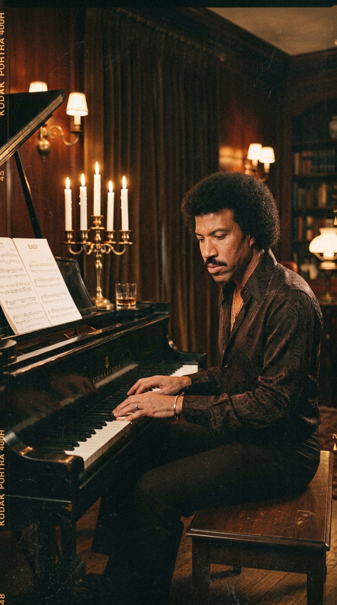
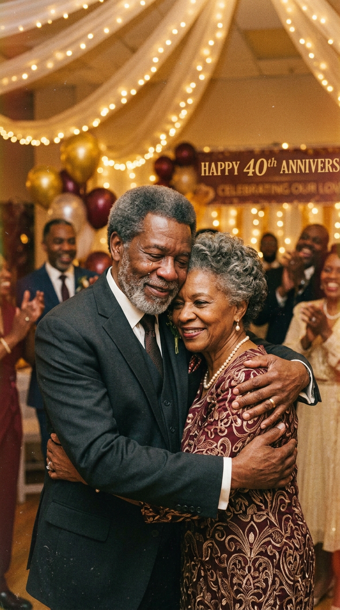
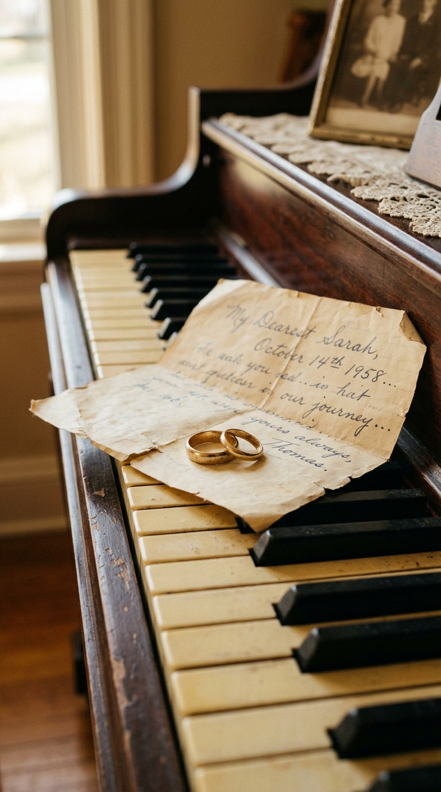
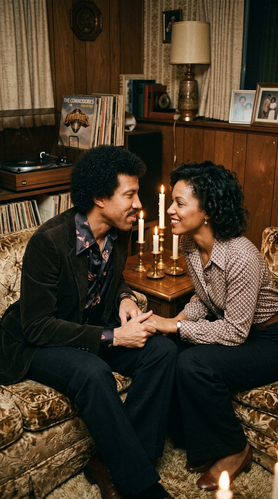
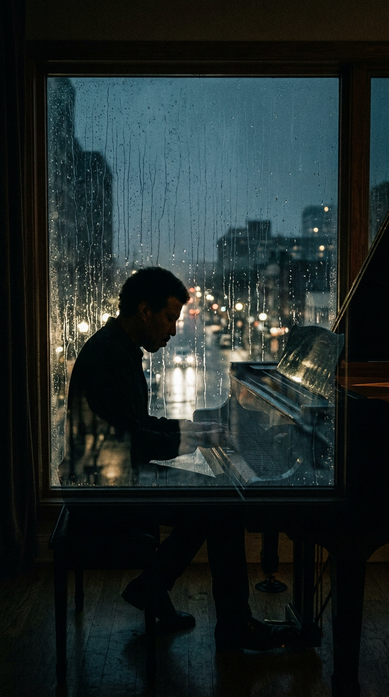
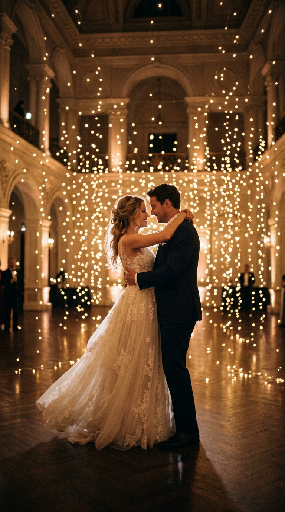
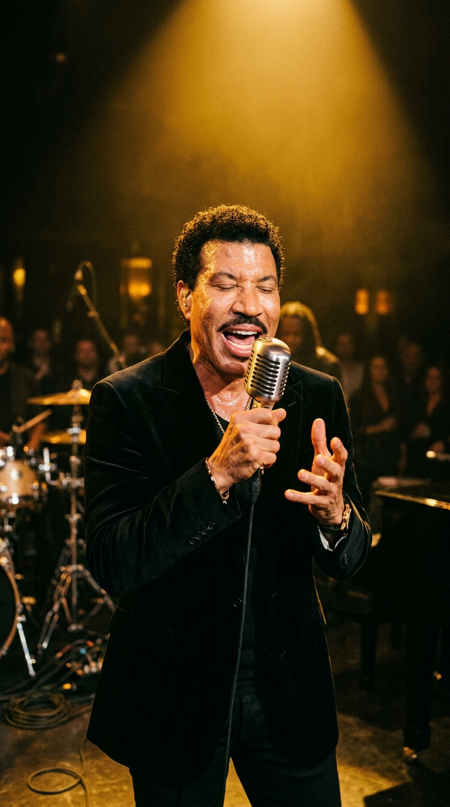

# Tres Veces una Dama: El Brindis de Tuskegee que Convirtió el Funk en un Vals Eterno

> *"Estaba en la fiesta del trigésimo quinto aniversario de bodas de mis padres en Tuskegee. Mi padre se levantó con su copa en la mano, miró a mi madre a los ojos y dijo: 'Alberta, te amé como una hermosa joven, te amé como una esposa maravillosa y te amo hoy como la madre ejemplar de nuestros hijos. Para mí, eres tres veces una dama'. Aquellas palabras me atravesaron el pecho como un rayo. Pensé en mi propia esposa Brenda y me di cuenta de que jamás le había dicho algo tan noble, tan puro y tan verdadero. Salí de esa fiesta, me senté al piano y las notas brotaron con lágrimas en mis ojos."*  
> — **Lionel Richie**, entrevista testimonial para el archivo de la *Songwriters Hall of Fame*, 2016.

---

## Prólogo: El Milagro en Compás de Tres por Cuatro

A mediados de 1978, las pistas de baile del planeta vibraban al compás implacable de la música disco y los ritmos sincopados del funk más sudoroso. En aquel ecosistema de bajos electrizantes, sintetizadores futuristas y baterías demoledoras, The Commodores reinaban como una de las maquinarias de ritmo más respetadas y feroces de la música negra estadounidense. Con himnos implacables como *"Machine Gun"*, *"Slippery When Wet"* y el colosal éxito de 1977 *"Brick House"*, el sexteto de Alabama había demostrado ser capaz de incendiar cualquier estadio con un groove de metales afilados y actitud callejera.

Sin embargo, en el interior de aquel titán del ritmo habitaba una sensibilidad distinta, una añoranza melódica que no pertenecía al frenesí de las discotecas, sino a la intimidad silenciosa de las casas de madera del sur estadounidense. En el corazón de esa búsqueda lírica se encontraba Lionel Richie Jr., un joven saxofonista y pianista de veintiocho años cuyo instinto compositivo lo empujaba hacia una vulnerabilidad que pocos hombres del soul de su tiempo se atrevían a exponer.

*1978: Lionel Richie ante el piano de cola. Lejos del ruido de los estadios, el músico buscaba una pureza lírica que conectara directamente con el corazón humano.*

Cuando *"Three Times a Lady"* vio la luz como sencillo del álbum *Natural High*, no solo desconcertó a los puristas del funk: rompió todas las reglas no escritas de la industria discográfica de la época. No era una balada soul convencional en compás de 4/4; era un vals clásico, aristocrático y conmovedor en compás de 3/4, guiado por un piano acústico de una sobriedad desgarradora y adornado con cuerdas que evocaban las orquestas de salón del siglo XIX. 

Aquella canción no surgió de un laboratorio de mercadotecnia ni de la ambición de conquistar las listas comerciales. Nació en una modesta reunión familiar en Alabama, como la respuesta de un hijo conmovido ante el amor inquebrantable de sus padres tras treinta y cinco años de adversidades compartidas.

---

## Acto I: Las Raíces de Tuskegee y el Brindis de un Padre

Para entender el alma de *"Three Times a Lady"*, es necesario viajar a las colinas arcillosas de Tuskegee, Alabama. Lionel Richie no creció en un gueto urbano ni en los suburbios de una metrópoli industrial; su infancia transcurrió en el campus histórico del **Tuskegee Institute** (hoy Tuskegee University), la prestigiosa universidad históricamente negra fundada por Booker T. Washington. 

La familia Richie habitaba una hermosa casa de madera que había sido un obsequio directo de Washington a los abuelos de Lionel. En aquel enclave de excelencia académica, dignidad civil y orgullo comunitario, Lionel creció rodeado por la música sacra de las iglesias baptistas, las bandas de marcha universitarias y la disciplina inquebrantable de su hogar.

Su padre, **Lionel Richie Sr.**, era un analista de sistemas y veterano del ejército estadounidense; un hombre de porte sobrio, modales caballerosos y un sentido estricto del honor. Su madre, **Alberta Foster Richie**, era una distinguida educadora y directora de escuela cuya dulzura y firmeza sostenían la armonía familiar. Durante décadas, ambos habían navegado juntos las tempestades del sur segregacionista, educando a sus hijos con una mezcla inquebrantable de fe, cultura y devoción mutua.

*Tuskegee, Alabama: Lionel Richie Sr. y Alberta Foster celebran treinta y cinco años de matrimonio. El brindis paternal transformaría para siempre la historia de la música popular.*

A finales de 1977, la familia se congregó en Tuskegee para festejar el trigésimo quinto aniversario de matrimonio de Lionel Sr. y Alberta. Entre risas, platos caseros y anécdotas de juventud compartidas por parientes y vecinos de toda la vida, el padre de Lionel pidió silencio y se puso de pie con una copa en la mano. Miró fijamente a Alberta, cuyos ojos reflejaban el peso y la ternura de media vida juntos, y pronunció un brindis que paralizó la sala:

*"Te quise cuando eras una muchacha hermosa llena de sueños; te amé como la esposa incondicional que caminó a mi lado en los tiempos más difíciles; y te amo con toda mi alma hoy como la madre de nuestros hijos. Para mí, Alberta, siempre has sido y siempre serás tres veces una dama"*.

En el fondo del salón, Lionel Jr. sintió que la respiración se le detenía. Aquellas palabras condensaban en una sola frase el misterio de la lealtad, la evolución del amor conyugal a través de las décadas y la gratitud profunda hacia la mujer que había sido el ancla de un hogar. 

---

## Acto II: El Espejo Conyugal y la Deuda con Brenda

El brindis de su padre no solo emocionó a Lionel; provocó en su interior una crisis de conciencia inmediata y punzante. Desde 1975, Lionel estaba casado con **Brenda Harvey**, su novia de la época universitaria en Tuskegee. Brenda había sido su gran soporte en los años de penuria, cuando The Commodores no eran más que un puñado de estudiantes universitarios apretujados en una furgoneta desvencijada, tocando por comida y gasolina en pequeños locales del sur.

*Las alianzas sobre el marfil: el símbolo tangible de un compromiso que Lionel Richie sintió la urgencia moral de plasmar en una melodía perdurable.*

Sin embargo, el vertiginoso ascenso a la fama mundial a partir de 1974 había cobrado un costo humano altísimo. Las giras interminables por Europa y Estados Unidos, los meses recluidos en los estudios de grabación de Los Ángeles y la histeria constante de la industria musical habían distanciado físicamente a la pareja. Lionel se vio reflejado en el espejo de su padre y sintió una punzante sensación de insuficiencia.

*"Miré a mi padre y luego pensé en Brenda"*, recordaría Lionel años más tarde en una entrevista televisiva. *"Mi padre le estaba agradeciendo a mi madre treinta y cinco años de lealtad, paciencia y entrega. Y yo me pregunté: '¿Qué le he dicho yo a Brenda?'. Llevábamos unos pocos años casados, pero la mitad de ese tiempo me la había pasado de gira en otra ciudad, durmiendo en hoteles y absorto en mi propia carrera. Me di cuenta de que nunca le había expresado una gratitud semejante. Sentí la necesidad desesperada de darle las gracias, de decirle que veía cada uno de sus sacrificios"*.

*1978: Lionel Richie y Brenda Harvey en la intimidad de su hogar. La canción nació como un desagravio y un agradecimiento íntimo por los sacrificios del matrimonio.*

Aquella noche, mientras la fiesta de aniversario languidecía y los invitados se despedían, la mente de Lionel hervía de emociones encontradas. La gratitud hacia su madre y el amor hacia su esposa se entrelazaron en un único torrente lírico. No podía esperar a regresar a California para escribir; la melodía exigía nacer en aquel mismo instante.

---

## Acto III: La Soledad Nocturna y el Vals Improbable

Al concluir la celebración, Lionel se retiró a la soledad de la casa familiar. En la penumbra de la sala, iluminada únicamente por el resplandor de las velas que se consumían y el reflejo de la lluvia golpeando suavemente los cristales, se sentó al piano. Sus manos, acostumbradas a los acordes sincopados y enérgicos de los sintetizadores y del clavinet, buscaron instintivamente una cadencia diferente.

*La noche de la creación: en la soledad del piano, Richie encontró una progresión armónica en 3/4 que evocaba la elegancia atemporal de los grandes bailes de salón.*

Comenzó a pulsar un compás ternario: un bajo profundo en el primer tiempo, seguido por dos acordes suaves en los tiempos débiles. *Un, dos, tres. Un, dos, tres.* Era el pulso milenario del vals. 

En la música popular de 1978, componer en 3/4 se consideraba un suicidio comercial para un artista negro. Las emisoras de radio R&B estaban programadas para ritmos bailables en 4/4 o baladas lentas de soul sureño. Pero Lionel no estaba pensando en las listas de popularidad; estaba escuchando en su mente la voz de su padre y la visión de una pareja madura bailando en el centro de un salón iluminado por la memoria.

Las primeras líneas de la letra brotaron sin esfuerzo, casi como una transcripción literal de su corazón:

> *"Thanks for the times that you've given me / The memories are all in my mind / And now that we've come to the end of our rainbow / There's something I must say out loud..."*  
> *(Gracias por los momentos que me has dado / Los recuerdos están todos en mi mente / Y ahora que hemos llegado al final de nuestro arcoíris / Hay algo que debo decir en voz alta...)*

El estribillo recogió el homenaje exacto a las palabras paternas, elevándolas a una plegaria universal:

> *"You're once, twice, three times a lady / And I love you / Yes, you're once, twice, three times a lady / And I love you / I love you..."*

Cuando terminó de estructurar los compases básicos, Lionel sintió una paz abrumadora, pero también una profunda perplejidad. Aquella pieza no sonaba en absoluto a The Commodores. Sonaba a un estándar clásico de la música estadounidense, una canción que parecía haber existido siempre, suspendida en el aire como una vieja tonada de Tin Pan Alley o una balada otoñal de Broadway.

*El vals de la memoria: una cadencia ternaria que desafiaba todas las convenciones del soul y el funk de finales de los años setenta.*

Convencido de que la banda jamás aceptaría tocar un vals tan dulce y tradicional, Lionel guardó la partitura en su maletín con un destino secreto en mente: presentársela a un crooner consagrado de la época dorada.

---

## Acto IV: La Batalla en Hitsville West: Sinatra vs. The Commodores

A comienzos de 1978, The Commodores se reunieron en los legendarios **Motown Recording Studios** (conocidos popularmente como *Hitsville West*), ubicados en el 7317 de Romaine Street, en el corazón de Los Ángeles. El grupo debía registrar el material para su séptimo álbum de estudio, *Natural High*, bajo la supervisión de su mentor y productor de cabecera: **James Anthony Carmichael**.

Carmichael no era un productor ordinario. Formado en música clásica, arreglista magistral y poseedor de un oído infalible para el timbre y la textura armónica, era el verdadero arquitecto sonoro detrás del éxito de la banda. Tenía la costumbre de sentarse con cada miembro del grupo a solas frente al piano para escuchar los demos y fragmentos que traían en sus libretas.

Cuando llegó el turno de Lionel, este comenzó mostrando varios temas enérgicos de tempo medio. Casi al final de la sesión, mientras recogía sus papeles, deslizó con timidez la maqueta de *"Three Times a Lady"*.

—Tengo esta otra canción —dijo Lionel con modestia—. Pero sé que no es para The Commodores. Es demasiado clásica, un vals puro. Estaba pensando en contactar a los editores de **Frank Sinatra** o tal vez a **Tony Bennett** para ofrecérsela. Creo que Sinatra podría hacer de esto una obra maestra.

Carmichael lo miró con el ceño fruncido y le ordenó que se sentara nuevamente al piano y la tocara de principio a fin. Lionel obedeció. Con las manos desnudas sobre el teclado acústico y su voz cantando en un tono suave y confidente, interpretó la pieza.

Al terminar el último acorde, el estudio quedó en un silencio sepulcral. Carmichael se quitó las gafas, miró a Lionel fijamente y exclamó con una contundencia implacable:

—¿Te has vuelto completamente loco, Lionel? ¡Tú no le vas a dar esta canción a Frank Sinatra! ¡Esta canción es para The Commodores y la vas a cantar tú mismo en este álbum!

La reacción de los demás integrantes del grupo —**Thomas McClary** (guitarra), **Milan Williams** (teclados), **William King** (trompeta), **Ronald LaPread** (bajo) y **Walter Orange** (batería)— estuvo cargada de escepticismo inicial. Tras haber conquistado las listas con el sonido crudo y bailable de *"Brick House"*, temían que publicar un vals orquestal destrozara su credibilidad en el circuito de música negra y entre sus seguidores de música funk.

Pero Carmichael fue tajante. Comprendió que la música no debía quedar encasillada en divisiones raciales ni en formatos rígidos de radio. *"Una gran canción no tiene color ni género"*, les insistió. *"Esta melodía posee una universalidad que va a atravesar el planeta entero"*.

---

## Acto V: La Grabación en Romaine Street: La Elegancia de la Sobriedad

La sesión de grabación de *"Three Times a Lady"* en Hitsville West fue una lección magistral de contención artística. En una época dominada por las capas densas de sintetizadores analógicos, Carmichael y The Commodores decidieron despojar la pista de cualquier artificio innecesario.

El cimiento instrumental fue grabado con una formación acústica elemental:
1. **Piano de Cola**: Interpretado por el propio Lionel Richie, cuyo toque melancólico y espaciado dictó el tempo íntimo de la canción.
2. **Batería con Escobillas**: Walter Orange abandonó la fuerza contundente de sus baquetas habituales para acariciar los parches de la caja y los platillos con escobillas metálicas, creando una textura suave y sedosa que emulaba las grabaciones de jazz vocal de los años cincuenta.
3. **Bajo Melódico**: Ronald LaPread aportó notas redondas, cálidas y sumamente espaciadas en su bajo Fender Precision, sosteniendo la armonía sin competir jamás con la línea vocal.
4. **Guitarras Acústicas**: Thomas McClary grabó sutiles arpegios de guitarra acústica que aportaban brillo al registro medio.

*La consagración vocal: Lionel Richie frente al micrófono, canalizando la emoción pura de su voz sin efectismos técnicos.*

Sobre esa base austera, James Anthony Carmichael escribió un arreglo de cuerdas magistral. En lugar de saturar la pista con un muro orquestal invasivo, diseñó líneas de violines y violonchelos que entraban y salían como olas suaves en la orilla del mar, amplificando el dramatismo del estribillo sin asfixiar la voz solista.

La toma vocal de Lionel Richie fue registrada en pocas tomas. Su interpretación no buscó los alardes vocales ni los gritos desgarrados característicos del soul clásico; cantó con la cercanía de quien está murmurando una confidencia al oído de la persona amada a escasos centímetros de distancia, manteniendo una serenidad madura que otorgaba a cada palabra un peso documental indiscutible.

---

## Acto VI: El Triunfo Global y el Veredicto de Motown

Cuando la cinta masterizada llegó al escritorio de **Berry Gordy Jr.**, el mítico fundador y presidente de Motown Records, el veredicto fue fulminante. Gordy, quien había descubierto a The Miracles, The Supremes, Marvin Gaye y The Jackson 5, reconoció de inmediato el calibre de lo que tenía en sus manos:

*"Lionel, esto no es solo un éxito más para la compañía"*, le aseguró Gordy con entusiasmo paternal. *"Esto es un clásico instantáneo. Esta canción va a sonar en las bodas, en los aniversarios y en los momentos más trascendentales de la vida de millones de personas dentro de cincuenta años"*.

Lanzado en junio de 1978 como el primer sencillo del álbum *Natural High*, *"Three Times a Lady"* desató un fenómeno sociológico sin precedentes en la historia de The Commodores:

* **El Crossover Absoluto**: El sencillo escaló vertiginosamente tanto en las listas de música negra como en las de pop general, alcanzando el **número 1 en el Billboard Hot 100** el 12 de agosto de 1978, posición que retuvo durante dos semanas consecutivas. Fue el **primer número 1 de la historia del grupo** en la lista principal de sencillos de Estados Unidos.
* **Conquista del Reino Unido**: En las islas británicas, la canción se convirtió en un himno nacional incontestable, alcanzando el **número 1 en la Official Singles Chart** durante cinco semanas consecutivas en agosto y septiembre de 1978, siendo el único número uno británico en toda la trayectoria de The Commodores.
* **Reconocimiento Crítico y Premios**: El tema recibió dos nominaciones de alto perfil en la vigésima primera edición de los **Premios Grammy** (1979): *Canción del Año* (reconociendo la labor de Lionel Richie como compositor) y *Mejor Interpretación Pop por un Dúo o Grupo con Voces*.

La canción derribó todas las barreras raciales y de formato radiofónico de la época. En estaciones de música country, de pop adulto contemporáneo, de soul urbano y de pop comercial, *"Three Times a Lady"* sonaba a todas horas. El grupo que había saltado a la fama como telonero de The Jackson 5 con atuendos psicodélicos y funk galáctico se convertía ahora en el referente máximo de la balada romántica transgeneracional.

---

## Epílogo: El Abrazo Final en Tuskegee

A pesar del éxito colosal, las giras mundiales en estadios abarrotados y las ventas millonarias de discos de platino, para Lionel Richie el verdadero significado de la canción se definió una tarde tranquila de 1978 en el porche de la casa familiar de Tuskegee.

Al regresar a casa tras la vorágine de la gira promocional, Lionel encontró a sus padres sentados en el porche, escuchando el disco de vinilo que giraba suavemente en la sala contigua. Su madre, Alberta, lo abrazó con lágrimas en los ojos sin necesidad de pronunciar una sola palabra. Pero fue su padre, Lionel Sr., quien se acercó, le puso una mano firme sobre el hombro y, con una sonrisa serena cargada de orgullo y complicidad, le dijo:

*"Hijo, utilizaste muy bien mis palabras. Pero más importante aún: lograste que el mundo entero entienda cómo debe honrarse a la mujer que amas"*.

*"Three Times a Lady"* no fue simplemente el primer gran número 1 de The Commodores ni el trampolín que catapultó la carrera legendaria de Lionel Richie como el compositor de baladas más exitoso de la década de 1980 (que más tarde daría frutos como *"Easy"*, *"Sail On"*, *"Still"* y su dueto inmortal *"Endless Love"* con Diana Ross). Fue, por encima de todo, un monumento a la gratitud humana, un puente de ternura tendido entre dos generaciones de una misma familia y la demostración imperecedera de que la verdadera grandeza musical no reside en el estruendo de la moda, sino en la capacidad de traducir el susurro más íntimo del corazón en un refugio eterno para el alma de los demás.

---

### 📚 Fuentes y Archivo Documental

* **Richie, Lionel**: Entrevistas biográficas y testimonios orales conservados en el archivo oficial del *Songwriters Hall of Fame* (Inducción Clase 1994, Ceremonia de Premiación y Masterclass 2016).
* **Betts, Graham**: *Motown Encyclopedia*, AC Publishing, 2014 (Capítulo detallado: *The Commodores: Hitsville West Sessions, Personnel and Chart Performance 1974–1982*).
* **Gordy, Berry**: *To Be Loved: The Music, the Magic, the Memories of Motown*, Warner Books, 1994 (Memorias sobre la transición artística de The Commodores y la producción de *Natural High*).
* **Carmichael, James Anthony**: Entrevistas de archivo para *Mix Magazine* y *Sound on Sound* sobre las sesiones de grabación en Motown Recording Studios (Romaine Street, Hollywood, 1978).
* **Billboard Magazine**: Archivos hemerográficos de las listas *Hot 100* y *Hot Soul Singles* (semanas del 12 y 19 de agosto de 1978; análisis de ventas de sencillos bajo la etiqueta Motown M 1443F).
* **The Official UK Charts Company**: Registro histórico de sencillos número uno del Reino Unido (semanas del 19 de agosto al 16 de septiembre de 1978).
* **National Academy of Recording Arts and Sciences (NARAS)**: Archivo oficial de nominaciones y ceremonias de la 21ª Entrega Anual de los Premios Grammy (febrero de 1979).
* **Tuskegee University Archives**: Documentación histórica sobre la familia Richie y la propiedad concedida por Booker T. Washington en el campus de Tuskegee, Alabama.
