# 🦎 El Rey Lagarto y el Fuego Eterno: La Odisea Chamánica de Jim Morrison
### *De las visiones infantiles en el desierto de Nuevo México al refugio poético de París: la vida volcánica del poeta que abrió las puertas de la percepción y ardió hasta la eternidad.*

---

**Por la redacción de Acordes Ocultos**  
*Tiempo de lectura estimado: 10 minutos*

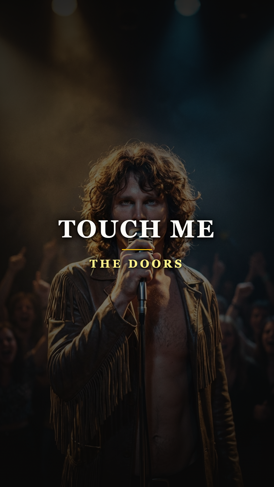

---

### Prólogo: El relámpago que no conoció la ceniza

Hay artistas que habitan la historia de la música como artesanos pacientes, esculpiendo sus obras a lo largo de décadas de cálculo y madurez. Y hay otros —figuras dionisíacas nacidas bajo el signo de la fatalidad y el fulgor— que cruzan el firmamento como meteoros incandescentes: consumen su oxígeno con una furia implacable, iluminan una era entera con su resplandor enceguecedor y desaparecen de golpe en la penumbra, dejando tras de sí un cráter imborrable en el alma de la cultura popular.

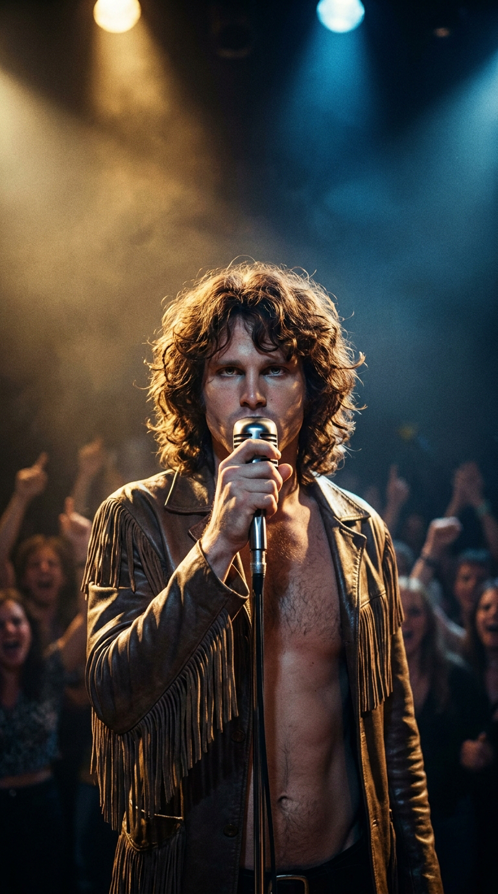
*1968: Jim Morrison con el micrófono suspendido en sus labios, en pleno trance escénico bajo los focos de Los Ángeles.*

**Jim Morrison** perteneció sin remedio a esta segunda estirpe. Dueño de una belleza estatuaria que la cámara cinematográfica devoraba con avidez y de una garganta capaz de deslizarse del susurro más íntimo de un blues de medianoche al aullido visceral de una bestia herida, Morrison jamás se consideró a sí mismo una estrella de rock al uso. Se sentía, ante todo, un poeta extraviado en la era industrial, un chamán errante empeñado en dinamitar las fronteras de la moral burguesa para despertar a una generación adormecida por la guerra y el conformismo televisivo.

Acompañado por el teclado arquitectónico de Ray Manzarek, la guitarra flamenca y sinuosa de Robby Krieger y la batería jazzera y elástica de John Densmore, Morrison lideró a **The Doors** en una travesía que redefinió los límites del rock psicodélico. Pero detrás de la iconografía del «Rey Lagarto» y los pantalones de cuero negro que la mercadotecnia inmortalizó, latía un ser humano desgarrado por sus propias visiones, perseguido por los tribunales de una nación puritana y sediento de un silencio que solo encontraría al otro lado del océano.

---

### Acto I: El espíritu del desierto y la revelación en la arena de Venice

Para comprender el misterio que gobernaba los impulsos de Jim Morrison es imprescindible remontarse a una mañana desolada de 1947. Jim apenas tenía cuatro años cuando viajaba con sus padres y sus abuelos en un automóvil por una carretera polvorienta que serpenteaba entre Albuquerque y Santa Fe, en el estado de Nuevo México.

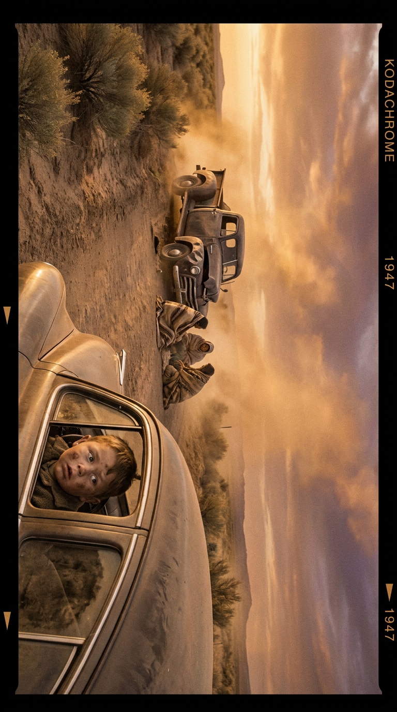
*1947: Una ruta desértica de Nuevo México al atardecer, donde la mirada del pequeño Jim presenció la tragedia que sellaría su destino.*

Al doblar una curva, el vehículo familiar se topó con un escenario devastador: un camión que transportaba trabajadores indígenas de una reserva apache y pueblo había volcado en la cuneta. Varios cuerpos ensangrentados yacían esparcidos sobre el asfalto caliente, mientras un anciano agonizaba a pocos metros de la ventanilla del coche. El padre de Jim, un oficial naval estricto, le ordenó al niño cerrar los ojos mientras buscaba auxilio, pero aquella estampa de dolor y misticismo quedó grabada a fuego en su psique infantil.

> —*«Esa fue la primera vez que probé el miedo»*, narraría Morrison años después en los versares orales registrados para *An American Prayer*. *«La reacción de mis padres fue decirme que había sido una pesadilla, que no había ocurrido. Pero yo lo vi. Sentí que las almas de aquellos indios muertos, quizás una o dos de ellas, estaban corriendo desorientadas y entraron en mi pecho. Quedaron atrapadas allí para siempre, guiando cada paso de mi vida»*.

Casi dos décadas más tarde, en el sofocante verano de 1965, aquel niño se había transformado en un joven ermitaño de veintiún años que deambulaba por las calles de Los Ángeles. Morrison acababa de graduarse en la Escuela de Cine de la UCLA, pero había roto todo contacto con su familia militar tras anunciarles que no tenía intención alguna de seguir una carrera convencional. Sin dinero en los bolsillos, sobrevivía alimentándose de judías enlatadas y tabletas de ácido lisérgico, durmiendo a la intemperie en las azoteas de destartalados edificios de Venice Beach.

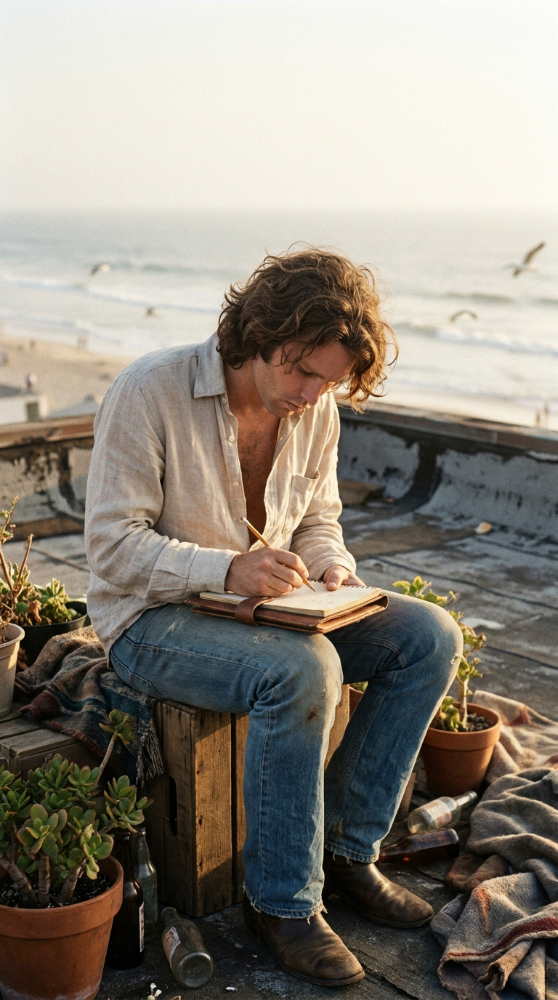
*Verano de 1965: Morrison refugiado en una azotea de Venice Beach, volcando sus primeros poemas en libretas carcomidas por la brisa marina.*

En aquellas noches de brisa marina y soledad absoluta, Jim llenaba decenas de libretas escolares con poemas, aforismos y fragmentos melódicos que escuchaba en su cabeza como una «inmensa sinfonía celestial de rock». Una tarde de julio, mientras caminaba descalzo por la arena de Venice, divisó a lo lejos a un compañero de la universidad: **Ray Manzarek**, un organista de formación clásica educado en Chicago que compartía su pasión por el blues y la literatura beatnik.

Sentados sobre una duna frente al océano, Manzarek le preguntó a Jim en qué había estado trabajando tras abandonar la facultad. Con una timidez inusitada, mirando hacia el horizonte, Morrison murmuró que había estado componiendo canciones.

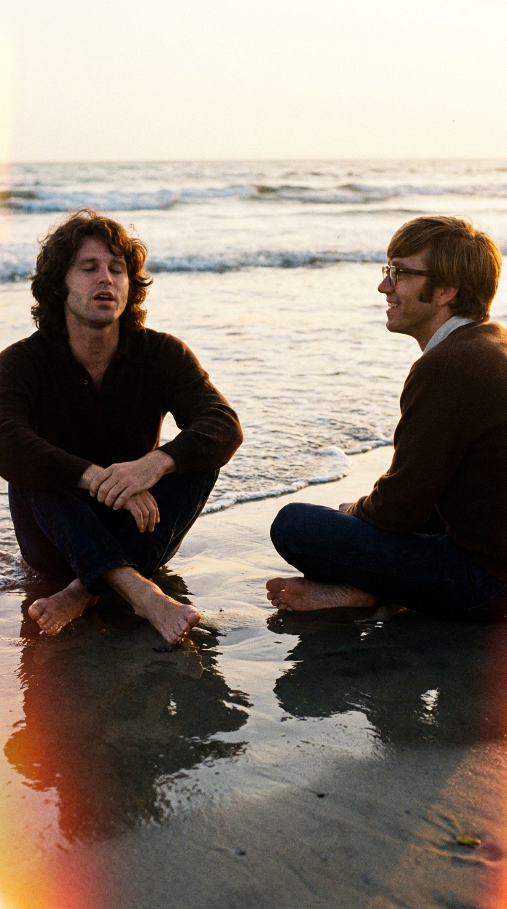
*Julio de 1965: En las dunas de Venice Beach, Morrison canta a capella 'Moonlight Drive' ante el asombro iluminado de Ray Manzarek.*

—*«Cántame una»*, le insistió Ray.

Jim cerró los ojos y, golpeando suavemente sus muslos para marcar un ritmo cadencioso, entonó a capella los versos de *«Moonlight Drive»*:

> *«Let's swim to the moon, uh-huh  
> Let's climb through the tide  
> Penetrate the evening that the city sleeps to hide...»*

Manzarek quedó petrificado. Las armonías que sugerían aquellas líneas no se parecían a nada que sonara en la radio de la época. No era el pop edulcorado del Brill Building ni el surf rock playero de los Beach Boys; era poesía pura, lírica nocturna con una sensualidad salvaje y cinematográfica.

—*«Cuando Jim cantó esas líneas, escuché la banda sonora completa en mi cabeza»*, recordaría Manzarek en su biografía *Light My Fire*. *«Eran las mejores letras de rock que había oído en mi vida. En ese mismo instante le dije: 'Hermano, vamos a armar una banda de rock and roll y ganaremos un millón de dólares'»*.

Para bautizar a la criatura, Morrison recurrió a una frase del poeta místico William Blake que Aldous Huxley había utilizado como epígrafe en su célebre ensayo sobre las drogas perceptivas: *«Si las puertas de la percepción se purificaran, todo se le aparecería al hombre tal como es: infinito»*. Habían nacido **The Doors**.

---

### Acto II: La hoguera del Whisky a Go Go y el desafío nacional a Ed Sullivan

Para completar la formación, Manzarek reclutó a dos músicos que conoció en clases de meditación trascendental: el guitarrista **Robby Krieger**, un prodigio de la guitarra acústica que mezclaba afinaciones de bottleneck blues con fraseos flamencos aprendidos en España, y el baterista **John Densmore**, un virtuoso del swing capaz de sostener compases sincopados y dinámicas orquestales sin necesidad de un bajista permanente.

A principios de 1966, The Doors consiguió la residencia como banda de planta en el mítico **Whisky a Go Go** sobre Sunset Strip. En aquel pequeño escenario abarrotado de humo, Jim Morrison comenzó su metamorfosis pública. Dominado en sus inicios por un pánico escénico tan paralizante que cantaba de espaldas al público mirando hacia los amplificadores, el vocalista aprendió a usar el trance chamánico, el alcohol y los improvisados recitales poéticos como un escudo protector. Cada actuación se convertía en un ritual dionisíaco donde los límites entre el concierto y la ceremonia mística se disolvían por completo.

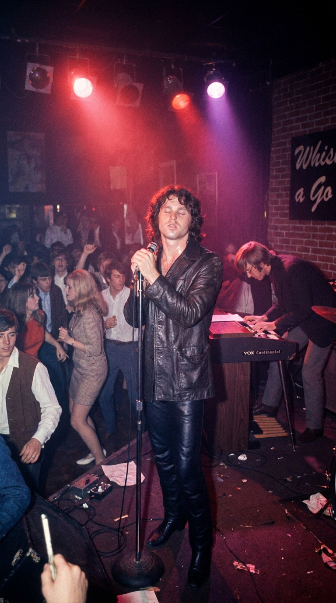
*1966: El Whisky a Go Go de Los Ángeles arde en una atmósfera psicodélica mientras Morrison desata sus monólogos poéticos en vivo.*

Aquel periplo formativo terminó abruptamente la noche en que Morrison, sumido en un potente viaje de LSD, decidió improvisar en directo una sección inédita para el tema culminante del grupo, *«The End»*. Inspirado por la tragedia sofoclea de Edipo Rey, Jim aulló ante la multitud pasmada:

> —*«Father? / Yes, son? / I want to kill you... / Mother? I want to... ¡FUCK YOU!»*.

El dueño del local, Phil Tanzini, subió enfurecido al escenario nada más terminar la canción y despidió al cuarteto en el acto. Sin embargo, el destino ya estaba sellado: entre el público de aquella noche se encontraba **Jac Holzman**, presidente del prestigioso sello independiente Elektra Records, quien quedó tan deslumbrado por la tensión teatral de la banda que les ofreció un contrato discográfico inmediato, asignándoles al productor **Paul A. Rothchild** y al ingeniero **Bruce Botnick**.

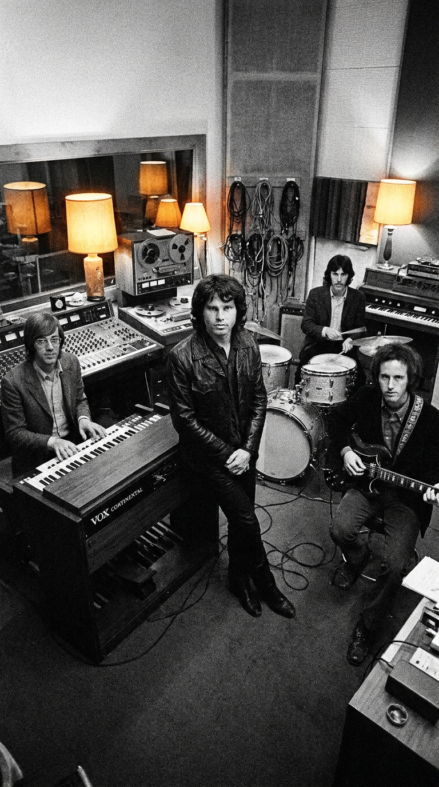
*1967: The Doors en el interior de Elektra Sound Recorders dando forma a su revolucionario sonido junto a la consola de grabación.*

En enero de 1967 vio la luz su álbum debut homónimo, pero la deflagración comercial definitiva ocurrió en abril, cuando una versión editada de *«Light My Fire»* —una composición nacida de la guitarra de Robby Krieger a la que Morrison añadió la segunda estrofa— trepó de forma imparable hasta el **número uno del Billboard Hot 100**. De la noche a la mañana, Morrison se convirtió en el rostro indiscutible de la contracultura norteamericana.

El choque frontal entre su espíritu indómito y el aparato conservador de los medios masivos tuvo lugar el 17 de septiembre de 1967, cuando The Doors fue invitado a presentarse en el programa de televisión de mayor audiencia del país: **The Ed Sullivan Show**.

Minutos antes de salir al aire ante más de cincuenta millones de televidentes, los censores de la cadena CBS y el propio productor del programa entraron en el camerino de la banda con una orden terminante: el verso *«Girl, we couldn't get much higher»* (*«Chica, no podríamos colocarnos/elevarnos mucho más»*) debía ser modificado, pues la palabra *higher* contenía una connotación directa hacia el consumo de estupefacientes. Se les exigió cantar *«Girl, we couldn't get much better»*.

La banda asintió con fingida cortesía para evitar que cancelaran su presentación. Sin embargo, en el instante en que las cámaras se encendieron y la luz roja del estudio transmitió la actuación en directo a cada hogar de la nación, Morrison se aferró al micrófono, miró fijamente al lente de la cámara principal y entonó la palabra prohibida con una nitidez desafiante y prolongada: *«GIRL, WE COULDN'T GET MUCH HIGHER»*.

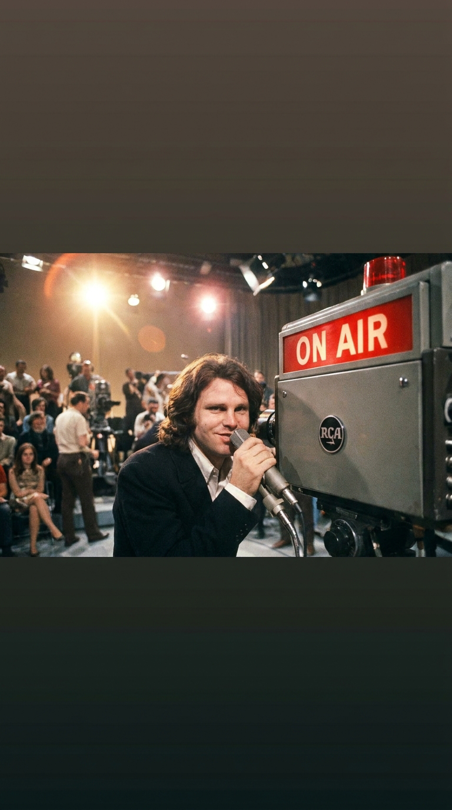
*17 de septiembre de 1967: Morrison desafía la censura en directo ante las cámaras de The Ed Sullivan Show con una mirada cargada de rebeldía.*

Al bajar del escenario, un enfurecido Sullivan se negó a estrecharles la mano. Un productor de la cadena corrió hacia el camerino gritando fuera de sí:
—*«¡El señor Sullivan está furioso! ¡Les prometió que jamás volverían a poner un pie en este show!»*.

Jim Morrison, ajustándose su cinturón con una sonrisa gélida, le contestó sin inmutarse:
> —*«Hey, man. ¿Y a quién le importa? Ya acabamos de hacer The Ed Sullivan Show»*.

---

### Acto III: El rey en el Hollywood Bowl y el giro orquestal de «Touch Me»

Durante los meses siguientes, el fenómeno de The Doors alcanzó proporciones mesiánicas. En julio de 1968, la banda ofreció su concierto más emblemático en el monumental anfiteatro del **Hollywood Bowl**, a los pies de las colinas de Hollywood. Ante dieciocho mil personas que abarrotaban las gradas bajo un cielo cuajado de estrellas, Morrison, ataviado con sus ya legendarios pantalones de cuero negro y una camisa campesina desabrochada, dominó la escena como un monarca dionisíaco: susurraba fábulas sobre reptiles prehistóricos (*«I am the Lizard King, I can do anything»*) y desataba tormentas sonoras que llevaban al público al borde del paroxismo.

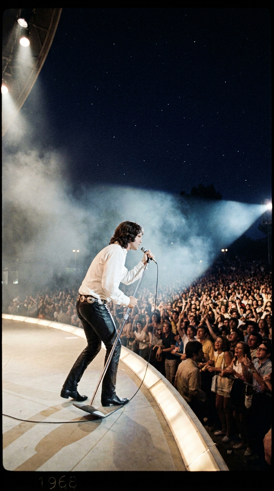
*5 de julio de 1968: El Hollywood Bowl se rinde ante la autoridad escénica del Rey Lagarto en una de las noches más laureadas del rock.*

Sin embargo, el éxito masivo comenzó a asfixiar a Morrison. Se sentía atrapado en el personaje del sex symbol adolescente que las revistas juveniles promovían, mientras su apetito por el alcohol y la autodestrucción crecía de manera alarmante. En el estudio de grabación, la banda buscaba expandir su paleta sonora para no repetirse.

Fue en el otoño de 1968, durante la gestación de su cuarto álbum de estudio, **The Soft Parade**, cuando Robby Krieger llevó al estudio una canción de amor titulada originalmente *«Hit Me»* (*«Pégame»*), inspirada en las intensas disputas conyugales que mantenía con su novia. Cuando Jim leyó la hoja con la letra manuscrita, arrugó la nariz y se negó rotundamente a cantarla en esos términos:

—*«Robby, no voy a salir ahí fuera a cantar 'Hit me'. La gente en la calle se toma las cosas al pie de la letra. No voy a pedirle a nadie que me pegue. Cámbialo por 'Touch me' ('Tócame')»*.

Bajo la dirección del productor Paul Rothchild, la canción se transformó en una ambiciosa sinfonía pop-rock de tres minutos. The Doors incorporó una majestuosa sección de vientos y cuerdas arreglada por Jesse McReynolds, enriquecida con un memorable solo de saxofón tenor interpretado por el maestro del jazz **Curtis Amy**.

Lanzada en diciembre de 1968, *«Touch Me»* se disparó inmediatamente hasta el **puesto número tres del Billboard Hot 100**, consolidándose como uno de los sencillos más radiantes y populares de la carrera del grupo. La voz de Jim —que cerraba la pieza con el críptico e improvisado guiño publicitario *«Stronger than dirt!»* en alusión a un comercial del limpiador Ajax— demostraba una calidez barítona arrebatadora. Sin embargo, mientras el tema sonaba en las emisoras de todo el planeta, el suelo bajo los pies de Morrison comenzaba a resquebrajarse.

---

### Acto IV: El calvario de Miami y el testamento desde el baño de Santa Monica

El punto de no retorno en la vida de Jim Morrison se produjo la noche del **1 de marzo de 1969** en el Dinner Key Auditorium de Miami. El recinto, un antiguo hangar de hidroaviones sin aire acondicionado ni ventilación, albergaba a casi doce mil jóvenes hacinados en un espacio habilitado para siete mil.

Morrison, quien había perdido varios vuelos en Los Ángeles consumiendo cantidades masivas de alcohol, subió al escenario en un estado de profunda intoxicación. En lugar de apegarse al repertorio musical, comenzó a increpar a la multitud con largos discursos filosóficos sobre la libertad y la cobardía colectiva:

> —*«¡Son un puñado de idiotas! ¡Dejan que todo el mundo les diga lo que tienen que hacer! ¿Cuánto tiempo creen que van a aguantar? ¿Qué van a hacer al respecto?»*.

En medio del caos, con la multitud arrojando prendas de ropa al escenario y la policía rodeando la tarima, se desató un tumulto generalizado. Días después, azuzadas por sectores ultraconservadores de Florida y la oficina del FBI, las autoridades locales emitieron una orden de arresto contra Morrison acusándolo de exhibicionismo obsceno, blasfemia pública y conducta lasciva.

El juicio, celebrado en el verano de 1970, fue una farsa moralizante donde los testimonios se contradecían abiertamente, pero la sentencia fue implacable: Morrison fue condenado a seis meses de trabajos forzados en la prisión estatal de Raiford. Aunque sus abogados apelaron la sentencia permitiéndole salir bajo fianza de cincuenta mil dólares, el daño psicológico fue devastador. Las promotoras de conciertos cancelaron giras completas y las emisoras de radio vetaron las canciones del grupo. Morrison se sentía un proscrito en su propia tierra.

Atrincherado contra la adversidad, el cuarteto decidió despojarse de todos los adornos comerciales y regresar a sus raíces más puras de blues de garaje. En diciembre de 1970, The Doors se encerró en su modesto cuartel general de dos plantas en Santa Monica Boulevard: **The Doors Workshop**.

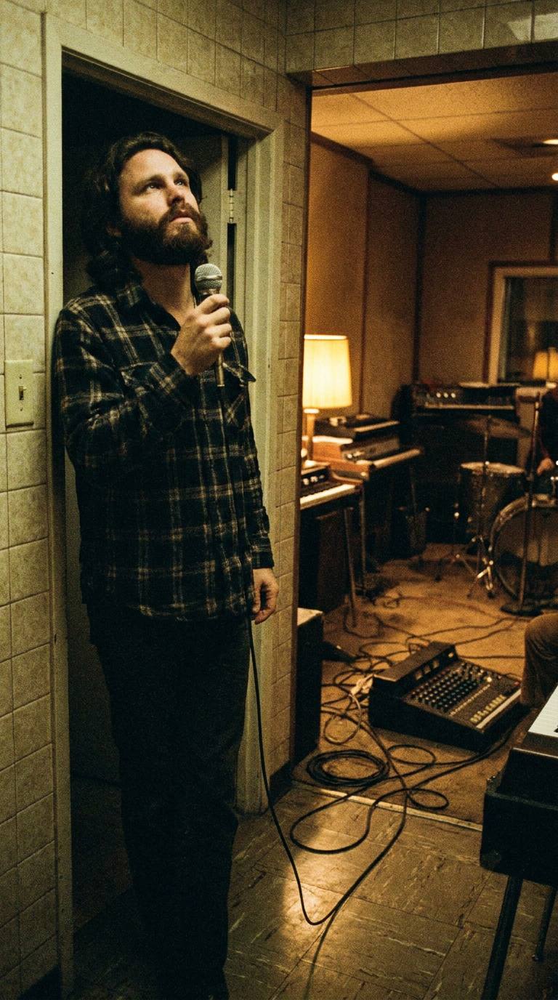
*Invierno de 1970: Jim Morrison con barba tupida canta en la intimidad del baño de The Doors Workshop durante las sesiones de L.A. Woman.*

Rechazando las consolas millonarias de los grandes estudios, instalaron una grabadora de ocho pistas en la planta superior y convirtieron el salón en sala de ensayo. Para grabar las pistas vocales de lo que sería su obra cumbre, **L.A. Woman**, Jim Morrison descubrió que la pequeña habitación del baño de la oficina, recubierta de azulejos desgastados, ofrecía una cámara de resonancia natural inigualable.

Descolgó la puerta, colocó allí un micrófono de mano Electro-Voice 676G y, sujetando una botella de bourbon con una mano y sus libretas de apuntes con la otra, vertió su alma desgarrada en las tomas definitivas de obras maestras como *«L.A. Woman»*, *«Love Her Madly»* y la sobrecogedora elegía final *«Riders on the Storm»*, donde su voz susurrada se doblaba a sí misma entre el sonido de truenos reales grabados por Bruce Botnick. Con solo veintisiete años, pero luciendo una barba espesa y el cuerpo cansado de un veterano de guerra, Morrison había entregado el mejor disco de su vida.

---

### Epílogo: El descanso del poeta en Père-Lachaise

En marzo de 1971, con las mezclas de *L.A. Woman* recién concluidas, Jim Morrison decidió poner tierra de por medio y escapar del asedio judicial norteamericano. Hizo las maletas y voló a París para reunirse con su compañera de vida, **Pamela Courson**.

Su sueño en la capital francesa era renacer: afeitarse la barba, perder peso, olvidar la maquinaria destructiva del estrellato y dedicarse por entero a la escritura poética. Durante varias semanas se le vio caminar en solitario a orillas del río Sena, pasar horas en los cafés del Barrio Latino leyendo a Rimbaud y Baudelaire, y anotar febrilmente sus impresiones parisinas en un pequeño cuaderno con tapas de cuero negro.

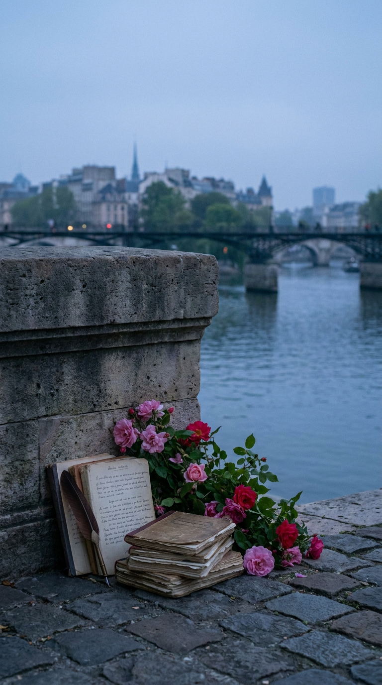
*La serenidad del río Sena en París al atardecer, donde el fuego terrenal de Morrison encontró su descanso definitivo.*

Pero el desgaste físico y los fantasmas internos cobraron su peaje final. En la madrugada del **3 de julio de 1971**, en el apartamento del número 17 de la Rue Beautreillis que compartía con Pamela, el corazón de Jim Morrison se detuvo para siempre mientras tomaba un baño caliente. Tenía exactamente veintisiete años.

Fue sepultado en una ceremonia íntima de apenas diez minutos en el legendario **cementerio de Père-Lachaise**, rodeado por las tumbas de sus héroes literarios: Oscar Wilde, Honoré de Balzac y Frédéric Chopin. Años más tarde, su familia colocó sobre la losa de granito una placa de bronce con un epitafio en griego antiguo redactado por su padre:

> **ΚΑΤΑ ΤΟΝ ΔΑΙΜΟΝΑ ΕΑΥΤΟΥ**  
> *(«Fiel a su propio espíritu» / «De acuerdo con su propio demonio interior»)*.

Jim Morrison ardió con una furia tan desmedida que su combustión no toleraba una vejez pacífica. No dejó herederos corporativos ni fórmulas prefabricadas; dejó una invitación perpetua a cruzar al otro lado de la realidad ordinaria, recordando a cada generación que mientras exista una chispa de poesía y rebeldía en la noche, el fuego del Rey Lagarto jamás se apagará.

---

### 📚 Fuentes y Archivo Documental

* **Hopkins, Jerry & Sugerman, Danny**: *No One Here Gets Out Alive* (Warner Books, 1980). La biografía canónica de Jim Morrison, testimonio indispensable sobre las sesiones de Venice Beach, el incidente de Ed Sullivan y los últimos días en París.
* **Manzarek, Ray**: *Light My Fire: My Life with The Doors* (Putnam, 1998). Memorias del tecladista fundador, detallando el encuentro en la arena de Venice en julio de 1965 y la reconstrucción armónica de *Moonlight Drive*.
* **Krieger, Robby**: *Set the Night on Fire: Living, Dying, and Playing Guitar with The Doors* (Little, Brown and Company, 2021). Crónica de primera mano sobre la composición original de *Hit Me / Touch Me* y la dinámica de grabación en Elektra Sound Recorders.
* **Densmore, John**: *Riders on the Storm: My Life with Jim Morrison and The Doors* (Delacorte Press, 1990). Análisis técnico sobre las dinámicas de ensayo, la tensión en el Whisky a Go Go y el juicio penal de Miami.
* **Botnick, Bruce & Rothchild, Paul A.**: Entrevistas históricas y notas de producción en *Mix Magazine* y *Sound on Sound* sobre las sesiones en The Doors Workshop y el uso del baño como cámara acústica para *L.A. Woman* (1971).
* **Archivo Hemerográfico de Los Angeles Times & Miami Herald**: Cobertura judicial del proceso contra Jim Morrison por los hechos del Dinner Key Auditorium (marzo 1969 - septiembre 1970).
* **Billboard Magazine Archive**: Registros históricos de popularidad de sencillos en el Hot 100 (*Light My Fire* N.º 1 en 1967; *Touch Me* N.º 3 en 1969).
