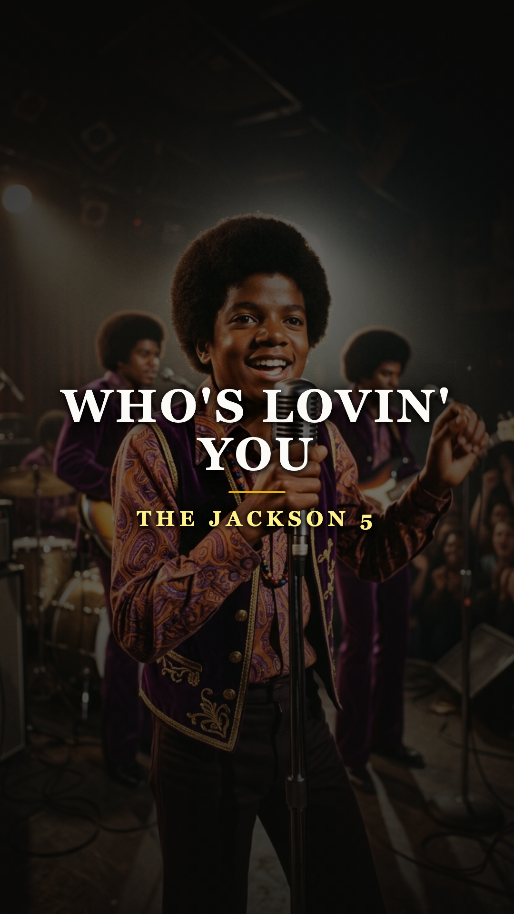
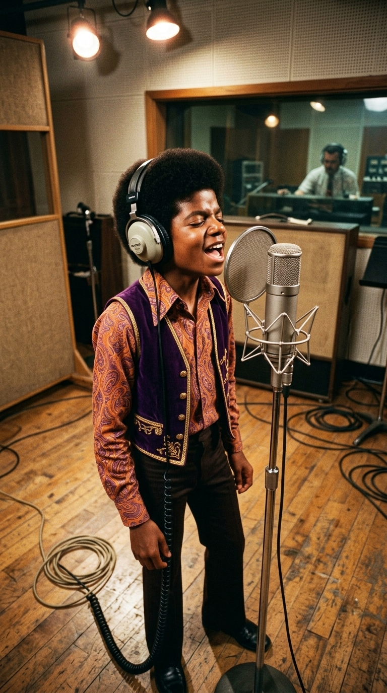
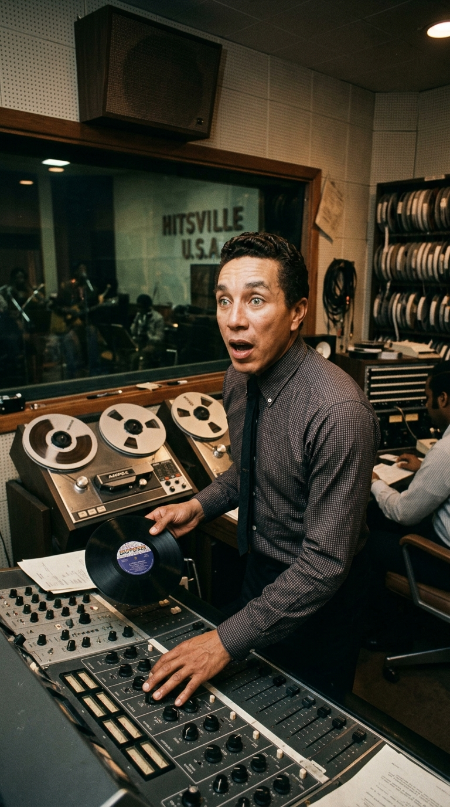
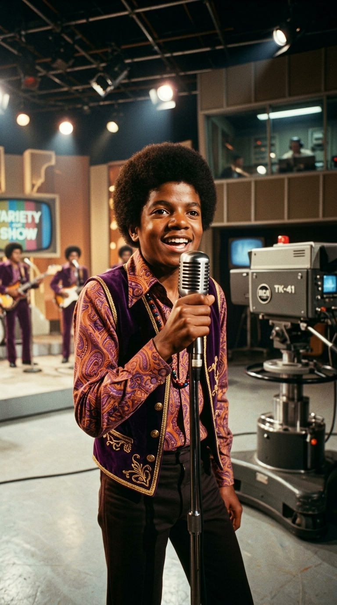
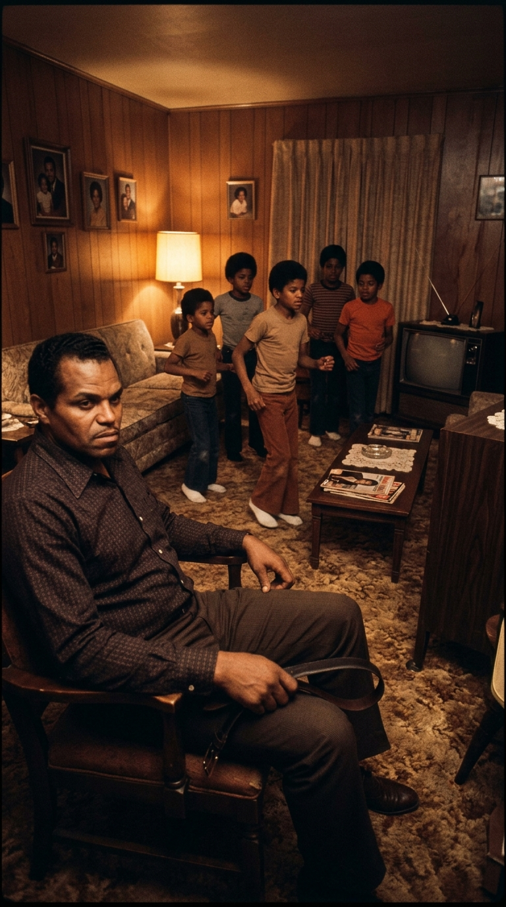
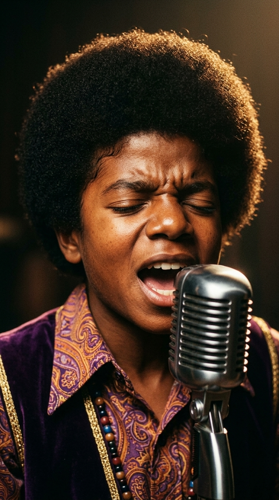
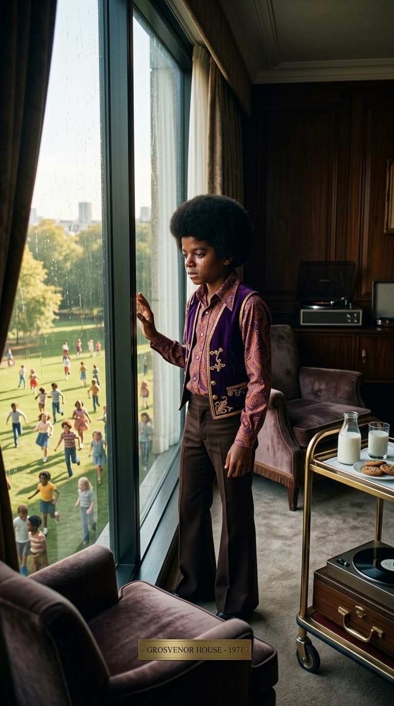
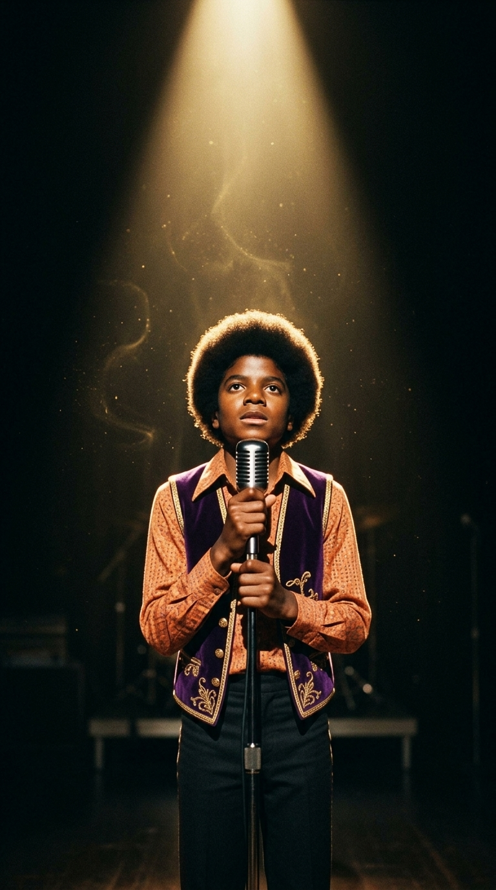

# 🎙️ El Dolor Imposible de un Niño: Michael Jackson y el Secreto Trágico de «Who's Lovin' You»
### *Cómo un niño de diez años dejó atónito a Smokey Robinson cantando el desamor con el alma de un anciano derrotado, ocultando el terror doméstico que inspiraba su voz.*

---

**Por la redacción de Acordes Ocultos**  
*Tiempo de lectura estimado: 8 minutos*

---

### Prólogo: El escalofrío en el foso de Hitsville

En el caluroso verano de 1969, en el diminuto sótano de madera del número 2648 de West Grand Boulevard en Detroit —la legendaria sede de la **Motown** conocida como *Hitsville U.S.A.*—, se produjo uno de los momentos más desconcertantes y sublimes de la historia de la música afroamericana. 

Frente a un micrófono de condensador Neumann U67, calzado con zapatos gastados y una camisa de cuadros que le quedaba ligeramente grande, se paró un niño afroamericano menudo de apenas diez años. A su alrededor, los experimentados músicos de sesión de **The Funk Brothers** —hombres curtidos en los clubes nocturnos de jazz, habituados a ver desfilar por allí a gigantes como Marvin Gaye, Stevie Wonder o The Temptations— intercambiaron miradas de indulgencia escéptica.

El ingeniero de sonido apretó el botón rojo de la grabadora de cinta de ocho pistas. No hubo cuenta atrás ni acordes de piano de apoyo. El niño tomó aire, cerró los ojos y soltó una introducción vocal a capela de una ferocidad y un desgarro tan viscerales que el vello de los brazos de los ingenieros se erizó al instante:

> *«When I had you... (oh, yeah!)  
> I treated you bad, and wrong, my dear...  
> And girl, since, since you went away, don't you know I sit around  
> With my head hanging down, and I wonder who's lovin' you...»*

Aquella voz no era la de un querubín infantil cantando canciones escolares. Era un quejido áspero, roto por un dolor milenario, cargado de melismas acrobáticos, silencios dramáticos y una sensación de culpa tan devastadora que parecía brotar de un anciano derrotado que hubiera malgastado setenta años de vida traicionando al amor de su existencia.

Aquel niño se llamaba **Michael Joseph Jackson**. Y la canción que estaba destrozando y reconstruyendo con cada suspiro era **«Who's Lovin' You»**.

*Verano de 1969, Hitsville U.S.A. (Detroit): Michael Jackson frente al micrófono de Motown, grabando la toma que paralizó a los veteranos del soul.*

---

### Acto I: «¿Quién demonios es este crío?»: La incredulidad de Smokey Robinson

La canción no era nueva. Había sido escrita y grabada nueve años antes, en 1960, por **Smokey Robinson**, el legendario vicepresidente de Motown, poeta mayor de la música negra y líder de The Miracles. Smokey la había compuesto como una balada de rhythm and blues tradicional sobre el remordimiento conyugal, inspirándose en los amores rotos de la madurez adulta.

Días después de aquella sesión en Detroit, Smokey Robinson entró en la cabina de control del estudio A para escuchar las maquetas de los nuevos fichajes procedentes del estado de Indiana. Cuando el productor puso a girar la cinta magnética con la versión de Michael, Smokey se quedó petrificado en su asiento.

*Estudio A de Motown: Smokey Robinson contempla la cinta atónito en la cabina de control tras escuchar su propia composición reinventada.*

Robinson se quitó los auriculares lentamente, miró fijamente al fundador del sello, **Berry Gordy**, y le espetó con una mezcla de indignación y asombro genuino:  
—*«Berry, deja de tomarme el pelo. ¿Quién es ese cantante y cuántos años tiene realmente? Exijo ver su certificado de nacimiento ahora mismo»*.

Gordy sonrió con suficiencia paternal:  
—*«Tiene diez años, Smokey. Cumplirá once el próximo mes»*.  
—*«Es imposible»*, replicó Smokey, sacudiendo la cabeza con incredulidad. *«Yo escribí esa canción cuando era un hombre adulto y creí que nadie podía cantarla con más dolor que yo. Pero este crío... este niño sabe cosas sobre el sufrimiento y la pérdida que ningún ser humano debería conocer a su edad. Acaba de arrebatármela para siempre»*.

Décadas después, Smokey Robinson seguiría repitiendo la misma confesión en cada entrevista: *«Michael no cantó mi canción; se la tragó entera, la digirió en su alma y la vomitó convertida en una tragedia inmortal»*.

---

### Acto II: La coartada pública de las galletas robadas

La grabación se publicó en octubre de 1969 como la cara B del primer sencillo monumental de The Jackson 5, *«I Want You Back»*. Mientras la cara A era una explosión efervescente de bubblegum soul diseñada para hacer bailar a la juventud, *«Who's Lovin' You»* se convirtió en el plato fuerte indiscutible de sus presentaciones en directo, dejando mudas a las audiencias de teatros legendarios como el Apollo de Harlem.

*Diciembre de 1969: Michael Jackson deslumbra en televisión con su sombrero lila y chaleco retro, ocultando el secreto de su desgarro.*

Cuando el grupo debutó ante millones de espectadores en el influyente programa de televisión ***The Ed Sullivan Show*** el 14 de diciembre de 1969, los presentadores y periodistas de las revistas musicales estaban obsesionados con la misma pregunta: ¿cómo era posible que un niño de primaria pudiera interpretar el dolor del desamor con semejante credibilidad dramática?

Fue entonces cuando la maquinaria publicitaria de Motown y la férrea tutela familiar tejieron una coartada infantil y simpática. En las entrevistas, Michael bajaba la mirada con una timidez encantadora, sonreía mostrando sus dientes de leche y decía con un hilo de voz:  
—*«Cuando canto esa canción, no pienso en mujeres ni en matrimonios rotos... Me imagino que estoy en el colegio y que una niña que me gustaba mucho me ha quitado el pastel de chocolate o las galletas del almuerzo, y me pongo muy triste»*.

El público y la prensa se reían conmovidos ante la supuesta inocencia del niño prodigio. Pero aquella respuesta ingeniosa era una máscara calculada. Una tapadera meticulosamente ensayada para ocultar a la opinión pública el verdadero y terrorífico pozo negro del que brotaba aquel llanto: un calvario de disciplina militar, miedo físico y violencia doméstica que se vivía a puerta cerrada a miles de kilómetros de allí.

---

### Acto III: El cinturón de cuero en el 2300 de Jackson Street

Para hallar la auténtica raíz de ese dolor no había que buscar en las aulas escolares de Detroit, sino en una diminuta casa de madera y ladrillo rojo de dos habitaciones situada en el **número 2300 de Jackson Street**, en la gris y contaminada ciudad siderúrgica de **Gary**, Indiana.

Allí vivían hacinados nueve hermanos junto a sus padres, Katherine y **Joseph «Joe» Jackson**. Joe, un operador de grúa en las fundiciones de acero de la Inland Steel Company, era un hombre frustrado y autoritario que había fracasado en sus propias aspiraciones musicales como guitarrista de blues. Al descubrir el talento armónico de sus hijos varones (Jackie, Tito, Jermaine, Marlon y el pequeño Michael), vio en ellos su único billete de escape de la miseria obrera.

*Gary, Indiana: La pequeña vivienda obrera donde Joe Jackson vigilaba los ensayos con un cinturón en la mano, imponiendo un régimen marcial.*

El régimen al que sometió a los niños rozaba la tortura psicológica y física. Al llegar a casa extenuado tras el turno de noche en la fundición, Joe no permitía que los hermanos salieran a la calle a montar en bicicleta ni a jugar al béisbol con los vecinos del barrio. Los obligaba a ensayar de pie en el estrecho salón durante cuatro, cinco y hasta seis horas consecutivas sin descanso.

Joe se sentaba en una silla junto a la pared con un **cinturón grueso de cuero de hebilla metálica** descansando sobre sus rodillas. No admitía la menor imperfección. Si Tito fallaba una nota en la guitarra, si Marlon tropezaba en una coreografía o si Michael desafinaba una sola inflexión vocal, Joe se levantaba furioso y azotaba a los niños sin piedad contra los muebles o contra la pared.

Años más tarde, en su autobiografía *Moonwalk* (1988) y en las célebres entrevistas con Martin Bashir y Oprah Winfrey, Michael Jackson relató con pavor aquellos años:

> *«Mi padre era implacable. Ensayábamos con miedo constante. Él se sentaba con el cinturón en la mano y si no lo hacías perfecto, te destrozaba la espalda. Nos golpeaba tanto que yo vomitaba del pánico con solo verlo entrar en la habitación. Yo era un niño de siete, ocho, nueve años... no conocía los parques, no conocía los juguetes. Solo conocía el miedo a no fallar»*.

*La lágrima solitaria: El desgarro que conmovió a millones no era amor adulto; era el pánico y la angustia de una infancia robada a golpes.*

Cuando Michael Jackson se plantó ante el micrófono en 1969 para cantar *«Who's Lovin' You»*, no estaba fingiendo ningún desamor. Estaba canalizando el terror cerval al castigo, la humillación cotidiana de un cuerpo menudo sometido a una presión sobrehumana y la angustia de un niño que comprendía, con una lucidez devastadora, que la única forma de no ser golpeado era entregar una interpretación tan perfecta y sobrecogedora que desarmara la furia de su progenitor. El blues no era una elección artística: era su grito de auxilio.

---

### Acto IV: La cima de la gloria y la ventana del hotel

El álbum debut, ***Diana Ross Presents The Jackson 5***, editado en diciembre de 1969, fue un fenómeno de masas colosal que transformó a los cinco hermanos en la primera gran sensación juvenil interétnica del planeta. Michael se convirtió en el ídolo absoluto de millones de niños y adolescentes en los cinco continentes.

Pero detrás de los discos de oro, los contratos millonarios y los trajes de terciopelo psicodélicos, la vida del pequeño rey del pop se convirtió en una jaula dorada aún más solitaria. Con apenas once años, Michael ya no podía asistir a la escuela regular ni pasear por ningún espacio público sin ser asediado por mareas humanas de fanáticos y fotógrafos.

*Gira nacional de 1970: Encerrado en suites de hoteles de lujo, Michael contemplaba a los niños jugar en los parques con lágrimas en los ojos.*

Durante las extenuantes giras por los Estados Unidos, mientras sus hermanos mayores salían a explorar las ciudades o alternar con admiradoras, el pequeño Michael pasaba las tardes enteras recluido en las suites de los hoteles de lujo, custodiado por guardaespaldas. 

Sus colaboradores más cercanos recuerdan una estampa desgarradora que se repetía invariablemente en cada ciudad: Michael apoyaba la frente contra el cristal helado de la ventana de la habitación en pisos altos, observando con lágrimas silenciosas a los niños anónimos de su edad que corrían y reían libres en los parques públicos de la acera de enfrente:

> *«Recuerdo mirar a esos niños jugar y no poder entender por qué yo no podía bajar a jugar con ellos. Lloraba porque me sentía el ser humano más solitario del universo. Tenía el mundo a mis pies, pero me habían robado la infancia»*.

---

### Epílogo: El precio impagable de un milagro

A lo largo de su legendaria carrera en solitario, Michael Jackson conquistaría hitos que jamás volverán a repetirse: publicaría *Thriller*, inventaría el *moonwalk*, revolucionaría los videoclips y se coronaría como la mayor estrella del espectáculo del siglo XX. Sin embargo, los críticos musicales más exigentes coinciden en que la cumbre emocional de su voz jamás superó la pureza telúrica de aquella toma grabada en Detroit a los diez años de edad.

*El eco de Hitsville: Una voz que conquistó a la humanidad entera al precio trágico de no haber conocido jamás la inocencia.*

*«Who's Lovin' You»* permanece como una joya irrepetible y a la vez como un documento trágico de la condición humana. Nos recuerda que, con frecuencia, los mayores monumentos del arte nacen en las ciénagas más oscuras del sufrimiento; y que aquel niño prodigio que conmovió a Smokey Robinson y al planeta entero nos entregó su alma a cambio de un sacrificio incalculable: regalarnos la banda sonora de nuestras vidas a cambio de no haber podido ser jamás un niño.

---

### 💬 El eco en la memoria

¿Qué sientes al volver a escuchar el desgarro a capela de Michael Jackson en *«Who's Lovin' You»* conociendo el calvario que vivía en su casa de Gary? ¿Crees que un prodigio artístico justifica el precio humano de una infancia sacrificada? Comparte tu reflexión en los comentarios.

---

### 📚 Fuentes y Archivo Documental

* **Jackson, Michael** (1988). *Moonwalk* (Autobiografía oficial). Doubleday / Random House, Nueva York.
* **Robinson, Smokey & Ritz, David** (1989). *Smokey: Inside My Life*. McGraw-Hill, Nueva York.
* **Taraborrelli, J. Randy** (2004). *Michael Jackson: The Magic, The Madness, The Whole Story*. Pan Books / St. Martin's Press.
* **Gordy, Berry** (1994). *To Be Loved: The Music, the Magic, the Memories of Motown*. Warner Books, Nueva York.
* **Motown Historical Museum Archives** (1969). *Hitsville U.S.A. Studio A Session Logs: Recording of Who's Lovin' You (Bobby Taylor, Producer)*. Detroit, MI.
* **Bego, Mark** (1984). *Michael! A Biography of Michael Jackson*. Pinnacle Books.
* **The Ed Sullivan Show Archives** (14 de Diciembre de 1969). *The Jackson 5 Historic Debut Broadcast Transcripts and Production Records*. CBS Television City, Los Ángeles.
