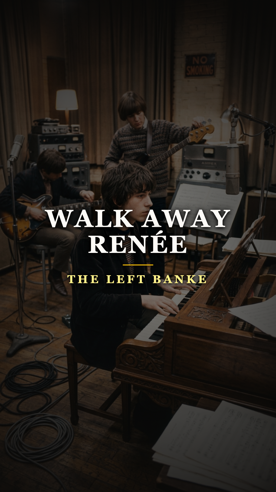
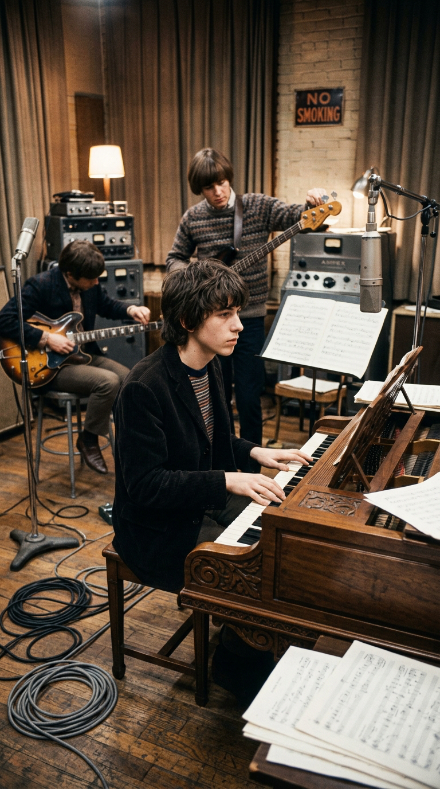
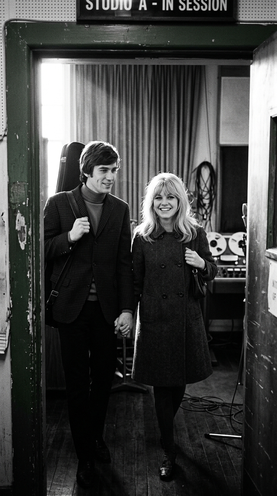
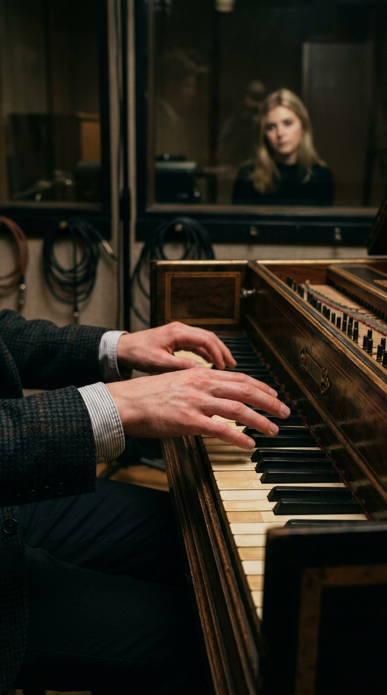
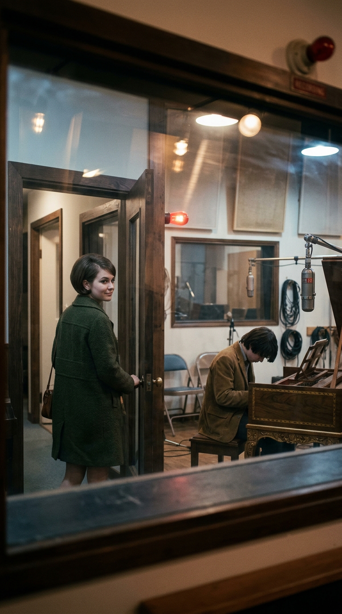
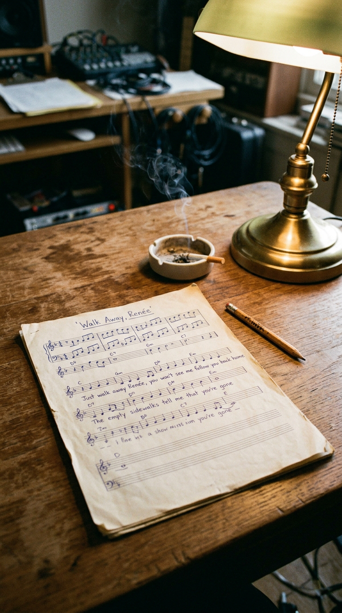
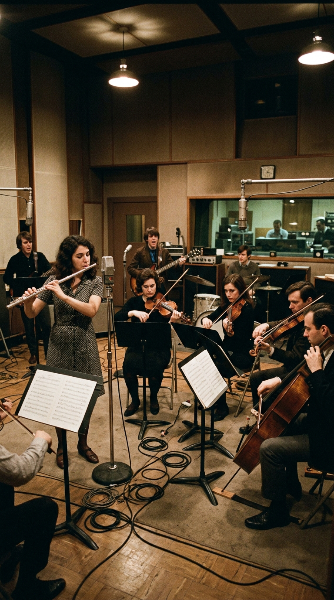
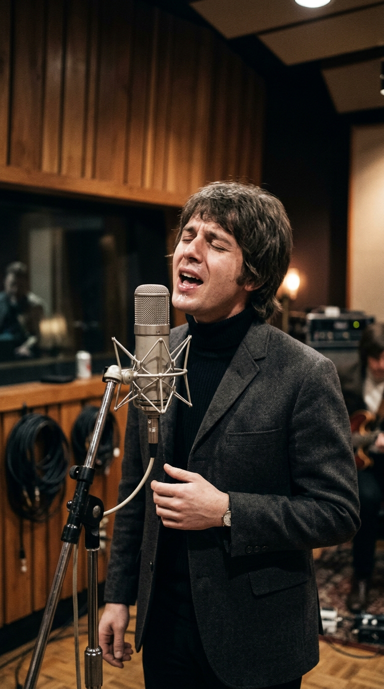
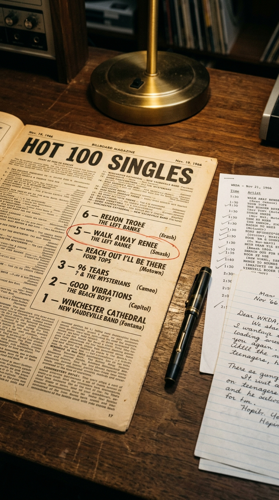

# El Amor Prohibido que Hizo Temblar un Clavecín: La Verdad Detrás de «Walk Away Renée»

> *«And when I see the sign that points one way, the lot we used to pass by every day... Just walk away, Renée, you won't see me follow you back home.»*  
> — **Michael Brown, 1966**

---

### Prólogo: La elegancia barroca de un secreto adolescente

En el otoño de 1966, una canción insólita conquistó las frecuencias de la radio estadounidense. No sonaba a las guitarras distorsionadas del incipiente garage rock ni al desenfado festivo de la invasión británica. Lo que salía de los altavoces era un tejido sonoro de una delicadeza aristocrática: el tintineo cristalino y melancólico de un clavecín barroco, un cuarteto de cuerdas que emulaba las fugas de Johann Sebastian Bach y un solo de flauta plateada que parecía flotar sobre la lluvia neoyorquina.

Aquella gema de tres minutos catapultó a **The Left Banke** al número cinco del *Billboard Hot 100*, acuñando en las páginas de la crítica musical un término enteramente nuevo: el *Baroque Pop*. Sin embargo, detrás de la sofisticación clásica de sus compases no había un cálculo comercial ni una pose estética ensayada. Había la tragedia muda, ardiente y vergonzosa de un muchacho de apenas dieciséis años cuyo cuerpo colapsaba cada vez que la novia de su mejor amigo entraba a la sala.

---

### Acto I: La musa en el umbral de World United Studios

El cerebro musical detrás del quinteto era Michael Brown (nacido Michael Lookofsky), un prodigio tímido e introvertido educado en el rigor de la música de cámara por su padre, el virtuoso violinista de jazz y arreglista Harry Lookofsky. Mientras sus compañeros de banda vivían la bohemia desenfrenada de Manhattan, Michael pasaba horas enclaustrado frente al teclado perfeccionando contrapuntos sacros.

Todo cambió la tarde en que el bajista del grupo, Tom Finn, abrió la puerta del estudio *World United* en la calle 48 llevando de la mano a su nueva pareja: **Renée Fladen**. Alta, magnética, con una cabellera rubia dorada y una mirada libre que desafiaba los convencionalismos de la época, Renée paralizó la sala con su sola presencia. Para Michael Brown, aquel instante no fue una simple atracción pasajera: fue un rayo fulminante que desarmó todas sus defensas espirituales.

---

### Acto II: El temblor incontrolable en las teclas

El problema insoluble comenzó cuando intentaron registrar las pistas de teclado. Michael se sentó al clavecín, ajustó la banqueta y levantó las manos para ejecutar los arpegios introductorios. Pero en cuanto levantó la vista y descubrió los ojos de Renée observándolo con fascinación a través del cristal de la cabina de control, una corriente eléctrica de pánico y culpa lo atravesó por completo.

Sus dedos comenzaron a temblar de manera descontrolada, tropezando con las teclas de madera y produciendo notas en falso. Lo intentó una, dos, cinco veces; cada tentativa terminaba en un nudo en la garganta y una sudoración helada. La vergüenza era insoportable: no podía disimular que la presencia de la mujer de su compañero de banda le arrebataba la motricidad.

Consciente de la tensión insostenible que se cernía sobre el estudio, el propio Tom Finn tuvo que acercarse a Renée y pedirle amablemente que saliera del recinto y diera un paseo por la avenida para que Michael pudiera calmarse. Solo cuando las puertas se cerraron y el silencio del estudio quedó vacío de su perfume, el joven tecladista pudo respirar de nuevo y registrar la melodía.

---

### Acto III: El ruego de la partitura solitaria

Aquella noche, devorado por el remordimiento y la devoción clandestina, Michael se encerró con papel pautado en el apartamento de su padre. Sabía que aquel amor era un pecado ético: traicionar a Tom Finn destruiría al grupo y a su propia conciencia. La única salida digna era suplicarle en silencio que desapareciera de su vista.

Junto a los letristas Bob Calilli y Tony Sansone, Michael canalizó su tormento en un ruego explícito e inmortal:

> *«Just walk away, Renée... You won't see me follow you back home. Now as the rain beats down upon my weary eyes, for me it cries.»*  
> *(«Solo márchate, Renée... No me verás seguirte a casa. Ahora que la lluvia golpea sobre mis ojos cansados, llora por mí.»)*

El título no era una metáfora abstracta: llevaba el nombre real de la mujer prohibida, grabado como un epitafio en el centro del estribillo.

---

### Acto IV: La sesión barroca y la voz de Steve Martin Caro

Para materializar la visión de su hijo, Harry Lookofsky convocó a un selecto cuarteto de cuerdas de la Filarmónica de Nueva York y al flautista George Marge. La sesión en los estudios *Century Sound* fue un alarde de orquestación donde la base rítmica del pop se fundió orgánicamente con la majestad del clasicismo europeo.

Frente al micrófono, el vocalista principal de The Left Banke, **Steve Martin Caro**, ofreció una interpretación vocal prodigiosa. Con un timbre que oscilaba entre la fragilidad adolescente y la desesperación romántica, Caro prestó su garganta al dolor de Michael, sin sospechar al principio la magnitud del secreto que estaba inmortalizando.

Cuando el solo de flauta irrumpe en el puente de la canción, el oyente no escucha un adorno técnico, sino la respiración contenida de un joven que prefiere renunciar al amor antes que manchar su lealtad.

---

### Acto V: El precio del número uno y la implosión de la banda

Lanzada por el sello Smash Records en julio de 1966, *«Walk Away Renée»* se transformó en un fenómeno de ventas global. Las emisoras de radio la emitían sin descanso y el vinilo vendió más de un millón de copias, escalando al Top 5 estadounidense.

Pero el éxito comercial tuvo un costo humano devastador. Con la canción sonando en cada esquina, la atmósfera dentro de The Left Banke se volvió irrespirable. La verdad detrás de la musa salió a la luz; la mirada de Tom Finn hacia Michael ya nunca volvió a ser la misma y la incomodidad devoró la camaradería juvenil.

Apenas unos meses después de haber inventado el pop barroco, Michael Brown abandonó la formación incapaz de soportar la presión emocional y las giras promocionales. La banda intentó continuar, pero el alma creativa ya se había quebrado.

---

### Epílogo: El monumento a la renuncia

Renée Fladen continuó su propio camino vital, convirtiéndose con los años en una respetada soprano y maestra de canto en la Costa Oeste. Sin embargo, su nombre quedó sellado en el bronce de la historia de la música popular como el símbolo máximo de la renuncia amorosa.

*«Walk Away Renée»* conmueve hoy porque no celebra una conquista ni un idilio correspondido, sino la dignidad moral del que decide apartarse. Cada vez que ese clavecín comienza a tintinear, el mundo recuerda que el arte más puro nace a veces del temblor involuntario de unas manos que eligen no tocar lo que no les pertenece.

---

### 💬 Comunidad y Reflexión

¿Sabías que el temblor de Michael Brown fue tan real que tuvieron que sacar a Renée del estudio para poder grabar? ¿Qué sientes al escuchar ese mítico arreglo barroco sabiendo el secreto que escondía?

Te leemos en los comentarios de **Acordes Ocultos**.

---

### 📚 Fuentes y Archivo Documental

* **Brown, Michael**: Entrevistas de archivo sobre la creación de The Left Banke y la composición de *«Walk Away Renée»*, *Goldmine Magazine*, 1988.
* **Finn, Tom**: Declaraciones retrospectivas sobre las tensiones internas y la figura de Renée Fladen, *Ugly Things Magazine*, Edición 26, 2007.
* **Billboard Magazine**: Archivo hemerográfico de listas de popularidad y ventas de Smash Records / Mercury, octubre–noviembre de 1966.
* **Fladen-Kamm, Renée**: Testimonios biográficos y memoria oral sobre la bohemia de Nueva York y su relación con los miembros de The Left Banke, San Francisco Early Music Society Archives.
* **Unterberger, Richie**: *Urban Spacemen and Wayfaring Strangers: Overlooked Innovators and Eccentric Visionaries of '60s Rock*, Backbeat Books, San Francisco, 2000.
