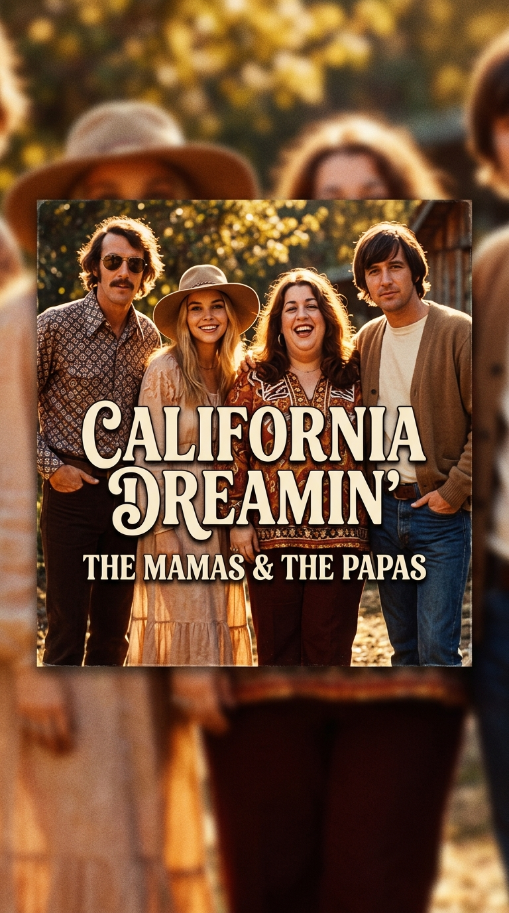
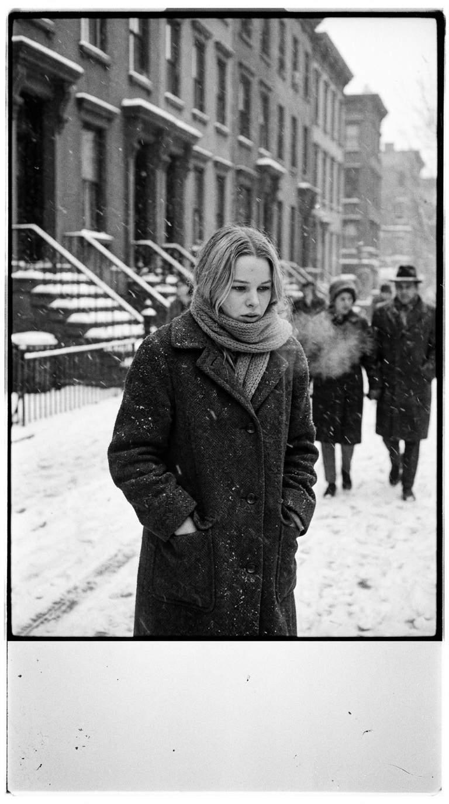
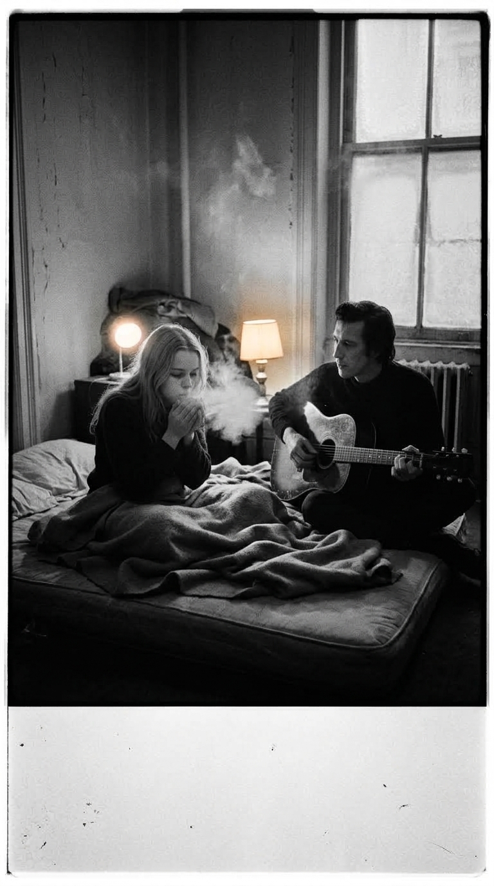
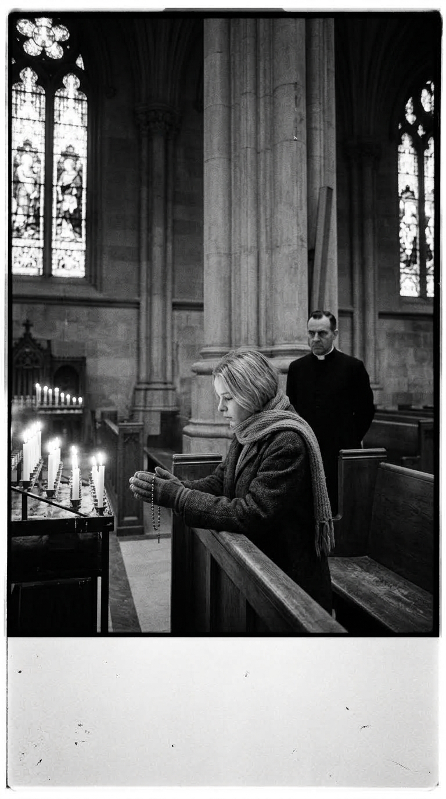
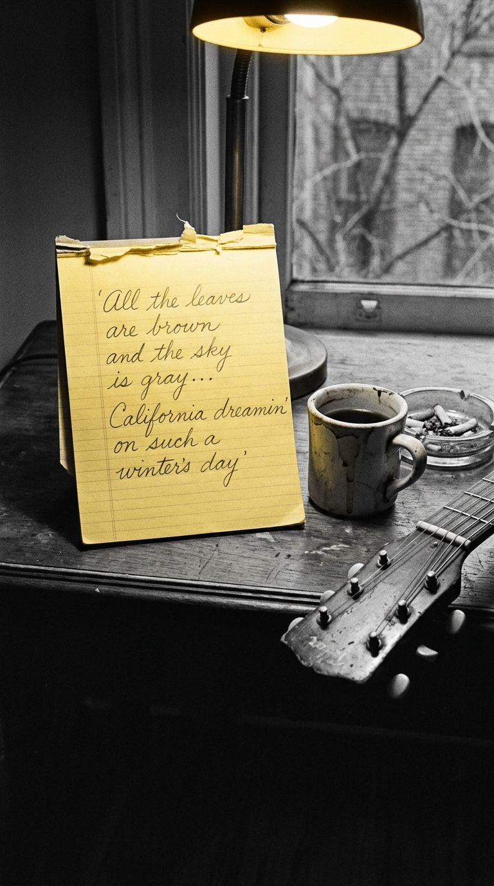
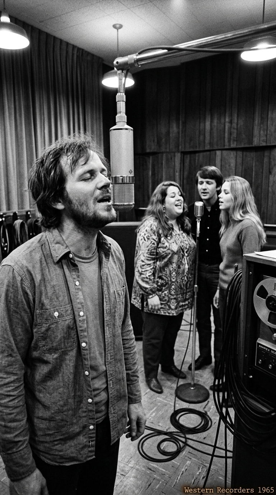
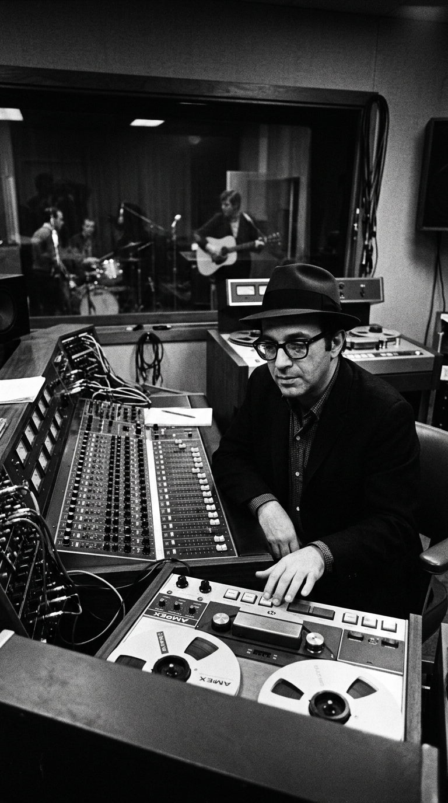
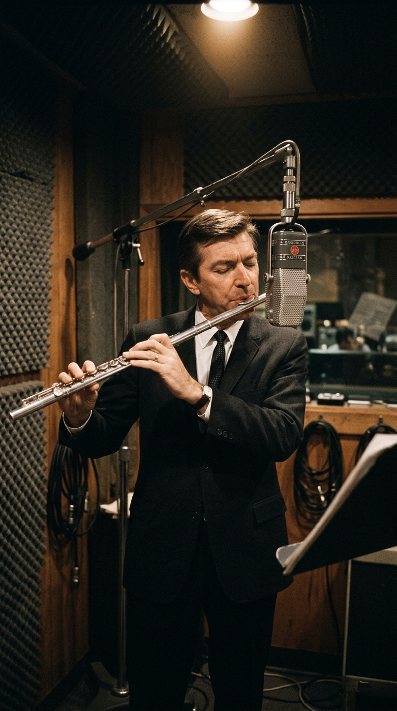
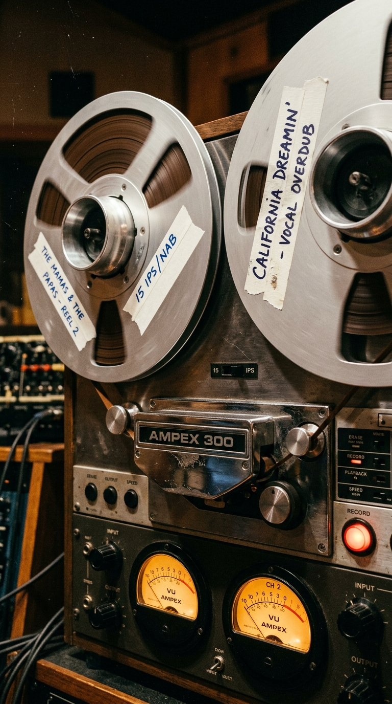

# El Himno Solar Nacido en un Cuarto Helado: La Verdadera Odisea de «California Dreamin’»

> *«All the leaves are brown and the sky is gray. I've been for a walk on a winter's day... I'd be safe and warm if I was in L.A.»*  
> — **John & Michelle Phillips, 1963**

---

### Prólogo: La ilusión dorada del Pacífico

Para el imaginario cultural del planeta, *«California Dreamin’»* es la encarnación sonora definitiva de la luz estival: la promesa de playas infinitas, palmeras recortadas contra el crepúsculo, descapotables deslizándose por la autopista del Pacífico y el florecimiento del movimiento contracultural de los sesenta. Su armonía vocal a cuatro partes —perfecta, sedosa y etérea— parece concebida bajo el influjo tibio de las olas californianas.

Sin embargo, detrás de aquella postal soleada se esconde una paradoja histórica fascinante: la canción más luminosa de la música popular estadounidense no nació frente al mar ni bajo el calor del verano, sino en la penumbra congelada de una madrugada bajo cero en Manhattan, en medio de una ventisca despiadada que casi acaba con la salud de sus protagonistas.

---

### Acto I: El invierno de 1963 y la celda del Albert Hotel

A finales de 1963, una joven de apenas dieciocho años llamada Michelle Gilliam experimentaba por primera vez el invierno de la Costa Este. Nacida y criada entre las playas de Long Beach y el clima templado de California, Michelle acababa de contraer matrimonio con el cantautor folk John Phillips. Instalados precariamente en Greenwich Village, la pareja intentaba abrirse paso en el circuito de cantautores bohemios, pero la realidad económica era devastadora.

Aquel diciembre, una de las peores olas de frío polar azotó Nueva York. John y Michelle se refugiaban en una habitación destartalada del decadente *Albert Hotel*, en University Place. El sistema de calefacción del edificio había colapsado; el viento se colaba por las rendijas de los ventanales y la temperatura interior descendía por debajo del punto de congelación. La pareja dormía vestida con abrigos de lana, bufandas y guantes deshilachados, frotándose las manos continuamente para no perder la sensibilidad en los dedos. Michelle, aterrorizada por una nieve que nunca antes había visto de cerca, lloraba de nostalgia añorando la tibieza de su hogar en la Costa Oeste.

---

### Acto II: La fuga a San Patricio y el verso de las tres de la mañana

En un intento desesperado por escapar del viento cortante durante un paseo matutino, Michelle cruzó las puertas de la imponente Catedral de San Patricio, en la Quinta Avenida. Fascinada por el resplandor de los cirios encendidos y el vaho protector de la piedra gótica, se arrodilló fingiendo orar simplemente para absorber el calor de las velas. Pero la mirada adusta de los sacerdotes y la atmósfera ceremoniosa pronto la hicieron sentir como una intrusa, empujándola de vuelta a la inclemencia del asfalto neoyorquino.

Aquella misma madrugada, alrededor de las tres, John Phillips despertó sobresaltado por el crujido de los radiadores mudos. Tomó su guitarra acústica con los dedos ateridos y comenzó a acariciar una progresión en compás menor. Sacudió suavemente a Michelle y le pidió papel y lápiz. La primera estrofa brotó como una descripción literal del paisaje que observaban por la ventana:

> *«All the leaves are brown and the sky is gray...»*  
> *(«Todas las hojas son marrones y el cielo es gris...»)*

Cuando llegaron al segundo verso, Michelle aportó su experiencia del mediodía en la catedral: *«Me detuve en una iglesia por el camino; me puse de rodillas y fingí rezar»*. Al principio, Michelle dudó de incluir la línea por temor a que resultara una blasfemia, pero John insistió con fervor: comprendió de inmediato que la tensión entre la devoción y el desamparo era el núcleo poético de la obra. Habían transformado la desesperación del frío en un anhelo ardiente de salvación: *«Estaría a salvo y abrigado si estuviera en Los Ángeles»*.

---

### Acto III: La cinta robada en Western Recorders

Tuvieron que pasar dos años para que la maqueta saliera del cajón. En el otoño de 1965, instalados ya en Los Ángeles y habiendo fundado **The Mamas and the Papas** junto al prodigioso tenor canadiense Denny Doherty y la arrolladora Cass Elliot, el grupo entabló amistad con Barry McGuire, el cantante que acababa de alcanzar el número uno mundial con el himno de protesta *«Eve of Destruction»*.

McGuire llevó al cuarteto a los míticos estudios *Western Recorders* en Sunset Boulevard para presentarlos a su productor y presidente de Dunhill Records, **Lou Adler**. La idea original era que *«California Dreamin’»* formara parte del segundo disco de McGuire, *This Precious Time*, con Barry como voz líder y el grupo cumpliendo el rol subordinado de coristas de fondo. La base instrumental fue grabada por los gigantes de *The Wrecking Crew*: Hal Blaine en la batería, Joe Osborn en el bajo, Larry Knechtel en los teclados y P.F. Sloan ejecutando la emblemática introducción de guitarra acústica de doce cuerdas.

Pero mientras escuchaba las reproducciones de control, Lou Adler sintió que algo no encajaba. La voz áspera, rasgada y urgente de Barry McGuire ahogaba la delicada arquitectura melancólica de la composición. En una maniobra de audacia y sigilo, Adler ordenó detener la sesión y le propuso a John Phillips un giro radical: borrarían la pista vocal de McGuire y colocarían a Denny Doherty al frente, convirtiendo a The Mamas and the Papas en los protagonistas absolutos del tema.

---

### Acto IV: El solo accidental de diez minutos y la voz fantasma

Para coronar el puente instrumental, Adler necesitaba un elemento que rompiera con el sonido estándar del folk acústico de la época. En ese instante providencial, el célebre jazzista **Bud Shank** caminaba por el pasillo del estudio tras haber finalizado otra sesión. Adler abrió la puerta de la cabina y le preguntó a quemarropa: *«Bud, ¿llevas tu flauta encima?»*.

Shank entró a la sala sin haber escuchado jamás la canción. El ingeniero colocó la cinta, Shank escuchó la progresión armónica una sola vez con los ojos cerrados, ajustó su flauta contralto frente al micrófono de cinta y ejecutó una improvisación de una sofisticación deslumbrante. En una única toma de apenas diez minutos, Bud Shank estampó el solo más influyente y copiado en la historia del pop vocal.

Sin embargo, la tecnología analógica de cuatro pistas de 1965 guardaba una sorpresa técnica imborrable. Al borrar la voz guía de Barry McGuire para superponer el timbre cristalino de Denny Doherty, el borrado magnético no fue perfecto y la señal original se filtró por inducción en los micrófonos ambientales de la sala.

Si se escucha con atención el máster original en el canal izquierdo, justo dos segundos antes de que Denny comience a cantar, se percibe con absoluta nitidez la voz ronca de Barry McGuire atacando el primer verso: *«All the leaves are...»*. Aquel «error» de estudio quedó prensado para siempre en millones de copias de vinilo, como una huella dactilar indestructible del destino.

---

### Acto V: El nacimiento de un mito universal

Lanzada en diciembre de 1965, *«California Dreamin’»* no tardó en convertirse en una deflagración cultural. Escaló implacable hasta las primeras posiciones de las listas internacionales y fue certificada como disco de oro. No fue únicamente un éxito comercial: fue la banda sonora que catalizó la gran migración juvenil hacia San Francisco y Los Ángeles, inaugurando la era del *Flower Power* y definiendo el sonido de toda una generación.

La ironía poética había completado su círculo: cuatro músicos que tiritaban bajo mantas raídas en un hotel de mala muerte de Manhattan habían inventado, a fuerza de pura nostalgia y dolor congelado, el mito dorado de la California eterna.

---

### Epílogo: La nostalgia como fuego creador

Las grandes obras de arte a menudo se construyen a partir de la distancia. No se escribe sobre el calor cuando se está tumbado bajo el sol, sino cuando el frío amenaza con apagar el corazón. *«California Dreamin’»* sobrevive al paso de las décadas porque su belleza no reside en la complacencia, sino en la añoranza: ese puente invisible que la imaginación humana tiende entre el invierno que padecemos y el verano al que soñamos regresar.

---

### 💬 Comunidad y Reflexión

¿Sabías que la voz de Barry McGuire aún susurra como un fantasma en el canal izquierdo de la canción? ¿Qué imagen acude a tu mente cada vez que suena ese inolvidable solo de flauta?

Te leemos en los comentarios de **Acordes Ocultos**.

---

### 📚 Fuentes y Archivo Documental

* **Phillips, Michelle**: *California Dreamin': The True Story of the Mamas and the Papas*, Warner Books, Nueva York, 1986.
* **Phillips, John**: *Papa John: An Autobiography*, Doubleday, Nueva York, 1986.
* **Adler, Lou**: Entrevistas de archivo sobre las sesiones en *Western Recorders* y la producción de Dunhill Records, *Mix Magazine*, 2001.
* **Blaine, Hal & Goggin, David**: *Hal Blaine and the Wrecking Crew*, Mix Books, Emeryville, California, 1990.
* **Billboard & RIAA Archives**: Registro de certificaciones y permanencia en listas del sencillo *«California Dreamin'»*, 1966.
* **DownBeat Magazine**: Archivo hemerográfico sobre la sesión de grabación de Bud Shank y su contribución al jazz-pop en la Costa Oeste, marzo de 1966.
