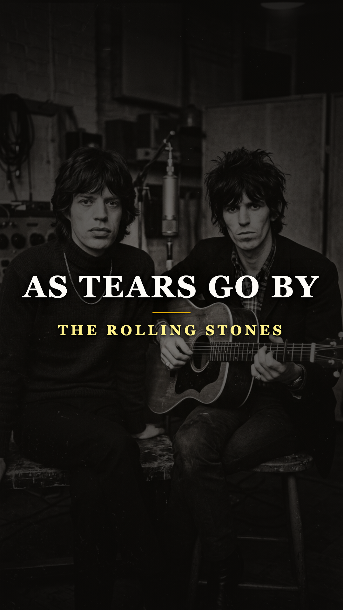
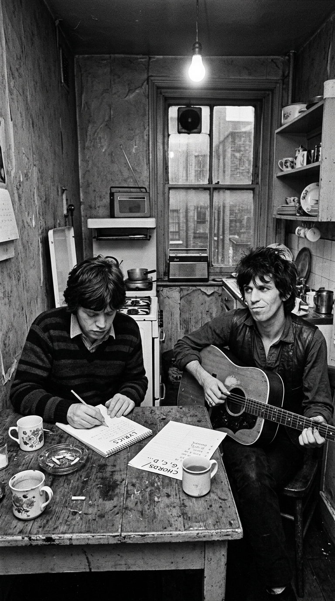
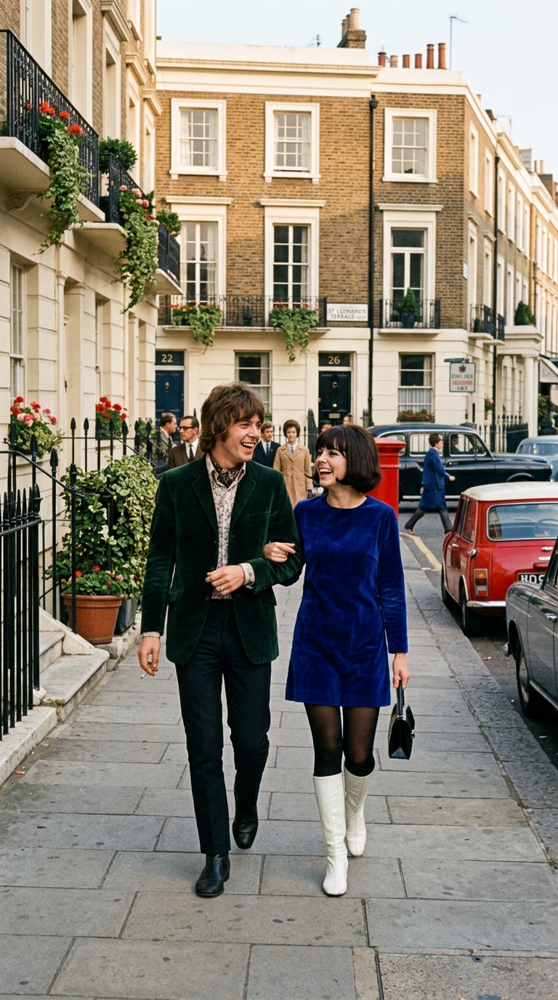
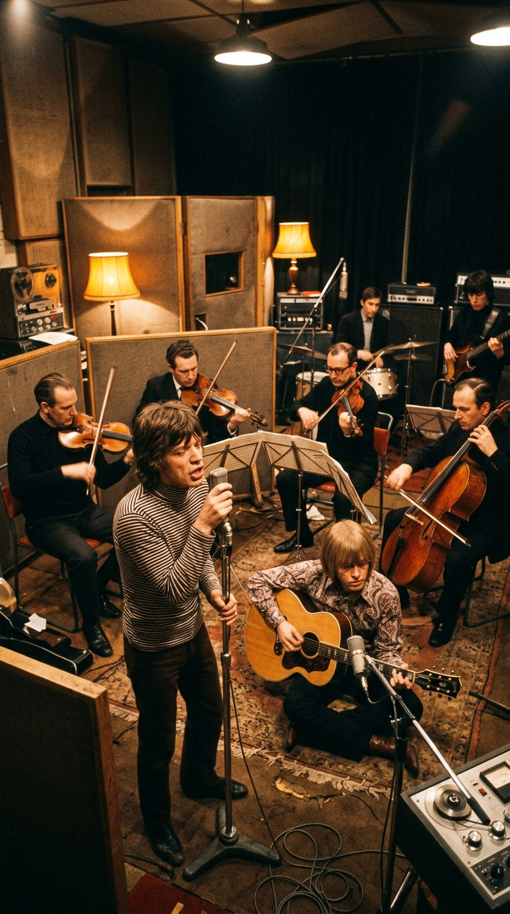
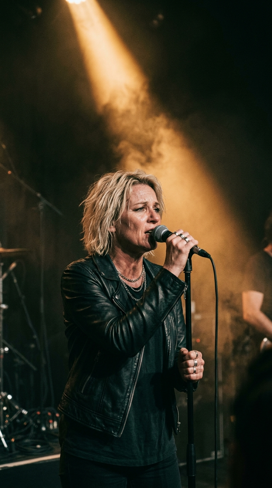
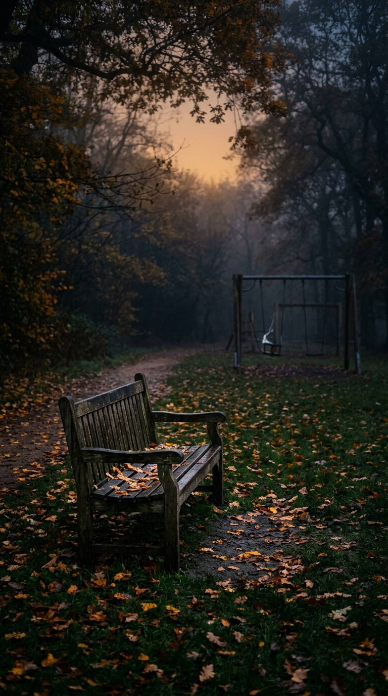

# 🥀 La Balada Nacida Bajo Llave: El Mito y la Herida de «As Tears Go By»
### *Cómo Mick Jagger y Keith Richards fueron encerrados en una cocina para componer su primera canción original, la despreciaron por blanda y terminaron prediciendo el trágico destino de su mayor musa, Marianne Faithfull.*

---

**Por la redacción de Acordes Ocultos**  
*Tiempo de lectura estimado: 8 minutos*

---

### Prólogo: El encierro en la cocina de Willesden (1964)

A principios de 1964, The Rolling Stones eran una furiosa banda de club. Cinco muchachos flacos, desgarbados y de miradas desafiantes que sobrevivían en el circuito londinense versionando a sus héroes del blues negro estadounidense: Chuck Berry, Muddy Waters y Bo Diddley. Tenían electricidad, peligro y arrogancia, pero carecían de lo más valioso en la era dorada del pop británico: **un catálogo propio de canciones originales**.

Mientras en los estudios de Abbey Road John Lennon y Paul McCartney fabricaban himnos número uno con una facilidad sobrehumana, los Stones seguían atrapados en el repertorio ajeno. Su joven y volcánico manager, **Andrew Loog Oldham**, un estratega de imagen de apenas veinte años obsesionado con la publicidad y el teatro de choque, comprendió que sin canciones propias la banda sería una moda pasajera.

Una tarde de primavera en un modesto apartamento del norte de Londres, Oldham decidió que la diplomacia había terminado. Empujó a **Mick Jagger** y a **Keith Richards** al interior de una pequeña cocina de baldosas gastadas, giró la llave en la cerradura desde el exterior y les gritó a través de la madera:
> *«De aquí no salís hasta que hayáis escrito una canción. Quiero una canción con paredes de ladrillo alrededor, ventanas altas y nada de sexo. Algo que las madres puedan tararear»*.

Atrapados entre tazas de té frío y bajo la luz cruda de una bombilla colgante, el vocalista y el guitarrista se miraron con fastidio. Keith tomó su vieja guitarra acústica de cuerdas metálicas, deslizó los dedos en una cadencia descendente en Sol mayor y Mick comenzó a garabatear versos en un bloc de notas arrugado.

Horas después, cuando Oldham abrió la puerta, los dos jóvenes le mostraron un tema titulado provisionalmente *«As Time Goes By»*. Era una balada acústica de una belleza crepuscular insólita para dos muchachos de veinte años, que hablaba sobre contemplar a los niños jugando en el parque mientras caía la tarde y la juventud se desvanecía en lágrimas.

Sin embargo, a Mick y a Keith la canción les provocaba vergüenza ajena. Sentían que aquella melodía acústica y sensible era una cursilería blanda que destruiría en el acto su reputación de forajidos del blues.
> *«Esto es una porquería sentimental»*, sentenciaron. *«Los Rolling Stones jamás grabarán algo así»*.

*Londres, 1964: Mick Jagger y Keith Richards forzados a componer su primer material original bajo llave.*

---

### Acto I: La colegiala de diecisiete años

Oldham, rebautizando la pista como **«As Tears Go By»** para evitar conflictos legales con el célebre tema de la película *Casablanca*, guardó la partitura en su maletín. Sabía exactamente qué hacer con ella.

Semanas antes, durante una sofisticada fiesta en Mayfair, el manager se había topado con una muchacha de belleza renacentista: **Marianne Faithfull**, una colegiala de diecisiete años recién salida de un internado de monjas en Reading, hija de una baronesa austriaca descendiente de la dinastía Sacher-Masoch. Marianne no tenía ambiciones de estrella del pop; cantaba baladas tradicionales en cafés folk con una voz limpia, pura y cristalina como un arroyo de montaña.

Oldham vio en ella el reverso perfecto de la sordidez de los Stones: el ángel caído de la aristocracia británica.

En los estudios Decca, con arreglos orquestales sobrios y una guitarra acústica de fondo, Marianne grabó *«As Tears Go By»*. Cuando el sencillo se publicó en junio de 1964, el impacto fue arrollador. Aquella voz adolescente, despojada de artificios y cargada de una extraña resignación prematura, escaló hasta el top diez de las listas británicas y estadounidenses.

De la noche a la mañana, la muchacha del internado se convirtió en el icono supremo de la pureza y la inocencia en el corazón del *Swinging London*.

*Junio de 1964: Marianne Faithfull a los 17 años grabando la melodía que cambiaría su vida.*

---

### Acto II: El torbellino del Swinging London y el hechizo de los Stones

El éxito de la canción acercó irremediablemente a Marianne al círculo íntimo de los Rolling Stones. En 1966, tras separarse de su primer esposo, Marianne y Mick Jagger comenzaron un romance apasionado que los coronó como la pareja real de la contracultura mundial.

Paseaban por Kings Road en descapotables de lujo, asistían a fiestas psicodélicas rodeados de fotógrafos y diseñadores, y Marianne se convirtió en la musa absoluta de la banda, inspirando joyas líricas como *«Wild Horses»* y *«You Can't Always Get What You Want»*.

Al ver cómo aquella balada descartada había conquistado el mundo, los propios Rolling Stones tragaron su orgullo. En el otoño de 1965, en los estudios Regent Sound de Londres, Mick Jagger grabó su propia versión arropado por un solemne cuarteto de cuerdas arreglado por Mike Leander. El tema se convirtió en un éxito masivo internacional para la banda, demostrando que su talento compositivo iba mucho más allá de los doce compases del blues.

Pero el cuento de hadas estaba a punto de convertirse en una pesadilla gótica.

*Londres, 1966: Mick Jagger y Marianne Faithfull en la cúspide de su idilio mediático.*

---

### Acto III: El abismo de Sídney y las calles del Soho

La vorágine de excesos, el acoso implacable de la prensa sensacionalista británica tras la redada policial en la mansión de Keith Richards en Redlands (1967) y las presiones de un entorno despiadado terminaron por quebrar el espíritu de Marianne.

En julio de 1969, mientras acompañaba a Jagger al rodaje de la película *Ned Kelly* en Australia, la angustia acumulada y la pérdida de la custodia de su hijo la empujaron al abismo. En una habitación de hotel en Sídney, Marianne ingirió una sobredosis letal de cientos de pastillas de Tuinal. Permaneció en un coma profundo durante seis días. Los médicos consideraron un milagro biológico que lograra despertar, aunque al abrir los ojos le susurró a Mick una frase desoladora: *«¿Por qué no me dejaste marchar?»*.

La relación entre ambos no sobrevivió a la tragedia. En 1970, el vínculo se disolvió definitivamente.

Lo que vino a continuación fue el descenso más brutal a los infiernos jamás documentado en la historia del rock. Desposeída de su dinero, estigmatizada por los tabloides y atrapada en una severa adicción a la heroína, Marianne Faithfull desapareció del mapa artístico. Durante más de dos años, entre 1971 y 1973, la antigua estrella vivió en la absoluta indigencia como una persona sintecho en las calles grises del Soho londinense, durmiendo en cuclillas sobre colchones sucios en edificios ocupados y envuelta en un viejo abrigo desgastado.

La dulce colegiala que cantaba sobre ver a los niños jugar se había convertido en un fantasma urbano al que nadie reconocía.

*Finales de 1965: The Rolling Stones grabando su célebre versión orquestal de «As Tears Go By».*

---

### Acto IV: La resurrección con la voz rota

A finales de los años setenta, cuando muchos daban a Marianne Faithfull por muerta, ocurrió el milagro de la redención. Con una fuerza de voluntad sobrehumana, apoyada por amigos leales y decidida a no ser una víctima más de los excesos de una década que devoró a tantos de sus contemporáneos, Marianne logró salir del infierno de la calle.

Su regreso musical en 1979 con el álbum *«Broken English»* dejó estupefacta a la crítica internacional. Su dulce voz de soprano adolescente había desaparecido por completo; en su lugar emergía una voz cavernosa, áspera, grave y rasgada por el tabaco, los estragos de la heroína y el dolor real. Era el sonido inconfundible de una superviviente.

En 1987, en su aclamado álbum *«Strange Weather»*, Marianne decidió cerrar el círculo de su existencia y volvió a entrar al estudio para grabar nuevamente **«As Tears Go By»**.

El resultado fue sobrecogedor. Aquella canción que dos jóvenes engreídos habían compuesto encerrados en una cocina ya no sonaba como un ejercicio de melancolía juvenil. En los labios de la mujer de cuarenta años que había caminado entre los muertos, cada palabra adquiría un peso desgarrador:
> *«It is the evening of the day...  
> I sit and watch the children play...  
> Doing things I used to do, they think are new...  
> I sit and watch as tears go by...»*

Ya no cantaba sobre una tristeza imaginada; cantaba sobre la verdadera cicatriz de haber perdido la juventud, la fama y la inocencia, y haber encontrado en los escombros la dignidad para seguir viviendo.

*1987: Marianne Faithfull resurgida de las cenizas, cantando «As Tears Go By» con su desgarrada voz madura.*

---

### Epílogo: El banco vacío y el precio de la inocencia

Hoy, más de seis décadas después de que una puerta de cocina se cerrara con llave en Londres, *«As Tears Go By»* se mantiene como uno de los monumentos más conmovedores de la historia de la música popular.

No fue simplemente el debut de Mick Jagger y Keith Richards como compositores ni el himno que consagró a los Rolling Stones más allá del blues. Fue una profecía involuntaria sobre la fragilidad del éxito y el paso implacable del tiempo.

Cuando los acordes de guitarra se extinguen y contemplamos el crepúsculo cayendo sobre un banco solitario en un parque otoñal, comprendemos la gran lección humana que Marianne Faithfull y los Stones nos legaron: el dolor no se puede borrar, pero cuando se transforma en arte puro, es lo único capaz de burlar a la muerte.

*La metáfora del crepúsculo: El banco solitario bajo el viento otoñal y la memoria de una inocencia que jamás regresará.*

---

### 📚 Fuentes y Archivo Documental
* **Oldham, Andrew Loog.** *Stoned: A Memoir of London in the 1960s.* Secker & Warburg, 2000. Memorias oficiales del primer manager de The Rolling Stones.
* **Faithfull, Marianne & Dalton, David.** *Faithfull: An Autobiography.* Little, Brown and Company, 1994. Testimonio directo sobre el encierro en la cocina, la grabación en Decca y los años de adicción en el Soho.
* **Richards, Keith & Fox, James.** *Life.* Little, Brown and Company, 2010. Crónica autobiográfica sobre la composición forzada de *As Tears Go By* y las sesiones en Regent Sound Studios.
* **Jagger, Mick.** Entrevistas históricas para *Rolling Stone* Magazine (1968, 1995) sobre la evolución lírica de la banda y su relación creativa con Marianne Faithfull.
* **Hemeroteca de The Times & Daily Mail.** Archivo hemerográfico sobre la redada de Redlands (febrero de 1967) y el ingreso hospitalario de Marianne Faithfull en Sídney (julio de 1969).
* **Official Charts Company & Billboard Hot 100.** Registros históricos de lanzamiento y posiciones de ventas para las versiones de Marianne Faithfull (1964) y The Rolling Stones (1965).
