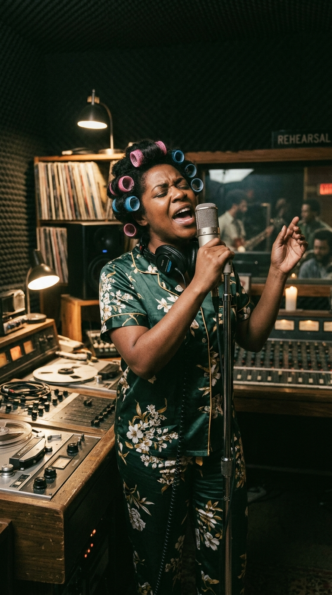
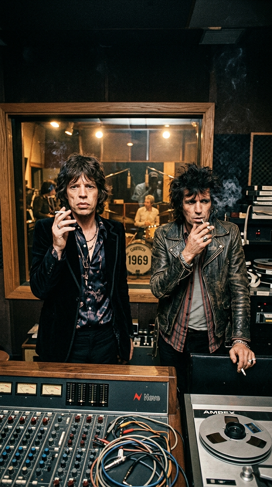
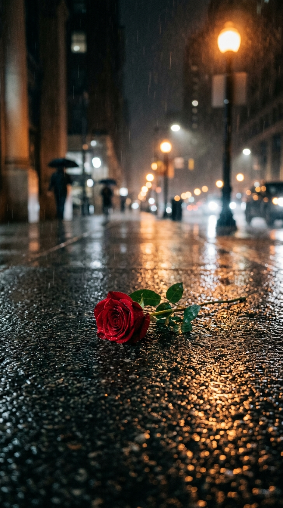
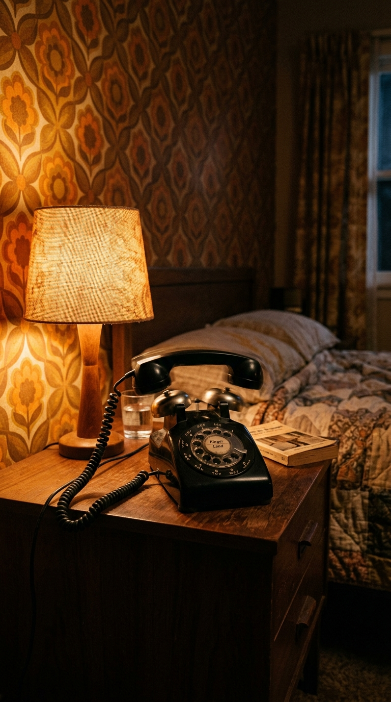
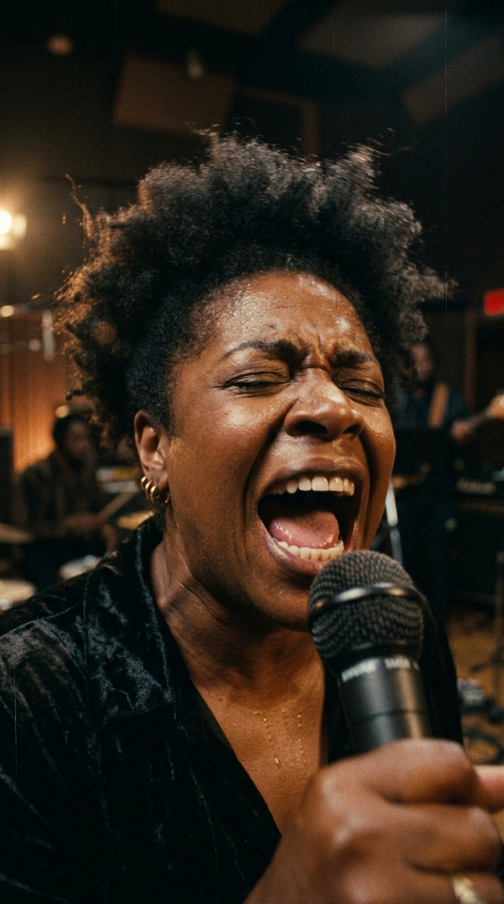
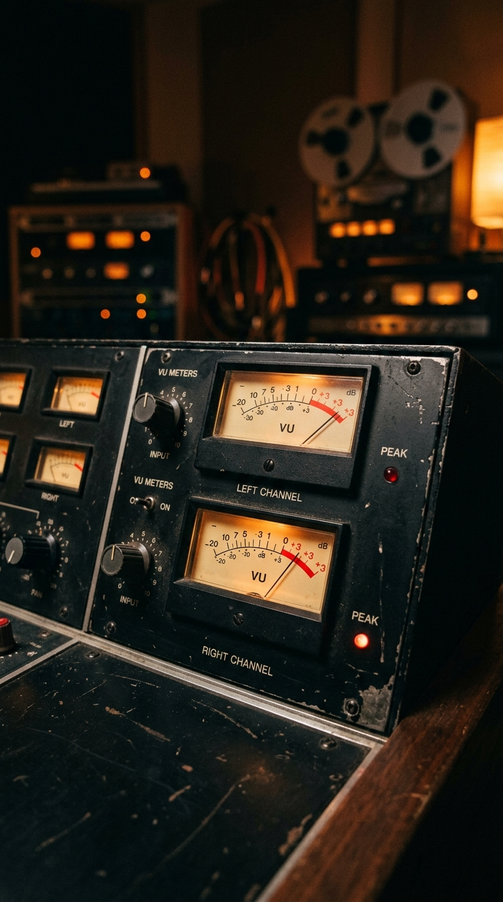
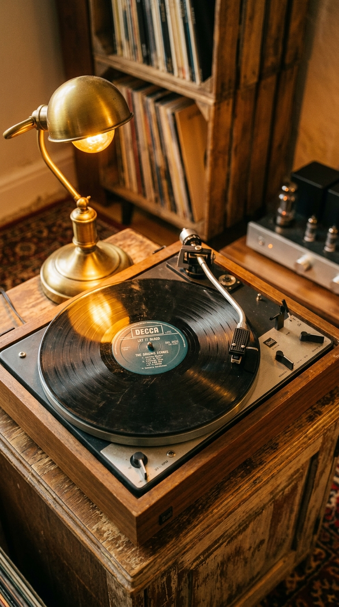

# ⚡ El Grito que Desgarró la Madrugada: La Herida Oculta de «Gimme Shelter»

> *«El mundo en 1969 se estaba cayendo a pedazos. Había una violencia insidiosa en el aire: la guerra de Vietnam en las pantallas, los asesinatos de Manson, los disturbios... 'Gimme Shelter' era una canción sobre el fin del mundo, una advertencia de que la tormenta ya estaba sobre nuestras cabezas y que nadie saldría ileso.»*  
> — **Keith Richards**, sobre la concepción del tema, Londres, 1969.

---

*Sunset Sound Studios, Los Ángeles, noviembre de 1969: Una joven corista embarazada vestida con camisón de seda y rulos en el pelo grita frente al micrófono el alarido más desgarrador en la historia del rock and roll.*

---

### Prólogo: El ocaso del sueño y el aroma de la ceniza

El año **1969** no concluyó con cantos pastorales de paz ni con el idilio utópico de las flores en el pelo. Murió asfixiado bajo una atmósfera densa de paranoia, fuego y desengaño.

En el sudeste asiático, la Guerra de Vietnam alcanzaba su cénit más sangriento, devorando a decenas de miles de jóvenes conscriptos en transmisiones televisivas diarias que teñían de luto los comedores occidentales. En agosto de aquel año, la brutalidad de la secta de Charles Manson en Cielo Drive (Los Ángeles) había destripado el corazón de Hollywood, sepultando de golpe la ingenua inocencia de la era hippie. Y en el seno íntimo de The Rolling Stones, las heridas supuraban en carne viva: apenas cuatro meses antes, el 3 de julio, su fundador y multiinstrumentista **Brian Jones** había sido hallado flotando sin vida en el fondo de la piscina de su mansión en Sussex.

*Sunset Sound, 1969: Jagger y Richards examinan las cintas maestras de 'Let It Bleed', buscando desesperadamente una chispa que sintetice la catástrofe de su tiempo.*

Los Stones sabían que ya no eran los chicos rebeldes del rhythm and blues británico; eran los cronistas involuntarios de una civilización que se precipitaba hacia el abismo. Sin embargo, cuando comenzaron a ensamblar las pistas para su nuevo álbum, *Let It Bleed*, la canción que debía abrir el disco poseía una fuerza rítmica arrolladora, pero carecía de su dimensión trágica definitiva. 

Hacía falta una voz que no fuera de este mundo. Un lamento capaz de personificar el terror de una madre viendo arder su propia casa. Y esa voz llegaría de la manera más insólita: a las dos de la mañana, en pijama y arrancada brutalmente del sueño.

---

### Acto I: El arpegio de la lluvia y las sombras de Mount Street

La génesis de *«Gimme Shelter»* no comenzó en los estudios de grabación de California, sino una tarde gris y tempestuosa de otoño en el barrio londinense de Mayfair.

**Keith Richards** se encontraba solo en el apartamento de su amigo, el marchante de arte Robert Fraser, en Mount Street. Afuera, el cielo de Londres se había transformado en un manto negro como el carbón y un aguacero torrencial azotaba los cristales con furia violenta. A través del ventanal, Richards contemplaba a cientos de transeúntes corriendo despavoridos, cubriéndose la cabeza con periódicos mojados y buscando desesperadamente un alero, una marquesina o cualquier rincón donde guarecerse del diluvio.

Con una guitarra acústica Gibson Hummingbird en su regazo, afinada en la modalidad abierta de Mi (*Open E*), los dedos de Richards comenzaron a trazar un arpegio circular, tembloroso y sombrío.

*Londres, 1969: En medio de la lluvia torrencial, nace la figura de un refugio elemental frente a la brutalidad del mundo exterior.*

Pero la tormenta que atormentaba a Keith no era solo meteorológica. En aquellos mismos días, su pareja sentimental, la actriz **Anita Pallenberg**, se encontraba rodando en los estudios de filmación la controvertida película vanguardista *Performance*, compartiendo escenas de alto contenido erótico y explícita intimidad con el mismísimo **Mick Jagger**. Recluido en soledad, devorado por los celos, la sospecha de traición y el consumo creciente de heroína, Richards canalizó toda su angustia emocional en aquellas seis cuerdas.

> *«La frase 'Ooh, a storm is threatening my very life today' ('Una tormenta amenaza mi propia vida hoy') me salió de golpe»*, escribiría Richards en sus memorias. *«Veía a la gente correr buscando refugio de la lluvia, pero para mí era algo mucho más visceral: era la sensación física de que todo lo que amaba estaba a punto de ser arrasado por un vendaval»*.

Cuando Jagger escuchó el riff, quedó hipnotizado. Añadió una de las interpretaciones de armónica más siniestras y desgarradoras de su carrera y completó la letra con una letanía que resumía el terror político y callejero de la época:

> *«War, children, it's just a shot away, it's just a shot away...»*  
> *(«La guerra, muchachos, está a solo un disparo de distancia...»)*

Meses más tarde, en octubre de 1969, la banda trasladó las cintas a los estudios **Sunset Sound** de Los Ángeles para culminar la mezcla final junto al productor **Jimmy Miller**. La pista instrumental era una obra de arte hipnótica: el bajo envolvente de Bill Wyman, la batería seca y marcial de Charlie Watts, las maracas inquietantes y las guitarras superpuestas de Keith.

Sin embargo, a medida que la canción crecía hacia su clímax, Miller y Jagger sentían un vacío insoportable. Los versos sobre la violación (*rape*) y el asesinato (*murder*) sonaban planos en la voz masculina de Jagger. Se necesitaba una presencia femenina que transformara la queja en una maldición profética.

Eran las doce y media de la noche. Y Jimmy Miller levantó el auricular del teléfono.

---

### Acto II: La llamada de las dos de la madrugada en Curtis Street

Al otro lado de la línea, en una modesta casa del sur de Los Ángeles, el teléfono de la mesita de noche comenzó a sonar con estrépito.

*Los Ángeles, 2:00 AM: El timbrazo que interrumpió el descanso de una mujer embarazada y cambió el destino de una grabación histórica.*

Eran casi las dos de la madrugada. **Merry Clayton**, una prodigiosa cantante afroamericana de apenas veintiún años —hija de un pastor bautista de Nueva Orleans y fogueada desde niña en las corales de góspel antes de convertirse en una de las codiciadas *Raelettes* de Ray Charles—, dormía profundamente. 

Clayton estaba atravesando los primeros meses de un **embarazo delicado** y su cuerpo le exigía reposo absoluto. Su esposo, el célebre saxofonista y director de jazz **Curtis Amy**, descolgó el aparato con irritación. La voz al otro lado pertenecía al legendario productor y arreglista **Jack Nitzsche**, estrecho colaborador de Phil Spector y amigo íntimo de los Rolling Stones.

*—Curtis, perdona la hora, pero necesito a Merry en el estudio de inmediato* —suplicó Nitzsche—. *Tengo aquí a unos tipos de Inglaterra llamados The Rolling Stones. Tienen una canción que necesita un coro femenino poderoso y nadie más en esta ciudad puede hacer lo que ellos buscan.*

Merry, medio dormida, se negó de inmediato:  
*—Diles que no. Son las dos de la mañana, estoy embarazada, tengo la cabeza llena de rulos y no sé quiénes son esos tipos rodantes.*

Pero Curtis Amy, que comprendía el funcionamiento implacable de la industria discográfica de Los Ángeles, miró a su joven esposa con ternura y firmeza:  
*—Cariño, levántate. Es una sesión importante. Ve, canta tus notas, cobra tu cheque y regresa a dormir. Yo te espero despierto.*

*Curtis Street, madrugada de noviembre de 1969: Envuelta en un abrigo de visón sobre su camisón de seda, Merry parte hacia el estudio sin imaginar el peso de lo que estaba por grabar.*

Merry Clayton no se molestó en vestirse. Dejó los rulos de plástico sujetos a su melena con una red, se dejó puesto su camisón de seda y sus zapatillas de estar por casa, se abrigó con un pesado abrigo de piel de visón y se anudó una bufanda de seda de Chanel al cuello para proteger su garganta del frío de la noche californiana.

Subió al automóvil y condujo a través de las avenidas desiertas de Los Ángeles hasta el número 6650 de Sunset Boulevard.

---

### Acto III: El quiebre vocal que estremeció a Sunset Sound

Cuando las puertas del estudio Sunset Sound se abrieron a las dos y media de la madrugada, los miembros de The Rolling Stones quedaron atónitos.

Ante ellos no estaba una diva sofisticada del pop, sino una muchacha menuda, visiblemente exhausta, con rulos en la cabeza y un abrigo largo de piel. Merry Clayton entró en la cabina de grabación masticando chicle, cruzó los brazos y miró a Mick Jagger a los ojos:  
*—Muy bien. Explíquenme rápido qué es lo que tengo que cantar porque tengo que volver a mi cama.*

Jagger, intimidado por la seguridad implacable de la joven de Nueva Orleans, se colocó a su lado frente al atril de partituras y le tarareó la melodía principal. Cuando Clayton leyó las palabras escritas a lápiz en la hoja de papel, frunció el ceño con sorpresa:  
*«Rape, murder! It's just a shot away, it's just a shot away...»*  
*(«¡Violación, asesinato! Está a solo un disparo de distancia...»)*

Para una devota creyente criada en las bancas de la iglesia bautista de su padre, entonar aquellas palabras oscuras era algo perturbador. Pero Merry respiró hondo, cerró los ojos, se acercó al micrófono de condensador de válvula Neumann y le indicó al ingeniero a través del cristal que hiciera correr la cinta.

*Sunset Sound, cabina de grabación: La fuerza sobrenatural de una garganta que transformó un verso de rock en un aullido de lamento bíblico.*

En la **primera toma**, la voz de Clayton entró como un torbellino de fuego, doblando la línea melódica de Jagger con una potencia vocal que hizo que los ingenieros tuvieran que retroceder los preamplificadores a toda prisa para evitar la saturación analógica. 

En la **segunda toma**, Clayton subió la apuesta, utilizando su rango de mezzosoprano para proyectar un grito lírico impregnado de dolor gospel.

Pero fue en la **tercera toma** donde ocurrió el milagro y la tragedia.

Clayton decidió desobedecer la melodía fijada por Jagger. En lugar de cantar en su registro habitual, reunió todo el aire disponible en sus pulmones, apretó su vientre con fuerza sobrehumana y se lanzó hacia una octava superior inalcanzable. Se empinó sobre las puntas de sus pies, abrió la boca hacia el cielo del estudio y aulló con una desesperación cósmica:

> *«¡RAPE, MURDER! IT'S JUST A SHOT AWAY!*  
> *¡¡RAPE, MURDER!! IT'S JUST A SHOT AWAY...»*

En ese segundo verso, en la palabra *«murder»*, la garganta de Merry Clayton fue empujada más allá de los límites físicos de las cuerdas vocales humanas. **Su voz se quebró dos veces consecutivas**, emitiendo un desgarro afónico, un sollozo gutural de una pureza y un sufrimiento tan pavorosos que el aire de la sala pareció congelarse al instante.

*Los vúmetros en la zona roja: El nivel de decibelios y presión acústica desafió la tolerancia de los circuitos de la mesa de mezcla.*

En la pista de audio aislada de aquella sesión —uno de los documentos sonoros más sobrecogedores que se conservan en los archivos del rock—, en la fracción de segundo posterior a que la voz de Merry se quiebra, se escucha con total nitidez cómo Mick Jagger, situado en la sala de control frente a la cristalera, emite un grito involuntario de puro espanto y admiración reverencial:  
*«¡WHOO!»*.

Clayton bajó los brazos, abrió los ojos y miró hacia la cabina.  
*—¿Está bien así, o necesitan otra?* —preguntó con serenidad.  
*—Merry... es lo más increíble que hemos escuchado en nuestras vidas* —respondió Jimmy Miller tembloroso—. *Por favor, vete a casa a descansar.*

Mick Jagger la despidió en la puerta con un beso en la mejilla y un agradecimiento reverente. Merry Clayton subió a su auto, encendió la calefacción y condujo de regreso hacia Curtis Street. Eran las tres y media de la madrugada.

---

### Acto IV: La pérdida en el hospital y la profecía sangrienta de Altamont

Lo que ocurrió en las horas posteriores constituye uno de los episodios más amargos y silenciados en la historia de la música popular.

Apenas unas horas después de haberse metido nuevamente en su cama, mientras la mañana comenzaba a despuntar sobre Los Ángeles, Merry Clayton se despertó sacudida por un dolor punzante e insoportable en el bajo vientre. Su esposo Curtis la encontró empapada en sudor frío y sangrando copiosamente. La subió en brazos al automóvil y corrió a toda velocidad hacia el hospital más cercano.

Los médicos no pudieron hacer nada. **Merry Clayton sufrió un aborto espontáneo fulminante.**

Durante décadas, la cantante y su círculo más íntimo evitaron abordar públicamente el suceso. Sin embargo, en su entorno siempre quedó la certeza desgarradora de que el violento sobresfuerzo pulmonar y muscular desplegado en la madrugada para alcanzar aquellas notas inhumanas en *«Gimme Shelter»* había desencadenado la pérdida irreparable de su bebé.

> *«Durante muchos años, no pude escuchar esa canción»*, confesaría Clayton con un nudo en la garganta décadas después en el laureado documental *20 Feet from Stardom*. *«Cada vez que sonaba en la radio, sentía que se me desgarraba el corazón. Me recordaba a mi bebé. Me recordaba el dolor más profundo que una mujer puede experimentar en su cuerpo y en su alma»*.

*La herida silenciosa: Detrás de la canción más venerada del rock yacía el luto invisible de una madre que entregó su propia sangre a cambio de un acorde inmortal.*

La tragedia de Merry Clayton pareció imbuir a la canción de un estigma premonitorio escalofriante.

Apenas tres semanas después del lanzamiento de *Let It Bleed*, el **6 de diciembre de 1969**, The Rolling Stones encabezaron el festival gratuito de **Altamont Speedway**, en el norte de California, concebido como la respuesta de la Costa Oeste al festival de Woodstock. El evento degeneró rápidamente en una pesadilla dantesca de violencia, alcohol y anfetaminas, dominada por los miembros de la banda de motociclistas *Hell's Angels*, contratados insensatamente como equipo de seguridad a cambio de quinientos dólares en cerveza.

Cuando los Stones subieron al escenario al caer la noche y comenzaron a interpretar sus temas más densos, una pelea brutal se desató a escasos metros de los botines de Mick Jagger. Un joven afroamericano de dieciocho años, **Meredith Hunter**, fue apuñalado y golpeado hasta la muerte por los Hell's Angels frente a los ojos horrorizados de la multitud.

La advertencia de *«Gimme Shelter»* se había cumplido al pie de la letra: la tormenta había caído sobre ellos y el asesinato estaba, efectivamente, a solo un disparo de distancia. La década de los sesenta había terminado en un charco de sangre.

---

### Epílogo: El refugio de la inmortalidad

Con el paso de los años, Merry Clayton transitó un largo camino de sanación interior. Comprendió que la tragedia no había sido un castigo, sino una misteriosa y dolorosa paradoja del destino que había dejado impreso su nombre con letras doradas en la historia de la humanidad.

En **1970**, aconsejada por su amigo Lou Adler, Clayton grabó su propia versión en solitario de *«Gimme Shelter»*, reclamando la canción para sí misma y transformándola en un himno de supervivencia y emancipación que trepó a las listas de éxitos de R&B. Y cuando en **2014** el documental *20 Feet from Stardom* fue galardonado con el premio **Óscar de la Academia**, el mundo entero se puso de pie para ovacionar a la mujer que, en camisón y con rulos en la cabeza, había dejado su vida entera frente al micrófono de Sunset Sound.

*El eco inextinguible: Medio siglo después, el solo vocal de Merry Clayton sigue sonando como el relámpago más puro y honesto jamás registrado en una cinta de grabación.*

Hoy en día, cuando el arpegio trémulo de Keith Richards comienza a emerger de la penumbra y la voz de Merry Clayton estalla como un trueno sobre la batería de Charlie Watts, los vellos de la piel se erizan exactamente igual que en 1969.

Porque no estamos escuchando un truco de producción ni una interpretación técnica impecable. Estamos escuchando la verdad desnuda del alma humana: un aullido de luto, belleza y resistencia que convirtió un dolor personal intransferible en el refugio sagrado de millones de almas frente a las tormentas de la vida.

---

### 💬 La Pregunta para Nuestra Comunidad

*«Gimme Shelter»* demostró que los momentos más sublimes de la historia del arte a menudo nacen en la frontera más frágil entre la inspiración genial y la tragedia personal.

**¿Qué sientes cada vez que la voz de Merry Clayton se quiebra en la palabra 'Murder'? ¿Conocías la devastadora historia humana que se escondía detrás de la grabación más intensa del rock?**

*Te leemos en los comentarios de nuestra publicación semanal.*

---

### 📚 Fuentes y Archivo Documental

Para la rigurosa reconstrucción histórica, técnica y biográfica de esta crónica, la redacción de *Acordes Ocultos* ha consultado y contrastado las siguientes fuentes documentales:

1. **Richards, Keith con James Fox.** *Life*. Little, Brown and Company, Nueva York, 2010. Memorias oficiales donde Keith relata la tarde de lluvia en Mount Street, la gestación de los arpegios en afinación abierta y el clima de tensión con Jagger y Anita Pallenberg.
2. **Clayton, Merry.** Entrevistas biográficas para *The Los Angeles Times* (artículo de Randy Lewis, 13 de marzo de 2014) y testimonios directos en el documental ganador del Óscar *20 Feet from Stardom* (dirigido por Morgan Neville, Tremolo Productions, 2013), donde relató con detalle la llamada nocturna y la posterior pérdida de su embarazo.
3. **Booth, Stanley.** *The True Adventures of the Rolling Stones*. A Cappella Books, Chicago, 2000. Crónica de referencia del periodista que convivió con la banda durante las sesiones de 1969 y presenció el desenlace fatal del festival de Altamont.
4. **Bockris, Victor.** *Keith Richards: The Biography*. Da Capo Press, 2003. Estudio pormenorizado de las sesiones en Sunset Sound Studios y la participación del arreglista Jack Nitzsche en la convocatoria de músicos en Los Ángeles.
5. **Miller, Jimmy.** *Sound on Sound Recording Logs & Studio Archives*. Registros técnicos de producción sobre la colocación de micrófonos Neumann, el balance de las pistas vocales aisladas de Jagger y Clayton y el grito de asombro grabado en cinta.
6. **Egan, Sean.** *The Mammoth Book of the Rolling Stones*. Running Press, Londres, 2013. Recopilación hemerográfica de artículos de la revista *Rolling Stone* y prensa británica de 1969–1970 sobre el impacto sociopolítico del lanzamiento de *Let It Bleed*.
