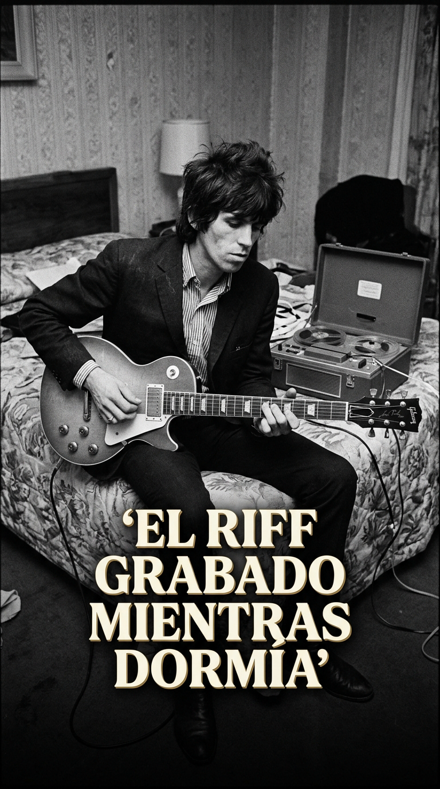
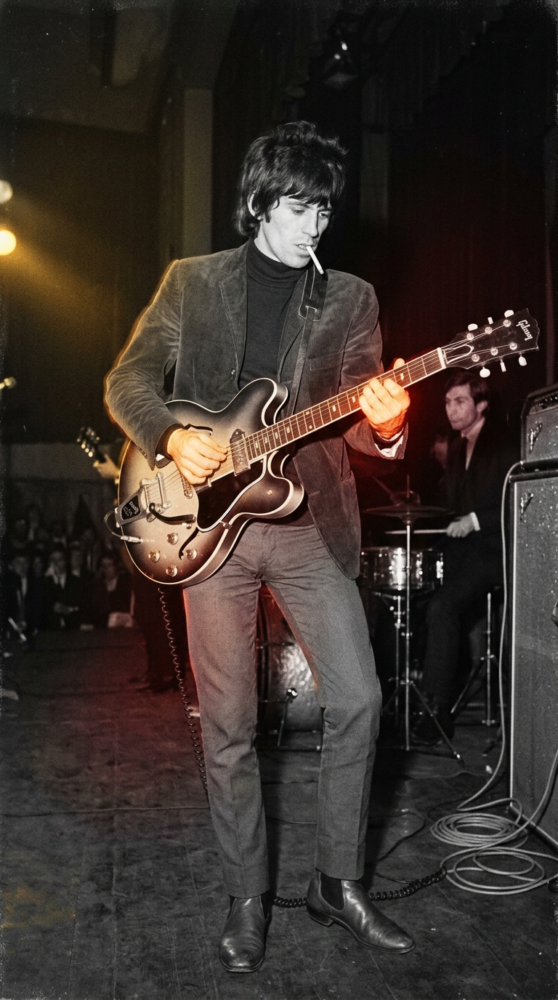
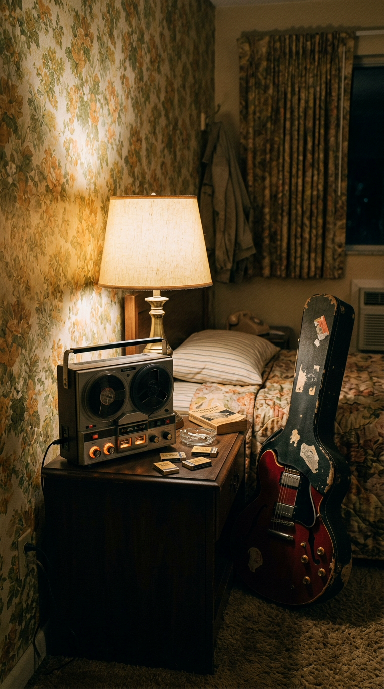
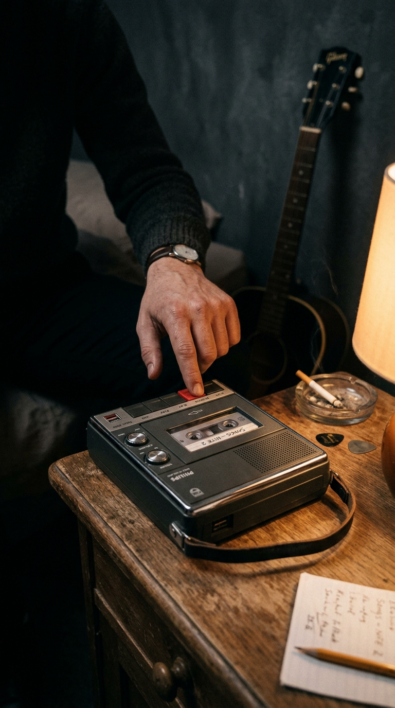
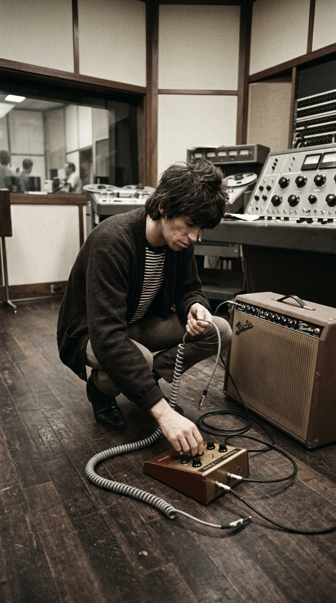
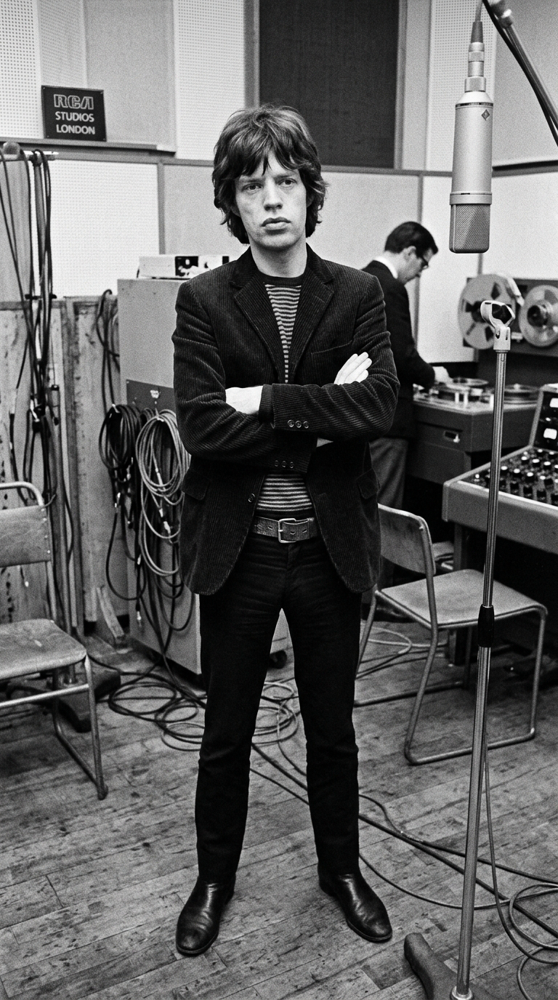
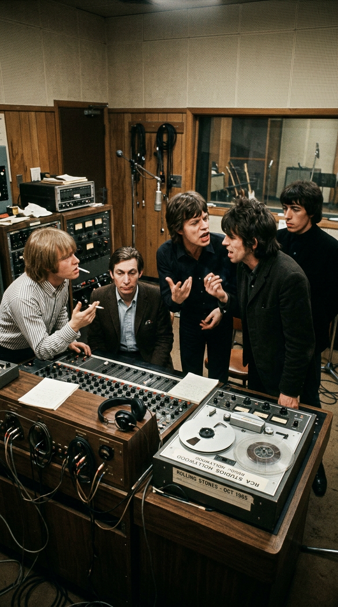
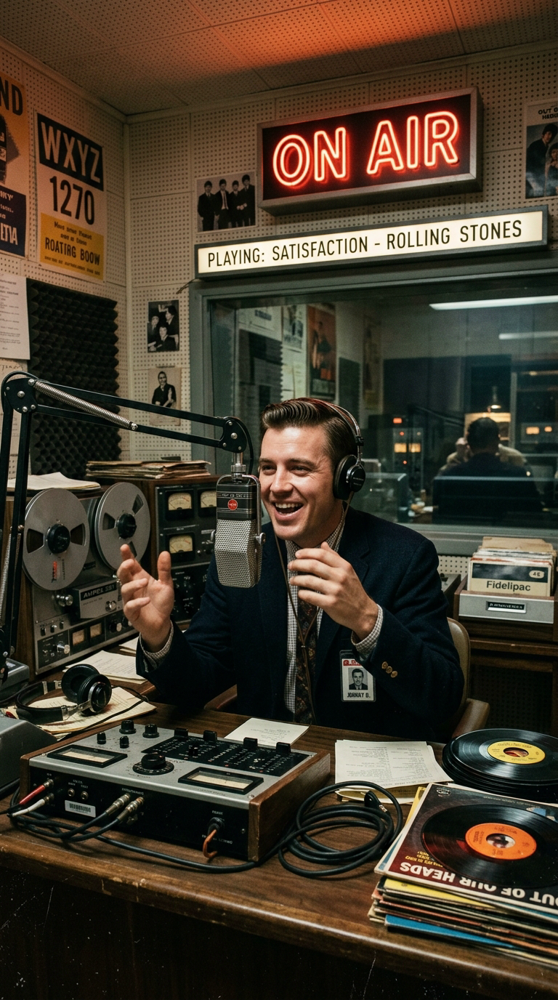
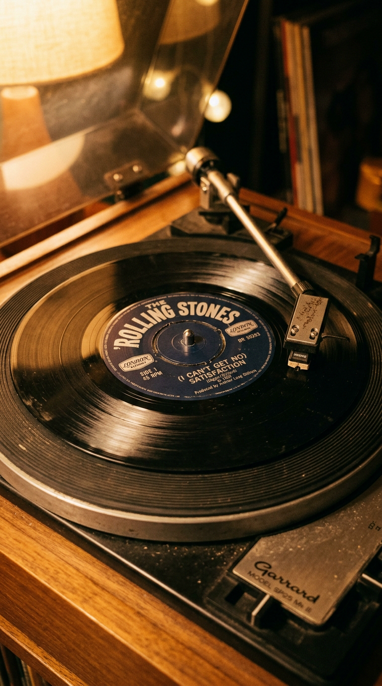

# ⚡ El Riff Grabado Mientras Dormía: La Cinta con Ronquidos que Creó a The Rolling Stones
### *Cómo Keith Richards despertó sonámbulo en un motel de Florida, grabó tres notas mágicas en un casete Philips y perdió una votación secreta que convirtió su maqueta rechazada en el himno definitivo del rock.*

---

**Por la redacción de Acordes Ocultos**  
*Tiempo de lectura estimado: 9 minutos*

---

### Prólogo: La revuelta en Jack Russell Stadium

La noche del 6 de mayo de 1965, el estado de Florida ardía bajo una humedad sofocante. En la ciudad costera de Clearwater, en el Jack Russell Stadium —un viejo diamante de béisbol adaptado para conciertos—, tres mil adolescentes enardecidos derribaron las vallas de seguridad apenas **The Rolling Stones** pisaron el escenario. Corrían los días de su tercera gira por los Estados Unidos, y la histeria colectiva que despertaba el quinteto británico desbordaba con creces la precaria capacidad policial de las provincias norteamericanas.

*Mayo de 1965: Keith Richards desata la electricidad y la insolencia británica durante la convulsa gira estadounidense.*

El espectáculo apenas duró cuatro canciones. Ante la invasión del terreno de juego y el lanzamiento descontrolado de botellas, la policía local desconectó el suministro eléctrico de los amplificadores, evacuando a la banda a toda prisa entre sirenas, persecuciones y porrazos. Empapados en sudor, exhaustos y con los nervios crispados, los cinco músicos fueron trasladados de incógnito a un modesto hospedaje de la costa: el **Fort Harrison Hotel**.

Para cualquier otro músico, aquella noche de violencia y frustración habría terminado en el bar del hotel o en el sopor de un insomnio amargo. Para la historia de la cultura occidental, sin embargo, aquella retirada forzada fue el preludio de un accidente sonámbulo que redefiniría para siempre el sonido del siglo XX.

---

### Acto I: La habitación 102 y la cinta sonámbula

En la penumbra de la habitación 102 del Fort Harrison Hotel, **Keith Richards**, que por entonces tenía veintiún años y el rostro afilado por los rigores de la carretera, se desplomó sobre la cama sin desvestirse. A su lado, apoyada contra la mesa de noche, descansaba su guitarra acústica Gibson y un artefacto tecnológico revolucionario para la época: una grabadora portátil de casete **Philips**, un aparato compacto de plástico gris con botones mecánicos que Keith llevaba consigo a todas partes para capturar ideas sueltas.

*La madrugada del 7 de mayo de 1965: En la soledad del Fort Harrison Hotel, el destino del rock esperaba en una cinta magnética.*

Alrededor de las cuatro de la madrugada, algo inexplicable ocurrió en el subconsciente de Richards. En un estado de duermevela casi cataléptico, el guitarrista abrió los ojos impulsado por una melodía insistente que le taladraba el cráneo con la fuerza de un rayo. Sin encender las lámparas de la habitación, se sentó al borde del colchón, estiró el brazo a oscuras y pulsó a ciegas los botones *Play* y *Record* de la grabadora.

Tomó la guitarra acústica entre sus manos y tocó una figura melódica elemental de apenas tres notas consecutivas: *Si - Do sostenido - Re*, repetidas con un fraseo sincopado, rítmico y desafiante. Al terminar la tercera pasada, rasgueó un acorde torpe, murmuró con voz ronca y pastosa hacia el micrófono diminuto la frase *«I can't get no satisfaction»*, dejó caer la guitarra sobre la alfombra y se desplomó hacia atrás, durmiéndose profundamente de nuevo.

*La penumbra de la madrugada: Keith Richards ejecuta el riff de tres notas en estado de duermevela antes de caer rendido.*

A la mañana siguiente, cuando los rayos del sol de Florida atravesaron las cortinas, Keith despertó con la mente en blanco. No guardaba el menor recuerdo de lo acontecido en la noche. Al mirar la mesilla, observó con extrañeza que la bobina de la cinta Philips estaba corrida por completo hasta el final.

> —*«Miré la grabadora y pensé: 'Qué raro, no recuerdo haber usado la cinta anoche'»*, relató Keith Richards con su característico humor sarcástico en su célebre autobiografía *Life* (2010). *«La rebobiné hasta el principio y le di al play. Lo que escuché fueron unos dos minutos de mí tocando ese riff con la acústica y susurrando 'I can't get no satisfaction'... seguidos inmediatamente por cuarenta minutos de mí mismo roncando como un cerdo. Me había quedado dormido con la máquina rodando»*.

---

### Acto II: La piscina de Clearwater y el desprecio consumista

Aquella misma mañana, Keith bajó a la terraza de la piscina del hotel, donde **Mick Jagger** tomaba el sol con un café y unos periódicos locales. Keith colocó la grabadora Philips sobre una mesa de hierro forjado y le dio al botón de reproducción.

*La mañana del descubrimiento: El momento en que la bobina magnética reveló el riff sonámbulo entre cuarenta minutos de ronquidos.*

Jagger no prestó atención a los ronquidos finales, pero el patrón rítmico de la guitarra acústica y la frase balbuceada por Keith encendieron una mecha en su imaginación. La palabra *Satisfaction* —tomada inconscientemente de una línea de la canción *«30 Days»* de Chuck Berry (*«If I don't get no satisfaction from the judge»*)— encapsulaba a la perfección el estado de ánimo de la banda: eran unos jóvenes ingleses de clase trabajadora asfixiados por la hipocresía puritana y el bombardeo comercial implacable de la sociedad estadounidense.

Sentado al borde de la piscina con una libreta escolar y un bolígrafo, Jagger tardó menos de diez minutos en redactar una de las letras más cáusticas, cínicas y sociológicamente lúcidas de la música popular:

> *«When I'm drivin' in my car, and the man come on the radio  
> He's tellin' me more and more about some useless information  
> Supposed to fire my imagination...  
> When I'm watchin' my TV and a man comes on and tell me  
> How white my shirts can be...  
> Well, he can't be a man 'cause he doesn't smoke  
> The same cigarettes as me...»*

Jagger no solo disparó contra la tiranía de la publicidad corporativa que intentaba lavar el cerebro de los jóvenes diciéndoles qué cigarrillos fumar o cómo blanquear sus camisas; en la última estrofa introdujo una alusión sexual directa que escandalizaría a los censores de la época: una chica que rechaza al narrador diciéndole que regrese la semana siguiente porque está pasando por una «racha de mala suerte» (*«on a losing streak»*, un eufemismo callejero británico para referirse al período menstrual).

El esqueleto de la canción estaba completo, pero en la mente de sus compositores, aquello no pasaba de ser una maqueta folclórica sin mayor trascendencia.

---

### Acto III: El pedal prohibido en RCA Studios

El 10 de mayo de 1965, los Stones hicieron una escala en Chicago para grabar los primeros bosquejos de la canción en **Chess Studios**, el templo sagrado de sus héroes Muddy Waters y Howlin' Wolf. Aquella toma inicial, acústica y con Brian Jones soplando una armónica campestre, carecía de pegada; sonaba demasiado liviana y tradicional para la agresividad que la letra reclamaba.

Dos días después, el 12 de mayo, la banda reservó dieciocho horas consecutivas en los legendarios **RCA Studios** de Hollywood, en Los Ángeles, bajo la ingeniería de sonido de **Dave Hassinger**.

Fue allí donde se produjo el auténtico chispazo sónico. **Ian Stewart**, el pianista original y leal asistente de gira de la banda, apareció en el estudio con una pequeña caja metálica rectangular de color marrón con un pulsador de pie: el **Gibson Maestro Fuzz-Tone FZ-1**, uno de los primeros pedales de distorsión a transistores de germanio jamás fabricados. El pedal había salido al mercado en 1962 pensado originalmente para que los contrabajos sonaran como tubas o para imitar instrumentos de viento, pero había sido un rotundo fracaso de ventas comerciales.

*12 de mayo de 1965 en RCA Studios: Keith Richards conecta el pedal Gibson Maestro Fuzz-Tone en el suelo del estudio de Hollywood.*

Keith Richards enchufó su guitarra Gibson Firebird al Fuzz-Tone y de allí a un amplificador Fender Showman. Al pisar el pedal y rasguear las tres notas de Clearwater, un rugido monstruoso invadió la sala de control: era un tono abrasivo, saturado, cortante y zumbante como un enjambre de avispas enfurecidas.

Sin embargo, para sorpresa de todos, Keith no pretendía que ese sonido quedara en el disco. Para él, el pedal era solo una **herramienta provisional de referencia**, una guía burda para que más adelante los arreglistas contrataran a una sección de vientos metales (trompetas, trombones y saxofones de corte soul al estilo de Stax Records y Otis Redding):

> —*«En mi cabeza, ese riff era para trompetas»*, insistiría Richards. *«Usé el pedal Fuzz únicamente para marcar dónde debían entrar los metales en la versión final. Nunca imaginé que alguien en su sano juicio quisiera publicar una guitarra sonando tan sucia y distorsionada en un disco comercial»*.

Mick Jagger, por su parte, observaba la escena cruzado de brazos con evidente escepticismo. Consideraba que el tempo era demasiado rápido y que la melodía sonaba excesivamente comercial y pegadiza para una banda que pretendía rivalizar con la rudeza del blues negro.

*1965: Mick Jagger escucha las tomas en la pecera del estudio, dudando del potencial comercial de la grabación.*

---

### Acto IV: La conspiración del mánager y la votación a espaldas de Keith

Tras rematar la sesión a las tantas de la madrugada con la batería demoledora de Charlie Watts, la pandereta hipnótica de Jack Nitzsche y la acústica de Brian Jones sosteniendo el colchón rítmico, Keith Richards y Mick Jagger dieron por cerrada la jornada asumiendo que *«Satisfaction»* era un experimento incompleto que requeriría regrabaciones posteriores.

Pero el mánager y productor de la banda, el maquiavélico y brillante **Andrew Loog Oldham**, sabía perfectamente lo que tenía entre manos. Con apenas veintiún años, Oldham poseía un instinto implacable para captar el pulso de la juventud rebelde: aquel riff zumbante con el pedal Fuzz no necesitaba trompetas; era el sonido de una sierra eléctrica cortando en dos la era de la ingenuidad pop.

*Mayo de 1965: El mánager Andrew Loog Oldham fuerza la votación interna en la mesa de sonido frente a las protestas de Keith.*

Al día siguiente, en la sala de control de RCA Studios, se celebró un tenso cónclave. Keith se negó tajantemente a que la canción viera la luz como sencillo:
—*«¡No está terminada! ¡Ese sonido de guitarra es una broma y la letra necesita pulirse!»*.

Oldham, consciente de que no podía doblegar a Keith en solitario, propuso someter el destino de la canción a una votación democrática entre los presentes. Charlie Watts y Brian Jones votaron a favor del lanzamiento inmediato; Bill Wyman se mostró indeciso; Mick y Keith votaron en contra. Oldham desempató haciendo valer su rol de productor.

Sin perder un solo minuto y temiendo que Keith destruyera la cinta máster, Oldham envió la grabación de inmediato a las oficinas de **London Records** en Nueva York para prensar los discos de 45 RPM a escala nacional.

Cuando los Stones retomaron la gira por el Medio Oeste norteamericano una semana después, Keith encendió la radio del automóvil mientras conducían hacia un concierto en Minnesota. De repente, aquel zumbido atronador que había tocado medio dormido en Florida brotó de los altavoces a un volumen ensordecedor. Keith casi estrella el vehículo contra la cuneta:
—*«¡Maldita sea! ¡Ese bastardo de Andrew la ha publicado!»*.

*Junio de 1965: Las emisoras de radio norteamericanas colapsan sus líneas ante la demanda del sencillo.*

---

### Epílogo: El nacimiento de la distorsión moderna

El 6 de junio de 1965, **(I Can't Get No) Satisfaction** aterrizó en las tiendas de discos de los Estados Unidos. La reacción social fue un terremoto cultural sin precedentes. Mientras emisoras puritanas de radio intentaban censurar los versos de Jagger y críticos conservadores alertaban sobre la «degeneración moral» que promovían aquellos jóvenes ingleses desarrapados, la juventud mundial encontró en esas tres notas su grito de emancipación definitivo.

El 10 de julio de 1965, el tema alcanzó el **número uno del Billboard Hot 100**, donde permaneció atornillado durante cuatro semanas consecutivas, otorgándole a The Rolling Stones el primer número uno de su carrera en Norteamérica y catapultándolos al estatus de leyendas planetarias indiscutibles.

*El disco de vinilo de 45 RPM que cambió para siempre la historia del rock y popularizó el pedal Fuzz en todo el planeta.*

El éxito fue tan arrollador que la fábrica Gibson agotó de la noche a la mañana todas las existencias del pedal Fuzz-Tone FZ-1, inaugurando formalmente la era de la distorsión eléctrica que más tarde alimentarían Jimi Hendrix, Jimmy Page y Pete Townshend. Y en un acto de justicia poética maravillosa, pocos meses después, el titán del soul **Otis Redding** grabó su propia e incendiaria versión de *«Satisfaction»* incorporando una sección de metales exactamente como Keith la había soñado en su habitación de motel.

Al escuchar la versión de Otis, Keith Richards sonrió conmovido y admitió su derrota definitiva ante el destino:

> —*«La versión de Otis Redding era exactamente lo que yo escuchaba en mi cabeza aquella noche en Florida. Pero si hubiéramos esperado a ponerle trompetas a la nuestra, jamás habríamos inventado ese monstruo. A veces, las mayores revoluciones culturales no nacen de cálculos perfectos ni de la técnica virtuosa, sino de la magia salvaje de un error capturado en el momento preciso»*.

Aquella cinta con dos minutos de genio somnoliento y cuarenta minutos de ronquidos no solo salvó a The Rolling Stones de ser una simple sombra de The Beatles: le entregó al rock and roll el colmillo afilado con el que mordió al mundo para no soltarlo jamás.

---

### 📚 Fuentes y Archivo Documental

* **Richards, Keith & James Fox**: *Life* (Little, Brown and Company, 2010). Testimonio en primera persona sobre la noche en el Fort Harrison Hotel, la grabadora Philips y su rechazo inicial al solo con Fuzz.
* **Jagger, Mick et al.**: *According to the Rolling Stones* (Chronicle Books, 2003). Memorias orales de los integrantes de la banda sobre la composición junto a la piscina de Clearwater y las sesiones en RCA Studios.
* **Oldham, Andrew Loog**: *Stoned: A Memoir of London in the 1960s* (St. Martin's Press, 2000). Crónica sobre la votación secreta de producción y el envío clandestino de las cintas a London Records.
* **Bockris, Victor**: *Keith Richards: The Biography* (Da Capo Press, 2003). Reconstrucción histórica de los disturbios policiales en el Jack Russell Stadium y la gira estadounidense de 1965.
* **Hassinger, Dave**: Entrevistas y notas técnicas de grabación sobre la consola de RCA Studios y el uso pionero del pedal Gibson Maestro Fuzz-Tone en *Sound on Sound* Magazine.
* **Wyman, Bill**: *Stone Alone: The Story of a Rock 'n' Roll Band* (Viking, 1990). Registros de diario y cronología detallada de las fechas de grabación entre Chicago y Los Ángeles.
* **Billboard Chart Archive**: Archivo histórico del Billboard Hot 100 de julio de 1965 (Cuatro semanas consecutivas en el N.º 1).
