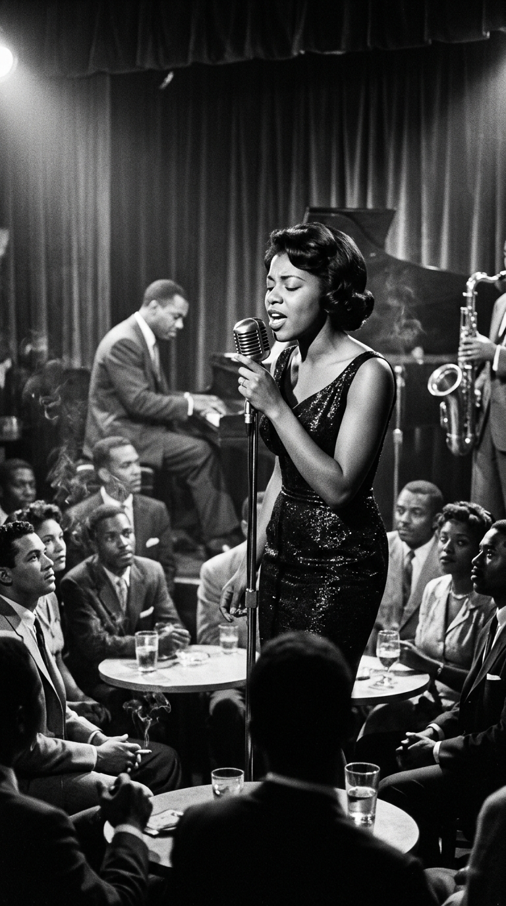
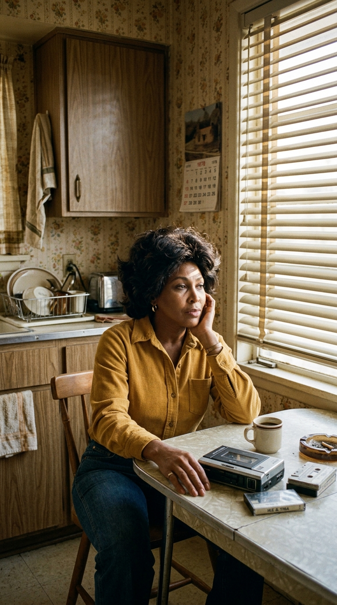

# 🦁 La Leona que Cruzó el Infierno: La Resurrección Imposible de Tina Turner
### *Cómo una niña abandonada en los algodonales de Tennessee sobrevivió a dieciséis años de terror doméstico, huyó por una autopista con 36 centavos en el bolsillo y se coronó a los 44 años como la reina absoluta del rock mundial.*

---

**Por la redacción de Acordes Ocultos**  
*Tiempo de lectura estimado: 8 minutos*

---

### Prólogo: Los treinta y seis centavos y la Interestatal 30

La medianoche del 1 de julio de 1976, la autopista Interestatal 30 a su paso por Dallas, Texas, era una cinta de asfalto negro azotada por el calor húmedo del verano y las luces cegadoras de los camiones de carga. Entre los arcenes de grava, esquivando a la carrera el tráfico veloz, una mujer corría desesperada hacia la oscuridad. Llevaba un traje blanco de dos piezas empapado en sangre, la cara brutalmente hinchada por los golpes y un pañuelo manchado apretado contra la nariz fracturada.

No llevaba bolso, ni joyas, ni equipaje. En el bolsillo del pantalón sus dedos temblorosos apretaban todo su patrimonio terrenal: **treinta y seis centavos de dólar** y una tarjeta de crédito de una gasolinera Mobil.

Aquella mujer acababa de huir de la suite del hotel Statler Hilton aprovechando que su marido y verdugo, el pionero del rhythm & blues **Ike Turner**, se había quedado dormido tras propinarle una paliza feroz en la parte trasera de una limusina. Jadeando de terror, cruzó los cuatro carriles de la autopista y entró por la puerta giratoria del hotel Ramada Inn. Al llegar al mostrador de recepción, la mujer alzó la mirada con los ojos inyectados en sangre y le suplicó al recepcionista:

> *«Soy Tina Turner. Si me da una habitación esta noche, le prometo que en cuanto amanezca le pagaré hasta el último centavo»*.

El recepcionista la miró, vio la dignidad inquebrantable que ardía bajo sus heridas y le entregó una llave. Aquella noche, en un cuarto anónimo de motel, nacía la mayor historia de resurrección de la música del siglo XX. Tina Turner renunció a las mansiones, a los automóviles de lujo, a las cuentas bancarias y a los derechos de autor de dos décadas de éxitos. En el acuerdo de divorcio pidió una sola cosa a cambio:

> *«Quédense con todo el dinero. Lo único que me pertenece es mi nombre de guerra. Dejen que me quede con Tina»*.

---

### Acto I: Los algodonales de Nutbush y el refugio del góspel

Para entender de qué acero estaba templada el alma de Tina Turner, es necesario descender al sur profundo de los Estados Unidos. Nacida el 26 de noviembre de 1939 en la diminuta comunidad rural de **Nutbush, Tennessee**, su verdadero nombre era **Anna Mae Bullock**.

Era la época de la segregación racial más implacable. Desde los ocho años, la pequeña Anna Mae pasaba jornadas enteras bajo el sol abrasador del verano recogiendo algodón con las manos agrietadas por las espinas de las plantas. Su infancia estuvo marcada por la violencia intrafamiliar y el abandono: primero huyó su madre para escapar de los maltratos de su padre, y poco después su padre las abandonó a ella y a su hermana a cargo de una abuela severa.

*Nutbush, 1948: La pequeña Anna Mae Bullock en los algodonales de Tennessee, donde el coro de la iglesia baptista fue su único refugio contra el desamparo.*

En medio de la pobreza y la soledad, la niña descubrió un refugio sagrado: la humilde iglesia baptista de madera del pueblo. Cuando el coro comenzaba a cantar los espirituales negros, Anna Mae cerraba los ojos y abría la garganta. No cantaba como las demás niñas; de su pecho brotaba un aullido gutural, áspero y lleno de una fuerza casi telúrica que hacía vibrar los tablones del templo. Aquella voz no era una técnica aprendida: era el llanto de un alma que se negaba a ser derrotada.

---

### Acto II: El volcán de St. Louis y la jaula de hierro

A finales de la década de 1950, tras mudarse a **St. Louis, Missouri**, la adolescente Anna Mae comenzó a frecuentar los clubes nocturnos de blues y R&B de la ciudad. Una noche de 1957, en el abarrotado **Club Manhattan**, vio tocar por primera vez a los *Kings of Rhythm*, la banda liderada por un carismático y despiadado guitarrista de Misisipi llamado **Ike Turner**.

Fascinada por el sonido eléctrico del grupo, Anna Mae le pidió varias veces a Ike que la dejara cantar. Él la ignoró con desdén. Pero una noche, durante un intermedio, el baterista de la banda le pasó un micrófono por diversión mientras sonaba una balada de B.B. King. 

Anna Mae tomó el micrófono y soltó la primera nota. El club entero se congeló. Las conversaciones cesaron al instante. Ike Turner saltó de la barra con los ojos desorbitados, cruzó la sala a zancadas y la tomó del brazo: jamás en su vida había escuchado a una mujer cantar con semejante furia animal y desgarro bluesero.

*St. Louis, 1957: Anna Mae Bullock empuña el micrófono en el Club Manhattan, cambiando para siempre el rumbo de la música negra.*

Ike la rebautizó como **Tina Turner** —registrando el nombre a sus espaldas para poder reemplazarla por otra mujer si ella decidía marcharse— y crearon la **Ike & Tina Turner Revue**. Durante los años sesenta y principios de los setenta, la pareja se convirtió en uno de los espectáculos escénicos más devastadores y electrizantes de la historia. Canciones como *«A Fool in Love»*, la monumental *«River Deep – Mountain High»* (producida por Phil Spector) y su versión torrencial de *«Proud Mary»* los convirtieron en leyendas mundiales que abrían los conciertos de The Rolling Stones.

Pero detrás del telón, la vida de Tina era un matadero. Consumido por una adicción monstruosa a la cocaína y por una paranoia enfermiza de control, Ike sometió a Tina a torturas sistemáticas: quemaduras de cigarrillo, palizas con percheros y mandíbulas rotas antes de salir a cantar, obligándola a subir al escenario tragándose su propia sangre. En 1968, desesperada y sintiéndose atrapada sin salida, Tina ingirió cincuenta pastillas de Valium en un intento de suicidio. Cuando despertó en el hospital, Ike la miró con odio y le dijo: *«Deberías haberte muerto»*.

La leona aguantó hasta aquella noche de julio de 1976 en Dallas. Cuando comprendió que la siguiente paliza la mataría, decidió que prefería morir atropellada en la autopista antes que volver a tocar el suelo de aquella habitación de hotel.

---

### Acto III: El purgatorio de los cabarets y los guantes de goma

Cuando el divorcio se formalizó en 1978, Tina Turner tenía treinta y ocho años. La justicia le concedió la custodia de sus hijos, pero la responsabilizó de las deudas millonarias por los conciertos cancelados tras la ruptura de la banda. No tenía casa, no tenía dinero y los promotores la demandaban a diario.

Para alimentar a sus hijos y pagar las deudas, Tina no dudó en arremangarse: recurrió a los cupones de alimentos del gobierno y limpió casas ajenas con guantes de goma.

*Los Ángeles, 1978: Limpiando casas con dignidad para saldar deudas ajenas mientras la industria la daba por acabada.*

Por las noches, aceptaba contratos en cabarets de segunda categoría en Las Vegas y programas de televisión de variedades, cantando en hoteles semi-vacíos. La industria discográfica estadounidense le cerró las puertas de golpe. Los ejecutivos de las grandes discográficas de Los Ángeles se burlaban de su mánager, el joven australiano Roger Davies, cuando intentaba conseguirle un contrato discográfico: *«Tina Turner es un chiste del pasado; es una cantante negra de cuarenta años y el rock es para chicos blancos de veinte»*.

Lo que aquellos hombres de corbata no sabían era que el fuego que ardía en el pecho de Tina no pertenecía a este mundo.

---

### Acto IV: La noche de los milagros en Londres y el rugido de 1984

El rescate provino de donde menos lo esperaba la industria: de la vanguardia del rock británico. Músicos como Martyn Ware (de The Human League y Heaven 17) la invitaron a Londres para grabar una versión demoledora de *«Let's Stay Together»* de Al Green.

Una noche de 1983, David Bowie cenaba en Nueva York con los máximos directivos de Capitol Records para celebrar su multimillonario fichaje. Cuando los ejecutivos le propusieron ir a celebrar a una discoteca exclusiva, Bowie los miró fijamente y les dijo: *«Esta noche no puedo. Tengo que ir al Ritz a ver a mi cantante favorita en el mundo: Tina Turner»*.

Los ejecutivos, aterrorizados de contrariar a su nueva superestrella, fueron con él al club. Al entrar, vieron a una mujer de cuarenta y cuatro años vestida con una chaqueta vaquera raída y tacones de aguja, dominando el escenario como una emperatriz salvaje. Al día siguiente, Capitol Records le ofreció un contrato para grabar un disco en dos semanas.

*Febrero de 1985: Tina Turner alza tres premios Grammy por «Private Dancer», sellando el mayor regreso en la historia del pop.*

El resultado fue ***Private Dancer*** (1984). Impulsado por obras maestras como *«What's Love Got to Do with It»* y *«Better Be Good to Me»*, el álbum vendió más de veinte millones de copias en todo el mundo. En la ceremonia de los premios Grammy de 1985, Tina Turner subió al escenario cuatro veces para recoger las estatuillas doradas mientras la misma industria que la había dado por muerta se ponía en pie para ovacionarla con lágrimas en los ojos. 

La mujer de los treinta y seis centavos era ahora la reina indiscutible de la música mundial.

---

### Acto V: La catedral del Maracaná y el himno de los estadios

A finales de la década de 1980, Tina Turner no era simplemente una estrella pop: era una fuerza de la naturaleza. En enero de 1988, durante la gira *Break Every Rule*, aterrizó en Río de Janeiro para actuar en el legendario **Estadio Maracaná**.

Aquella noche, ante **ciento ochenta mil personas** —la mayor audiencia de pago jamás congregada en la historia para un artista en solitario—, Tina se subió a una pasarela gigante suspendida en el aire mientras fuegos artificiales iluminaban el cielo carioca. Cuando entonó los primeros versos, el rugido de la multitud sacudió los cimientos de la ciudad. El libro Guinness de los Récords certificó su hazaña: ninguna mujer sobre la faz de la tierra había reunido a tanta gente en un solo recinto.

*Estadio Maracaná, Río de Janeiro, 1988: 180.000 almas rindiéndose ante la reina del rock en el concierto récord de la historia.*

Un año después, en 1989, Tina grabó la canción que se convertiría en el himno definitivo de su existencia: **«The Best»** (originalmente grabada por Bonnie Tyler). Con su riff de sintetizador palpitante, el solo de saxofón electrizante y su estribillo universal (*«You're simply the best, better than all the rest...»*), la canción trascendió las emisoras para convertirse en el cántico de los estadios de fútbol, las victorias olímpicas y las batallas personales de millones de seres humanos alrededor del globo.

No era una canción de amor romántico; era el grito de victoria de una mujer que había mirado de frente a la muerte y la había dejado atrás.

---

### Epílogo: El lago de Zúrich y la leona en paz

En sus últimas décadas de vida, retirada en su residencia de Küsnacht a orillas del apacible **Lago de Zúrich en Suiza**, Tina Turner encontró finalmente la paz que la vida le negó en su juventud. Renunció a la ciudadanía estadounidense para convertirse en ciudadana suiza, rodeada del amor incondicional de su esposo Erwin Bach (quien llegó a donarle un riñón en 2017 para salvarle la vida).

Ni el cáncer intestinal, ni los derrames cerebrales, ni la desgarradora tragedia de perder a sus dos hijos biológicos lograron borrar la sonrisa luminosa y sabia de su rostro. 

*Lago de Zúrich, Suiza: La serenidad majestuosa de una leyenda que cruzó el fuego y alcanzó la inmortalidad.*

Cuando Tina Turner partió de este mundo el 24 de mayo de 2023 a los ochenta y tres años, no dejó tras de sí la sombra de una víctima. Dejó el monumento indestructible de una **Catedral de Leyenda**: la certeza absoluta de que, sin importar cuán oscura sea la noche, cuán hondas sean las heridas o cuán vacíos estén tus bolsillos, un alma que se niega a rendirse siempre terminará reinando.

---

### 📚 Fuentes y Archivo Documental

Para la rigurosa reconstrucción biográfica, histórica y musical de esta entrega de *Catedrales de Leyenda*, la redacción de *Acordes Ocultos* ha consultado y contrastado las siguientes fuentes documentales:

1. **Turner, Tina & Loder, Kurt.** *I, Tina: My Life Story*. William Morrow & Company, Nueva York, 1986. Autobiografía oficial de referencia con los testimonios exhaustivos sobre los años de Nutbush, la tiranía de Ike Turner y el escape de Dallas en 1976.
2. **Turner, Tina.** *My Love Story: A Memoir*. Atria Books / Simon & Schuster, Nueva York, 2018. Memorias de su segunda etapa de vida: la resurrección de los años ochenta, su matrimonio con Erwin Bach y su vida en Suiza.
3. **Bego, Mark.** *Tina Turner: Break Every Rule*. Taylor Trade Publishing, 2003. Crónica documental sobre las sesiones de grabación de *Private Dancer* y el impacto mediático de su regreso a las listas internacionales.
4. **Guinness World Records Archive (1988).** Certificación oficial del récord mundial de asistencia de pago para un concierto de un artista en solitario: Estadio Maracaná, Río de Janeiro, Brasil (180.000 espectadores).
5. **Recording Academy (Grammy Awards Archives, 1985).** Registro oficial de galardones: Grabación del Año, Canción del Año, Mejor Interpretación Vocal Pop Femenina y Mejor Interpretación Vocal Rock Femenina.
6. **Rolling Stone Magazine Archives (1981-1989).** Entrevistas históricas con Tina Turner, David Bowie y Martyn Ware sobre la gestación del sonido pop-rock de los ochenta.
