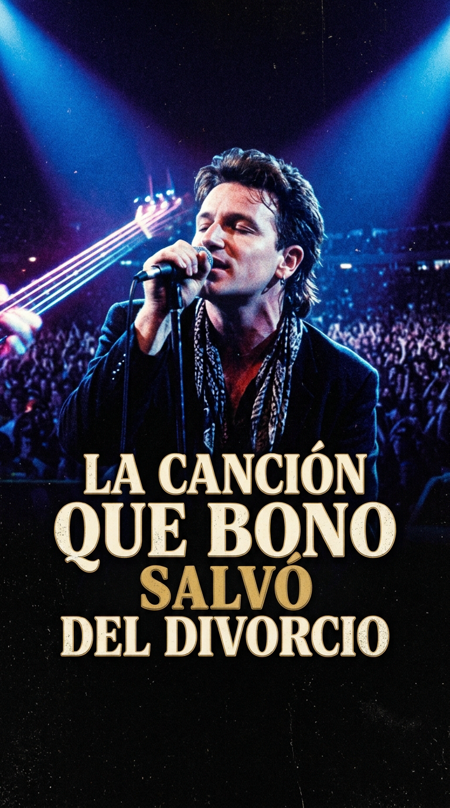
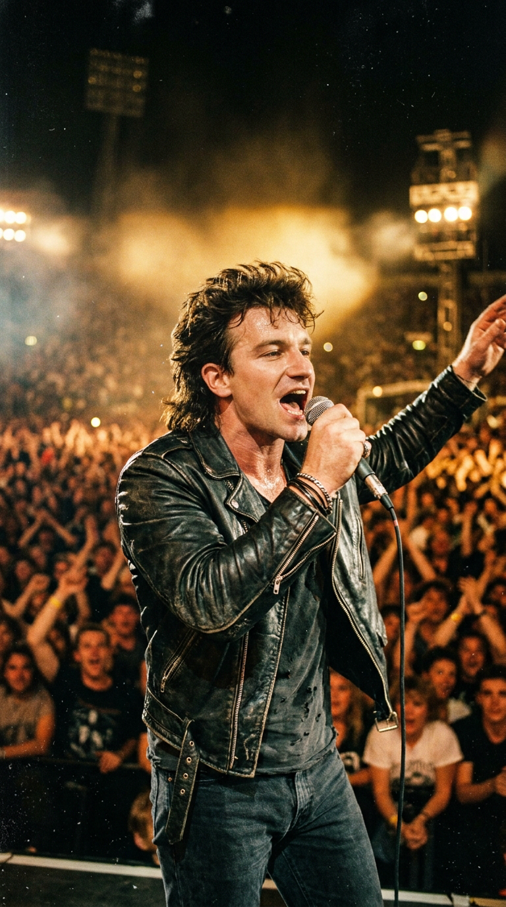
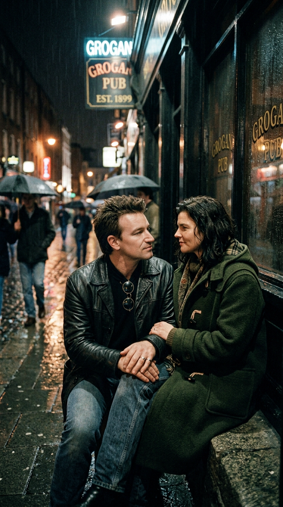
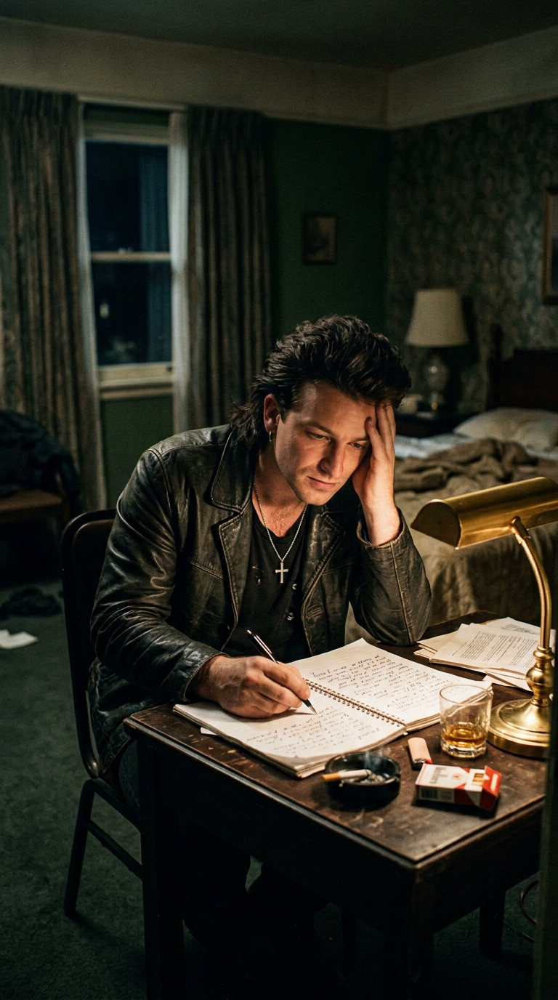
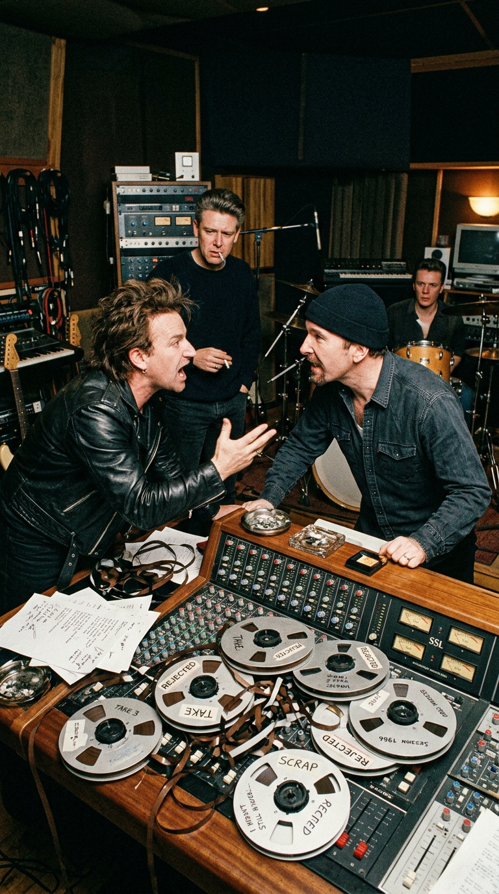
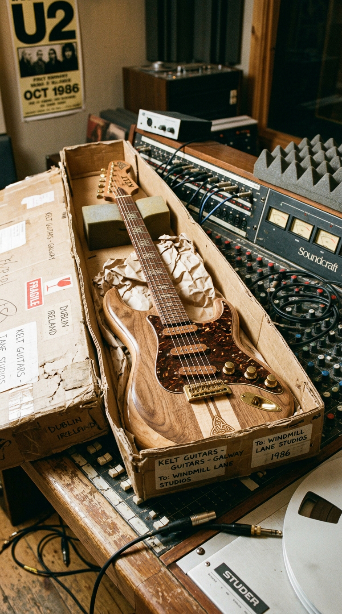
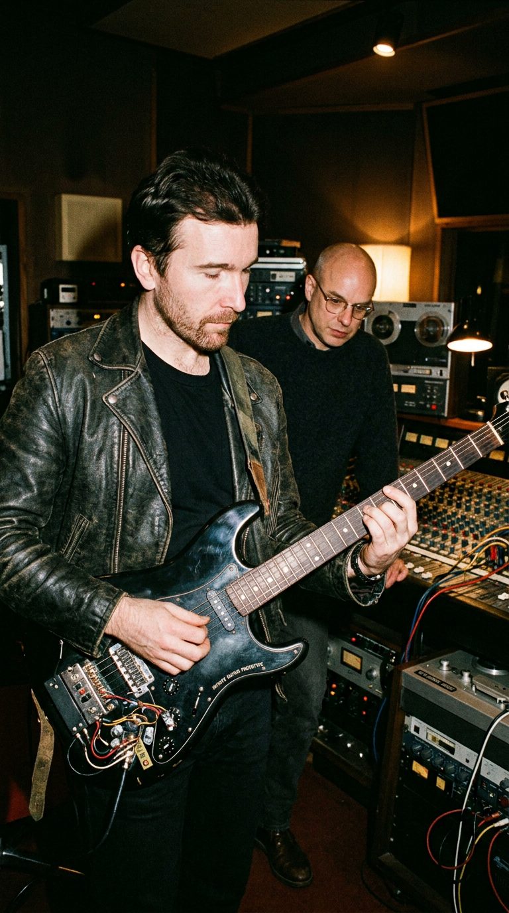
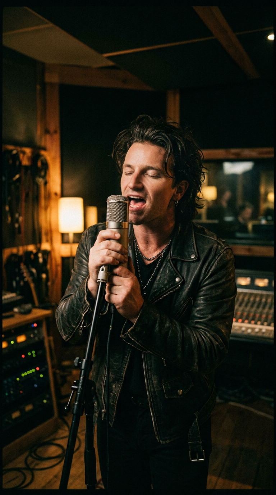
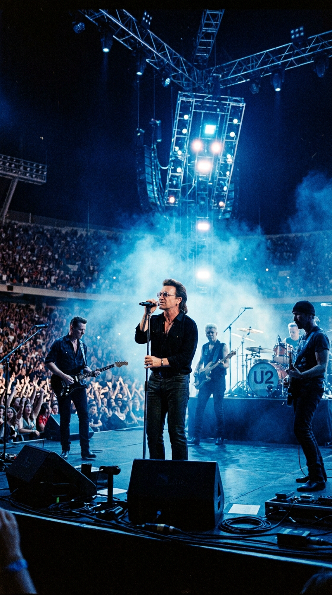
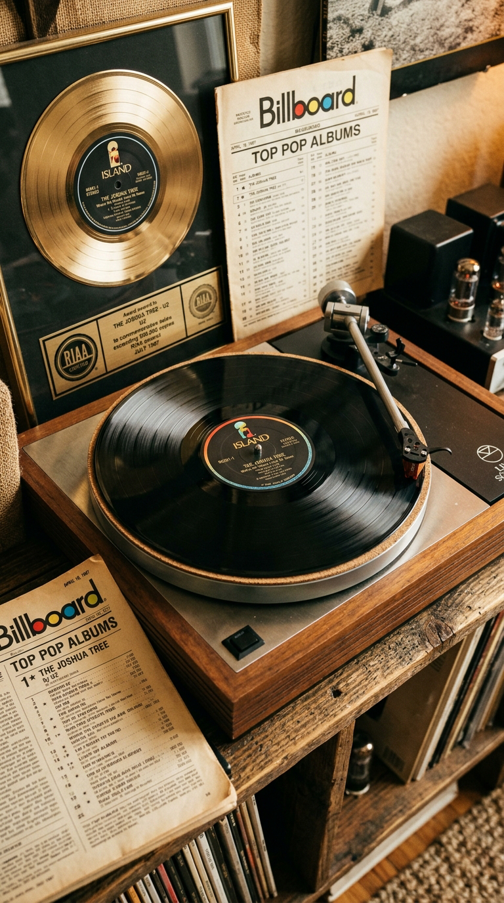

# 🕊️ La Canción que Bono Salvó del Divorcio: La Crisis Matrimonial y la Guitarra Infinita que Crearon el Himno de U2
### *Cómo la encrucijada existencial de un líder desgarrado entre el estrellato y su hogar en Dublín estuvo a punto de terminar en la papelera del estudio hasta la llegada de un extraño paquete postal desde Canadá.*

---

**Por la redacción de Acordes Ocultos**  
*Tiempo de lectura estimado: 9 minutos*

---

### Prólogo: El vértigo tras el diluvio de Wembley

El 13 de julio de 1985, sobre el colosal escenario del estadio de Wembley en Londres ante setenta y dos mil almas y una audiencia televisiva estimada en mil novecientos millones de espectadores, un joven irlandés de veinticinco años llamado Paul Hewson —a quien el mundo entero conocía como **Bono**— saltó de la tarima hacia el foso de seguridad durante la interpretación de *«Bad»*, rescatando a una joven de la multitud para fundirse en un abrazo que paralizó la retransmisión global del festival **Live Aid**.

*1987: Bono bajo los focos de los grandes estadios, convertido en la voz más apasionada de su generación.*

Aquella tarde, **U2** dejó de ser una respetada formación de post-punk dublinés para convertirse en un fenómeno sociocultural de escala planetaria. Sin embargo, para Bono, el precio personal de aquella aceleración meteórica fue devastador. Al regresar a las calles húmedas y grises de Dublín, la realidad cotidiana lo golpeó con la brutalidad de un muro de hormigón.

El cantante se encontraba en una encrucijada psicológica límite. Casado desde 1982 con su novia de la adolescencia, **Alison «Ali» Stewart** —a quien había conocido en los pupitres de la escuela Mount Temple a los quince años—, Bono comenzó a experimentar un desgarro íntimo que amenazaba con dinamitar su cordura, su matrimonio y el futuro de la banda.

---

### Acto I: La casa de Melbeach y el dilema del forajido

A principios de 1986, buscando aislarse de la atención mediática y reflexionar sobre la dirección del próximo trabajo discográfico del grupo —que llevaría por título *The Joshua Tree*—, Bono y Ali alquilaron una modesta vivienda cerca del mar en Melbeach, en la costa norte de Dublín.

*1986: En la soledad de una habitación frente al mar de Irlanda, Bono escribe la letra más vulnerable y conflictiva de su vida.*

Allí, contemplando las olas romper contra los acantilados bajo cielos encapotados, Bono se sentó frente a un cuaderno a escribir con una honestidad desarmante. Sentía que en su interior coexistían dos hombres irreconciliables que tiraban de él en direcciones opuestas: por un lado, el muchacho hogareño, leal y comprometido que anhelaba la paz doméstica y la protección de su esposa; por el otro, el artista egoísta, trashumante y poseído por el fuego sagrado de los escenarios, dispuesto a devorarlo todo a su paso.

En su autobiografía *Surrender: 40 canciones, una historia* (2022), Bono describiría con crudeza aquel dilema:

> —*«Estar en una banda de rock exitosa te convierte en un monstruo de narcisismo. Viajas por el mundo, te aplauden miles de personas cada noche y terminas creyendo que el universo gira a tu alrededor. Pero el matrimonio es exactamente lo opuesto: exige renunciar al ego, escuchar, estar presente y entregarte por completo a otra persona. Sentía que mi vocación de forajido nómada estaba asfixiando a la mujer que más amaba. Estaba atrapado en una jaula: no podía vivir con ella porque le hacía daño con mis ausencias, pero tampoco podía vivir sin ella porque era el único ancla que me impedía enloquecer»*.

*1986: Bono y su esposa Ali Hewson en una calle lluviosa de Dublín, intentando salvar un pacto de vida asediado por la fama.*

De aquella fractura espiritual brotó la letra de **«With or Without You»**. No era una balada romántica complaciente ni un poema almibarado de reconciliación; era una autopsia descarnada del amor adulto y del coste emocional del matrimonio:

> *«See the stone set in your eyes  
> See the thorn twist in your side  
> I'll wait for you...  
> Sleight of hand and twist of fate  
> On a bed of nails she makes me wait  
> And I wait without you...  
> With or without you  
> With or without you  
> I can't live with or without you...»*

El verso central —*«And you give yourself away»* («Y te entregas / Y te delatas»)— resumía la paradoja: amar implica desnudarse hasta quedar indefenso, pero también traicionarse a uno mismo para poder pertenecer a otro.

---

### Acto II: El estancamiento en la mansión Danesmoate

En la primavera de 1986, U2 alquiló **Danesmoate House**, una imponente y sombría mansión georgiana del siglo XVIII situada en Rathfarnham, a los pies de las colinas de Dublín, para convertir sus salones en un estudio de grabación residencial bajo la producción de **Brian Eno** y **Daniel Lanois**.

*1986: Los integrantes de U2 y sus productores discuten alrededor de la consola de grabación frente a cintas descartadas.*

Cuando Bono presentó los primeros acordes de *«With or Without You»*, la reacción del resto de la banda fue de un desencanto unánime. El bajista **Adam Clayton** y el baterista **Larry Mullen Jr.** comenzaron a tocar una base rítmica sobre una progresión de cuatro acordes cíclica y minimalista (Re mayor, La mayor, Si menor, Sol mayor). 

Durante semanas enteras, la canción no conseguía despegar. Para los estándares innovadores del grupo, la estructura sonaba demasiado plana, repetitiva y carente de dinámica. Adam Clayton consideraba que el bajo parecía el de una balada comercial predecible de radiofórmula, y Larry Mullen sentía que la batería no tenía dónde explotar.

La frustración en el estudio alcanzó un punto muerto insostenible. Daniel Lanois y Brian Eno, agotados por decenas de tomas infructuosas, llegaron a la conclusión de que la canción era un callejón sin salida y sugirieron descartarla formalmente de la lista de canciones del álbum para centrarse en temas más urgentes como *«Where the Streets Have No Name»* o *«I Still Haven't Found What I'm Looking For»*. La cinta estuvo a punto de ser arrumbada para siempre en la papelera del estudio.

---

### Acto III: El paquete postal de Canadá y la guitarra infinita

Fue en ese instante de claudicación artística cuando el azar tecnológico y la amistad cambiaron el rumbo de los acontecimientos. Una mañana lluviosa, llegó a la mansión de Danesmoate un paquete postal procedente de Toronto, Canadá, remitido por el músico, inventor y productor vanguardista **Michael Brook**. El destinatario era el guitarrista de la banda, **The Edge** (David Evans).

*1986: La llegada de la caja de cartón que contenía el prototipo experimental de la Infinite Guitar diseñado por Michael Brook.*

Al abrir la caja de cartón, The Edge se encontró con un prototipo artesanal y de aspecto tosco llamado la **Infinite Guitar** («Guitarra Infinita»). Era una guitarra eléctrica cuyos circuitos y pastillas magnéticas habían sido profundamente modificados con un bucle de inducción electrónica que hacía que las cuerdas metálicas vibraran de forma constante y perpetua, generando una nota sostenida que jamás moría y que carecía del ataque percusivo tradicional de la púa.

Curioso por comprobar el sonido del artefacto, The Edge se encerró en una habitación contigua vacía de la mansión, conectó el prototipo a su amplificador y comenzó a tocar notas agudas y flotantes por encima de la pista básica de bajo y batería que sonaba por los monitores.

*1986: The Edge experimenta con las frecuencias sostenidas de la Infinite Guitar bajo la atenta mirada de Brian Eno.*

En la sala de control, Brian Eno y Daniel Lanois se quedaron petrificados. Aquel sonido no parecía una guitarra convencional: sonaba como un quejido celestial, como un órgano litúrgico atravesando una niebla matinal, un llanto sostenido que flotaba ingrávido en el aire y envolvía la rigidez rítmica del bajo de Clayton.

> —*«En cuanto The Edge tocó esas notas con la Infinite Guitar, todos en la sala nos miramos y supimos que la canción acababa de nacer»*, recordaría Daniel Lanois años más tarde. *«Le dio una dimensión mística y cinematográfica descomunal. De repente, la sencillez de los cuatro acordes ya no era aburrida: era un mantra hipnótico sobre el que flotaba un espíritu»*.

Inspirado por la atmósfera casi sagrada que se había adueñado de Danesmoate, Bono se colocó frente al micrófono de condensador en la penumbra de la sala principal y grabó una interpretación vocal sobrehumana. Conteniendo la respiración en las primeras estrofas, su voz fue elevándose en intensidad hasta estallar en el clímax final con un grito de liberación y agonía (*«Ooooh... nothing to win and nothing left to lose!»*) que erizó la piel de los técnicos tras la consola.

*1986: En la penumbra de la sala principal de Danesmoate, Bono entrega una de las tomas vocales más desgarradoras de la música contemporánea.*

---

### Acto IV: La conquista planetaria y la redención del pacto

El 16 de marzo de 1987, **With or Without You** fue publicado como el primer sencillo de **The Joshua Tree**. La respuesta social y comercial fue fulminante. Las emisoras de radio de todo el planeta emitieron la canción de forma ininterrumpida, cautivadas por ese crescendo magistral que comenzaba en un murmullo tímido de bajo y desembocaba en un torbellino emocional desatado.

El 16 de mayo de 1987, la canción escaló hasta el **puesto número uno del Billboard Hot 100** de los Estados Unidos, marcando el primer liderato de U2 en la historia de las listas norteamericanas, posición en la que permaneció durante tres semanas consecutivas.

*1987: U2 interpreta With or Without You ante estadios monumentales durante la legendaria gira The Joshua Tree.*

La vulnerabilidad lírica de Bono y la arquitectura sonora de The Edge conectaron con millones de seres humanos que se vieron reflejados en esa desgarradora pugna entre el anhelo de libertad personal y el compromiso del corazón. Lejos de distanciar a la pareja, la honestidad brutal de la canción sirvió como un puente de redención: Ali Hewson no solo comprendió las dudas de su esposo, sino que acompañó a Bono a lo largo de las décadas siguientes, forjando uno de los matrimonios más sólidos y longevos de la historia del espectáculo.

*El icónico vinilo de The Joshua Tree: el disco que consagró a U2 en el Olimpo de la música y demostró que la fragilidad humana puede conmover al mundo.*

---

### Epílogo: El susurro que nunca se apaga

Casi cuatro décadas después de aquella tarde lluviosa en Melbeach, *«With or Without You»* sigue resonando en los recintos más imponentes del mundo con la misma fuerza sobrecogedora del primer día. Cada vez que The Edge pulsa las primeras notas etéreas de la guitarra infinita y el bajo hipnótico de Adam Clayton comienza a latir, el tiempo parece suspenderse en un instante sagrado.

Bono ha reflexionado en múltiples ocasiones sobre el significado perdurable de aquella confesión desesperada que casi termina en la basura:

> —*«Creí que esa canción destruiría mi vida privada porque exponía mis mayores debilidades y miedos. Pero el arte tiene una magia redentora: cuando dices la verdad más dolorosa sobre ti mismo, descubres que estás cantando la verdad de todo el mundo. Todos nos hemos sentido alguna vez atrapados en ese abismo entre querer huir y necesitar quedarnos. Es el misterio más hermoso y terrible de la condición humana»*.

*«With or Without You»* no es simplemente el mayor éxito de U2: es el monumento sonoro a la victoria de la vulnerabilidad sobre la soberbia, la prueba de que cuando un hombre se atreve a reconocer que no puede vivir solo, el rock and roll se convierte en una oración universal.

---

### 📚 Fuentes y Archivo Documental

* **Bono**: *Surrender: 40 Songs, One Story* (Alfred A. Knopf, 2022). Autobiografía oficial de Paul Hewson, con capítulos dedicados a la crisis con Ali Hewson y la escritura en Melbeach.
* **U2 & Neil McCormick**: *U2 by U2* (HarperCollins, 2006). Historia oral exhaustiva de los miembros de la banda narrando las sesiones de grabación en Danesmoate House.
* **Flanagan, Bill**: *U2: At the End of the World* (Delta, 1996). Crónica testimonial sobre la relación interna de la banda y el proceso creativo con Brian Eno y Daniel Lanois.
* **Brook, Michael**: Entrevistas históricas sobre la invención de la *Infinite Guitar* y el envío del prototipo a The Edge en *Guitar Player* Magazine (1987).
* **Classic Albums: The Joshua Tree**: Documental oficial de la serie de la BBC / Isis Productions (Dirigido por Philip King y Nuala O'Connor, 1999), con análisis en la mesa de mezclas de las pistas multipista por Daniel Lanois.
* **Billboard Chart Archive**: Archivo histórico del Billboard Hot 100 de mayo de 1987 (Tres semanas consecutivas en el N.º 1).
